> [!IMPORTANT]
> **⚠️ 수동 검토 권장 (자가힐링 주의)**
>
> AI 자가힐링 결과물이 실제 의도와 다를 수 있으므로, **상세 리뷰 내용에 기반한 수동 점검**을 우선해 주시기 바랍니다. 자가힐링 기능을 활용하실 경우 최종 결과물을 신중하게 확인해 주세요.

# 코드 리뷰 결과 - b64e1ab8 (승인)

## 코드 복잡도 분석

**분석된 파일**: 3개 / 변경된 파일: 4개


### Import 의존관계 다이어그램

```mermaid
flowchart TD
    F0["GroupQueryMapper.java (0 imports)"]
    F1["GroupInfoMapper.java (0 imports)"]
    F2["User.java (0 imports)"]
    F3["SchoolLevel.java (0 imports)"]
    F4["GroupService.java (17 imports)"]:::center
    F5["MemberService.java (0 imports)"]
    F6["ConvertUtils.java (0 imports)"]
    F7["GroupInfo.java (0 imports)"]
    F8["MemberType.java (0 imports)"]
    F9["EmailVerificationService.java (0 imports)"]
    F10["UserStatus.java (0 imports)"]
    F11["MemberStatus.java (0 imports)"]
    F12["GroupMemberMapper.java (1 imports)"]:::center
    F13["UserMapper.java (0 imports)"]
    F14["IdGenerator.java (0 imports)"]
    F15["GroupMember.java (0 imports)"]
    F16["PageUtil.java (0 imports)"]
    F17["DgnssService.java (0 imports)"]
    F12 --> F15
    F4 --> F0
    F4 --> F1
    F4 --> F2
    F4 --> F3
    F4 --> F5
    F4 --> F6
    F4 --> F7
    F4 --> F8
    F4 --> F9
    F4 --> F10
    F4 --> F11
    F4 --> F12
    F4 --> F13
    F4 --> F14
    F4 --> F15
    F4 --> F16
    F4 --> F17
    classDef center fill:#ff6b6b,stroke:#333,stroke-width:3px
    classDef high fill:#ffd93d,stroke:#333,stroke-width:2px
```



**범례**: 중심 파일 (변경됨) | 많은 import (10개 이상)


### 모니터링 권장 (LOW)


**`groupmembermapper.java`** (other)

- 평균 복잡도: **0.266**

- 최대 복잡도: 0.520

- 청크 수: 2개

- 평균 사용처: 34.0곳


**권장사항:**

- **모니터링 권장**: 복잡도가 높은 편이지만 영향 범위 제한적


**`groupservice.java`** (other)

- 평균 복잡도: **0.264**

- 최대 복잡도: 0.518

- 청크 수: 2개

- 평균 사용처: 15.0곳


**권장사항:**

- **모니터링 권장**: 복잡도가 높은 편이지만 영향 범위 제한적


**`groupmembermapper.xml`** (other)

- 평균 복잡도: **0.262**

- 최대 복잡도: 0.516

- 청크 수: 2개

- 평균 사용처: 7.0곳


**권장사항:**

- **모니터링 권장**: 복잡도가 높은 편이지만 영향 범위 제한적


---


## 📋 결론: 승인 (Approved)

CP님의 커밋은 **그룹 자진탈퇴(LEFT) 학생의 재가입 허용 기능**을 명확하게 구현하여 비즈니스 요구사항을 잘 반영하고 있습니다. 코드 구조가 명확하고 데이터 일관성을 유지하는 방식이 적절하며, Critical이나 High 수준의 문제는 없어 **승인(Approved)** 합니다.

---

## 🔍 변경사항 상세 분석

### 1. 변경 요약
이 커밋은 `vs-develop` 브랜치를 `feature/frontend`에 병합한 Merge 커밋으로, 실제 코드 변경은 그룹 가입 로직의 확장입니다:

| 파일 | 변경 내용 |
|------|-----------|
| `GroupMemberMapper.java` | `findByGroupIdAndUserNo()` 메서드 추가 |
| `GroupService.java` | 기존 멤버 상태 확인 및 재가입 처리 로직 추가 |
| `GroupMemberMapper.xml` | `findByGroupIdAndUserNo` 쿼리 추가 |

### 2. 구현된 로직의 작동 방식

**핵심 로직 순서 (GroupService.java):**

```java
1. 기존 멤버 조회 (findByGroupIdAndUserNo)
2. 기존 멤버가 존재하는 경우:
   - ACTIVE 상태: "이미 해당 그룹에 가입되어 있습니다." 예외 발생
   - KICKED 상태: "강퇴된 그룹에는 재가입할 수 없습니다." 예외 발생  
   - LEFT 상태: 기존 row 재활성화 (status → ACTIVE, joinedAt 갱신)
3. 기존 멤버가 없는 경우: 새 멤버 생성
```

### 3. 코드 구현 품질 평가

**👍 우수한 점:**
- **비즈니스 로직 명확성**: ACTIVE/KICKED/LEFT 상태별 처리가 명확하게 구분되었습니다.
- **데이터 일관성**: LEFT 상태 멤버의 경우 기존 row를 재활성화하여 데이터 무결성을 유지합니다.
- **로그 추적성**: `log.info("회원 그룹 재가입: groupId={}, userNo={}, memberId={}")`를 통해 운영 추적이 용이합니다.
- **트랜잭션 관리**: `@Transactional` 어노테이션으로 데이터 정합성이 보장됩니다.

**⚠️ 개선 제안 사항 (Medium 수준):**

1. **Null-safety 보완**
   ```java
   // 현재: null 체크 없이 getStatus() 직접 사용
   if (existing.getStatus() == MemberStatus.ACTIVE)
   
   // 제안: null 체크 추가
   MemberStatus status = existing.getStatus();
   if (status == null) {
       throw new IllegalStateException("회원 상태 정보가 유효하지 않습니다.");
   }
   ```

2. **동시성 고려**
   - 현재 로직은 조회-업데이트 패턴으로, 동일 사용자가 동시에 재가입 요청할 경우 중복 처리 가능성 존재
   - 해결 방안: `@Transactional(isolation = Isolation.SERIALIZABLE)` 적용 또는 낙관적 락 고려

3. **예외 메시지 개선**
   - 현재: "이미 해당 그룹에 가입되어 있습니다."
   - 제안: "이미 해당 그룹의 활성 멤버입니다. 중복 가입이 불가능합니다."

### 4. SQL 쿼리 분석

**추가된 매퍼 메서드:**
```xml
<select id="findByGroupIdAndUserNo" resultMap="groupMemberResultMap">
    SELECT id, group_id, user_no, stdt_id, nickname, /* ... */
    FROM group_member
    WHERE group_id = #{groupId} AND user_no = #{userNo}
    LIMIT 1
</select>
```
- **장점**: 단일 쿼리로 특정 그룹의 사용자 정보 조회 가능
- **성능**: `LIMIT 1`과 인덱스 활용 가능성으로 효율적

---

## 📊 아키텍처적 고려사항

### 1. 상태 관리 패턴
CP님의 구현은 **상태 기반 전이(State-based Transition)** 패턴을 잘 적용했습니다:
- **ACTIVE → (유지)**: 중복 방지
- **KICKED → (차단)**: 영구적 제한  
- **LEFT → ACTIVE**: 조건부 재활성화

### 2. 확장성 고려
현재 구현은 향후 추가될 상태(예: `PAUSED`, `INACTIVE`)에 대비하여 `if-else` 체인으로 구성되었습니다. 상태가 많아질 경우 **전략 패턴(Strategy Pattern)** 도입을 고려할 수 있습니다.

### 3. 데이터 모델 영향도
- **기존 스키마 변경 없음**: 단순 조회 메서드 추가로 기존 구조에 영향 없음
- **역호환성 유지**: 새 로직은 기존 데이터와 완전 호환

---

## ✅ 최종 평가 기준

| 평가 항목 | 결과 | 근거 |
|-----------|------|------|
| **기능 정확성** | ✅ 통과 | 상태별 비즈니스 규칙 정확 구현 |
| **코드 품질** | ✅ 통과 | 가독성 좋은 코드, 적절한 예외 처리 |
| **성능** | ✅ 통과 | 효율적인 쿼리, 불필요한 연산 없음 |
| **보안** | ✅ 통과 | 권한 체크 등 보안 이슈 없음 |
| **유지보수성** | ✅ 통과 | 로깅, 주석, 일관된 패턴 |

---

## 💡 종합 의견

CP님의 구현은 **그룹 멤버십 상태 관리**라는 복잡한 비즈니스 요구사항을 단순하면서도 효과적으로 해결했습니다. 특히 다음과 같은 점이 인상적입니다:

1. **데이터 중심 설계**: 기존 row 재활성화를 통해 불필요한 데이터 증식을 방지하고 일관성 유지
2. **점진적 개선**: 기존 가입 로직을 확장하여 호환성을 깨지 않는 방식으로 기능 추가
3. **운영 친화성**: 상세한 로깅을 통해 문제 발생 시 빠른 디버깅 가능

Medium 수준의 개선 제안은 코드 품질을 한 단계 더 높일 수 있는 선택적 사항이며, 현재 상태로도 프로덕션 배포에 문제가 없습니다. **승인(Approved)** 을 권장합니다.