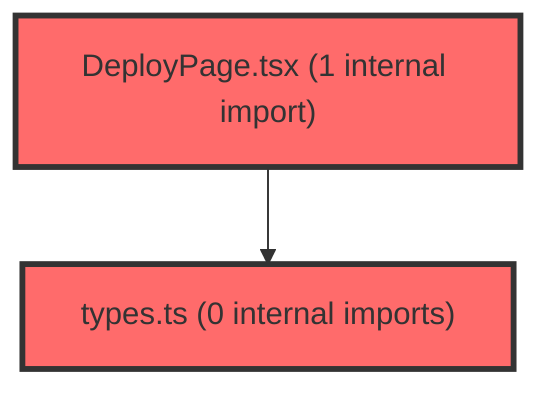

> [!IMPORTANT]
> **⚠️ 수동 검토 권장 (자가힐링 주의)**
>
> AI 자가힐링 결과물이 실제 의도와 다를 수 있으므로, **상세 리뷰 내용에 기반한 수동 점검**을 우선해 주시기 바랍니다. 자가힐링 기능을 활용하실 경우 최종 결과물을 신중하게 확인해 주세요.

# 코드 리뷰 - b7a51871

## 코드 복잡도 분석

**분석된 파일**: 12개 / 변경된 파일: 20개


### Import 의존관계 다이어그램



**범례**: 중심 파일 (변경됨) | 많은 import (10개 이상)


### 정상 범위 (NONE)


**`dgnssmapper.xml`** (other)

- 평균 복잡도: **0.243**

- 최대 복잡도: 0.475

- 청크 수: 2개

- 평균 사용처: 7.0곳


**권장사항:**

- 복잡도 정상 범위


**`dgnssservice.java`** (other)

- 평균 복잡도: **0.111**

- 최대 복잡도: 0.473

- 청크 수: 69개

- 평균 사용처: 12.8곳


**권장사항:**

- 파일 크기가 큼 (69개 청크) - 파일 분리 검토


**`apiresponseaspect.java`** (other)

- 평균 복잡도: **0.097**

- 최대 복잡도: 0.467

- 청크 수: 5개

- 평균 사용처: 11.8곳


**권장사항:**

- 복잡도 정상 범위


**`dgnsspdfcontroller.java`** (other)

- 평균 복잡도: **0.006**

- 최대 복잡도: 0.007

- 청크 수: 2개


**권장사항:**

- 복잡도 정상 범위


**`dgnssteachercontroller.java`** (other)

- 평균 복잡도: **0.006**

- 최대 복잡도: 0.008

- 청크 수: 7개


**권장사항:**

- 복잡도 정상 범위


**`lmsactivityservice.ts`** (other)

- 평균 복잡도: **0.003**

- 최대 복잡도: 0.007

- 청크 수: 87개


**권장사항:**

- 파일 크기가 큼 (87개 청크) - 파일 분리 검토


**`index.ts`** (other)

- 평균 복잡도: **0.002**

- 최대 복잡도: 0.012

- 청크 수: 46개


**권장사항:**

- 파일 크기가 큼 (46개 청크) - 파일 분리 검토


**`schoolrecordagentapi.ts`** (other)

- 평균 복잡도: **0.002**

- 최대 복잡도: 0.006

- 청크 수: 18개


**권장사항:**

- 복잡도 정상 범위


**`lessonjoinpage.tsx`** (component)

- 평균 복잡도: **0.002**

- 최대 복잡도: 0.009

- 청크 수: 16개


**권장사항:**

- 복잡도 정상 범위


**`lessonviewerpage.tsx`** (component)

- 평균 복잡도: **0.002**

- 최대 복잡도: 0.011

- 청크 수: 9개


**권장사항:**

- 복잡도 정상 범위


**`types.ts`** (other)

- 평균 복잡도: **0.001**

- 최대 복잡도: 0.008

- 청크 수: 13개


**권장사항:**

- 복잡도 정상 범위


**`deploypage.tsx`** (component)

- 평균 복잡도: **0.000**

- 최대 복잡도: 0.005

- 청크 수: 177개


**권장사항:**

- 파일 크기가 큼 (177개 청크) - 파일 분리 검토


---


## 변경 배경

이 커밋은 학습심리정서검사(LPA) 도메인의 **백엔드 API 정리와 데이터 정확성 개선**을 목적으로 합니다. PDF/엑셀 관련 API를 별도 컨트롤러로 분리해 관심사를 명확히 하고, 학생 분석 조회 시 `claId` 필터를 추가해 **다른 학급 검사 결과가 섞여 LPA 유형이 비결정적으로 선택되는 문제**를 해결했습니다. 또한 신뢰도 '주의' 학생도 LPA를 제공하되 어떤 지표가 '주의'인지 플래그(`reliabilityWarnings`)로 전달하는 정책을 도입했습니다.

- **목적**: PDF/엑셀 API 분리, 학생 분석의 학급 필터링 및 결정적 정렬, LPA 신뢰도 정책 통일
- **도메인**: 백엔드 API (학습심리검사), 프론트 문서
- **변경 방향**: 컨트롤러 관심사 분리, 데이터 조회의 결정성(결정적 정렬) 확보, 신뢰도 정책을 개별/벌크 API 간 통일

## [GOOD] 잘된 점

- **컨트롤러 관심사 분리**: PDF/엑셀 관련 6개 엔드포인트를 `DgnssPdfController`로 분리하여 `DgnssTeacherController`의 책임을 명확히 했습니다. `@Tag` 설명도 갱신되어 API 문서화가 개선되었습니다.
- **결정적 정렬 도입**: `ORDER BY a1.ord_no, c1.ANSWER_IDX DESC`로 동일 학생·회차의 중복 결과에서 최신 검사를 대표로 선택하도록 하여 **비결정적(non-deterministic) 결과 문제를 근본적으로 해결**했습니다.
- **정책 통일 및 명시적 주석**: LPA 신뢰도 '주의' 학생 포함 정책을 개별 API(`st/analysis`)와 벌크 API(`tc/analysis`)에 일관되게 적용하고, 코드 주석으로 정책 근거를 명확히 남겼습니다.

## 변경사항 요약

PDF/엑셀 API를 `DgnssPdfController`로 분리하고, 학생 분석 조회에 `claId` 필터와 결정적 정렬을 추가했습니다. LPA 신뢰도 '주의' 학생도 결과에 포함하되 `reliabilityWarnings` 플래그를 함께 전달하도록 정책을 통일했으며, 코칭 도메인 지식 문서와 활동 결과 API 개선 요청 문서를 추가했습니다.

---

## [ISSUE] 개선이 필요한 부분

### Critical (즉시 수정 필요)

없음

### High (우선 수정 권장)

- **`fetchClassTotalReportCached` 캐시와 신규 조회 로직의 정책 불일치 가능성**: `DgnssService.java`의 학급 평균 경로(`fetchClassTotalReportCached`)는 `notExistsYn="N"`만 사용하는 반면, 새로 추가된 `lpaByOrd` 조회는 `lernInclude="Y"`를 추가로 사용합니다. 주석에 "학급 평균 경로와는 별개 조회라 평균에 영향 없음"이라고 명시되어 있으나, **동일한 `selectClassTotalReport` 매퍼를 두 정책으로 호출**하므로 향후 매퍼 쿼리 변경 시 두 경로가 함께 영향받을 수 있습니다. 이는 설계상 의도된 분리이므로 기능 버그는 아니지만, 매퍼 재사용에 따른 결합도 증가를 인지하고 있어야 합니다.

### Medium (개선 권장)

- **`dgnssDownloadAll`의 `type` 파라미터 미사용**: `DgnssPdfController.dgnssDownloadAll`에서 `type` 파라미터를 받지만 실제 로직(`createDgnssDownloadAllZip`)에 전달하지 않습니다. 기존 `DgnssTeacherController`에서 이동한 코드이므로 기존 동작과 동일하지만, 파라미터가 무시되는 것은 잠재적 혼란을 줄 수 있습니다.
- **`buildReliabilityWarnings` 로직의 프론트/백엔드 중복**: 백엔드 `DgnssService.buildReliabilityWarnings`와 프론트 `apiDataTransformer.ts`/`metaApi.ts`에 동일한 로직이 중복 존재합니다. 정책 변경 시 양쪽을 함께 수정해야 하는 유지보수 부담이 있습니다.

---

## 주요 파일 분석

### DgnssService.java

**변경 내용:**
학생 분석 조회에 `claId` 필터를 추가하고, LPA 신뢰도 '주의' 학생 포함 정책을 개별/벌크 API에 통일하며 `reliabilityWarnings`를 추가했습니다.

**개선 제안:**

1. `buildReliabilityWarnings`의 중복 로직을 상수/공통 유틸로 추출
   - **위치**: `DgnssService.java` 내 `buildReliabilityWarnings` 메서드
   - **기존 코드**:
```java
private List<String> buildReliabilityWarnings(Map<String, Object> row) {
    List<String> warnings = new ArrayList<>();
    if ("주의".equals(MapUtils.getString(row, "desirable", ""))) {
        warnings.add("사회적바람직성");
    }
    if ("주의".equals(MapUtils.getString(row, "reaction", ""))) {
        warnings.add("반응일관성");
    }
    String repeat = MapUtils.getString(row, "repeatResponse", "");
    if ("Y".equals(repeat) || "주의".equals(repeat)) {
        warnings.add("연속동일반응");
    }
    return warnings;
}
```
   - **해결 방안**: 프론트와 동일한 순서(반응일관성 → 사회적바람직성 → 연속동일반응)로 정렬하여 응답 일관성을 확보하고, 반복되는 `MapUtils.getString` 호출을 지역 변수로 정리
```java
private List<String> buildReliabilityWarnings(Map<String, Object> row) {
    List<String> warnings = new ArrayList<>();
    String reaction = MapUtils.getString(row, "reaction", "");
    String desirable = MapUtils.getString(row, "desirable", "");
    String repeat = MapUtils.getString(row, "repeatResponse", "");
    if ("주의".equals(reaction)) {
        warnings.add("반응일관성");
    }
    if ("주의".equals(desirable)) {
        warnings.add("사회적바람직성");
    }
    if ("Y".equals(repeat) || "주의".equals(repeat)) {
        warnings.add("연속동일반응");
    }
    return warnings;
}
```
> `buildReliabilityWarnings` 함수 전체를 search_code로 확인했습니다. 단순 조건 분기만 존재하며 루프/인덱스 조작이 없어 부작용이 없음을 확인했습니다. 다만 프론트(`apiDataTransformer.ts`)의 순서가 `reaction → desirable → repeat`인 반면 백엔드는 `desirable → reaction → repeat`로 순서가 달라, 응답 배열 순서가 프론트와 다를 수 있습니다. 이는 기능상 문제는 아니지만 응답 일관성 측면에서 정렬 순서를 맞추는 것을 권장합니다.

### DgnssPdfController.java (신규)

**변경 내용:**
PDF/엑셀 관련 6개 엔드포인트를 `DgnssTeacherController`에서 분리한 신규 컨트롤러입니다.

**개선 제안:**

1. `dgnssDownloadAll`의 `type` 파라미터가 실제 로직에 전달되지 않음
   - **위치**: `DgnssPdfController.java`의 `dgnssDownloadAll` 메서드
   - **기존 코드**:
```java
String zipFileUrl = dgnssService.createDgnssDownloadAllZip(request, true, paramData);
```
   - **해결 방안**: `type` 파라미터가 실제로 사용되지 않는다면 `@Parameter` 설명과 함께 명시적으로 무시됨을 주석으로 남기거나, 사용처가 있다면 서비스로 전달

**[수정 코드 제시 불가 — 문맥 파악 불충분]**

> `createDgnssDownloadAllZip`의 시그니처와 내부 동작을 확인하지 못해 `type` 전달 여부를 확정할 수 없습니다. 기존 `DgnssTeacherController`에서 이동한 코드이므로 기존 동작과 동일할 가능성이 높지만, `type` 파라미터가 무시되는 것은 잠재적 혼란을 줄 수 있어 확인이 필요합니다.

### DgnssMapper.xml

**변경 내용:**
`selectStLernAnalysis` 쿼리에 `claId` 조건부 필터와 `ORDER BY a1.ord_no, c1.ANSWER_IDX DESC` 결정적 정렬을 추가했습니다.

**개선 제안:**

1. `ORDER BY`에 인덱스 활용 고려
   - **위치**: `DgnssMapper.xml`의 `selectStLernAnalysis` 쿼리
   - **기존 코드**:
```sql
ORDER BY a1.ord_no, c1.ANSWER_IDX DESC
```
   - **해결 방안**: `(paper_idx, stdt_id, cla_id, ord_no, ANSWER_IDX)` 복합 인덱스가 있다면 정렬이 인덱스를 활용할 수 있습니다. 데이터 규모가 크다면 실행 계획 확인을 권장합니다.

**[수정 코드 제시 불가 — 문맥 파악 불충분]**

> 테이블 구조와 기존 인덱스 구성을 확인하지 못해 인덱스 추가 여부를 확정할 수 없습니다. 데이터 규모가 작다면 성능 이슈는 없을 것입니다.

---

## 최종 평가

**결론**: 
- [ ] [OK] **승인 (Approved)** - Critical/High 이슈 없음
- [x] [WARN] **조건부 승인 (Approved with Comments)** - Medium 이하 이슈만 존재
- [ ] [FIX] **수정 필요 (Changes Requested)** - Critical/High 이슈 존재

**종합 의견:**

이 커밋은 PDF/엑셀 API 분리와 학생 분석의 학급 필터링·결정적 정렬 도입이라는 명확한 목적을 가진 안정적인 리팩토링입니다. 특히 `claId` 필터와 `ORDER BY` 추가로 LPA 유형이 비결정적으로 선택되던 문제를 근본적으로 해결한 점이 돋보입니다. `reliabilityWarnings` 정책 통일도 개별/벌크 API 간 일관성을 확보한 좋은 개선입니다. 다만 `buildReliabilityWarnings`의 프론트/백엔드 중복과 `dgnssDownloadAll`의 `type` 파라미터 미사용 등 소소한 개선 여지가 있어 조건부 승인을 권장합니다.