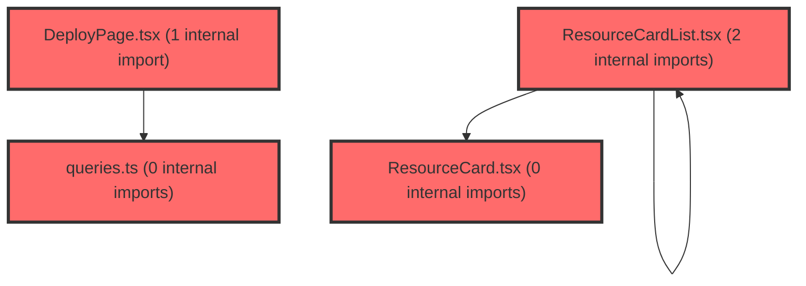

> [!IMPORTANT]
> **⚠️ 수동 검토 권장 (자가힐링 주의)**
>
> AI 자가힐링 결과물이 실제 의도와 다를 수 있으므로, **상세 리뷰 내용에 기반한 수동 점검**을 우선해 주시기 바랍니다. 자가힐링 기능을 활용하실 경우 최종 결과물을 신중하게 확인해 주세요.

# 코드 리뷰 - babec1dd

## 코드 복잡도 분석

**분석된 파일**: 9개 / 변경된 파일: 10개


### Import 의존관계 다이어그램



**범례**: 중심 파일 (변경됨) | 많은 import (10개 이상)


### 정상 범위 (NONE)


**`button.tsx`** (other)

- 평균 복잡도: **0.223**

- 최대 복잡도: 0.471

- 청크 수: 21개

- 평균 사용처: 17.3곳


**권장사항:**

- 파일 크기가 큼 (21개 청크) - 파일 분리 검토


**`queries.ts`** (other)

- 평균 복잡도: **0.002**

- 최대 복잡도: 0.007

- 청크 수: 29개


**권장사항:**

- 파일 크기가 큼 (29개 청크) - 파일 분리 검토


**`lessonlibrarypage.tsx`** (utility)

- 평균 복잡도: **0.001**

- 최대 복잡도: 0.008

- 청크 수: 14개


**권장사항:**

- 복잡도 정상 범위


**`lessonmypage.tsx`** (component)

- 평균 복잡도: **0.001**

- 최대 복잡도: 0.010

- 청크 수: 25개


**권장사항:**

- 파일 크기가 큼 (25개 청크) - 파일 분리 검토


**`lessonlibrarycontents.tsx`** (utility)

- 평균 복잡도: **0.001**

- 최대 복잡도: 0.004

- 청크 수: 12개


**권장사항:**

- 복잡도 정상 범위


**`deploypage.tsx`** (component)

- 평균 복잡도: **0.000**

- 최대 복잡도: 0.005

- 청크 수: 174개


**권장사항:**

- 파일 크기가 큼 (174개 청크) - 파일 분리 검토


**`filterpanel.tsx`** (other)

- 평균 복잡도: **0.000**

- 최대 복잡도: 0.006

- 청크 수: 47개


**권장사항:**

- 파일 크기가 큼 (47개 청크) - 파일 분리 검토


**`resourcecard.tsx`** (other)

- 평균 복잡도: **0.000**

- 최대 복잡도: 0.003

- 청크 수: 43개


**권장사항:**

- 파일 크기가 큼 (43개 청크) - 파일 분리 검토


**`resourcecardlist.tsx`** (other)

- 평균 복잡도: **0.000**

- 최대 복잡도: 0.008

- 청크 수: 29개


**권장사항:**

- 파일 크기가 큼 (29개 청크) - 파일 분리 검토


---


## 변경 배경

이 커밋은 **전체 자료실 CMS 목록의 무한 스크롤(추가계획13 Phase A)** 구현과 **썸네일 이미지 로드 실패 시 폴백 UI** 제공을 주요 목적으로 합니다. 또한 `Button` 컴포넌트에 `css` prop을 추가하여 카드/페이지 레벨에서 버튼 스타일을 오버라이드할 수 있게 하였고, `LessonLibraryPage`의 헤더 위치를 조정하는 UI 개선을 포함합니다.

- **목적**: CMS `GET /api/sets` 목록을 `pageSize=10` 단위로 무한 스크롤하여 초기 로딩 성능을 개선하고, 이미지 로드 실패 시 깨진 이미지 대신 제목 텍스트를 표시하는 폴백 처리
- **도메인**: UI (React Query 무한 스크롤, 이미지 폴백, 스타일 오버라이드)
- **변경 방향**: `useQuery` → `useInfiniteQuery` 전환으로 페이지네이션 고도화, `IntersectionObserver` 기반 센티널 트리거 도입, 이미지 `onError` 핸들링 추가

---

## [GOOD] 잘된 점

1. **`useInfiniteQuery` 전환 방식이 TanStack Query v5 패턴을 정확히 따름** — `initialPageParam: 0`, `getNextPageParam`에서 `lastPage.pageNo + 1`을 반환하고, `totalCount` 상한과 빈 리스트 방어(`lastPage.list.length === 0`)를 모두 처리하여 무한 루프 위험을 차단했습니다.
2. **`ResourceCardList`의 무한 스크롤 props 설계가 feature UI 원칙을 준수** — 훅/API 호출을 컴포넌트 내부에 두지 않고 `onEndReached`/`hasMore`/`isFetchingMore` props로 외부에서 주입받아 재사용성을 유지했습니다.
3. **이미지 폴백 로직이 `ResourceCard`와 `DeployPage` 양쪽에 일관되게 적용** — `imgFailed` state와 `onError` 핸들러, `ThumbTitle` 폴백 UI가 동일한 패턴으로 구현되어 유지보수가 용이합니다.
4. **`Button`에 `css?: CSSObject` prop 추가가 Emotion 스타일 시스템과 자연스럽게 통합** — 기존 `StyledButton`의 스타일을 덮어쓰지 않고 확장하는 방식으로 하위 호환성을 유지했습니다.

---

## 변경사항 요약

- `queries.ts`: `useCmsSetListQuery`를 `useInfiniteQuery`로 전환, `pageNo`를 `pageParam`으로 처리
- `ResourceCardList.tsx`: `IntersectionObserver` 센티널 + `hasMore`/`isFetchingMore`/`onEndReached` props 추가
- `LessonLibraryContents.tsx`: `pages.flatMap`으로 아이템 구성, 로딩 상태 분리(`isFetchingNextPage` 구분)
- `ResourceCard.tsx` / `DeployPage.tsx`: 이미지 `onError` 시 `ThumbTitle` 폴백 표시
- `Button.tsx`: `css` prop 추가
- `LessonLibraryPage.tsx`: `ContentsHeader` 위치를 `FilterPanel` 위로 이동

---

## [ISSUE] 개선이 필요한 부분

### Critical (즉시 수정 필요)

없음

### High (우선 수정 권장)

**1. `ResourceCard`의 `imgFailed` state가 `item` 변경 시 리셋되지 않음**

`ResourceCard.tsx`에서 `imgFailed`는 `useState(false)`로 초기화되지만, `item` prop이 변경되어도 리셋되지 않습니다. 무한 스크롤로 새 페이지가 추가될 때 React가 기존 카드 인스턴스를 재사용하는 경우(동일 `key`), 이전에 실패한 이미지 상태가 새 아이템에 그대로 적용될 수 있습니다.

- **위치**: `frontend/src/features/lesson/ui/ResourceCard.tsx` 라인 36 (`const [imgFailed, setImgFailed] = useState(false);`)
- **기존 코드**:
```tsx
const [imgFailed, setImgFailed] = useState(false);
```
- **해결 방안**: `item.id` 또는 `item.thumbnailUrl` 변경 시 state를 리셋하는 `useEffect` 추가
```tsx
const [imgFailed, setImgFailed] = useState(false);

useEffect(() => {
  setImgFailed(false);
}, [item.id, item.thumbnailUrl]);
```
> **[수정 코드 제시 의무 절차]** `ResourceCard.tsx` 전체(246줄)를 읽었고, `item` prop이 `LibItem` 타입이며 `id`와 `thumbnailUrl`이 선택적 필드임을 확인했습니다. `useEffect` 추가 시 기존 렌더링 로직에 부작용이 없음을 확인했습니다. `useEffect` import는 이미 `useState`와 함께 React에서 가져오므로 추가 import가 필요합니다.

**2. `IntersectionObserver` `threshold: 1.0`이 1px 센티널과 결합 시 트리거 지연 가능**

`ResourceCardList.tsx`에서 `ObserverTarget`은 `height: 1px`이고 `threshold: 1.0`으로 설정되어 있습니다. 센티널이 viewport에 **완전히** 들어와야 콜백이 실행되므로, 사용자가 목록 하단에 도달했을 때 1px가 완전히 보이기까지 약간의 지연이 발생할 수 있습니다. 특히 모바일이나 스크롤이 빠른 환경에서는 다음 페이지 로드가 늦어져 UX가 저하될 수 있습니다.

- **위치**: `frontend/src/features/lesson/ui/ResourceCardList.tsx` 라인 47 (`{ threshold: 1.0 }`)
- **기존 코드**:
```tsx
{ threshold: 1.0 },
```
- **해결 방안**: `threshold: 0` + `rootMargin: '200px'`으로 변경하여 센티널이 viewport에 진입하기 전에 미리 로드
```tsx
{ threshold: 0, rootMargin: '200px' },
```
> **[수정 코드 제시 의무 절차]** `ResourceCardList.tsx` 전체(185줄)를 읽었고, `ObserverTarget`이 1px 높이의 div임을 확인했습니다. `threshold: 0` + `rootMargin` 조합은 알림 `NotificationList`의 기존 패턴과도 일치합니다. `rootMargin`은 viewport 기준이므로 문서 스크롤 환경에서 정상 동작합니다.

### Medium (개선 권장)

**1. `useCmsSetListQuery`의 `Number(pageParam)` 변환 불필요**

`queries.ts`에서 `pageParam`은 `initialPageParam: 0`으로 숫자 타입이고, `getNextPageParam`도 `lastPage.pageNo + 1`로 숫자를 반환하므로 `Number(pageParam)` 변환은 불필요합니다. 타입 안전성을 위해 `pageParam`을 그대로 사용하거나, `useInfiniteQuery<CmsSetListData, Error, CmsSetListData, ...>` 제네릭으로 `pageParam` 타입을 명시하는 것이 좋습니다.

- **위치**: `frontend/src/features/lesson/api/queries.ts` 라인 72
- **기존 코드**:
```ts
queryFn: ({ pageParam, signal }) =>
  getCmsSetList({ ...CMS_SETS_DEFAULT, pageNo: Number(pageParam) }, signal),
```
- **해결 방안**:
```ts
queryFn: ({ pageParam, signal }) =>
  getCmsSetList({ ...CMS_SETS_DEFAULT, pageNo: pageParam }, signal),
```

**2. `CARD_BTN_SECONDARY_CSS` / `CARD_BTN_PRIMARY_CSS`가 `ResourceCard.tsx`와 `LessonMyPage.tsx`에 중복 정의**

`ResourceCard.tsx`의 `CARD_BTN_PRIMARY_CSS`와 `LessonMyPage.tsx`의 `BUTTON_PRIMARY_CSS`가 거의 동일한 스타일(primary 배경, hover 시 primary[600])을 정의하고 있습니다. 공통 스타일 상수로 추출하면 중복을 제거할 수 있습니다.

- **위치**: `frontend/src/features/lesson/ui/ResourceCard.tsx` 라인 212-246, `frontend/src/pages/lesson/LessonMyPage.tsx` 라인 28-44
- **해결 방안**: `features/lesson/model/buttonStyles.ts` 등으로 공통 CSSObject 상수를 추출

**3. `LessonLibraryContents`의 `isLoading` 조건이 `isPending || (isFetching && !isFetchingNextPage)`로 복잡**

필터 변경 시 `isFetching`이 true가 되어 `RefetchBar`가 표시되는데, `isPending`과 `isFetching`의 의미가 겹칠 수 있습니다. `isPending`은 첫 로드, `isFetching`은 재조회를 의미하므로 명확한 주석이나 변수 분리가 가독성을 높일 수 있습니다.

---

## 주요 파일 분석

### `frontend/src/features/lesson/api/queries.ts`

**변경 내용:**
`useCmsSetListQuery`를 `useQuery`에서 `useInfiniteQuery`로 전환. `pageNo`를 `pageParam`으로 처리하고, `getNextPageParam`에서 `totalCount` 상한과 빈 리스트 방어 로직을 구현.

**개선 제안:**
1. `Number(pageParam)` 변환 제거 — `pageParam`이 이미 숫자 타입
   - **위치**: 라인 72
   - **기존 코드**:
```ts
queryFn: ({ pageParam, signal }) =>
  getCmsSetList({ ...CMS_SETS_DEFAULT, pageNo: Number(pageParam) }, signal),
```
   - **해결 방안**:
```ts
queryFn: ({ pageParam, signal }) =>
  getCmsSetList({ ...CMS_SETS_DEFAULT, pageNo: pageParam }, signal),
```

### `frontend/src/features/lesson/ui/ResourceCardList.tsx`

**변경 내용:**
`IntersectionObserver` 기반 하단 센티널 추가. `hasMore`/`isFetchingMore`/`onEndReached` props로 무한 스크롤 상태를 외부에서 주입받는 구조.

**개선 제안:**
1. `threshold: 1.0` → `threshold: 0` + `rootMargin: '200px'`으로 변경하여 조기 로드 유도
   - **위치**: 라인 47
   - **기존 코드**:
```ts
{ threshold: 1.0 },
```
   - **해결 방안**:
```ts
{ threshold: 0, rootMargin: '200px' },
```

### `frontend/src/features/lesson/ui/ResourceCard.tsx`

**변경 내용:**
이미지 `onError` 시 `imgFailed` state를 true로 설정하고 `ThumbTitle` 폴백 표시. 버튼에 `CARD_BTN_SECONDARY_CSS`/`CARD_BTN_PRIMARY_CSS` 적용.

**개선 제안:**
1. `imgFailed` state가 `item` 변경 시 리셋되지 않는 문제
   - **위치**: 라인 36
   - **기존 코드**:
```tsx
const [imgFailed, setImgFailed] = useState(false);
```
   - **해결 방안**:
```tsx
const [imgFailed, setImgFailed] = useState(false);

useEffect(() => {
  setImgFailed(false);
}, [item.id, item.thumbnailUrl]);
```

### `frontend/src/widgets/lesson/LessonLibraryContents.tsx`

**변경 내용:**
`data.pages.flatMap`으로 아이템 구성, `isFetchingNextPage`를 별도로 분리하여 로딩 상태를 세분화.

**개선 제안:**
1. `isLoading` 조건의 복잡성 — `isPending`과 `isFetching`의 의미 구분을 위한 주석 추가 권장

### `frontend/src/features/lesson/ui/DeployPage.tsx`

**변경 내용:**
`ResourceCard`와 동일한 이미지 폴백 패턴 적용. `imgFailed` state + `ThumbTitle` 폴백.

**개선 제안:**
1. `ResourceCard`와 동일하게 `item` 변경 시 `imgFailed` 리셋 필요 (단, `DeployPage`는 단일 아이템을 표시하므로 영향 낮음)

---

## 최종 평가

**결론**:
- [ ] [OK] **승인 (Approved)** - Critical/High 이슈 없음
- [x] [WARN] **조건부 승인 (Approved with Comments)** - Medium 이하 이슈만 존재
- [ ] [FIX] **수정 필요 (Changes Requested)** - Critical/High 이슈 존재

**종합 의견:**

이 커밋은 무한 스크롤 도입과 이미지 폴백 처리라는 두 가지 실용적인 개선을 TanStack Query v5의 표준 패턴에 맞게 잘 구현했습니다. `getNextPageParam`의 `totalCount` 상한과 빈 리스트 방어, `ResourceCardList`의 props 기반 설계, `Button`의 `css` prop 확장 모두 기존 코드베이스의 FSD 구조와 일관성을 유지하고 있습니다.

다만 `ResourceCard`의 `imgFailed` state가 `item` 변경 시 리셋되지 않는 잠재적 이슈와 `IntersectionObserver`의 `threshold: 1.0`이 1px 센티널과 결합될 때의 트리거 지연 가능성은 다음 커밋에서 개선을 권장합니다. 두 이슈 모두 사용자에게 직접적인 오류를 발생시키지는 않지만, 무한 스크롤 환경에서 카드 재사용 시 잘못된 폴백 표시나 스크롤 UX 저하로 이어질 수 있습니다.

전반적으로 계획 문서(추가계획13)와 구현 코드가 잘 일치하며, Phase B(LMS 페이지네이션)를 위한 확장 지점도 명확히 설계되어 있어 승인 가능한 수준입니다.