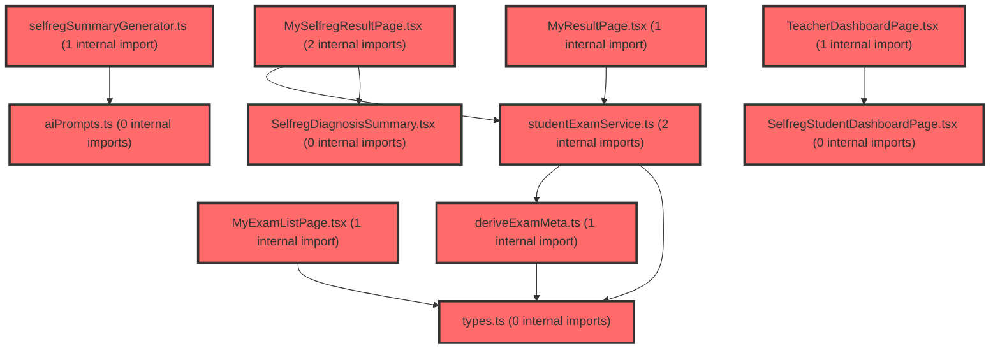

> [!IMPORTANT]
> **⚠️ 수동 검토 권장 (자가힐링 주의)**
>
> AI 자가힐링 결과물이 실제 의도와 다를 수 있으므로, **상세 리뷰 내용에 기반한 수동 점검**을 우선해 주시기 바랍니다. 자가힐링 기능을 활용하실 경우 최종 결과물을 신중하게 확인해 주세요.

# 코드 리뷰 - bbfc9797

## 코드 복잡도 분석

**분석된 파일**: 17개 / 변경된 파일: 17개


### Import 의존관계 다이어그램



**범례**: 중심 파일 (변경됨) | 많은 import (10개 이상)


### 정상 범위 (NONE)


**`types.ts`** (other)

- 평균 복잡도: **0.005**

- 최대 복잡도: 0.010

- 청크 수: 4개


**권장사항:**

- 복잡도 정상 범위


**`studentexamservice.ts`** (other)

- 평균 복잡도: **0.004**

- 최대 복잡도: 0.009

- 청크 수: 20개


**권장사항:**

- 복잡도 정상 범위


**`aiprompts.ts`** (other)

- 평균 복잡도: **0.004**

- 최대 복잡도: 0.024

- 청크 수: 50개


**권장사항:**

- 파일 크기가 큼 (50개 청크) - 파일 분리 검토


**`deriveexammeta.ts`** (utility)

- 평균 복잡도: **0.003**

- 최대 복잡도: 0.006

- 청크 수: 8개


**권장사항:**

- 복잡도 정상 범위


**`selfregfactordefinitions.ts`** (other)

- 평균 복잡도: **0.003**

- 최대 복잡도: 0.003

- 청크 수: 1개


**권장사항:**

- 복잡도 정상 범위


**`useapidata.ts`** (other)

- 평균 복잡도: **0.002**

- 최대 복잡도: 0.010

- 청크 수: 60개


**권장사항:**

- 파일 크기가 큼 (60개 청크) - 파일 분리 검토


**`selfregsummarygenerator.ts`** (utility)

- 평균 복잡도: **0.002**

- 최대 복잡도: 0.004

- 청크 수: 14개


**권장사항:**

- 복잡도 정상 범위


**`selfregdiagnosissummary.tsx`** (other)

- 평균 복잡도: **0.001**

- 최대 복잡도: 0.006

- 청크 수: 16개


**권장사항:**

- 복잡도 정상 범위


**`selfregstudentdashboardpage.tsx`** (component)

- 평균 복잡도: **0.001**

- 최대 복잡도: 0.012

- 청크 수: 68개


**권장사항:**

- 파일 크기가 큼 (68개 청크) - 파일 분리 검토


**`classdashboardv2widget.tsx`** (other)

- 평균 복잡도: **0.001**

- 최대 복잡도: 0.012

- 청크 수: 177개


**권장사항:**

- 파일 크기가 큼 (177개 청크) - 파일 분리 검토


**`selfregresultoverview.tsx`** (component)

- 평균 복잡도: **0.000**

- 최대 복잡도: 0.009

- 청크 수: 68개


**권장사항:**

- 파일 크기가 큼 (68개 청크) - 파일 분리 검토


**`selfregstudentsummary.tsx`** (other)

- 평균 복잡도: **0.000**

- 최대 복잡도: 0.002

- 청크 수: 26개


**권장사항:**

- 파일 크기가 큼 (26개 청크) - 파일 분리 검토


**`index.ts`** (other)

- 평균 복잡도: **0.000**

- 최대 복잡도: 0.000

- 청크 수: 13개


**권장사항:**

- 복잡도 정상 범위


**`myexamlistpage.tsx`** (component)

- 평균 복잡도: **0.000**

- 최대 복잡도: 0.008

- 청크 수: 114개


**권장사항:**

- 파일 크기가 큼 (114개 청크) - 파일 분리 검토


**`myresultpage.tsx`** (component)

- 평균 복잡도: **0.000**

- 최대 복잡도: 0.008

- 청크 수: 100개


**권장사항:**

- 파일 크기가 큼 (100개 청크) - 파일 분리 검토


**`myselfregresultpage.tsx`** (component)

- 평균 복잡도: **0.000**

- 최대 복잡도: 0.008

- 청크 수: 92개


**권장사항:**

- 파일 크기가 큼 (92개 청크) - 파일 분리 검토


**`teacherdashboardpage.tsx`** (component)

- 평균 복잡도: **0.000**

- 최대 복잡도: 0.004

- 청크 수: 42개


**권장사항:**

- 파일 크기가 큼 (42개 청크) - 파일 분리 검토


---


## 변경 배경

이 커밋은 **자기조절학습검사(paperIdx='2')의 2차 검사 지원**을 위한 프론트엔드 아키텍처 개선입니다. 기존에는 `useTeacherClasses` 훅이 paperIdx 구분 없이 모든 검사를 단일 흐름으로 처리했으나, 이번 변경으로 **검사지 종류(학습종합검사/자기조절학습검사)별로 데이터를 분리 조회**하고, **1차/2차 회차별 상태(진행중/종료/시작전)를 정확히 표시**할 수 있게 되었습니다. 또한 학생 대시보드에 **자기조절학습 결과 개요(레이더 차트, 프로파일 테이블, AI 요약, 학습 현황 카드)** UI 컴포넌트를 신규 추가하고, 학생 검사 목록에 **권장월(recommendedMonth)과 2차 검사 잠금(locked) 상태**를 파생 로직으로 적용했습니다.

- **목적**: 자기조절학습검사 2차 검사 지원 및 결과 대시보드 UI 신규 구축
- **도메인**: 프론트엔드 UI 컴포넌트, 데이터 페칭 훅, 비즈니스 로직(검사 상태 파생)
- **변경 방향**: paperIdx 파라미터 기반 데이터 분리, 회차별 상태 표시 정확성 개선, 신규 UI 컴포넌트 추가

---

## [GOOD] 잘된 점

1. **paperIdx 파라미터 도입으로 데이터 격리가 명확해짐**: `useTeacherClasses(paperIdx, enabled)` 시그니처로 검사지 종류를 명시적으로 구분하고, `queryKey`에 `paperIdx`를 포함하여 캐시 격리를 보장한 점이 좋습니다. `TeacherDashboardPage`에서 `activePaperIdx`를 계산해 전달하는 흐름도 일관적입니다.
2. **회차별 상태 로직이 명확하게 개선됨**: `round1Completed`, `round2Completed`, `examStatus.round1/round2`를 각각 독립적으로 계산하여 '종료/진행중/시작전' 상태를 정확히 표현합니다. `dgnssIds`를 추가하여 다운스트림 API 호출에 필요한 검사 ID를 함께 제공한 점도 실용적입니다.
3. **파생 로직의 유틸 분리**: `deriveExamMeta.ts`에 `withRecommendedMonth`, `deriveLockedStatus`를 순수 함수로 분리하여 테스트 용이성과 재사용성을 확보했습니다. `RECOMMENDED_MONTH` 상수도 명확하게 정의되어 있습니다.
4. **신규 UI 컴포넌트의 구조적 설계**: `SelfregResultOverview`는 레이더 차트, T점수 스케일, 툴팁, 회차 스위치를 하나의 카드로 통합하고, `SelfregProfileTable`은 SVG 오버레이 방식으로 프로파일 라인을 그려 성능과 유연성을 확보했습니다.

---

## 변경사항 요약

- `useApiData.ts`: `useTeacherClasses`에 `paperIdx`/`enabled` 파라미터 추가, 검사 목록 필터링, 회차별 상태/통계 로직 개선
- `SelfregResultOverview.tsx` (신규): 자기조절학습 종합 결과 개요(레이더 차트 + T점수 스케일 + 회차 스위치) 및 프로파일 테이블 컴포넌트
- `SelfregStudentSummary.tsx` (신규): AI 분석 총평 카드 및 개인 학습 현황 카드
- `studentExamService.ts`: `recommendedMonth` 필드 추가, `deriveLockedStatus`/`withRecommendedMonth` 적용, `locked` 상태 라벨/색상/메시지 추가

---

## [ISSUE] 개선이 필요한 부분

### Critical (즉시 수정 필요)

없음

### High (우선 수정 권장)

**1. `useTeacherClasses`의 `paperIdx='2'`일 때 `buildClassFromAPI` 미사용으로 인한 데이터 누락 가능성**

- **위치**: `frontend/src/features/api/useApiData.ts` 라인 508 (`if (primaryDgnssId && paperIdx === '1')`)
- **기존 코드**:
```typescript
if (primaryDgnssId && paperIdx === '1') {
  return buildClassFromAPI(
    group.claId,
    group.grade,
    group.classNumber,
    schoolLevel,
    primaryDgnssId,
    round2?.dgnssId,
    group.schoolLevel,
  );
}
```
- **문제**: `paperIdx === '2'`(자기조절학습검사)인 경우 `buildClassFromAPI`를 호출하지 않고 항상 `simpleClass`(빈 `students` 배열)를 반환합니다. 이는 자기조절학습검사 결과가 있는 학급에서도 학생 목록이 비어 있는 `Class` 객체만 생성됨을 의미합니다. `TeacherDashboardPage`에서 `paperIdx='2'`를 선택했을 때 학급 상세로 이동하면 학생 데이터가 없어 대시보드가 정상 동작하지 않을 수 있습니다. `buildClassFromAPI`가 paperIdx='2' 데이터를 지원하지 않는 구조라면, 최소한 `simpleClass`에 `students`를 채울 수 있는 경로를 고려해야 합니다.

**2. `latestCompletedExam` 우선순위로 인한 `totalStudents`/`assessedStudents` 왜곡 가능성**

- **위치**: `frontend/src/features/api/useApiData.ts` 라인 521-524
- **기존 코드**:
```typescript
const latestCompletedExam = round2 ?? round1;
...
totalStudents: (latestCompletedExam ?? activeExam)!.stTotalCnt,
assessedStudents: (latestCompletedExam ?? activeExam)!.stSubmCnt,
```
- **문제**: `round2`가 존재하면 항상 `round2`의 `stTotalCnt`/`stSubmCnt`를 사용합니다. 그러나 `round2`가 완료되었더라도 `round1`의 응시 인원이 더 많을 수 있고, `round2`가 아직 진행 중(진행중 상태)인데 `round1`만 완료된 경우에도 `round2`의 값이 사용됩니다. `examStatus.round1`이 '종료'인데 `totalStudents`가 `round2` 기준으로 표시되는 것은 사용자에게 혼란을 줄 수 있습니다. 회차별로 별도 통계를 제공하거나, 최소한 `activeExam`(진행중)이 있으면 `activeExam` 기준으로 표시하는 것이 더 직관적입니다.

### Medium (개선 권장)

**1. `SelfregResultOverview`의 `overviewBarPosition` 로직 복잡성**

- **위치**: `frontend/src/features/student-dashboard/ui/SelfregResultOverview.tsx` (overviewBarPosition 함수)
- **문제**: `OVERVIEW_LEVEL_BANDS` 배열과 `bandIndex` 계산, `progress` 계산이 복잡하여 가독성이 떨어집니다. 특히 `Math.max(2, ((index + Math.max(0, Math.min(1, progress))) / 5) * 100)`에서 `progress`가 `(clamped - band.min) / (band.max - band.min + 1)`로 계산되는데, `+1`의 의미가 명확하지 않습니다. 단순히 `(score - 20) / 60 * 100`으로 선형 매핑하는 것이 더 이해하기 쉽습니다.

**2. `SelfregProfileTable`의 `PROFILE_ROWS` 상수와 `makeProfileLines`의 중복 계산**

- **위치**: `SelfregResultOverview.tsx` (PROFILE_ROWS, makeProfileLines)
- **문제**: `PROFILE_ROWS`는 모듈 레벨 상수로 정의되어 있지만, `makeProfileLines`는 컴포넌트 내부에서 매번 `SELFREG_DOMAIN_STRUCTURE.map`과 `PROFILE_ROWS.flatMap`을 반복 수행합니다. `scores`가 변경될 때마다 전체 도메인/요인을 순회하므로, `useMemo`로 최적화하거나 `PROFILE_ROWS`를 도메인별로 미리 그룹핑해두면 성능이 개선됩니다.

**3. `SelfregInsightSummary`의 문장 생성 로직 하드코딩**

- **위치**: `SelfregStudentSummary.tsx` (InsightText)
- **문제**: `{strengths.map((factor) => factor.name).join('과 ')}` 방식으로 문장을 조합하는데, 강점이 2개 이상일 때 'A과 B' 형태로 어색한 문장이 생성될 수 있습니다. 예: '학습 원동력과 메타 인지과' (조사 '과' 중복). `join('과 ')` 대신 마지막 항목 앞에 '와/과'를 붙이는 헬퍼 함수를 사용하는 것이 좋습니다.

**4. `deriveLockedStatus`의 `Set` 사용 시 `paperIdx` 타입 안전성**

- **위치**: `deriveExamMeta.ts` (deriveLockedStatus)
- **문제**: `firstRoundSubmitted`가 `Set<string>`으로 선언되어 `item.paperIdx`(string)를 그대로 사용합니다. `paperIdx`가 `'1' | '2'`로 제한된 타입이라면 `Set<'1' | '2'>`로 선언하는 것이 타입 안전성을 높입니다.

---

## 주요 파일 분석

### frontend/src/features/api/useApiData.ts

**변경 내용:**
`useTeacherClasses` 훅에 `paperIdx`/`enabled` 파라미터를 추가하고, 검사 목록을 paperIdx로 필터링하며, 회차별 상태/통계 로직을 개선했습니다.

**개선 제안:**

1. **paperIdx='2'일 때 buildClassFromAPI 미사용 문제**
   - **위치 (라인 508)**: `if (primaryDgnssId && paperIdx === '1')`
   - **기존 코드**:
```typescript
if (primaryDgnssId && paperIdx === '1') {
  return buildClassFromAPI(...);
}
```
   - **해결 방안**: `buildClassFromAPI`가 paperIdx='2'를 지원하는지 확인 후, 지원한다면 조건을 `if (primaryDgnssId)`로 변경하거나, 지원하지 않는다면 `simpleClass`에 `students`를 채우는 별도 로직을 추가하세요. 현재 구조에서는 paperIdx='2' 선택 시 학급 상세에서 학생 데이터가 비어 있어 대시보드가 정상 동작하지 않을 수 있습니다.

2. **`latestCompletedExam` 우선순위 개선**
   - **위치 (라인 521-524)**: `totalStudents`/`assessedStudents` 계산
   - **기존 코드**:
```typescript
const latestCompletedExam = round2 ?? round1;
...
totalStudents: (latestCompletedExam ?? activeExam)!.stTotalCnt,
assessedStudents: (latestCompletedExam ?? activeExam)!.stSubmCnt,
```
   - **해결 방안**: `activeExam`(진행중)이 있으면 `activeExam` 기준으로, 없으면 `round2` → `round1` 순으로 사용하되, `examStatus`와 일관성을 유지하도록 우선순위를 명확히 문서화하세요. 예를 들어 `const displayExam = activeExam ?? round2 ?? round1;`로 변경하면 진행중인 검사의 통계가 우선 표시됩니다.

### frontend/src/features/student-dashboard/ui/SelfregResultOverview.tsx (신규)

**변경 내용:**
자기조절학습 종합 결과 개요(레이더 차트, T점수 스케일, 회차 스위치)와 프로파일 테이블 컴포넌트를 신규 추가했습니다.

**개선 제안:**

1. **`overviewBarPosition` 로직 단순화**
   - **위치**: `overviewBarPosition` 함수
   - **기존 코드**:
```typescript
const overviewBarPosition = (score: number) => {
  const clamped = Math.max(20, Math.min(80, score));
  const bandIndex = OVERVIEW_LEVEL_BANDS.findIndex((band) => clamped <= band.max);
  const index = bandIndex < 0 ? OVERVIEW_LEVEL_BANDS.length - 1 : bandIndex;
  const band = OVERVIEW_LEVEL_BANDS[index];
  const progress = (clamped - band.min) / (band.max - band.min + 1);
  return Math.max(2, ((index + Math.max(0, Math.min(1, progress))) / 5) * 100);
};
```
   - **해결 방안**: 5단계 구간을 균등하게 나누는 단순 선형 매핑으로 대체할 수 있습니다:
```typescript
const overviewBarPosition = (score: number) => {
  const clamped = Math.max(20, Math.min(80, score));
  return Math.max(2, ((clamped - 20) / 60) * 100);
};
```
   - 단, 기존 로직이 5단계 구간별 비균등 매핑을 의도한 것이라면, 각 구간의 경계값을 상수로 추출하고 주석으로 의도를 명확히 설명하세요.

2. **`makeProfileLines`의 중복 계산 최적화**
   - **위치**: `makeProfileLines` 함수
   - **기존 코드**:
```typescript
const makeProfileLines = (profileScores: number[]) =>
  SELFREG_DOMAIN_STRUCTURE.map((domain) => ({
    domain,
    points: PROFILE_ROWS.flatMap((row, rowIndex) => {
      if (row.type !== 'factor' || row.domain !== domain.id) return [];
      return [{ x: profilePosition(profileScores[row.factorIndex] ?? 50), y: rowIndex * PROFILE_ROW_HEIGHT + PROFILE_ROW_HEIGHT / 2 }];
    }),
  }));
```
   - **해결 방안**: `PROFILE_ROWS`를 도메인별로 미리 그룹핑한 상수를 정의하면 반복 순회를 줄일 수 있습니다:
```typescript
const PROFILE_ROWS_BY_DOMAIN = SELFREG_DOMAIN_STRUCTURE.reduce((acc, domain) => {
  acc[domain.id] = PROFILE_ROWS.flatMap((row, rowIndex) =>
    row.type === 'factor' && row.domain === domain.id
      ? [{ rowIndex, factorIndex: row.factorIndex }]
      : [],
  );
  return acc;
}, {} as Record<string, Array<{ rowIndex: number; factorIndex: number }>>);

const makeProfileLines = (profileScores: number[]) =>
  SELFREG_DOMAIN_STRUCTURE.map((domain) => ({
    domain,
    points: (PROFILE_ROWS_BY_DOMAIN[domain.id] ?? []).map(({ rowIndex, factorIndex }) => ({
      x: profilePosition(profileScores[factorIndex] ?? 50),
      y: rowIndex * PROFILE_ROW_HEIGHT + PROFILE_ROW_HEIGHT / 2,
    })),
  }));
```

### frontend/src/features/student-dashboard/ui/SelfregStudentSummary.tsx (신규)

**변경 내용:**
AI 분석 총평 카드와 개인 학습 현황 카드를 신규 추가했습니다.

**개선 제안:**

1. **문장 생성 시 조사 처리**
   - **위치**: `SelfregInsightSummary` 컴포넌트의 `InsightText`
   - **기존 코드**:
```typescript
{studentName} 학생은 {strengths.map((factor) => factor.name).join('과 ')}에서 상대적인 강점을 보입니다.
```
   - **해결 방안**: 조사 '와/과'를 올바르게 처리하는 헬퍼 함수를 추가하세요:
```typescript
const joinWithParticle = (names: string[]) => {
  if (names.length === 0) return '';
  if (names.length === 1) return names[0];
  const last = names[names.length - 1];
  const hasBatchim = (last.charCodeAt(last.length - 1) - 0xac00) % 28 !== 0;
  return `${names.slice(0, -1).join(', ')}${hasBatchim ? '과' : '와'} ${last}`;
};
```
   - 사용 예: `{joinWithParticle(strengths.map((factor) => factor.name))}`

### frontend/src/features/student-exam/api/studentExamService.ts

**변경 내용:**
`recommendedMonth` 필드 추가, `deriveLockedStatus`/`withRecommendedMonth` 적용, `locked` 상태 라벨/색상/메시지 추가.

**개선 제안:**

1. **`mapToListItem`의 `recommendedMonth` 초기값 하드코딩**
   - **위치**: `mapToListItem` 함수 내 `recommendedMonth: ''`
   - **기존 코드**:
```typescript
return {
  ...
  recommendedMonth: '',
};
```
   - **해결 방안**: `withRecommendedMonth`에서 채워지므로 초기값이 빈 문자열인 것은 의도적일 수 있습니다. 다만, `mapToListItem`이 다른 곳에서도 사용될 가능성이 있다면 `recommendedMonth`를 옵셔널(`recommendedMonth?: string`)로 선언하거나, `mapToListItem` 내부에서 `RECOMMENDED_MONTH`를 직접 참조하는 것이 더 명확합니다.

---

## 최종 평가

**결론**:
- [ ] [OK] **승인 (Approved)** - Critical/High 이슈 없음
- [ ] [WARN] **조건부 승인 (Approved with Comments)** - Medium 이하 이슈만 존재
- [x] [FIX] **수정 필요 (Changes Requested)** - Critical/High 이슈 존재

**종합 의견:**

이 커밋은 자기조절학습검사 2차 검사 지원이라는 중요한 기능 확장을 잘 구조화하여 구현했습니다. `paperIdx` 기반 데이터 분리, 회차별 상태 로직 개선, 파생 유틸 분리, 신규 UI 컴포넌트 추가까지 전반적으로 방향성이 명확하고 코드 품질도 우수합니다. 다만, **`paperIdx='2'`일 때 `buildClassFromAPI`를 건너뛰어 학생 데이터가 비어 있는 `Class` 객체가 생성되는 문제**와 **`latestCompletedExam` 우선순위로 인한 통계 왜곡 가능성**은 실제 사용자에게 영향을 줄 수 있는 High 수준 이슈로 판단됩니다. 이 두 가지를 보완하면 충분히 승인 가능한 수준입니다. 특히 `paperIdx='2'` 선택 시 학급 상세 대시보드가 정상 동작하는지 실제 데이터로 검증해보시기를 권장합니다.