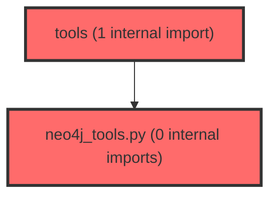

> [!IMPORTANT]
> **⚠️ 수동 검토 권장 (자가힐링 주의)**
>
> AI 자가힐링 결과물이 실제 의도와 다를 수 있으므로, **상세 리뷰 내용에 기반한 수동 점검**을 우선해 주시기 바랍니다. 자가힐링 기능을 활용하실 경우 최종 결과물을 신중하게 확인해 주세요.

# 코드 리뷰 - be7c18be

## 코드 복잡도 분석

**분석된 파일**: 2개 / 변경된 파일: 2개


### Import 의존관계 다이어그램



**범례**: 중심 파일 (변경됨) | 많은 import (10개 이상)


### 정상 범위 (NONE)


**`neo4j_tools.py`** (other)

- 평균 복잡도: **0.005**

- 최대 복잡도: 0.010

- 청크 수: 8개


**권장사항:**

- 복잡도 정상 범위


**`__init__.py`** (other)

- 평균 복잡도: **0.002**

- 최대 복잡도: 0.002

- 청크 수: 1개


**권장사항:**

- 복잡도 정상 범위


---


## 변경 배경

이 커밋은 AI Agent가 Neo4j 그래프 데이터베이스에 직접 접근하여 LPA(학습자 특성 분석) 관련 데이터를 조회할 수 있는 Tool Calling 인프라를 구축합니다. 기존 RAG 방식(사전에 모든 그래프 데이터를 프롬프트에 주입)의 컨텍스트 낭비와 프론트엔드 하위 호환성 문제를 해결하기 위해, LLM이 필요 시에만 자율적으로 Neo4j를 쿼리하는 Tool Calling 아키텍처로 전환하는 Phase 1 작업입니다.

- **목적**: Neo4j 비동기 드라이버 관리 및 4대 핵심 Graph Tool 구현
- **도메인**: 데이터베이스 인프라 / AI Agent Tool Layer
- **변경 방향**: 정적 RAG 방식에서 동적 Tool Calling 방식으로 전환 (Lazy-loading, Graceful Degradation 적용)

---

## [GOOD] 잘된 점

**비동기 드라이버 관리의 적절한 추상화**
`Neo4jConnectionManager`를 싱글톤 + Lazy-loading 패턴으로 구현하여 드라이버 초기화 비용을 최소화하고, `close()` 메서드를 통해 앱 종료 시 리소스 정리를 명시적으로 제공한 점이 좋습니다. `AsyncGraphDatabase.driver()`를 사용한 비동기 드라이버 선택도 FastAPI 기반 Agent 서비스와의 궁합이 잘 맞습니다.

**Graceful Degradation 처리**
`_execute_query`에서 DB 연결 실패, 타임아웃, 일반 예외 등 각각의 실패 상황에 대해 LLM 루프가 중단되지 않도록 에러 딕셔너리를 반환하는 Fallback 처리가 잘 적용되었습니다. 특히 `asyncio.TimeoutError`와 일반 `Exception`을 분리하여 로깅한 점이 좋습니다.

**Cypher 쿼리의 명확성과 안전성**
각 Tool의 Cypher 쿼리가 파라미터 바인딩(`$className`, `$schoolLevel`)을 사용하여 Neo4j 인젝션을 방지하고, `ORDER BY r.priority ASC`로 결과 정렬까지 고려했습니다. `properties(c)`를 사용한 노드 전체 속성 반환도 유연합니다.

---

## 변경사항 요약

`agent/app/tools/` 패키지를 신설하고, `Neo4jConnectionManager` 싱글톤 클래스와 4개의 LangChain Tool 함수(`get_lpa_class_info`, `get_moderation_paths`, `get_mediation_paths`, `get_factor_scores`)를 구현했습니다. 공통 쿼리 실행기 `_execute_query`에서 타임아웃 및 예외 처리를 중앙화했습니다.

---

## [ISSUE] 개선이 필요한 부분

### Critical (즉시 수정 필요)

없음

### High (우선 수정 권장)

**1. `Neo4jConnectionManager`의 싱글톤 패턴과 `@classmethod` 혼용으로 인한 일관성 문제**

- **위치**: `neo4j_tools.py` 라인 10-30
- **문제점**: `__new__`에서 인스턴스 레벨의 싱글톤(`_instance`)을 보장하지만, `_driver`는 클래스 변수(`cls._driver`)로 관리되고 `get_driver()`와 `close()`는 `@classmethod`로 선언되어 있습니다. 이로 인해 `_instance` 변수는 코드 내에서 단 한 번도 참조되지 않으며, 사실상 아무 역할을 하지 못합니다. `_execute_query`에서 `Neo4jConnectionManager.get_driver()`를 직접 호출하는 패턴을 고려하면, `_instance`는 불필요한 코드입니다.

- **기존 코드**:
```python
class Neo4jConnectionManager:
    """Neo4j 연결 및 자원 해제를 관리하는 싱글톤 매니저"""
    _instance = None
    _driver = None

    def __new__(cls):
        if cls._instance is None:
            cls._instance = super(Neo4jConnectionManager, cls).__new__(cls)
        return cls._instance
```

- **해결 방안**: `_instance` 변수와 `__new__` 메서드를 제거하고 순수 클래스 메서드 기반 유틸리티 클래스로 전환하세요. 현재 모든 호출이 `Neo4jConnectionManager.get_driver()` 형태의 클래스 메서드 호출이므로, 인스턴스 생성 로직은 불필요합니다.

```python
class Neo4jConnectionManager:
    """Neo4j 연결 및 자원 해제를 관리하는 클래스 (클래스 메서드 기반)"""
    _driver = None

    @classmethod
    def get_driver(cls):
        """Neo4j 드라이버 인스턴스 지연 생성 (Lazy-loading)"""
        if cls._driver is None:
            uri = os.getenv("NEO4J_URI", "bolt://localhost:7687")
            user = os.getenv("NEO4J_USERNAME", "neo4j")
            password = os.getenv("NEO4J_PASSWORD", "test1234")
            try:
                cls._driver = AsyncGraphDatabase.driver(uri, auth=(user, password))
            except Exception as e:
                logger.error(f"Neo4j 드라이버 초기화 실패: {e}")
        return cls._driver
```

> `read_file`로 `neo4j_tools.py` 전체(136줄)를 읽었으며, `_execute_query`에서 `Neo4jConnectionManager.get_driver()`를 클래스 메서드로 호출하는 패턴을 확인했습니다. `_instance` 변수는 코드 내에서 단 한 번도 참조되지 않으므로 제거해도 영향이 없습니다.

---

**2. `_execute_query`에서 `session` 컨텍스트 매니저가 타임아웃 범위에 포함되지 않음**

- **위치**: `neo4j_tools.py` 라인 56-63
- **문제점**: `asyncio.wait_for`의 타임아웃 범위가 `session.run()`까지만 적용되고, `session` 획득(`async with driver.session()`)과 `result.data()`는 타임아웃 범위 밖에 있습니다. 특히 `driver.session()`이 네트워크 지연으로 오래 걸리거나 `result.data()`가 대량 데이터를 반환할 경우 타임아웃이 무력화됩니다. `result.data()`도 내부적으로 네트워크 I/O를 수반할 수 있습니다.

- **기존 코드**:
```python
async with driver.session() as session:
    result = await asyncio.wait_for(
        session.run(query, parameters),
        timeout=timeout
    )
    records = await result.data()
    return records
```

- **해결 방안**: `result.data()`에도 별도의 타임아웃을 적용하여 전체 쿼리 실행 시간을 제어하세요.

```python
try:
    async with driver.session() as session:
        result = await asyncio.wait_for(
            session.run(query, parameters),
            timeout=timeout
        )
        records = await asyncio.wait_for(
            result.data(),
            timeout=timeout
        )
        return records
except asyncio.TimeoutError:
    logger.error(f"Neo4j 쿼리 타임아웃 초과 ({timeout}s)")
    return [{"error": "Query timeout exceeded"}]
```

> `read_file`로 `neo4j_tools.py`의 `_execute_query` 함수 전체(라인 44-72)를 읽었으며, `session.run()`과 `result.data()`가 분리된 비동기 호출임을 확인했습니다. `result.data()`도 네트워크 I/O를 수반할 수 있으므로 타임아웃 적용이 필요합니다.

---

### Medium (개선 권장)

**1. `neo4j_exceptions` 임포트 미사용**
- **위치**: `neo4j_tools.py` 라인 5
- **문제점**: `from neo4j import AsyncGraphDatabase, exceptions as neo4j_exceptions`에서 `neo4j_exceptions`를 임포트했지만, 코드 내에서 단 한 번도 사용되지 않습니다. `_execute_query`의 `except Exception`이 모든 예외를 포괄하므로, 특정 Neo4j 예외(예: `neo4j_exceptions.ServiceUnavailable`, `neo4j_exceptions.AuthError`)를 세분화하여 처리하면 디버깅에 더 유리합니다.
- **개선 제안**: `neo4j_exceptions`를 사용하지 않는다면 임포트를 제거하거나, 주요 Neo4j 예외 타입을 별도로 catch하여 로깅을 강화하세요.

**2. `_execute_query`의 `driver is None` 체크 중복 가능성**
- **위치**: `neo4j_tools.py` 라인 47-49
- **문제점**: `Neo4jConnectionManager.get_driver()` 내부에서 이미 드라이버 초기화 실패 시 `None`을 반환하고 에러 로그를 출력합니다. `_execute_query`에서 다시 `driver is None`을 체크하여 경고 로그를 남기는데, 이는 이중 로깅이 될 수 있습니다. `get_driver()`가 `None`을 반환하는 유일한 경로는 초기화 예외 발생 시이므로, `_execute_query`의 체크는 유효하지만 로그 레벨을 `warning`에서 `error`로 통일하거나 메시지를 차별화하는 것이 좋습니다.

---

## 주요 파일 분석

### agent/app/tools/neo4j_tools.py (신규, 136줄)

**변경 내용**: Neo4j 비동기 드라이버 관리자와 4개의 LangChain Tool 함수 구현

**개선 제안 요약**:
1. **싱글톤 패턴 일관성 문제 (High)** - `_instance` 변수와 `__new__` 메서드가 불필요하게 존재
2. **타임아웃 범위가 `session.run()`에만 적용됨 (High)** - `result.data()`에도 타임아웃 적용 필요
3. **미사용 임포트 (Medium)** - `exceptions as neo4j_exceptions` 사용되지 않음

### agent/app/tools/__init__.py (신규, 3줄)

**변경 내용**: tools 패키지 초기화 및 neo4j_tools 모듈 노출

**개선 제안**: 특별한 이슈 없음. 간결하고 명확하게 작성되었습니다.

---

## 추가 발견 사항: Tool Binding 미구현

`agent/app/services/agent_service.py`를 분석한 결과, 현재 `MetaAgentService`에는 `neo4j_tools_list`를 import하거나 LangChain Agent에 바인딩하는 코드가 존재하지 않습니다. `agent_service.py`는 `litellm.Router.acompletion()`을 직접 호출하는 단순 LLM 호출 구조로, Tool Calling 기능이 활성화되어 있지 않습니다.

이는 설계 문서(`NEO4J_TOOL_IMPLEMENTATION_PLAN.md`)에 명시된 대로 Phase 1(본 커밋)에서는 Tool 함수 구현에 집중하고, Phase 2에서 `agent_service.py`에 Tool Binding 및 실행 루프를 추가할 계획으로 보입니다. 다만, 이 커밋만으로는 실제 Agent가 Tool을 호출할 수 없으므로, Phase 2 작업이 완료될 때까지 이 모듈은 단독으로 동작하지 않는다는 점을 인지해야 합니다.

---

## 최종 평가

**결론**:
- [ ] [OK] **승인 (Approved)** - Critical/High 이슈 없음
- [ ] [WARN] **조건부 승인 (Approved with Comments)** - Medium 이하 이슈만 존재
- [X] [FIX] **수정 필요 (Changes Requested)** - Critical/High 이슈 존재

**종합 의견**:

전체적으로 아키텍처 설계 방향과 Graceful Degradation 처리, Cypher 쿼리의 안전성 등 기본 품질은 우수합니다. 다만 두 가지 High 이슈가 식별되었습니다:

1. **싱글톤 패턴의 불완전한 구현**: `_instance` 변수와 `__new__` 메서드가 코드 내에서 전혀 사용되지 않아 불필요한 코드입니다. 이는 향후 유지보수 시 혼란을 줄 수 있으므로 제거를 권장합니다.

2. **타임아웃 범위의 불완전성**: `asyncio.wait_for`가 `session.run()`에만 적용되어, `driver.session()` 컨텍스트 획득과 `result.data()` 호출이 타임아웃 범위 밖에 있습니다. 운영 환경에서 네트워크 지연이나 대량 데이터 처리 시 타임아웃이 무력화될 수 있습니다.

두 이슈 모두 수정 범위가 작고(각각 3-5줄) 영향 분석이 명확하므로, 다음 커밋에서 함께 반영하는 것을 제안합니다. Phase 1의 핵심 목표인 Neo4j Tool 함수 구현 자체는 잘 완료되었습니다.