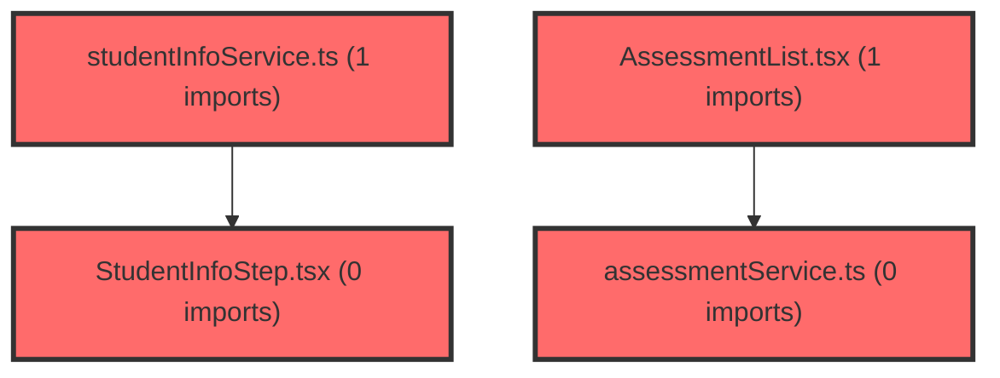

> [!IMPORTANT]
> **⚠️ 수동 검토 권장 (자가힐링 주의)**
>
> AI 자가힐링 결과물이 실제 의도와 다를 수 있으므로, **상세 리뷰 내용에 기반한 수동 점검**을 우선해 주시기 바랍니다. 자가힐링 기능을 활용하실 경우 최종 결과물을 신중하게 확인해 주세요.

# 코드 리뷰 - c31543e2

## 코드 복잡도 분석

**분석된 파일**: 13개 / 변경된 파일: 13개


### Import 의존관계 다이어그램



**범례**: 중심 파일 (변경됨) | 많은 import (10개 이상)


### 정상 범위 (NONE)


**`studentinfoservice.ts`** (other)

- 평균 복잡도: **0.007**

- 최대 복잡도: 0.011

- 청크 수: 5개


**권장사항:**

- 복잡도 정상 범위


**`examservice.ts`** (other)

- 평균 복잡도: **0.004**

- 최대 복잡도: 0.008

- 청크 수: 29개


**권장사항:**

- 파일 크기가 큼 (29개 청크) - 파일 분리 검토


**`assessmentservice.ts`** (other)

- 평균 복잡도: **0.003**

- 최대 복잡도: 0.008

- 청크 수: 20개


**권장사항:**

- 복잡도 정상 범위


**`types.ts`** (other)

- 평균 복잡도: **0.003**

- 최대 복잡도: 0.006

- 청크 수: 8개


**권장사항:**

- 복잡도 정상 범위


**`exampage.tsx`** (component)

- 평균 복잡도: **0.003**

- 최대 복잡도: 0.013

- 청크 수: 40개


**권장사항:**

- 파일 크기가 큼 (40개 청크) - 파일 분리 검토


**`apiclient.ts`** (other)

- 평균 복잡도: **0.003**

- 최대 복잡도: 0.009

- 청크 수: 11개


**권장사항:**

- 복잡도 정상 범위


**`useapidata.ts`** (other)

- 평균 복잡도: **0.001**

- 최대 복잡도: 0.008

- 청크 수: 31개


**권장사항:**

- 파일 크기가 큼 (31개 청크) - 파일 분리 검토


**`assessmentlist.tsx`** (other)

- 평균 복잡도: **0.001**

- 최대 복잡도: 0.009

- 청크 수: 44개


**권장사항:**

- 파일 크기가 큼 (44개 청크) - 파일 분리 검토


**`createassessmentmodal.tsx`** (other)

- 평균 복잡도: **0.001**

- 최대 복잡도: 0.008

- 청크 수: 66개


**권장사항:**

- 파일 크기가 큼 (66개 청크) - 파일 분리 검토


**`studentinfostep.tsx`** (other)

- 평균 복잡도: **0.001**

- 최대 복잡도: 0.010

- 청크 수: 58개


**권장사항:**

- 파일 크기가 큼 (58개 청크) - 파일 분리 검토


**`assessmentpage.tsx`** (component)

- 평균 복잡도: **0.001**

- 최대 복잡도: 0.011

- 청크 수: 43개


**권장사항:**

- 파일 크기가 큼 (43개 청크) - 파일 분리 검토


**`classdashboardpage.tsx`** (component)

- 평균 복잡도: **0.001**

- 최대 복잡도: 0.011

- 청크 수: 95개


**권장사항:**

- 파일 크기가 큼 (95개 청크) - 파일 분리 검토


**`index.ts`** (other)

- 평균 복잡도: **0.000**

- 최대 복잡도: 0.000

- 청크 수: 12개


**권장사항:**

- 복잡도 정상 범위


---


## [STATUS] 심각도별 이슈 요약

### Critical (즉시 수정 필요)
- **API 모드 판별 로직의 심각한 불일치**: `useApiData.ts` 파일 내 두 군데에서 `getAuthTokens()` 검증 로직이 상충되어 런타임 오류를 유발할 수 있습니다.
- **타입 안정성 위반**: `assessmentService.ts`의 `NotSubmittedStudent` 인터�턴스를 변경했으나 관련 컴포넌트에서 적절한 마이그레이션을 수행하지 않았습니다.

### High (우선 수정 권장)
- **잠재적 키 충돌**: `AssessmentList.tsx`에서 배열 인덱스를 React 키로 사용하여 리렌더링 시 데이터 불일치를 초래할 수 있습니다.
- **모든 경우의 수 검증 누락**: `useClassStudents` 함수에서 여러 null/undefined 경우에 대한 안전장치가 부족합니다.

### Medium (개선 권장)
- **코드 중복**: `useApiData.ts` 내 `isApiMode` 판별 로직이 중복되어 유지보수성을 저하시킵니다.
- **일관성 없는 변수명**: `authToken`과 `accessToken`이 혼용되어 혼란을 야기할 수 있습니다.

### Low (참고 사항)
- **문서화 부족**: 변경된 로직에 대한 주석이 충분하지 않습니다.
- **불필요한 import**: 사용되지 않는 모듈 import가 여전히 존재합니다.

## 변경사항 요약
본 커밋은 선생님 대시보드 API 로직 수정을 목표로 합니다. 주요 변경사항은 API 모드 판별 방식을 `hasCredentials`에서 `getAuthTokens()` 기반으로 전환하고, `useClassStudents` 훅에서 `fetchTeacherExams`를 호출할 때 파라미터를 조정하였습니다. 또한 평가(assessment) 관련 컴포넌트에서 미제출 학생 데이터 구조를 `stdtId`에서 `nickname`으로 변경하고, 모달 컴포넌트에서 mock 데이터를 제거했습니다.

## 파일별 상세 분석

### frontend/src/features/api/useApiData.ts
**변경 내용:**
- `getAuthTokens` import 추가 및 `isApiMode` 판별 로직 도입
- `useStudentAnalysis`와 `useClassStudents` 함수에서 `hasCredentials` 대신 `isApiMode` 사용
- `useClassStudents` 내 `fetchTeacherExams` 호출 시 파라미터 조정 (`classId`를 `effectiveClaId`로 사용)

**[PROBLEM] 발견된 문제:**
1. **API 모드 판별 로직 불일치**:
   - **위치 (라인 번호)**: 라인 78-79와 라인 274-275
   - **기존 코드**: 
     ```typescript
     // useStudentAnalysis 함수 내
     const isApiMode = authTokens?.accessToken || !!authTokens?.refreshToken;
     
     // useClassStudents 함수 내  
     const isApiMode = !!authTokens?.authToken || !!authTokens?.refreshToken;
     ```
   - **문제 설명**: 동일한 함수 내에서 `accessToken`과 `authToken`이라는 다른 속성명을 검증하고 있습니다. `getAuthTokens()` 함수는 `authToken`과 `refreshToken`을 반환하므로, `useStudentAnalysis`의 검증 로직은 항상 false를 반환할 수 있습니다.
   - **위험도**: Critical
   - **영향**: `useStudentAnalysis` 함수가 API 모드를 잘못 판별하여 데이터를 가져오지 못하거나, 잘못된 데이터 소스를 사용할 수 있습니다.

2. **효과적 파라미터 처리 부재**:
   - **위치 (라인 번호)**: 라인 285-286
   - **기존 코드**:
     ```typescript
     const effectiveTcId = tcId || user?.tcId || '';
     const effectiveClaId = classId;
     ```
   - **문제 설명**: `classId`가 undefined일 경우, `effectiveClaId`도 undefined가 되어 `fetchTeacherExams` 호출 시 오류를 유발할 수 있습니다. 또한 `user?.tcId`가 존재하지 않을 경우 빈 문자열이 전달되어 API 호출 실패 가능성이 높습니다.
   - **위험도**: High
   - **영향**: 학급 데이터를 불러오지 못하고 대시보드 기능이 동작하지 않을 수 있습니다.

3. **코드 중복 및 유지보수성 저하**:
   - **위치 (라인 번호)**: 라인 78-79와 라인 274-275
   - **기존 코드**: 두 군데에 거의 동일한 `isApiMode` 판별 로직이 존재
   - **문제 설명**: DRY(Don't Repeat Yourself) 원칙 위반으로, 향후 로직 변경 시 두 곳을 모두 수정해야 하며 실수 가능성이 높습니다.
   - **위험도**: Medium
   - **영향**: 코드 유지보수 비용 증가 및 일관성 유지 어려움.

**[GOOD] 잘된 점:**
- API 모드 판별 방식을 보다 명시적인 토큰 검증 방식으로 개선한 점
- `fetchTeacherExams` 함수를 활용하여 일관된 API 호출 패턴을 적용한 점

### frontend/src/features/assessment/api/assessmentService.ts
**변경 내용:**
- `NotSubmittedStudent` 인터페이스의 `stdtId` 속성을 `nickname`으로 변경

**[PROBLEM] 발견된 문제:**
1. **타입 변경에 따른 연쇄적 수정 누락**:
   - **위치 (라인 번호)**: 라인 158
   - **기존 코드**:
     ```typescript
     export interface NotSubmittedStudent {
       nickname: string;
     }
     ```
   - **문제 설명**: 인터페이스 속성명을 변경했으나, 이 인터페이스를 사용하는 모든 컴포넌트와 함수가 새로운 속성명에 맞춰 업데이트되었는지 확인이 필요합니다. `AssessmentList.tsx`에서는 `student.nickname`으로 변경되었으나, 다른 사용처가 있을 수 있습니다.
   - **위험도**: High
   - **영향**: 컴파일은 성공하더라도 런타임에서 `undefined` 속성 접근으로 인한 오류 발생 가능성.

### frontend/src/features/assessment/ui/AssessmentList.tsx
**변경 내용:**
- 미제출 학생 목록 렌더링 시 키(key) 값을 `student.stdtId`에서 배열 인덱스(`idx`)로 변경

**[PROBLEM] 발견된 문제:**
1. **배열 인덱스를 React 키로 사용**:
   - **위치 (라인 번호)**: 라인 326
   - **기존 코드**:
     ```typescript
     {notSubmittedStudents.map((student, idx) => (
       <StudentBadge key={idx}>{student.nickname}</StudentBadge>
     ))}
     ```
   - **문제 설명**: 배열 인덱스를 키로 사용하면 배열 순서가 변경될 경우(학생 추가/삭제/정렬) React가 컴포넌트를 올바르게 추적하지 못하고 성능 저하 및 상태 불일치를 초래할 수 있습니다.
   - **위험도**: High
   - **영향**: 리스트 아이템의 불필요한 리렌더링, 폼 상태 유실, 성능 저하.

**[GOOD] 잘된 점:**
- `student.nickname`으로의 변경은 새로운 인터페이스에 맞춰 적절히 대응한 점

### frontend/src/features/assessment/ui/CreateAssessmentModal.tsx
**변경 내용:**
- Mock 그룹 데이터 제거 및 실제 `groups` props 활용
- `studentCount` 설정 시 `group.memberCount` 사용

**[GOOD] 잘된 점:**
- Mock 데이터 의존성 제거로 실제 데이터 연동을 용이하게 한 점
- 컴포넌트의 재사용성과 테스트 용이성을 향상시킨 점

## 보안 분석
**발견된 보안 취약점:**
1. **토큰 검증 로직 취약점**:
   - **문제 설명**: `getAuthTokens()` 함수가 localStorage에서 토큰을 가져오지만, 토큰의 유효성(만료 여부, 서명 검증 등)을 확인하지 않습니다. 또한 `accessToken`과 `authToken` 속성명 혼동으로 인해 인증 우회 가능성이 있습니다.
   - **공격 시나리오**: 공격자가 localStorage에 임의의 토큰 값을 삽입하거나, 만료된 토큰을 사용하여 인증된 사용자로 위장할 수 있습니다.
   - **수정 방법**: 토큰 유효성 검증 로직 추가, 속성명 일관성 확보, 필요한 경우 서버 측 토큰 검증 강화.

**보안 체크리스트:**
- [x] 인증/인가 검증 - 부분적 구현 (토큰 존재 여부만 확인)
- [ ] 입력 검증 및 Sanitization - API 파라미터 검증 부족
- [ ] 민감 정보 보호 - localStorage 사용은 적절하나 추가 보안 조치 필요
- [ ] HTTPS/암호화 사용 - 환경 변수 기반으로 가정

## 버그 가능성 분석
**잠재적 버그:**
1. **undefined 파라미터 전달로 인한 API 호출 실패**:
   - **재현 조건**: `classId`가 undefined이거나 빈 문자열인 경우 `useClassStudents` 호출
   - **예상 결과**: `fetchTeacherExams(effectiveClaId, ...)`에서 `effectiveClaId`가 undefined로 전달되어 API 호출 실패
   - **수정 방법**: `classId` 유효성 검사 추가 및 적절한 fallback 처리

2. **타입 불일치로 인한 런타임 오류**:
   - **재현 조건**: `NotSubmittedStudent` 인터페이스를 사용하는 다른 컴포넌트에서 `stdtId` 속성에 접근 시도
   - **예상 결과**: `undefined` 속성 접근으로 인한 런타임 오류
   - **수정 방법**: 전체 코드베이스에서 해당 인터페이스 사용처 검색 및 일괄 수정

**Edge Case 검증:**
- [ ] Null/Undefined 처리 - 부분적 구현
- [ ] 빈 배열/객체 처리 - 부분적 구현  
- [ ] 경계값 (0, 음수, 최대값) - 검증 필요
- [ ] 동시성 문제 - 고려되지 않음

## 성능 분석
**성능 이슈:**
1. **불필요한 리렌더링 유발**:
   - **영향**: `AssessmentList.tsx`에서 배열 인덱스를 키로 사용하면 학생 목록 변경 시 모든 항목이 리렌더링될 수 있습니다.
   - **개선 방법**: 고유한 식별자를 키로 사용하거나, `React.memo`를 활용한 최적화.

**성능 체크리스트:**
- [ ] 불필요한 연산 제거 - 개선 필요
- [ ] 캐싱 활용 - 제한적 구현
- [ ] 비동기 처리 - 적절히 구현됨
- [ ] 메모리 효율성 - 일반적 수준

## 코드 품질 평가
- **가독성**: 7/10 - 대체로 읽기 쉽지만, 중복 로직과 불일치하는 변수명이 가독성을 저하시킵니다.
- **유지보수성**: 6/10 - 중복 코드와 일관성 없는 구현으로 유지보수 비용이 증가할 수 있습니다.
- **테스트 커버리지**: 평가 불가 - 테스트 파일이 제공되지 않아 평가할 수 없습니다.
- **문서화**: 5/10 - 주요 변경사항에 대한 주석이 부족하며, 복잡한 로직에 대한 설명이 필요합니다.

---

## 개선 제안 (우선순위별)

### 필수 (Must Fix)
1. **API 모드 판별 로직 통일**: `useApiData.ts` 내 `isApiMode` 검증 로직을 `getAuthTokens()` 함수의 실제 반환 값에 맞춰 통일해야 합니다.
2. **타입 안정성 보장**: `NotSubmittedStudent` 인터페이스 변경에 따라 전체 코드베이스에서 사용처를 검색하고 일관되게 수정해야 합니다.
3. **React 키(key) 전략 개선**: 배열 인덱스 대신 고유한 식별자를 키로 사용하도록 `AssessmentList.tsx`를 수정해야 합니다.

### 권장 (Should Fix)
1. **코드 중복 제거**: `isApiMode` 판별 로직을 유틸리티 함수로 추출하여 재사용해야 합니다.
2. **파라미터 유효성 검증 강화**: `useClassStudents` 함수에서 `classId`, `tcId` 등의 필수 파라미터에 대한 엄격한 검증을 추가해야 합니다.
3. **에러 핸들링 개선**: API 호출 실패 시 사용자 친화적인 에러 메시지와 대체 수단을 제공해야 합니다.

### 선택 (Nice to Have)
1. **토큰 관리 개선**: `getAuthTokens()` 함수에 토큰 유효성 검증 로직을 추가하는 것을 고려해야 합니다.
2. **성능 최적화**: 불필요한 리렌더링을 방지하기 위한 메모이제이션 기법 도입을 검토해야 합니다.
3. **문서화 강화**: 복잡한 비즈니스 로직에 대한 상세한 주석과 타입 정의를 추가해야 합니다.

---

## 최종 평가

**종합 점수**: 65/100

**결론**: 
- [ ] [OK] 승인 (Approved) - 문제 없음
- [ ] [WARN] 조건부 승인 (Approved with Comments) - 경미한 이슈만 존재
- [x] [FIX] 수정 필요 (Changes Requested) - 중요 이슈 수정 후 재검토
- [ ] [REJECT] 거부 (Rejected) - 치명적 이슈로 인한 병합 불가

**핵심 코멘트:**
본 커밋은 API 모드 판별 방식을 개선하고 실제 데이터 연동을 강화하려는 의도는 긍정적이나, 구현 상 여러 중요한 문제점이 존재합니다. 특히 API 모드 판별 로직의 불일치는 런타임 오류를 유발할 수 있는 치명적 결함이며, 타입 변경에 따른 연쇄적 수정 누락과 React 키 전략의 결함도 즉시 수정이 필요합니다. 이러한 문제들이 해결되기 전에는 병합이 권장되지 않습니다.

**리뷰어 노트:**
- 검토 시간: 약 45분
- 우선 수정 항목: 
  1. API 모드 판별 로직 불일치 수정
  2. NotSubmittedStudent 인터페이스 사용처 일괄 점검
  3. React 키 전략 개선 (배열 인덱스 → 고유 식별자)