> [!IMPORTANT]
> **⚠️ 수동 검토 권장 (자가힐링 주의)**
>
> AI 자가힐링 결과물이 실제 의도와 다를 수 있으므로, **상세 리뷰 내용에 기반한 수동 점검**을 우선해 주시기 바랍니다. 자가힐링 기능을 활용하실 경우 최종 결과물을 신중하게 확인해 주세요.

# 코드 리뷰 - c56ac258

## 코드 복잡도 분석

**분석된 파일**: 11개 / 변경된 파일: 34개


### Import 의존관계 다이어그램

```mermaid
flowchart TD
    F0["EmailVerificationService.java (4 imports)"]:::center
    F1["RefreshTokenMapper.java (0 imports)"]
    F2["DgnssService.java (0 imports)"]
    F3["ResponseDTO.java (0 imports)"]
    F4["ConvertUtils.java (0 imports)"]
    F5["UserMapper.java (0 imports)"]
    F6["IdGenerator.java (0 imports)"]
    F7["EmailVerificationController.java (4 imports)"]:::center
    F8["AidtCommonUtil.java (0 imports)"]
    F9["EmailVerificationMapper.java (0 imports)"]
    F10["index.ts (0 imports)"]:::center
    F11["lpaProfiles.ts (1 imports)"]:::center
    F12["JwtUtil.java (0 imports)"]
    F13["MemberService.java (0 imports)"]
    F14["GuestAuthService.java (10 imports)"]:::center
    F15["CustomBody.java (0 imports)"]
    F16["GroupService.java (18 imports)"]:::center
    F17["GroupInfoMapper.java (0 imports)"]
    F18["GroupMemberMapper.java (0 imports)"]
    F19["GroupQueryMapper.java (0 imports)"]
    F16 --> F5
    F16 --> F6
    F16 --> F13
    F16 --> F0
    F16 --> F14
    F16 --> F17
    F16 --> F4
    F16 --> F18
    F16 --> F2
    F16 --> F19
    F7 --> F3
    F7 --> F8
    F7 --> F15
    F7 --> F0
    F0 --> F5
    F0 --> F9
    F11 --> F10
    F14 --> F5
    F14 --> F12
    F14 --> F0
    F14 --> F17
    F14 --> F18
    F14 --> F1
    classDef center fill:#ff6b6b,stroke:#333,stroke-width:3px
    classDef high fill:#ffd93d,stroke:#333,stroke-width:2px
```



**범례**: 중심 파일 (변경됨) | 많은 import (10개 이상)


### 모니터링 권장 (LOW)


**`llm_router.py`** (other)

- 평균 복잡도: **0.272**

- 최대 복잡도: 0.526

- 청크 수: 2개

- 평균 사용처: 5.5곳


**권장사항:**

- **모니터링 권장**: 복잡도가 높은 편이지만 영향 범위 제한적


**`emailverificationservice.java`** (other)

- 평균 복잡도: **0.267**

- 최대 복잡도: 0.522

- 청크 수: 2개

- 평균 사용처: 35.5곳


**권장사항:**

- **모니터링 권장**: 복잡도가 높은 편이지만 영향 범위 제한적


**`emailverificationcontroller.java`** (other)

- 평균 복잡도: **0.265**

- 최대 복잡도: 0.519

- 청크 수: 2개

- 평균 사용처: 23.5곳


**권장사항:**

- **모니터링 권장**: 복잡도가 높은 편이지만 영향 범위 제한적


**`groupservice.java`** (other)

- 평균 복잡도: **0.264**

- 최대 복잡도: 0.518

- 청크 수: 2개

- 평균 사용처: 15.0곳


**권장사항:**

- **모니터링 권장**: 복잡도가 높은 편이지만 영향 범위 제한적


**`coachingstrategy.tsx`** (component)

- 평균 복잡도: **0.264**

- 최대 복잡도: 0.534

- 청크 수: 23개

- 평균 사용처: 23.3곳


**권장사항:**

- **모니터링 권장**: 복잡도가 높은 편이지만 영향 범위 제한적

- 파일 크기가 큼 (23개 청크) - 파일 분리 검토


**`assessmentpage.tsx`** (component)

- 평균 복잡도: **0.258**

- 최대 복잡도: 0.567

- 청크 수: 60개

- 평균 사용처: 25.6곳


**권장사항:**

- **모니터링 권장**: 복잡도가 높은 편이지만 영향 범위 제한적

- 파일 크기가 큼 (60개 청크) - 파일 분리 검토


**`index.ts`** (other)

- 평균 복잡도: **0.255**

- 최대 복잡도: 0.526

- 청크 수: 188개

- 평균 사용처: 28.1곳


**권장사항:**

- **모니터링 권장**: 복잡도가 높은 편이지만 영향 범위 제한적

- 파일 크기가 큼 (188개 청크) - 파일 분리 검토


**`lpaprofiles.ts`** (other)

- 평균 복잡도: **0.253**

- 최대 복잡도: 0.586

- 청크 수: 72개

- 평균 사용처: 31.2곳


**권장사항:**

- **모니터링 권장**: 복잡도가 높은 편이지만 영향 범위 제한적

- 파일 크기가 큼 (72개 청크) - 파일 분리 검토


### 정상 범위 (NONE)


**`corsconfig.java`** (config)

- 평균 복잡도: **0.265**

- 최대 복잡도: 0.519

- 청크 수: 2개

- 평균 사용처: 6.0곳


**권장사항:**

- Config 파일은 높은 연결도가 정상적임


**`guestauthservice.java`** (other)

- 평균 복잡도: **0.011**

- 최대 복잡도: 0.011

- 청크 수: 1개


**권장사항:**

- 복잡도 정상 범위


**`coachingstrategymodal.tsx`** (component)

- 평균 복잡도: **0.001**

- 최대 복잡도: 0.005

- 청크 수: 10개


**권장사항:**

- 복잡도 정상 범위


---


## [GOOD] 잘된 점
1. **보안 및 데이터 무결성 강화**: 게스트 참가 시 기존 회원 이메일 차단 로직을 다중 계층에서 구현하여 시스템의 일관성과 보안을 확보했습니다. 이는 데이터 중복 방지와 비즈니스 로직 정합성 유지에 중요한 개선입니다.
2. **환경별 유연성 확보**: CORS 설정을 하드코딩에서 프로퍼티 기반으로 전환하여 다양한 배포 환경(개발/스테이징/프로덕션)에 대응할 수 있게 되었습니다.
3. **프로덕션 준비도 향상**: 에이전트 서비스의 Dockerfile을 멀티스테이지 빌드로 개선하고, 비루트 사용자 실행, Gunicorn 서버 도입 등 프로덕션 환경 최적화를 통해 운영 안정성을 높였습니다.
4. **문서화의 체계적 개선**: 에이전트 서비스의 README를 상세히 작성하여 API 사용 방법, 테스트 절차, 운영 가이드를 명확히 제공하고 있습니다.

## 변경사항 요약
본 커밋은 `vs-develop` 브랜치를 `feature/frontend-architecture` 브랜치로 머지한 작업입니다. 주요 변경사항은 게스트 참가 시 기존 회원 이메일 차단 로직 추가, CORS 설정 환경 변수화, 에이전트 서비스 인프라 개선, 문서화 강화 등으로 구성됩니다.

---

## [ISSUE] 개선이 필요한 부분

### Critical (즉시 수정 필요)
- **없음**: 명백한 버그, 보안 취약점, 데이터 손실 가능성이 발견되지 않았습니다.

### High (우선 수정 권장)
- **없음**: 성능 저하, 잠재적 오류, 중요한 로직 문제가 발견되지 않았습니다.

### Medium (개선 권장)
1. **이메일 인증 목적(purpose) 매개변수 처리**: `EmailVerificationService.sendCode` 메서드에서 `purpose` 파라미터에 대한 검증이 부족합니다. null 값이나 예상치 못한 값에 대한 기본 처리 방침이 필요합니다.
2. **에이전트 워커 수의 하드코딩**: Dockerfile에서 Gunicorn 워커 수를 1로 고정했으나, 이는 인메모리 세션 관리 제한 때문입니다. 외부 세션 저장소 도입 시 확장성을 고려한 환경 변수화가 필요합니다.

---

## 주요 파일 분석

### backend/src/main/java/com/vs/meta/api/group/service/GroupService.java
**변경 내용:**
`joinGroupAsGuest` 메서드에 기존 회원 이메일 존재 여부 검증 로직 추가(라인 179-183).

**개선 제안:**
1. **예외 메시지 상수화**: 동일한 예외 메시지를 여러 서비스에서 중복 사용하고 있으므로, 상수로 정의하여 일관성을 유지하는 것이 좋습니다.
   - **위치 (라인 번호)**: 182
   - **기존 코드**: `throw new IllegalArgumentException("이미 가입된 회원 이메일입니다. 회원으로 로그인하여 그룹에 참가해주세요.");`
   - **해결 방안 (수정 코드)**:
     ```java
     // 클래스 상단에 상수 정의
     private static final String EXISTING_MEMBER_EMAIL_ERROR = "이미 가입된 회원 이메일입니다. 회원으로 로그인하여 그룹에 참가해주세요.";
     
     // 기존 코드 대체
     throw new IllegalArgumentException(EXISTING_MEMBER_EMAIL_ERROR);
     ```

### backend/src/main/java/com/vs/meta/common/config/CorsConfig.java
**변경 내용:**
CORS 설정을 `app.frontend-url` 프로퍼티 기반으로 변경하고, `allowCredentials` 및 `maxAge` 설정 추가.

**개선 제안:**
1. **다중 오리진 지원 고려**: 현재 단일 URL만 허용하지만, 개발/테스트 환경을 위해 여러 오리진을 지원할 수 있도록 배열 형태로 확장하는 것이 유연합니다.
   - **위치 (라인 번호)**: 17
   - **기존 코드**: `.allowedOrigins(frontendUrl)`
   - **해결 방안 (수정 코드)**:
     ```java
     @Value("${app.frontend-urls}") // comma-separated values 예: "http://localhost:3000,http://localhost:3001"
     private String[] frontendUrls;
     
     // 설정 메서드 내
     .allowedOrigins(frontendUrls)
     ```

### agent/Dockerfile
**변경 내용:**
멀티스테이지 빌드 도입, 비루트 사용자 실행, Gunicorn 워커 설정 추가.

**개선 제안:**
1. **워커 수 환경 변수화**: 현재 하드코딩된 워커 수(1)를 환경 변수로 설정하여 유연성을 확보하는 것이 좋습니다.
   - **위치 (라인 번호)**: 62
   - **기존 코드**: `CMD ["gunicorn", "main:app", "-w", "1", "-k", "uvicorn.workers.UvicornWorker", "-b", "0.0.0.0:8000", "--keep-alive", "65", "--forwarded-allow-ips", "*"]`
   - **해결 방안 (수정 코드)**:
     ```dockerfile
     ENV GUNICORN_WORKERS=1
     CMD ["sh", "-c", "gunicorn main:app -w ${GUNICORN_WORKERS} -k uvicorn.workers.UvicornWorker -b 0.0.0.0:8000 --keep-alive 65 --forwarded-allow-ips \"*\""]
     ```

### backend/src/main/java/com/vs/meta/api/member/service/EmailVerificationService.java
**변경 내용:**
`sendCode` 메서드에 `purpose` 파라미터 추가 및 게스트 용도 시 기존 회원 이메일 차단 로직 구현.

**개선 제안:**
1. **purpose 파라미터 기본값 처리**: `purpose`가 null일 경우 기본값을 설정하거나 명시적 예외 처리를 추가하는 것이 안전합니다.
   - **위치 (라인 번호)**: 29
   - **기존 코드**: `if ("GUEST".equalsIgnoreCase(purpose)) {`
   - **해결 방안 (수정 코드)**:
     ```java
     if (purpose == null) {
         purpose = "MEMBER"; // 또는 기본값 설정
     }
     
     if ("GUEST".equalsIgnoreCase(purpose)) {
         // 기존 로직
     }
     ```

---

## 최종 평가

**결론**: 
- [x] [OK] **승인 (Approved)** - Critical/High 이슈 없음

**종합 의견:**
CP님, 이 커밋은 게스트 참가 보안 강화, 환경별 설정 관리 개선, 인프라 최적화 등 실무에서 중요한 개선사항을 포함하고 있습니다. 변경된 로직들은 명확하고 테스트 가능한 구조로 구현되었으며, 프로덕션 환경에서의 운영 안정성을 높이는 방향으로 진행되었습니다. Medium 수준의 개선 사항은 코드 완성도를 높이는 선택적 제안으로, 현재 상태로도 충분히 승인 가능한 수준입니다.