> [!IMPORTANT]
> **⚠️ 수동 검토 권장 (자가힐링 주의)**
>
> AI 자가힐링 결과물이 실제 의도와 다를 수 있으므로, **상세 리뷰 내용에 기반한 수동 점검**을 우선해 주시기 바랍니다. 자가힐링 기능을 활용하실 경우 최종 결과물을 신중하게 확인해 주세요.

# 코드 리뷰 - c7170a97

## 코드 복잡도 분석

**분석된 파일**: 110개 / 변경된 파일: 178개


### Import 의존관계 다이어그램

```mermaid
flowchart TD
    F0["format.ts (2 internal imports)"]:::center
    F1["annotationTypes.ts (0 internal imports)"]:::center
    F2["StudentTab.tsx (6 internal imports)"]:::center
    F3["MyDataView.tsx (2 internal imports)"]:::center
    F4["LiveWidget.tsx (2 internal imports)"]:::center
    F5["TypeChangeStudents.tsx (0 internal imports)"]:::center
    F6["mock-data.ts (0 internal imports)"]:::center
    F7["ResourceGrid.tsx (2 internal imports)"]:::center
    F8["TopChangeSummary.tsx (0 internal imports)"]:::center
    F9["RecommendCarousel.tsx (2 internal imports)"]:::center
    F10["StrategyCard.tsx (3 internal imports)"]:::center
    F11["ReportSummary.tsx (4 internal imports)"]:::center
    F12["apiMapper.ts (1 internal import)"]:::center
    F13["PageContent.tsx (6 internal imports)"]:::center
    F14["SelfregStudentResultView.tsx (1 internal import)"]:::center
    F15["useMonitorWindow.ts (0 internal imports)"]:::center
    F16["ClassCurationView.tsx (1 internal import)"]:::center
    F17["PageTab.tsx (3 internal imports)"]:::center
    F18["AssessmentPage.tsx (1 internal import)"]:::center
    F19["DonutGauge.tsx (3 internal imports)"]:::center
    F20["IndividualCoachingPage.tsx (1 internal import)"]:::center
    F21["DeployOverlay.tsx (3 internal imports)"]:::center
    F22["AnnotationCanvas.tsx (2 internal imports)"]:::center
    F23["PenToolbar.tsx (1 internal import)"]:::center
    F24["StrategyRadarChart.tsx (2 internal imports)"]:::center
    F25["strategy.ts (1 internal import)"]:::center
    F26["SlideCanvas.tsx (1 internal import)"]:::center
    F27["useDraggable.ts (0 internal imports)"]:::center
    F28["ResourceCard.tsx (4 internal imports)"]:::center
    F29["EditorOverlay.tsx (6 internal imports)"]:::center
    F30["annotationDraw.ts (1 internal import)"]:::center
    F31["ResourcesContext.tsx (3 internal imports)"]:::center
    F32["ClassTrackingSection.tsx (5 internal imports)"]:::center
    F33["SlideStrip.tsx (1 internal import)"]:::center
    F34["ClassLiveOverlay.tsx (12 internal imports)"]:::center
    F35["ResultsView.tsx (4 internal imports)"]:::center
    F36["SelfregOverviewChart.tsx (0 internal imports)"]:::center
    F37["shared.tsx (1 internal import)"]:::center
    F38["RecommendTop3.tsx (3 internal imports)"]:::center
    F39["aggregation.ts (1 internal import)"]:::center
    F40["level.ts (1 internal import)"]:::center
    F41["ResponseGrid.tsx (3 internal imports)"]:::center
    F42["CardThumb.tsx (2 internal imports)"]:::center
    F43["components/index.ts (0 internal imports)"]:::center
    F44["StrategyReport.tsx (3 internal imports)"]:::center
    F45["StrategyReportDemo.tsx (3 internal imports)"]:::center
    F46["ReportCard.tsx (6 internal imports)"]:::center
    F47["useSlideAnnotations.ts (1 internal import)"]:::center
    F48["cardStyles.ts (0 internal imports)"]:::center
    F49["StatusPanel.tsx (3 internal imports)"]:::center
    F50["ResourceListPage.tsx (7 internal imports)"]:::center
    F51["TeacherDashboardPage.tsx (1 internal import)"]:::center
    F52["InterventionTimeline.tsx (0 internal imports)"]:::center
    F53["ClassInterventionTimeline.tsx (0 internal imports)"]:::center
    F54["SignificantFactorChanges.tsx (0 internal imports)"]:::center
    F55["MyLessonCard.tsx (4 internal imports)"]:::center
    F56["LibraryView.tsx (3 internal imports)"]:::center
    F57["resources/types.ts (0 internal imports)"]:::center
    F58["CategoryChangeList.tsx (0 internal imports)"]:::center
    F59["SummaryStrip.tsx (3 internal imports)"]:::center
    F60["ReportFilterChips.tsx (2 internal imports)"]:::center
    F61["MonitorPanel.tsx (1 internal import)"]:::center
    F62["ReportCardGrid.tsx (6 internal imports)"]:::center
    F63["StrategyReport/types.ts (0 internal imports)"]:::center
    F64["StudentDashboardPage.tsx (0 internal imports)"]:::center
    F65["StudentTrackingSection.tsx (1 internal import)"]:::center
    F66["MonitorContent.tsx (1 internal import)"]:::center
    F67["CaptureOverlay.tsx (5 internal imports)"]:::center
    F68["library/index.ts (0 internal imports)"]:::center
    F69["PopoutWindow.tsx (0 internal imports)"]:::center
    F50 --> F21
    F50 --> F59
    F50 --> F27
    F50 --> F68
    F50 --> F31
    F50 --> F55
    F50 --> F33
    F51 --> F64
    F32 --> F54
    F32 --> F53
    F32 --> F58
    F32 --> F5
    F32 --> F8
    F65 --> F52
    F14 --> F36
    F19 --> F63
    F19 --> F25
    F19 --> F40
    F10 --> F63
    F10 --> F25
    F10 --> F19
    F24 --> F63
    F24 --> F25
    F44 --> F63
    F44 --> F24
    F44 --> F10
    F45 --> F63
    F45 --> F44
    F45 --> F45
    F25 --> F63
    F12 --> F63
    F40 --> F63
    F20 --> F43
    F42 --> F6
    F42 --> F57
    F21 --> F6
    F21 --> F0
    F21 --> F31
    F29 --> F0
    F29 --> F57
    F29 --> F26
    F29 --> F6
    F29 --> F31
    F29 --> F33
    F26 --> F29
    F33 --> F29
    F16 --> F38
    F56 --> F6
    F56 --> F7
    F56 --> F57
    F9 --> F28
    F9 --> F57
    F38 --> F6
    F38 --> F31
    F38 --> F9
    F28 --> F42
    F28 --> F57
    F28 --> F31
    F28 --> F48
    F7 --> F28
    F7 --> F57
    F22 --> F30
    F22 --> F1
    F34 --> F0
    F34 --> F23
    F34 --> F22
    F34 --> F1
    F34 --> F15
    F34 --> F61
    F34 --> F4
    F34 --> F6
    F34 --> F66
    F34 --> F47
    F34 --> F69
    F34 --> F31
    F4 --> F31
    F4 --> F27
    F66 --> F6
    F61 --> F66
    F23 --> F1
    F30 --> F1
    F47 --> F1
    F3 --> F31
    F3 --> F55
    F55 --> F42
    F55 --> F57
    F55 --> F31
    F55 --> F48
    F67 --> F0
    F67 --> F57
    F67 --> F39
    F67 --> F6
    F67 --> F31
    F13 --> F57
    F13 --> F37
    F13 --> F39
    F13 --> F59
    F13 --> F41
    F13 --> F31
    F17 --> F57
    F17 --> F39
    F17 --> F13
    F46 --> F0
    F46 --> F57
    F46 --> F39
    F46 --> F42
    F46 --> F48
    F46 --> F31
    F62 --> F0
    F62 --> F57
    F62 --> F39
    F62 --> F62
    F62 --> F46
    F62 --> F31
    F60 --> F0
    F60 --> F31
    F11 --> F6
    F11 --> F0
    F11 --> F39
    F11 --> F57
    F35 --> F49
    F35 --> F31
    F35 --> F60
    F35 --> F62
    F49 --> F0
    F49 --> F31
    F49 --> F39
    F2 --> F0
    F2 --> F57
    F2 --> F37
    F2 --> F39
    F2 --> F41
    F2 --> F31
    F41 --> F0
    F41 --> F37
    F41 --> F57
    F59 --> F57
    F59 --> F31
    F59 --> F39
    F37 --> F57
    F31 --> F6
    F31 --> F0
    F31 --> F57
    F39 --> F57
    F0 --> F6
    F0 --> F57
    classDef center fill:#ff6b6b,stroke:#333,stroke-width:3px
    classDef high fill:#ffd93d,stroke:#333,stroke-width:2px
```



**범례**: 중심 파일 (변경됨) | 많은 import (10개 이상)


### 모니터링 권장 (LOW)


**`assessmentpage.tsx`** (component)

- 평균 복잡도: **0.236**

- 최대 복잡도: 0.526

- 청크 수: 64개

- 평균 사용처: 30.8곳


**권장사항:**

- **모니터링 권장**: 복잡도가 높은 편이지만 영향 범위 제한적

- 파일 크기가 큼 (64개 청크) - 파일 분리 검토


### 정상 범위 (NONE)


**`dgnssmapper.xml`** (other)

- 평균 복잡도: **0.242**

- 최대 복잡도: 0.473

- 청크 수: 2개

- 평균 사용처: 7.0곳


**권장사항:**

- 복잡도 정상 범위


**`dgnsscontroller.java`** (other)

- 평균 복잡도: **0.209**

- 최대 복잡도: 0.470

- 청크 수: 25개

- 평균 사용처: 25.8곳


**권장사항:**

- 파일 크기가 큼 (25개 청크) - 파일 분리 검토


**`dgnssmapper.java`** (other)

- 평균 복잡도: **0.187**

- 최대 복잡도: 0.466

- 청크 수: 199개

- 평균 사용처: 27.9곳


**권장사항:**

- 파일 크기가 큼 (199개 청크) - 파일 분리 검토


**`resourcelistpage.tsx`** (component)

- 평균 복잡도: **0.166**

- 최대 복잡도: 0.469

- 청크 수: 17개

- 평균 사용처: 22.2곳


**권장사항:**

- 복잡도 정상 범위


**`globalexceptionhandler.java`** (config)

- 평균 복잡도: **0.114**

- 최대 복잡도: 0.466

- 청크 수: 21개

- 평균 사용처: 12.0곳


**권장사항:**

- 파일 크기가 큼 (21개 청크) - 파일 분리 검토

- Config 파일은 높은 연결도가 정상적임


**`dgnssservice.java`** (other)

- 평균 복잡도: **0.110**

- 최대 복잡도: 0.473

- 청크 수: 70개

- 평균 사용처: 12.6곳


**권장사항:**

- 파일 크기가 큼 (70개 청크) - 파일 분리 검토


**`index.ts`** (component)

- 평균 복잡도: **0.110**

- 최대 복잡도: 0.463

- 청크 수: 21개

- 평균 사용처: 7.8곳


**권장사항:**

- 파일 크기가 큼 (21개 청크) - 파일 분리 검토


**`index.ts`** (component)

- 평균 복잡도: **0.092**

- 최대 복잡도: 0.461

- 청크 수: 10개

- 평균 사용처: 3.0곳


**권장사항:**

- 복잡도 정상 범위


**`routes.tsx`** (other)

- 평균 복잡도: **0.052**

- 최대 복잡도: 0.463

- 청크 수: 24개

- 평균 사용처: 2.3곳


**권장사항:**

- 파일 크기가 큼 (24개 청크) - 파일 분리 검토


**`paperpermissionadminmapper.xml`** (other)

- 평균 복잡도: **0.009**

- 최대 복잡도: 0.009

- 청크 수: 1개


**권장사항:**

- 복잡도 정상 범위


**`paperpermissioncontroller.java`** (other)

- 평균 복잡도: **0.006**

- 최대 복잡도: 0.008

- 청크 수: 2개


**권장사항:**

- 복잡도 정상 범위


**`paperpermissionmapper.xml`** (other)

- 평균 복잡도: **0.006**

- 최대 복잡도: 0.006

- 청크 수: 1개


**권장사항:**

- 복잡도 정상 범위


**`paperpermissionadmincontroller.java`** (other)

- 평균 복잡도: **0.005**

- 최대 복잡도: 0.010

- 청크 수: 4개


**권장사항:**

- 복잡도 정상 범위


**`paperpermissionadminservice.java`** (other)

- 평균 복잡도: **0.005**

- 최대 복잡도: 0.008

- 청크 수: 2개


**권장사항:**

- 복잡도 정상 범위


**`paperpermissionservice.java`** (other)

- 평균 복잡도: **0.005**

- 최대 복잡도: 0.005

- 청크 수: 2개


**권장사항:**

- 복잡도 정상 범위


**`strategy.ts`** (component)

- 평균 복잡도: **0.005**

- 최대 복잡도: 0.012

- 청크 수: 5개


**권장사항:**

- 복잡도 정상 범위


**`individualcoachingpage.tsx`** (component)

- 평균 복잡도: **0.005**

- 최대 복잡도: 0.015

- 청크 수: 6개


**권장사항:**

- 복잡도 정상 범위


**`shared.tsx`** (component)

- 평균 복잡도: **0.005**

- 최대 복잡도: 0.009

- 청크 수: 7개


**권장사항:**

- 복잡도 정상 범위


**`strategyreport.tsx`** (component)

- 평균 복잡도: **0.004**

- 최대 복잡도: 0.013

- 청크 수: 7개


**권장사항:**

- 복잡도 정상 범위


**`apimapper.ts`** (component)

- 평균 복잡도: **0.004**

- 최대 복잡도: 0.007

- 청크 수: 6개


**권장사항:**

- 복잡도 정상 범위


**`resourcegrid.tsx`** (utility)

- 평균 복잡도: **0.004**

- 최대 복잡도: 0.007

- 청크 수: 4개


**권장사항:**

- 복잡도 정상 범위


**`monitorpanel.tsx`** (component)

- 평균 복잡도: **0.004**

- 최대 복잡도: 0.006

- 청크 수: 3개


**권장사항:**

- 복잡도 정상 범위


**`personinfoclientimpl.java`** (other)

- 평균 복잡도: **0.003**

- 최대 복잡도: 0.006

- 청크 수: 5개


**권장사항:**

- 복잡도 정상 범위


**`scopeconfig.ts`** (config)

- 평균 복잡도: **0.003**

- 최대 복잡도: 0.009

- 청크 수: 13개


**권장사항:**

- Config 파일은 높은 연결도가 정상적임


**`selfregoverviewchart.tsx`** (component)

- 평균 복잡도: **0.003**

- 최대 복잡도: 0.012

- 청크 수: 16개


**권장사항:**

- 복잡도 정상 범위


**`strategyreportdemo.tsx`** (component)

- 평균 복잡도: **0.003**

- 최대 복잡도: 0.007

- 청크 수: 5개


**권장사항:**

- 복잡도 정상 범위


**`level.ts`** (utility)

- 평균 복잡도: **0.003**

- 최대 복잡도: 0.004

- 청크 수: 4개


**권장사항:**

- 복잡도 정상 범위


**`recommendtop3.tsx`** (utility)

- 평균 복잡도: **0.003**

- 최대 복잡도: 0.008

- 청크 수: 6개


**권장사항:**

- 복잡도 정상 범위


**`resourcecard.tsx`** (utility)

- 평균 복잡도: **0.003**

- 최대 복잡도: 0.011

- 청크 수: 7개


**권장사항:**

- 복잡도 정상 범위


**`annotationcanvas.tsx`** (component)

- 평균 복잡도: **0.003**

- 최대 복잡도: 0.011

- 청크 수: 18개


**권장사항:**

- 복잡도 정상 범위


**`popoutwindow.tsx`** (component)

- 평균 복잡도: **0.003**

- 최대 복잡도: 0.008

- 청크 수: 6개


**권장사항:**

- 복잡도 정상 범위


**`paperpermissiondeniedexception.java`** (other)

- 평균 복잡도: **0.002**

- 최대 복잡도: 0.002

- 청크 수: 2개


**권장사항:**

- 복잡도 정상 범위


**`usetrackingclassdata.ts`** (other)

- 평균 복잡도: **0.002**

- 최대 복잡도: 0.004

- 청크 수: 6개


**권장사항:**

- 복잡도 정상 범위


**`usetrackingstudentdata.ts`** (other)

- 평균 복잡도: **0.002**

- 최대 복잡도: 0.005

- 청크 수: 7개


**권장사항:**

- 복잡도 정상 범위


**`difftop3.ts`** (utility)

- 평균 복잡도: **0.002**

- 최대 복잡도: 0.006

- 청크 수: 8개


**권장사항:**

- 복잡도 정상 범위


**`layoutv2.tsx`** (other)

- 평균 복잡도: **0.002**

- 최대 복잡도: 0.009

- 청크 수: 45개


**권장사항:**

- 파일 크기가 큼 (45개 청크) - 파일 분리 검토


**`selfregstudentresultview.tsx`** (component)

- 평균 복잡도: **0.002**

- 최대 복잡도: 0.008

- 청크 수: 33개


**권장사항:**

- 파일 크기가 큼 (33개 청크) - 파일 분리 검토


**`strategyradarchart.tsx`** (component)

- 평균 복잡도: **0.002**

- 최대 복잡도: 0.006

- 청크 수: 9개


**권장사항:**

- 복잡도 정상 범위


**`types.ts`** (component)

- 평균 복잡도: **0.002**

- 최대 복잡도: 0.007

- 청크 수: 6개


**권장사항:**

- 복잡도 정상 범위


**`libraryview.tsx`** (utility)

- 평균 복잡도: **0.002**

- 최대 복잡도: 0.010

- 청크 수: 19개


**권장사항:**

- 복잡도 정상 범위


**`livewidget.tsx`** (component)

- 평균 복잡도: **0.002**

- 최대 복잡도: 0.007

- 청크 수: 15개


**권장사항:**

- 복잡도 정상 범위


**`pentoolbar.tsx`** (component)

- 평균 복잡도: **0.002**

- 최대 복잡도: 0.004

- 청크 수: 4개


**권장사항:**

- 복잡도 정상 범위


**`annotationdraw.ts`** (component)

- 평균 복잡도: **0.002**

- 최대 복잡도: 0.004

- 청크 수: 8개


**권장사항:**

- 복잡도 정상 범위


**`usemonitorwindow.ts`** (component)

- 평균 복잡도: **0.002**

- 최대 복잡도: 0.009

- 청크 수: 11개


**권장사항:**

- 복잡도 정상 범위


**`useslideannotations.ts`** (component)

- 평균 복잡도: **0.002**

- 최대 복잡도: 0.009

- 청크 수: 11개


**권장사항:**

- 복잡도 정상 범위


**`pagetab.tsx`** (component)

- 평균 복잡도: **0.002**

- 최대 복잡도: 0.007

- 청크 수: 7개


**권장사항:**

- 복잡도 정상 범위


**`reportcardgrid.tsx`** (component)

- 평균 복잡도: **0.002**

- 최대 복잡도: 0.009

- 청크 수: 10개


**권장사항:**

- 복잡도 정상 범위


**`reportfilterchips.tsx`** (component)

- 평균 복잡도: **0.002**

- 최대 복잡도: 0.010

- 청크 수: 5개


**권장사항:**

- 복잡도 정상 범위


**`resultsview.tsx`** (component)

- 평균 복잡도: **0.002**

- 최대 복잡도: 0.008

- 청크 수: 9개


**권장사항:**

- 복잡도 정상 범위


**`mock-data.ts`** (other)

- 평균 복잡도: **0.002**

- 최대 복잡도: 0.008

- 청크 수: 44개


**권장사항:**

- 파일 크기가 큼 (44개 청크) - 파일 분리 검토


**`types.ts`** (other)

- 평균 복잡도: **0.002**

- 최대 복잡도: 0.007

- 청크 수: 16개


**권장사항:**

- 복잡도 정상 범위


**`selfregfactors.ts`** (other)

- 평균 복잡도: **0.002**

- 최대 복잡도: 0.007

- 청크 수: 19개


**권장사항:**

- 복잡도 정상 범위


**`paperpermissionadminmapper.java`** (other)

- 평균 복잡도: **0.001**

- 최대 복잡도: 0.002

- 청크 수: 3개


**권장사항:**

- 복잡도 정상 범위


**`usersearchresult.java`** (other)

- 평균 복잡도: **0.001**

- 최대 복잡도: 0.001

- 청크 수: 1개


**권장사항:**

- 복잡도 정상 범위


**`resultcounselingobservationsection.tsx`** (other)

- 평균 복잡도: **0.001**

- 최대 복잡도: 0.011

- 청크 수: 96개


**권장사항:**

- 파일 크기가 큼 (96개 청크) - 파일 분리 검토


**`typeclassification.tsx`** (other)

- 평균 복잡도: **0.001**

- 최대 복잡도: 0.012

- 청크 수: 54개


**권장사항:**

- 파일 크기가 큼 (54개 청크) - 파일 분리 검토


**`examtrackingpage.tsx`** (component)

- 평균 복잡도: **0.001**

- 최대 복잡도: 0.003

- 청크 수: 9개


**권장사항:**

- 복잡도 정상 범위


**`studentdashboardpage.tsx`** (component)

- 평균 복잡도: **0.001**

- 최대 복잡도: 0.009

- 청크 수: 73개


**권장사항:**

- 파일 크기가 큼 (73개 청크) - 파일 분리 검토


**`teacherdashboardpage.tsx`** (component)

- 평균 복잡도: **0.001**

- 최대 복잡도: 0.005

- 청크 수: 37개


**권장사항:**

- 파일 크기가 큼 (37개 청크) - 파일 분리 검토


**`classdashboardv2widget.tsx`** (other)

- 평균 복잡도: **0.001**

- 최대 복잡도: 0.012

- 청크 수: 168개


**권장사항:**

- 파일 크기가 큼 (168개 청크) - 파일 분리 검토


**`categorychangelist.tsx`** (other)

- 평균 복잡도: **0.001**

- 최대 복잡도: 0.010

- 청크 수: 24개


**권장사항:**

- 파일 크기가 큼 (24개 청크) - 파일 분리 검토


**`topchangesummary.tsx`** (other)

- 평균 복잡도: **0.001**

- 최대 복잡도: 0.010

- 청크 수: 62개


**권장사항:**

- 파일 크기가 큼 (62개 청크) - 파일 분리 검토


**`comparisonsection.tsx`** (other)

- 평균 복잡도: **0.001**

- 최대 복잡도: 0.012

- 청크 수: 99개


**권장사항:**

- 파일 크기가 큼 (99개 청크) - 파일 분리 검토


**`index.ts`** (component)

- 평균 복잡도: **0.001**

- 최대 복잡도: 0.003

- 청크 수: 8개


**권장사항:**

- 복잡도 정상 범위


**`cardthumb.tsx`** (component)

- 평균 복잡도: **0.001**

- 최대 복잡도: 0.002

- 청크 수: 5개


**권장사항:**

- 복잡도 정상 범위


**`cardstyles.ts`** (component)

- 평균 복잡도: **0.001**

- 최대 복잡도: 0.001

- 청크 수: 3개


**권장사항:**

- 복잡도 정상 범위


**`deployoverlay.tsx`** (component)

- 평균 복잡도: **0.001**

- 최대 복잡도: 0.005

- 청크 수: 15개


**권장사항:**

- 복잡도 정상 범위


**`editoroverlay.tsx`** (component)

- 평균 복잡도: **0.001**

- 최대 복잡도: 0.006

- 청크 수: 30개


**권장사항:**

- 파일 크기가 큼 (30개 청크) - 파일 분리 검토


**`classcurationview.tsx`** (utility)

- 평균 복잡도: **0.001**

- 최대 복잡도: 0.002

- 청크 수: 3개


**권장사항:**

- 복잡도 정상 범위


**`classliveoverlay.tsx`** (component)

- 평균 복잡도: **0.001**

- 최대 복잡도: 0.005

- 청크 수: 34개


**권장사항:**

- 파일 크기가 큼 (34개 청크) - 파일 분리 검토


**`monitorcontent.tsx`** (component)

- 평균 복잡도: **0.001**

- 최대 복잡도: 0.002

- 청크 수: 3개


**권장사항:**

- 복잡도 정상 범위


**`annotationtypes.ts`** (component)

- 평균 복잡도: **0.001**

- 최대 복잡도: 0.003

- 청크 수: 11개


**권장사항:**

- 복잡도 정상 범위


**`usedraggable.ts`** (component)

- 평균 복잡도: **0.001**

- 최대 복잡도: 0.004

- 청크 수: 13개


**권장사항:**

- 복잡도 정상 범위


**`captureoverlay.tsx`** (component)

- 평균 복잡도: **0.001**

- 최대 복잡도: 0.005

- 청크 수: 23개


**권장사항:**

- 파일 크기가 큼 (23개 청크) - 파일 분리 검토


**`pagecontent.tsx`** (component)

- 평균 복잡도: **0.001**

- 최대 복잡도: 0.005

- 청크 수: 9개


**권장사항:**

- 복잡도 정상 범위


**`studenttab.tsx`** (component)

- 평균 복잡도: **0.001**

- 최대 복잡도: 0.008

- 청크 수: 16개


**권장사항:**

- 복잡도 정상 범위


**`responsegrid.tsx`** (component)

- 평균 복잡도: **0.001**

- 최대 복잡도: 0.006

- 청크 수: 7개


**권장사항:**

- 복잡도 정상 범위


**`resourcescontext.tsx`** (store)

- 평균 복잡도: **0.001**

- 최대 복잡도: 0.007

- 청크 수: 35개


**권장사항:**

- 파일 크기가 큼 (35개 청크) - 파일 분리 검토

- Store 파일은 높은 연결도가 정상적임


**`aggregation.ts`** (utility)

- 평균 복잡도: **0.001**

- 최대 복잡도: 0.006

- 청크 수: 42개


**권장사항:**

- 파일 크기가 큼 (42개 청크) - 파일 분리 검토


**`format.ts`** (utility)

- 평균 복잡도: **0.001**

- 최대 복잡도: 0.002

- 청크 수: 23개


**권장사항:**

- 파일 크기가 큼 (23개 청크) - 파일 분리 검토


**`paperpermissionmapper.java`** (other)

- 평균 복잡도: **0.000**

- 최대 복잡도: 0.000

- 청크 수: 1개


**권장사항:**

- 복잡도 정상 범위


**`personinfoclient.java`** (other)

- 평균 복잡도: **0.000**

- 최대 복잡도: 0.000

- 청크 수: 4개


**권장사항:**

- 복잡도 정상 범위


**`calculatesubcategoryaveragesbyround.ts`** (utility)

- 평균 복잡도: **0.000**

- 최대 복잡도: 0.002

- 청크 수: 10개


**권장사항:**

- 복잡도 정상 범위


**`classinterventiontimeline.tsx`** (other)

- 평균 복잡도: **0.000**

- 최대 복잡도: 0.008

- 청크 수: 36개


**권장사항:**

- 파일 크기가 큼 (36개 청크) - 파일 분리 검토


**`classtrackingsection.tsx`** (other)

- 평균 복잡도: **0.000**

- 최대 복잡도: 0.000

- 청크 수: 24개


**권장사항:**

- 파일 크기가 큼 (24개 청크) - 파일 분리 검토


**`interventiontimeline.tsx`** (other)

- 평균 복잡도: **0.000**

- 최대 복잡도: 0.003

- 청크 수: 51개


**권장사항:**

- 파일 크기가 큼 (51개 청크) - 파일 분리 검토


**`significantfactorchanges.tsx`** (other)

- 평균 복잡도: **0.000**

- 최대 복잡도: 0.008

- 청크 수: 42개


**권장사항:**

- 파일 크기가 큼 (42개 청크) - 파일 분리 검토


**`studentfactorchangelist.tsx`** (other)

- 평균 복잡도: **0.000**

- 최대 복잡도: 0.008

- 청크 수: 23개


**권장사항:**

- 파일 크기가 큼 (23개 청크) - 파일 분리 검토


**`studenttrackingsection.tsx`** (other)

- 평균 복잡도: **0.000**

- 최대 복잡도: 0.010

- 청크 수: 108개


**권장사항:**

- 파일 크기가 큼 (108개 청크) - 파일 분리 검토


**`trackingemptystate.tsx`** (store)

- 평균 복잡도: **0.000**

- 최대 복잡도: 0.004

- 청크 수: 21개


**권장사항:**

- 파일 크기가 큼 (21개 청크) - 파일 분리 검토

- Store 파일은 높은 연결도가 정상적임


**`typechangestudents.tsx`** (other)

- 평균 복잡도: **0.000**

- 최대 복잡도: 0.003

- 청크 수: 45개


**권장사항:**

- 파일 크기가 큼 (45개 청크) - 파일 분리 검토


**`index.ts`** (other)

- 평균 복잡도: **0.000**

- 최대 복잡도: 0.000

- 청크 수: 6개


**권장사항:**

- 복잡도 정상 범위


**`scopetree.tsx`** (other)

- 평균 복잡도: **0.000**

- 최대 복잡도: 0.006

- 청크 수: 71개


**권장사항:**

- 파일 크기가 큼 (71개 청크) - 파일 분리 검토


**`index-dtdso09s.js`** (other)

- 평균 복잡도: **0.000**

- 최대 복잡도: 0.000

- 청크 수: 15개


**권장사항:**

- 복잡도 정상 범위


**`donutgauge.tsx`** (component)

- 평균 복잡도: **0.000**

- 최대 복잡도: 0.000

- 청크 수: 3개


**권장사항:**

- 복잡도 정상 범위


**`strategycard.tsx`** (component)

- 평균 복잡도: **0.000**

- 최대 복잡도: 0.000

- 청크 수: 3개


**권장사항:**

- 복잡도 정상 범위


**`noexamresultcta.tsx`** (component)

- 평균 복잡도: **0.000**

- 최대 복잡도: 0.001

- 청크 수: 4개


**권장사항:**

- 복잡도 정상 범위


**`slidecanvas.tsx`** (component)

- 평균 복잡도: **0.000**

- 최대 복잡도: 0.001

- 청크 수: 3개


**권장사항:**

- 복잡도 정상 범위


**`slidestrip.tsx`** (component)

- 평균 복잡도: **0.000**

- 최대 복잡도: 0.000

- 청크 수: 1개


**권장사항:**

- 복잡도 정상 범위


**`recommendcarousel.tsx`** (utility)

- 평균 복잡도: **0.000**

- 최대 복잡도: 0.002

- 청크 수: 5개


**권장사항:**

- 복잡도 정상 범위


**`index.ts`** (utility)

- 평균 복잡도: **0.000**

- 최대 복잡도: 0.000

- 청크 수: 8개


**권장사항:**

- 복잡도 정상 범위


**`index.ts`** (component)

- 평균 복잡도: **0.000**

- 최대 복잡도: 0.000

- 청크 수: 12개


**권장사항:**

- 복잡도 정상 범위


**`mydataview.tsx`** (component)

- 평균 복잡도: **0.000**

- 최대 복잡도: 0.000

- 청크 수: 2개


**권장사항:**

- 복잡도 정상 범위


**`mylessoncard.tsx`** (component)

- 평균 복잡도: **0.000**

- 최대 복잡도: 0.000

- 청크 수: 6개


**권장사항:**

- 복잡도 정상 범위


**`reportcard.tsx`** (component)

- 평균 복잡도: **0.000**

- 최대 복잡도: 0.002

- 청크 수: 10개


**권장사항:**

- 복잡도 정상 범위


**`reportsummary.tsx`** (component)

- 평균 복잡도: **0.000**

- 최대 복잡도: 0.002

- 청크 수: 7개


**권장사항:**

- 복잡도 정상 범위


**`statuspanel.tsx`** (component)

- 평균 복잡도: **0.000**

- 최대 복잡도: 0.004

- 청크 수: 13개


**권장사항:**

- 복잡도 정상 범위


**`summarystrip.tsx`** (component)

- 평균 복잡도: **0.000**

- 최대 복잡도: 0.004

- 청크 수: 9개


**권장사항:**

- 복잡도 정상 범위


**`index.ts`** (component)

- 평균 복잡도: **0.000**

- 최대 복잡도: 0.000

- 청크 수: 12개


**권장사항:**

- 복잡도 정상 범위


---


## 변경 배경

이 커밋은 **검사 유형(paperIdx) 권한 관리 기능**을 도입한 것입니다. 계정(교사)별로 종합학습검사(paperIdx=1)와 자기조절(paperIdx=2) 검사 수행 권한을 독립적으로 부여/회수할 수 있게 하며, FE가 메뉴·토글 노출을 결정할 수 있도록 권한 조회 API(`/api/dgnss/paper-permission/me`)를 제공하고, `tc/start`에서 미허용 유형의 검사 생성을 서버 측에서 차단(403 `PAPER_NOT_ALLOWED`)합니다.

- **목적**: 검사 유형별 계정 권한 관리 및 미허용 유형 검사 생성 차단
- **도메인**: 비즈니스 로직(권한 관리) + API + 관리자 어드민 UI
- **변경 방향**: 기존 "모든 교사가 모든 검사 가능"에서 "계정별 유형 권한 제어"로 전환. 하위호환(paperIdx 미전송 시 전체 조회)을 유지하면서 권한 검증을 추가

---

## [GOOD] 잘된 점

- **하위호환 설계가 우수**: `tc/info`·`tc/overview`의 `paperIdx` 파라미터를 미전송/공백/0이면 기존처럼 1·2 전체를 조회하도록 `<if>` 태그로 처리하여 기존 호출을 깨지 않게 함
- **이중 방어 구조**: FE 숨김 + 서버 측 `tc/start` 차단을 함께 구현하여 권한 우회를 막음
- **PII 보호 인식**: `PersonInfoClientImpl.search`에서 keyword(이름)를 로그에 남기지 않고, 빈 검색어로 인한 전체 목록 우회를 차단하는 등 문서의 보안 지침을 코드에 반영
- **명확한 도메인 분리**: 권한 조회(`PaperPermissionService`), 관리자 어드민(`PaperPermissionAdminService`), Auth 연동(`PersonInfoClient`)이 각각 분리되어 책임이 명확함

---

## 변경사항 요약

검사 유형 권한 관리 기능 전체(권한 조회 API, 관리자 어드민 CRUD, `tc/start` 서버 차단, `tc/info`·`tc/overview` paperIdx 필터)와 Auth 회원 검색 연동(`search`/`UserSearchResult`)을 추가하고, 관련 FE 전달 문서 2종을 신규 작성했습니다.

---

## [ISSUE] 개선이 필요한 부분

### Critical (즉시 수정 필요)

없음

### High (우선 수정 권장)

**1. `tc/start`에서 `paperIdx=0`(또는 미전송) 시 권한 검증이 차단되는 하위호환 문제**

`DgnssService.insertTcDgnssStart`에서 `paperIdx`를 `MapUtils.getInteger(paramMap, "paperIdx", 0)`으로 읽어 기본값이 0입니다. 이후 `paperPermissionService.isAllowed(userNo, String.valueOf(paperIdx))`를 호출하는데, `isAllowed`는 paperIdx가 `"1"`/`"2"`가 아니면 `false`를 반환합니다. 따라서 **paperIdx를 전송하지 않거나 0으로 보내는 기존 클라이언트는 무조건 403 `PAPER_NOT_ALLOWED`로 차단**됩니다.

이는 `tc/info`·`tc/overview`에서 "paperIdx 미전송/0이면 전체 조회"로 하위호환을 보장한 것과 달리, `tc/start`에서는 하위호환이 깨지는 불일치입니다. `tc/start`가 항상 명시적 paperIdx를 보내는 신규 FE만 사용한다면 문제가 없지만, 기존 호출자(구버전 FE, 테스트 스크립트 등)가 있다면 회귀가 발생합니다.

- **위치**: `DgnssService.java` `insertTcDgnssStart` 내 권한 검증 블록 (약 284~288행)
- **기존 코드**:
```java
Long userNo = SecurityUtil.requireCurrentUserNo();
if (!paperPermissionService.isAllowed(userNo, String.valueOf(paperIdx))) {
    throw new PaperPermissionDeniedException("해당 검사 유형에 대한 권한이 없습니다. paperIdx=" + paperIdx);
}
```
- **해결 방안**: paperIdx가 0(또는 미전송)일 때는 기존 동작(전체 허용)을 유지하도록, 권한 검증을 paperIdx가 1 또는 2인 경우에만 수행하도록 가드합니다.
```java
Long userNo = SecurityUtil.requireCurrentUserNo();
// paperIdx 미전송/0(전체)은 기존 동작 유지, 명시적 유형(1/2)만 권한 검증
if (paperIdx == 1 || paperIdx == 2) {
    if (!paperPermissionService.isAllowed(userNo, String.valueOf(paperIdx))) {
        throw new PaperPermissionDeniedException("해당 검사 유형에 대한 권한이 없습니다. paperIdx=" + paperIdx);
    }
}
```
> 이 수정은 `insertTcDgnssStart`의 권한 검증 블록만 변경하며, 이후 `selectActvStdtCnt` 등 기존 로직에는 영향을 주지 않습니다. 다만 실제로 `tc/start`가 항상 paperIdx를 명시적으로 보내는지 FE 호출부(`assessmentService.ts` 등)를 추가로 확인하는 것을 권장합니다.

**2. `PaperPermissionAdminService.listSearch`의 페이징/총계 불일치**

검색 모드에서 `totalPages`와 `totalElements`를 Auth 검색 기준(`sr.totalPages()`, `sr.totalElements()`)으로 반환하지만, 실제 `rows`는 로컬 교사와의 교집합으로 필터링되어 **페이지 내 건수가 줄어들 수 있습니다**. 예를 들어 Auth 검색이 10건을 반환했는데 그중 로컬 교사가 3명뿐이면, 페이지에는 3건만 표시되면서 총계는 Auth 기준(10건)으로 표시됩니다. 이는 페이지네이션 UI에서 "총 N건"과 실제 표시 건수가 어긋나고, 마지막 페이지가 비어 보일 수 있는 UX 문제를 유발합니다.

- **위치**: `PaperPermissionAdminService.java` `listSearch` 메서드 (return 문)
- **기존 코드**:
```java
// 검색 모드 페이징/총계는 Auth 기준(교집합 필터로 페이지 내 건수는 줄 수 있음)
return new PageView(rows, page, Math.max(sr.totalPages(), 1), sr.totalElements());
```
- **해결 방안**: 교집합 후 실제 건수를 기준으로 총계를 재계산하거나, 최소한 총계가 "로컬 교사 중 매칭된 수"를 반영하도록 조정합니다. 정확한 총계를 얻으려면 Auth 검색을 페이지 단위로 순회하며 교집합을 누적해야 하므로, 우선은 `rows.size()` 기반의 근사 총계 또는 "검색 결과 중 우리 시스템 교사 N명"이라는 안내 문구를 함께 노출하는 방안을 권장합니다.
> **[수정 코드 제시 불가 — 문맥 파악 불충분]**: 정확한 총계 계산을 위해서는 Auth 검색의 전체 페이지 순회 전략과 어드민 뷰의 페이징 렌더링 방식을 함께 확인해야 하므로, 단일 지점 수정 코드만으로는 부작용 없이 교체하기 어렵습니다.

### Medium (개선 권장)

**1. `PaperPermissionAdminController.update`의 예외 처리 방식**

`update` 메서드가 `try-catch`로 모든 예외를 잡아 `success=false`와 `e.getMessage()`를 그대로 반환합니다. `e.getMessage()`는 내부 구현 상세(예: DB 제약조건, NPE 등)가 노출될 수 있어 보안·운영 관점에서 아쉽습니다. 관리자 화면용이므로 위험도는 낮지만, 로그에는 스택트레이스를 남기고 응답에는 사용자 친화적 메시지로 변환하는 것이 좋습니다.

**2. `PaperPermissionService.isAllowed`의 매직 스트링 비교**

`PAPER_COMPREHENSIVE`/`PAPER_SELFREG` 상수를 정의해두고 `equals`로 비교하는 것은 좋지만, `tc/start`에서 `String.valueOf(paperIdx)`로 변환해 넘기는 부분이 다소 우회적입니다. `isAllowed(long userNo, int paperIdx)` 오버로드를 추가하면 호출부가 더 명확해질 수 있습니다.

**3. `PersonInfoClientImpl.search`의 `@SuppressWarnings("unchecked")`와 raw `Map` 사용**

`body(Map.class)`로 받아 `Map<String, Object>`로 캐스팅하는 방식은 타입 안전성이 낮습니다. Auth 응답 구조가 안정적이라면 전용 DTO(record)를 도입해 파싱하는 것이 장기적으로 유지보수에 유리합니다. 다만 기존 `getOne`/`getBatch`도 같은 패턴을 쓰므로 프로젝트 컨벤션을 따른 것으로 볼 수 있어 우선순위는 낮습니다.

---

## 주요 파일 분석

### DgnssService.java
**변경 내용:** `selectTcDgnssOverview`에 paperIdx 필터 파라미터를 추가하고, `insertTcDgnssStart`에 권한 검증 로직을 삽입.

**개선 제안:**
1. `insertTcDgnssStart`의 권한 검증이 paperIdx=0(미전송)에서도 차단되는 하위호환 문제 (위 High #1 참조)
   - **위치**: 약 284~288행
   - **기존 코드**:
```java
Long userNo = SecurityUtil.requireCurrentUserNo();
if (!paperPermissionService.isAllowed(userNo, String.valueOf(paperIdx))) {
    throw new PaperPermissionDeniedException("해당 검사 유형에 대한 권한이 없습니다. paperIdx=" + paperIdx);
}
```
   - **해결 방안 (수정 코드)**:
```java
Long userNo = SecurityUtil.requireCurrentUserNo();
// paperIdx 미전송/0(전체)은 기존 동작 유지, 명시적 유형(1/2)만 권한 검증
if (paperIdx == 1 || paperIdx == 2) {
    if (!paperPermissionService.isAllowed(userNo, String.valueOf(paperIdx))) {
        throw new PaperPermissionDeniedException("해당 검사 유형에 대한 권한이 없습니다. paperIdx=" + paperIdx);
    }
}
```

### PaperPermissionAdminService.java
**변경 내용:** 교사 계정 목록(로컬 페이징)과 Auth 검색(교집합) 두 모드를 지원하는 권한 관리 목록 조회 서비스.

**개선 제안:**
1. 검색 모드의 페이징/총계가 Auth 기준이라 교집합 필터로 페이지 내 건수와 총계가 어긋나는 문제 (위 High #2 참조)
   - **위치**: `listSearch` 메서드 return 문
   - **[수정 코드 제시 불가 — 문맥 파악 불충분]**

### PaperPermissionService.java
**변경 내용:** 계정별 검사 유형 권한 조회(`getPermissions`)와 허용 여부 판정(`isAllowed`).

**개선 제안:**
1. `isAllowed`가 paperIdx가 1/2가 아닌 값(0 포함)에 대해 무조건 `false`를 반환 — 호출부에서 가드하지 않으면 하위호환 문제 발생 (위 High #1과 연계)
   - **위치**: `isAllowed` 메서드 (약 48~57행)
   - **기존 코드**:
```java
public boolean isAllowed(long userNo, String paperIdx) {
    Map<String, Object> perm = getPermissions(userNo);
    if (PAPER_COMPREHENSIVE.equals(paperIdx)) {
        return Boolean.TRUE.equals(perm.get("comprehensive"));
    }
    if (PAPER_SELFREG.equals(paperIdx)) {
        return Boolean.TRUE.equals(perm.get("selfreg"));
    }
    return false;
}
```
   - **해결 방안 (수정 코드)**: 미지원 paperIdx(0 등)에 대한 정책을 명확히 하기 위해, "전체(0)는 허용"으로 처리하거나 호출부에서 사전 가드하도록 주석과 함께 명시합니다. 서비스 자체는 "유형별 허용 여부만 판정"이라는 책임을 유지하되, 0에 대한 기본 정책을 명확히 하는 것이 좋습니다.
```java
public boolean isAllowed(long userNo, String paperIdx) {
    Map<String, Object> perm = getPermissions(userNo);
    if (PAPER_COMPREHENSIVE.equals(paperIdx)) {
        return Boolean.TRUE.equals(perm.get("comprehensive"));
    }
    if (PAPER_SELFREG.equals(paperIdx)) {
        return Boolean.TRUE.equals(perm.get("selfreg"));
    }
    // 미지원 paperIdx(0/기타) — 호출부에서 사전 가드하거나 전체 허용 정책을 명시
    return false;
}
```

### PersonInfoClientImpl.java
**변경 내용:** Auth `users/search` 호출 메서드 `search`와 헬퍼 `toInt`/`toLong` 추가.

**개선 제안:**
1. raw `Map` 파싱 대신 전용 DTO 도입 검토 (Medium #3 참조) — 프로젝트 컨벤션상 우선순위 낮음

---

## 최종 평가

**결론**:
- [ ] [OK] **승인 (Approved)** - Critical/High 이슈 없음
- [ ] [WARN] **조건부 승인 (Approved with Comments)** - Medium 이하 이슈만 존재
- [x] [FIX] **수정 필요 (Changes Requested)** - Critical/High 이슈 존재

**종합 의견:**

전반적으로 권한 관리 기능의 설계가 명확하고, 하위호환을 고려한 `paperIdx` 필터 처리와 PII 보호 인식이 돋보이는 좋은 커밋입니다. 특히 `tc/info`·`tc/overview`의 paperIdx 필터가 `<if>` 태그로 미전송/0을 안전하게 처리한 점, 그리고 FE 숨김 + 서버 차단의 이중 방어 구조는 실무적으로 잘 설계되었습니다.

다만 두 가지 High 이슈가 확인되어 수정을 권장합니다.

첫째, `tc/start`의 권한 검증이 paperIdx=0(미전송)에서도 차단되는 하위호환 문제입니다. `isAllowed`가 paperIdx가 1/2가 아닌 값에 대해 무조건 `false`를 반환하므로, 기존 클라이언트가 paperIdx를 명시적으로 보내지 않으면 403으로 차단됩니다. 이는 `tc/info`·`tc/overview`에서 하위호환을 보장한 것과 불일치합니다. 실제 FE 호출부가 항상 paperIdx를 명시적으로 보내는지 확인 후, 그렇지 않다면 권한 검증에 `paperIdx == 1 || paperIdx == 2` 가드를 추가하시기 바랍니다.

둘째, 관리자 검색 모드의 페이징/총계가 Auth 기준이라 교집합 필터로 페이지 내 건수와 총계가 어긋나는 UX 문제입니다. 이는 검색 결과가 많을수록 사용자 혼란을 유발할 수 있으므로, 교집합 후 실제 건수를 기준으로 총계를 재계산하거나 안내 문구를 추가하는 방안을 검토하시기 바랍니다.

이 두 가지를 수정하면 충분히 승인 가능한 수준의 커밋입니다.