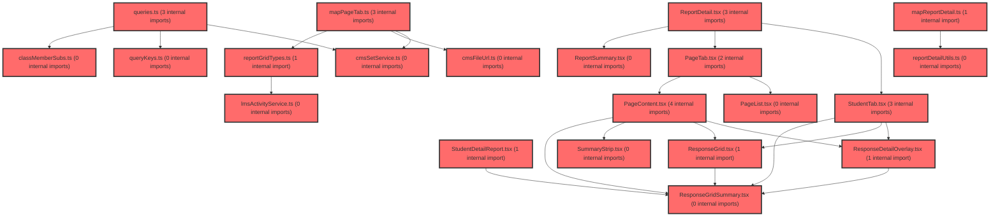

# 코드 리뷰 - c9d3939b

## 코드 복잡도 분석

**분석된 파일**: 32개 / 변경된 파일: 38개


### Import 의존관계 다이어그램



**범례**: 중심 파일 (변경됨) | 많은 import (10개 이상)


### 정상 범위 (NONE)


**`routes.tsx`** (other)

- 평균 복잡도: **0.052**

- 최대 복잡도: 0.463

- 청크 수: 24개

- 평균 사용처: 2.3곳


**권장사항:**

- 파일 크기가 큼 (24개 청크) - 파일 분리 검토


**`index.ts`** (component)

- 평균 복잡도: **0.026**

- 최대 복잡도: 0.461

- 청크 수: 36개

- 평균 사용처: 1.7곳


**권장사항:**

- 파일 크기가 큼 (36개 청크) - 파일 분리 검토


**`cmssetservice.ts`** (other)

- 평균 복잡도: **0.004**

- 최대 복잡도: 0.010

- 청크 수: 12개


**권장사항:**

- 복잡도 정상 범위


**`mappagetab.ts`** (component)

- 평균 복잡도: **0.004**

- 최대 복잡도: 0.014

- 청크 수: 28개


**권장사항:**

- 파일 크기가 큼 (28개 청크) - 파일 분리 검토


**`lmsactivityservice.ts`** (other)

- 평균 복잡도: **0.003**

- 최대 복잡도: 0.007

- 청크 수: 79개


**권장사항:**

- 파일 크기가 큼 (79개 청크) - 파일 분리 검토


**`queries.ts`** (other)

- 평균 복잡도: **0.003**

- 최대 복잡도: 0.012

- 청크 수: 120개


**권장사항:**

- 파일 크기가 큼 (120개 청크) - 파일 분리 검토


**`index.ts`** (other)

- 평균 복잡도: **0.002**

- 최대 복잡도: 0.011

- 청크 수: 41개


**권장사항:**

- 파일 크기가 큼 (41개 청크) - 파일 분리 검토


**`classmembersubs.ts`** (other)

- 평균 복잡도: **0.002**

- 최대 복잡도: 0.004

- 청크 수: 6개


**권장사항:**

- 복잡도 정상 범위


**`cmsfileurl.ts`** (other)

- 평균 복잡도: **0.002**

- 최대 복잡도: 0.003

- 청크 수: 3개


**권장사항:**

- 복잡도 정상 범위


**`mapreportdetail.ts`** (other)

- 평균 복잡도: **0.002**

- 최대 복잡도: 0.007

- 청크 수: 27개


**권장사항:**

- 파일 크기가 큼 (27개 청크) - 파일 분리 검토


**`reportdetailutils.ts`** (utility)

- 평균 복잡도: **0.002**

- 최대 복잡도: 0.010

- 청크 수: 33개


**권장사항:**

- 파일 크기가 큼 (33개 청크) - 파일 분리 검토


**`reportgridtypes.ts`** (other)

- 평균 복잡도: **0.002**

- 최대 복잡도: 0.008

- 청크 수: 9개


**권장사항:**

- 복잡도 정상 범위


**`lessonresultdetailpage.tsx`** (component)

- 평균 복잡도: **0.002**

- 최대 복잡도: 0.005

- 청크 수: 9개


**권장사항:**

- 복잡도 정상 범위


**`index.ts`** (other)

- 평균 복잡도: **0.002**

- 최대 복잡도: 0.004

- 청크 수: 4개


**권장사항:**

- 복잡도 정상 범위


**`lessonactivityreportembed.tsx`** (other)

- 평균 복잡도: **0.001**

- 최대 복잡도: 0.003

- 청크 수: 10개


**권장사항:**

- 복잡도 정상 범위


**`studentlessonresultpage.tsx`** (component)

- 평균 복잡도: **0.001**

- 최대 복잡도: 0.003

- 청크 수: 7개


**권장사항:**

- 복잡도 정상 범위


**`pagelist.tsx`** (component)

- 평균 복잡도: **0.001**

- 최대 복잡도: 0.012

- 청크 수: 32개


**권장사항:**

- 파일 크기가 큼 (32개 청크) - 파일 분리 검토


**`responsedetailoverlay.tsx`** (other)

- 평균 복잡도: **0.001**

- 최대 복잡도: 0.005

- 청크 수: 83개


**권장사항:**

- 파일 크기가 큼 (83개 청크) - 파일 분리 검토


**`responsegridsummary.tsx`** (other)

- 평균 복잡도: **0.001**

- 최대 복잡도: 0.005

- 청크 수: 25개


**권장사항:**

- 파일 크기가 큼 (25개 청크) - 파일 분리 검토


**`studenttab.tsx`** (other)

- 평균 복잡도: **0.001**

- 최대 복잡도: 0.008

- 청크 수: 92개


**권장사항:**

- 파일 크기가 큼 (92개 청크) - 파일 분리 검토


**`studentlessonbanner.tsx`** (other)

- 평균 복잡도: **0.001**

- 최대 복잡도: 0.008

- 청크 수: 26개


**권장사항:**

- 파일 크기가 큼 (26개 청크) - 파일 분리 검토


**`querykeys.ts`** (other)

- 평균 복잡도: **0.000**

- 최대 복잡도: 0.001

- 청크 수: 20개


**권장사항:**

- 복잡도 정상 범위


**`pagecontent.tsx`** (component)

- 평균 복잡도: **0.000**

- 최대 복잡도: 0.002

- 청크 수: 30개


**권장사항:**

- 파일 크기가 큼 (30개 청크) - 파일 분리 검토


**`pagetab.tsx`** (component)

- 평균 복잡도: **0.000**

- 최대 복잡도: 0.005

- 청크 수: 27개


**권장사항:**

- 파일 크기가 큼 (27개 청크) - 파일 분리 검토


**`reportdetail.tsx`** (other)

- 평균 복잡도: **0.000**

- 최대 복잡도: 0.003

- 청크 수: 26개


**권장사항:**

- 파일 크기가 큼 (26개 청크) - 파일 분리 검토


**`reportsummary.tsx`** (other)

- 평균 복잡도: **0.000**

- 최대 복잡도: 0.004

- 청크 수: 50개


**권장사항:**

- 파일 크기가 큼 (50개 청크) - 파일 분리 검토


**`responsegrid.tsx`** (other)

- 평균 복잡도: **0.000**

- 최대 복잡도: 0.004

- 청크 수: 30개


**권장사항:**

- 파일 크기가 큼 (30개 청크) - 파일 분리 검토


**`statuspanel.tsx`** (other)

- 평균 복잡도: **0.000**

- 최대 복잡도: 0.003

- 청크 수: 54개


**권장사항:**

- 파일 크기가 큼 (54개 청크) - 파일 분리 검토


**`summarystrip.tsx`** (other)

- 평균 복잡도: **0.000**

- 최대 복잡도: 0.004

- 청크 수: 10개


**권장사항:**

- 복잡도 정상 범위


**`studentdetailreport.tsx`** (other)

- 평균 복잡도: **0.000**

- 최대 복잡도: 0.008

- 청크 수: 81개


**권장사항:**

- 파일 크기가 큼 (81개 청크) - 파일 분리 검토


**`studentreportdashboard.tsx`** (other)

- 평균 복잡도: **0.000**

- 최대 복잡도: 0.003

- 청크 수: 30개


**권장사항:**

- 파일 크기가 큼 (30개 청크) - 파일 분리 검토


**`index.ts`** (other)

- 평균 복잡도: **0.000**

- 최대 복잡도: 0.000

- 청크 수: 4개


**권장사항:**

- 복잡도 정상 범위


---


## 변경 배경

이 커밋은 수업(lesson) 기능의 **교사 결과보기·학생 결과보기** 영역을 실 API로 전면 연동한 작업입니다. 추가계획20(선택 반 학생 집계·PageTab API), 추가계획21(교사 수동 채점·ResponseDetailOverlay), 추가계획22(학생 결과보기 API)의 구현 완료를 반영합니다.

- **목적**: 교사 수동 채점 PATCH, 학생 `my-activities`/`participation result` API 연동, 선택 반 학생 필터링, 페이지별 상세(CMS set→articles) 구현
- **도메인**: 비즈니스 로직(API 연동) + UI 위젯
- **변경 방향**: 목업 데이터 제거 → 실 LMS/CMS API 연동, 반(classId) 스코프로 사람 축 필터링, `SUBMITTED`만 단건 조회로 409 방지

## [GOOD] 잘된 점

- **API 계층 분리가 명확**: `lmsActivityService.ts`(service)와 `queries.ts`(React Query 훅)로 책임을 분리하고, 페이지/위젯에서 직접 fetch하지 않는 FSD 규칙을 잘 지켰습니다.
- **409 방지 로직을 문서와 코드에 일관되게 반영**: `status !== 'SUBMITTED'`면 단건 participations를 호출하지 않는 규칙을 `useTeacherParticipationsMapQuery` 주석과 문서(§19.5)에 명시했습니다.
- **Idempotency-Key 처리**: 교사 수동 채점 PATCH에 멱등키를 명시적으로 전달해 재시도 안전성을 확보했습니다.
- **문서화 충실도**: 추가계획20~22의 스펙·체크리스트·구현 결과를 상세히 기록해 유지보수성을 높였습니다.

## 변경사항 요약

교사 수동 채점(`patchParticipationGrading`), 학생 결과보기(`getMyActivities`/`getParticipationResult`), 선택 반 학생 필터링(`useClassMemberSubsQuery`), 페이지별 상세(CMS article map) 훅을 추가하고, `CmsArticleInfo.thumbnail` 필드를 확장했습니다. 라우트 페이지명을 `LessonReportDetailPage`→`LessonResultDetailPage`로 변경했습니다.

---

## [ISSUE] 개선이 필요한 부분

### Critical (즉시 수정 필요)

없음

### High (우선 수정 권장)

- **`useTeacherParticipationsMapQuery`의 `activityId!` non-null assertion**: `enabled: Boolean(activityId)`로 가드하지만, `queryFn` 내부에서 `activityId!`를 사용합니다. `enabled`가 false일 때는 queryFn이 실행되지 않으므로 실제 런타임 오류 위험은 낮지만, `activityId`가 undefined일 때 `lessonKeys.activityParticipation(activityId ?? '', id)`로 키가 빈 문자열이 되는 경로가 존재합니다. `enabled` 가드가 있으므로 치명적이진 않으나, `queryFn`에서 `activityId`를 캡처해 undefined 체크를 명시하는 편이 안전합니다.

### Medium (개선 권장)

- **`useParticipationResultQuery`의 retry 로직 중복**: 403/404는 retry하지 않고 그 외는 `failureCount < 1`로 제한하는 로직이 `retryUnlessNotFound`(queries.ts:319)와 유사합니다. 다만 학생 결과는 403(`RESULT_NOT_AVAILABLE`)도 처리해야 하므로 별도 함수로 분리한 것은 타당합니다. 다만 `retryUnlessNotFound`와의 중복을 줄이려면 공통 헬퍼로 추출하는 것을 고려할 수 있습니다.
- **`useClassMemberSubsQuery`의 `isPending` 조건**: `Boolean(classId) && Boolean(user?.id) && query.isPending`으로, classId가 없으면 isPending이 false가 되어 로딩 상태가 아닌 것으로 처리됩니다. 이는 의도된 동작(반 없음 = 빈 집합)일 수 있으나, 호출부에서 이 의미를 명확히 인지하고 있는지 확인이 필요합니다.

---

## 주요 파일 분석

### frontend/src/features/lesson/api/queries.ts

**변경 내용:** 채점 mutation, 교사/학생 단건 결과 맵, 반 멤버, CMS article 맵, 학생 결과 훅 추가.

**개선 제안:**

1. `useTeacherParticipationsMapQuery`의 non-null assertion 제거
   - **위치 (라인 420~427)**: `queryFn` 내 `getTeacherParticipationResult(activityId!, id, signal)`
   - **기존 코드**:
```ts
queryFn: ({ signal }: { signal?: AbortSignal }) =>
  getTeacherParticipationResult(activityId!, id, signal),
```
   - **해결 방안 (수정 코드)**:
```ts
queryFn: ({ signal }: { signal?: AbortSignal }) =>
  getTeacherParticipationResult(activityId as string, id, signal),
```
     > `enabled: Boolean(activityId)`가 이미 가드하므로 `as string`으로 명시적 캐스팅해 non-null assertion(`!`)보다 안전한 의도를 전달합니다. (이미 `enabled`로 보호되어 있어 동작 변화는 없음)

### frontend/src/features/lesson/api/lmsActivityService.ts

**변경 내용:** `patchParticipationGrading`, `MyActivity`, `getMyActivities`, `getParticipationResult` 추가.

**개선 제안:**

1. `patchParticipationGrading`의 `items` 배열이 항상 1개만 전달되는 구조
   - **위치 (라인 412~434)**: `PatchParticipationGradingItem[]` 배열을 받지만 실제 호출부(queries.ts)는 항상 단일 항목 `[{ activityItemId, errata }]`만 전달합니다.
   - **제안**: API가 다중 항목을 지원하므로 배열 시그니처는 유지하되, 호출부에서 단일 항목만 보내는 것은 의도된 설계로 보입니다. 다만 `awardedScore`/`comment`가 타입에 있으나 실제로는 전달되지 않아(보류 상태) 추후 확장을 위한 예비 필드임을 주석으로 명시하면 좋겠습니다.

### frontend/src/app/router/routes.tsx

**변경 내용:** `LessonReportDetailPage` → `LessonResultDetailPage` 페이지 컴포넌트명 변경.

**개선 제안:**

- 페이지명 변경이 라우트 경로(`/lesson/result/:activityId`)는 유지하면서 컴포넌트명만 바뀌었습니다. 문서(§19.7)의 FSD 구조(`LessonReportDetailPage`)와 실제 코드(`LessonResultDetailPage`)의 명칭이 불일치하므로, 문서를 함께 갱신하거나 명칭을 통일하는 것이 좋습니다.

---

## 최종 평가

**결론**: 
- [x] [OK] **승인 (Approved)** - Critical/High 이슈 없음

**종합 의견:**

교사·학생 결과보기 영역을 실 API로 전환하고 반 스코프 필터링과 409 방지 규칙을 일관되게 적용한 견고한 커밋입니다. FSD 레이어 분리와 문서화가 우수하며, 지적된 사항은 모두 사소한 개선 제안 수준입니다. 승인합니다.