> [!IMPORTANT]
> **⚠️ 수동 검토 권장 (자가힐링 주의)**
>
> AI 자가힐링 결과물이 실제 의도와 다를 수 있으므로, **상세 리뷰 내용에 기반한 수동 점검**을 우선해 주시기 바랍니다. 자가힐링 기능을 활용하실 경우 최종 결과물을 신중하게 확인해 주세요.

# 코드 리뷰 - ca651015

## 코드 복잡도 분석

**분석된 파일**: 33개 / 변경된 파일: 34개


### Import 의존관계 다이어그램

```mermaid
flowchart TD
    F0["ClassStatusSection.tsx (1 internal import)"]:::center
    F1["schoolRecordApi.ts (0 internal imports)"]:::center
    F2["ScopeTree.tsx (0 internal imports)"]:::center
    F3["useSchoolRecordStudentData.ts (4 internal imports)"]:::center
    F4["buildObservationInput.ts (1 internal import)"]:::center
    F5["RecordPreviewModal.tsx (0 internal imports)"]:::center
    F6["situations.ts (1 internal import)"]:::center
    F7["assessment/types.ts (0 internal imports)"]:::center
    F8["factorInfo.ts (1 internal import)"]:::center
    F9["useSchoolRecordClassData.ts (4 internal imports)"]:::center
    F10["examSlotService.ts (1 internal import)"]:::center
    F11["computeStudentProfile.ts (1 internal import)"]:::center
    F12["api/queryKeys.ts (0 internal imports)"]:::center
    F13["MainLayoutV2.tsx (1 internal import)"]:::center
    F14["queries.ts (2 internal imports)"]:::center
    F15["BulkGenerateSection.tsx (1 internal import)"]:::center
    F16["StudentWritingSection.tsx (1 internal import)"]:::center
    F17["assessmentService.ts (1 internal import)"]:::center
    F18["formatters.ts (1 internal import)"]:::center
    F19["AiGenerationNotice.tsx (0 internal imports)"]:::center
    F20["ExamManagementOverview.tsx (1 internal import)"]:::center
    F21["api/queryKeys.ts (0 internal imports)"]:::center
    F22["school-record/types.ts (0 internal imports)"]:::center
    F17 --> F7
    F10 --> F7
    F14 --> F21
    F14 --> F7
    F20 --> F7
    F8 --> F22
    F6 --> F22
    F11 --> F22
    F9 --> F12
    F9 --> F11
    F9 --> F1
    F9 --> F22
    F3 --> F12
    F3 --> F11
    F3 --> F1
    F3 --> F22
    F4 --> F22
    F18 --> F22
    F13 --> F2
    F15 --> F19
    F0 --> F5
    F16 --> F19
    classDef center fill:#ff6b6b,stroke:#333,stroke-width:3px
    classDef high fill:#ffd93d,stroke:#333,stroke-width:2px
```



**범례**: 중심 파일 (변경됨) | 많은 import (10개 이상)


### 정상 범위 (NONE)


**`routes.tsx`** (other)

- 평균 복잡도: **0.057**

- 최대 복잡도: 0.463

- 청크 수: 22개

- 평균 사용처: 2.5곳


**권장사항:**

- 파일 크기가 큼 (22개 청크) - 파일 분리 검토


**`assessmentservice.ts`** (other)

- 평균 복잡도: **0.003**

- 최대 복잡도: 0.008

- 청크 수: 32개


**권장사항:**

- 파일 크기가 큼 (32개 청크) - 파일 분리 검토


**`queries.ts`** (other)

- 평균 복잡도: **0.003**

- 최대 복잡도: 0.014

- 청크 수: 45개


**권장사항:**

- 파일 크기가 큼 (45개 청크) - 파일 분리 검토


**`schoolrecordapi.ts`** (other)

- 평균 복잡도: **0.003**

- 최대 복잡도: 0.006

- 청크 수: 9개


**권장사항:**

- 복잡도 정상 범위


**`buildobservationinput.ts`** (utility)

- 평균 복잡도: **0.003**

- 최대 복잡도: 0.006

- 청크 수: 6개


**권장사항:**

- 복잡도 정상 범위


**`downloadcsv.ts`** (utility)

- 평균 복잡도: **0.003**

- 최대 복잡도: 0.005

- 청크 수: 8개


**권장사항:**

- 복잡도 정상 범위


**`scopeconfig.ts`** (config)

- 평균 복잡도: **0.003**

- 최대 복잡도: 0.009

- 청크 수: 13개


**권장사항:**

- Config 파일은 높은 연결도가 정상적임


**`examslotservice.ts`** (other)

- 평균 복잡도: **0.002**

- 최대 복잡도: 0.013

- 청크 수: 6개


**권장사항:**

- 복잡도 정상 범위


**`situations.ts`** (other)

- 평균 복잡도: **0.002**

- 최대 복잡도: 0.004

- 청크 수: 5개


**권장사항:**

- 복잡도 정상 범위


**`computestudentprofile.ts`** (other)

- 평균 복잡도: **0.002**

- 최대 복잡도: 0.010

- 청크 수: 10개


**권장사항:**

- 복잡도 정상 범위


**`types.ts`** (other)

- 평균 복잡도: **0.002**

- 최대 복잡도: 0.006

- 청크 수: 15개


**권장사항:**

- 복잡도 정상 범위


**`formatters.ts`** (utility)

- 평균 복잡도: **0.002**

- 최대 복잡도: 0.005

- 청크 수: 9개


**권장사항:**

- 복잡도 정상 범위


**`assessmentpage.tsx`** (component)

- 평균 복잡도: **0.002**

- 최대 복잡도: 0.009

- 청크 수: 55개


**권장사항:**

- 파일 크기가 큼 (55개 청크) - 파일 분리 검토


**`querykeys.ts`** (other)

- 평균 복잡도: **0.001**

- 최대 복잡도: 0.002

- 청크 수: 3개


**권장사항:**

- 복잡도 정상 범위


**`types.ts`** (other)

- 평균 복잡도: **0.001**

- 최대 복잡도: 0.006

- 청크 수: 11개


**권장사항:**

- 복잡도 정상 범위


**`querykeys.ts`** (other)

- 평균 복잡도: **0.001**

- 최대 복잡도: 0.002

- 청크 수: 3개


**권장사항:**

- 복잡도 정상 범위


**`useschoolrecordclassdata.ts`** (other)

- 평균 복잡도: **0.001**

- 최대 복잡도: 0.005

- 청크 수: 16개


**권장사항:**

- 복잡도 정상 범위


**`useschoolrecordstudentdata.ts`** (other)

- 평균 복잡도: **0.001**

- 최대 복잡도: 0.009

- 청크 수: 26개


**권장사항:**

- 파일 크기가 큼 (26개 청크) - 파일 분리 검토


**`schoolrecordpage.tsx`** (component)

- 평균 복잡도: **0.001**

- 최대 복잡도: 0.009

- 청크 수: 27개


**권장사항:**

- 파일 크기가 큼 (27개 청크) - 파일 분리 검토


**`topchangesummary.tsx`** (other)

- 평균 복잡도: **0.001**

- 최대 복잡도: 0.010

- 청크 수: 62개


**권장사항:**

- 파일 크기가 큼 (62개 청크) - 파일 분리 검토


**`aigenerationnotice.tsx`** (other)

- 평균 복잡도: **0.001**

- 최대 복잡도: 0.004

- 청크 수: 16개


**권장사항:**

- 복잡도 정상 범위


**`classstatussection.tsx`** (other)

- 평균 복잡도: **0.001**

- 최대 복잡도: 0.008

- 청크 수: 89개


**권장사항:**

- 파일 크기가 큼 (89개 청크) - 파일 분리 검토


**`examclassmanagementview.tsx`** (component)

- 평균 복잡도: **0.000**

- 최대 복잡도: 0.005

- 청크 수: 75개


**권장사항:**

- 파일 크기가 큼 (75개 청크) - 파일 분리 검토


**`exammanagementoverview.tsx`** (component)

- 평균 복잡도: **0.000**

- 최대 복잡도: 0.008

- 청크 수: 99개


**권장사항:**

- 파일 크기가 큼 (99개 청크) - 파일 분리 검토


**`index.ts`** (other)

- 평균 복잡도: **0.000**

- 최대 복잡도: 0.000

- 청크 수: 10개


**권장사항:**

- 복잡도 정상 범위


**`factorinfo.ts`** (other)

- 평균 복잡도: **0.000**

- 최대 복잡도: 0.000

- 청크 수: 1개


**권장사항:**

- 복잡도 정상 범위


**`mainlayoutv2.tsx`** (other)

- 평균 복잡도: **0.000**

- 최대 복잡도: 0.008

- 청크 수: 46개


**권장사항:**

- 파일 크기가 큼 (46개 청크) - 파일 분리 검토


**`scopetree.tsx`** (other)

- 평균 복잡도: **0.000**

- 최대 복잡도: 0.006

- 청크 수: 64개


**권장사항:**

- 파일 크기가 큼 (64개 청크) - 파일 분리 검토


**`bulkgeneratesection.tsx`** (other)

- 평균 복잡도: **0.000**

- 최대 복잡도: 0.007

- 청크 수: 59개


**권장사항:**

- 파일 크기가 큼 (59개 청크) - 파일 분리 검토


**`recordemptystate.tsx`** (store)

- 평균 복잡도: **0.000**

- 최대 복잡도: 0.005

- 청크 수: 21개


**권장사항:**

- 파일 크기가 큼 (21개 청크) - 파일 분리 검토

- Store 파일은 높은 연결도가 정상적임


**`recordpreviewmodal.tsx`** (component)

- 평균 복잡도: **0.000**

- 최대 복잡도: 0.003

- 청크 수: 54개


**권장사항:**

- 파일 크기가 큼 (54개 청크) - 파일 분리 검토


**`studentwritingsection.tsx`** (other)

- 평균 복잡도: **0.000**

- 최대 복잡도: 0.009

- 청크 수: 139개


**권장사항:**

- 파일 크기가 큼 (139개 청크) - 파일 분리 검토


**`index.ts`** (other)

- 평균 복잡도: **0.000**

- 최대 복잡도: 0.000

- 청크 수: 4개


**권장사항:**

- 복잡도 정상 범위


---


## 변경 배경

이 커밋은 **검사 관리 기능의 확장**을 목적으로 합니다. 기존에는 '학습종합검사(paperIdx=1)'만 지원했으나, 이번 변경을 통해 **'자기조절학습검사(paperIdx=2)'까지 지원**하도록 확장했습니다. 또한 **생활기록부 작성 페이지(SchoolRecordPage)** 를 신규 추가하여 `/exam/record` 라우트에 연결했습니다.

- **목적**: 검사 유형(paperIdx)별 필터링 및 권한 기반 검사 유형 전환 지원, 생활기록부 작성 기능 신규 도입
- **도메인**: 프론트엔드 UI, API 서비스 계층, React Query 캐시 관리
- **변경 방향**: `paperIdx` 파라미터를 쿼리 키와 API 호출에 전파하여 검사 유형별 데이터 분리, 교사 권한(`PaperPermission`) 기반 UI 제어

---

## [GOOD] 잘된 점

1. **타입 안전성 강화**: `PaperIdx = '1' | '2'` 유니온 타입을 도입하여 `paperIdx`를 문자열 리터럴로 제한했습니다. `fetchExamList`의 `_paperIdx?: string`에서 `paperIdx?: PaperIdx`로 변경한 것은 타입 안전성을 크게 개선한 부분입니다.
2. **React Query 키 설계가 체계적**: `assessmentKeys.examSlots(claId, userId, paperIdx)`에 `paperIdx ?? 'all'` 기본값을 사용하여 키 충돌을 방지했습니다. `paperPermission` 키도 별도로 분리하여 권한 데이터의 캐시 격리를 보장했습니다.
3. **권한 기반 UI 제어**: `usePaperPermissionQuery`를 통해 교사의 검사 유형 권한을 조회하고, `canSwitchPaper`(권한이 2개 모두 있을 때만)로 유형 전환 UI를 조건부 렌더링한 설계가 명확합니다.
4. **신규 컴포넌트의 관심사 분리**: `ExamClassManagementView`가 725줄로 다소 크지만, 스타일드 컴포넌트를 하단에 모아두고 비즈니스 로직(필터링, 진행률 계산)을 `useMemo`로 분리한 구조는 유지보수 측면에서 합리적입니다.

---

## 변경사항 요약

- `assessmentService.ts`: `fetchPaperPermission` API 추가, `fetchExamList`에 `paperIdx` 파라미터 전달
- `examSlotService.ts`: `paperIdx` 기반 슬롯 필터링 로직 추가
- `queries.ts` / `queryKeys.ts`: `usePaperPermissionQuery` 추가, `examSlots` 키에 `paperIdx` 반영
- `ExamClassManagementView.tsx` 신규: 반별 검사 관리 상세 뷰 (회차 탭, 학생 제출 현황 테이블)
- `ExamManagementOverview.tsx`: 검사 유형 전환 스위치 추가, `paperIdx` 기반 슬롯 조회로 변경
- `school-record` feature 신규: 생활기록부 API, 쿼리 키, 38개 요인 메타데이터 추가
- `routes.tsx`: `/exam/record` 라우트를 `SchoolRecordPage`로 교체

---

## [ISSUE] 개선이 필요한 부분

### Critical (즉시 수정 필요)

없음

### High (우선 수정 권장)

**1. `useInvalidateAssessmentGroup`의 무효화 키가 `paperIdx`를 포함하지 않아 캐시 갱신 누락 가능**

`queries.ts`의 `useInvalidateAssessmentGroup`에서 무효화 키를 `['assessment', 'exam-slots', claId, userId]`로만 지정하고 있습니다. 하지만 `examSlots` 쿼리 키는 이제 `paperIdx`를 포함하도록 변경되었습니다.

- **위치**: `frontend/src/features/assessment/api/queries.ts` 라인 68-70
- **기존 코드**:
```typescript
await queryClient.invalidateQueries({
  queryKey: [...assessmentKeys.all, 'exam-slots', claId, userId],
});
```

React Query의 `invalidateQueries`는 **부분 일치(prefix match)** 방식으로 동작합니다. 즉, `['assessment', 'exam-slots', claId, userId]`는 `['assessment', 'exam-slots', claId, userId, '1']`과 `['assessment', 'exam-slots', claId, userId, '2']`를 모두 무효화합니다. 따라서 **현재 구현으로도 두 paperIdx의 캐시가 모두 갱신**되므로 기능상 문제는 없습니다.

다만, `assessmentKeys.examSlots(claId, userId)`를 호출하면 `paperIdx`가 `undefined`가 되어 `'all'`로 대체된 키(`['assessment', 'exam-slots', claId, userId, 'all']`)가 생성됩니다. 이는 실제 쿼리 키(`'1'` 또는 `'2'`)와 일치하지 않지만, `invalidateQueries`의 prefix 매칭 특성상 `['assessment', 'exam-slots', claId, userId]`로 시작하는 모든 키가 무효화되므로 동작에는 문제가 없습니다.

**권장 사항**: 명시적으로 `assessmentKeys.examSlots(claId, userId)` 대신 `[...assessmentKeys.all, 'exam-slots', claId, userId]`를 사용한 것은 의도된 것으로 보입니다. 다만, `assessmentKeys.examSlots` 헬퍼를 사용하지 않고 하드코딩한 것은 향후 키 구조 변경 시 누락 위험이 있으므로, 헬퍼 함수를 통해 키를 생성하는 것이 더 안전합니다.

**2. `useTeacherClassList`의 `paperIdx` 미전달로 인한 사이드바 상태 불일치**

`useApiData.ts`의 `useTeacherClassList`에서 `useAssessmentSlotsQueries(groups, user?.id)`를 호출할 때 `paperIdx`를 전달하지 않고 있습니다. 이 경우 `paperIdx`는 `undefined`가 되어 `fetchExamList`에 `paperIdx` 파라미터가 전달되지 않고, `EXAM_SLOTS` 전체(4개 슬롯)에 대한 데이터를 조회하게 됩니다.

반면 `AssessmentPage`에서는 `activePaperIdx`를 전달하여 특정 paperIdx에 해당하는 슬롯만 조회합니다. 이로 인해:
- 사이드바는 항상 전체 슬롯 기준으로 상태를 계산
- 검사 페이지는 선택된 paperIdx 기준으로 상태를 계산

이 두 화면 간 상태 계산 기준이 달라질 수 있습니다. 예를 들어, 학습종합검사(paperIdx=1)만 진행 중인 경우, 사이드바는 전체 슬롯 중 `in_progress`가 있으므로 '진행 중'으로 표시하지만, 검사 페이지에서 자기조절학습검사(paperIdx=2)를 선택하면 해당 검사는 '시작 전'으로 표시됩니다. 이는 의도된 동작일 수 있으나, **사이드바의 검사 상태 표시가 현재 선택된 검사 유형과 무관하게 동작**한다는 점에서 UX 혼란을 줄 수 있습니다.

- **위치**: `frontend/src/features/api/useApiData.ts` 라인 591-593
- **제안**: `useTeacherClassList`도 현재 활성화된 `paperIdx`를 파라미터로 받아 동일한 기준으로 상태를 계산하거나, 사이드바는 전체 기준으로 유지하되 이 동작이 의도된 것인지 명시적으로 문서화하는 것이 좋습니다.

### Medium (개선 권장)

**1. `ExamClassManagementView`의 `submitted` 판정 로직이 불완전할 수 있음**

`ExamClassManagementView.tsx` 라인 478-486에서 학생의 제출 상태를 다음과 같이 판정합니다:

```typescript
const hasIdentifiableSubmissionState = missingIdentifiers.size > 0 || pendingCount === 0;
const studentRows = activeMembers.map((member, index) => {
  const isMissing =
    missingIdentifiers.has(member.stdtId) ||
    missingIdentifiers.has(member.name) ||
    missingIdentifiers.has(getMemberName(member));
  return {
    member,
    number: member.memberNo ?? index + 1,
    name: getMemberName(member),
    submitted: hasStarted && hasIdentifiableSubmissionState && !isMissing,
  };
});
```

`hasIdentifiableSubmissionState`가 `false`인 경우(즉, `missingIdentifiers`가 비어있고 `pendingCount > 0`인 경우), **모든 학생이 `submitted: false`로 표시**됩니다. 이는 서버에서 `notDgnssStartList`가 빈 배열로 오는 경우(예: API가 아직 미제출 학생 목록을 제공하지 않는 경우) 발생할 수 있습니다. 이 경우 실제로 제출한 학생도 '미제출'로 잘못 표시될 수 있습니다.

이 로직은 서버 응답의 `notDgnssStartList`가 항상 정확하다는 가정에 의존합니다. 만약 서버가 이 필드를 아직 지원하지 않거나 빈 배열을 반환한다면, 제출 상태 표시가 모두 '미제출'로 잘못 렌더링됩니다. **서버 API의 응답 형식에 대한 확인이 필요**하며, 불확실한 경우 `submitted` 판정을 서버의 `submittedCount` 기반으로 보수적으로 처리하는 것이 안전합니다.

**2. `fetchPaperPermission`의 `staleTime: Number.POSITIVE_INFINITY` 설정**

`queries.ts` 라인 18-24에서 `usePaperPermissionQuery`에 `staleTime: Number.POSITIVE_INFINITY`를 설정했습니다. 이는 권한 정보가 세션 동안 변경되지 않는다는 가정에 기반합니다. 하지만 관리자가 교사 권한을 변경하는 경우, **페이지 새로고침 전까지 변경 사항이 반영되지 않습니다**. 권한 변경 주기가 빈번하지 않다면 문제가 없지만, `refetchOnWindowFocus`를 활성화하거나 `staleTime`을 제한하는 것을 고려해볼 수 있습니다.

**3. `schoolRecordApi`의 `saveDraft`에서 `DRAFT_STATUS_CODE` 변환 로직**

`schoolRecordApi.ts`의 `saveDraft`에서 `status: DRAFT_STATUS_CODE[payload.status]`로 변환하고 있습니다. `DRAFT_STATUS_CODE`와 `DRAFT_STATUS_FROM_CODE`가 양방향 매핑으로 정의되어 있는지 확인이 필요합니다. 만약 매핑이 누락된 상태 코드가 있다면 런타임 오류가 발생할 수 있습니다.

---

## 주요 파일 분석

### `frontend/src/features/assessment/api/queries.ts`

**변경 내용:**
- `usePaperPermissionQuery` 훅 추가
- `useAssessmentSlotsQueries`에 `paperIdx` 및 `enabled` 파라미터 추가
- `useInvalidateAssessmentGroup`의 무효화 키를 하드코딩된 배열로 변경

**개선 제안:**

1. `useInvalidateAssessmentGroup`에서 `assessmentKeys.examSlots` 헬퍼를 사용하지 않고 하드코딩한 부분
   - **위치**: `queries.ts` 라인 68-70
   - **기존 코드**:
```typescript
await queryClient.invalidateQueries({
  queryKey: [...assessmentKeys.all, 'exam-slots', claId, userId],
});
```
   - **해결 방안 (수정 코드)**:
```typescript
await queryClient.invalidateQueries({
  queryKey: assessmentKeys.examSlots(claId, userId),
});
```
   - `assessmentKeys.examSlots(claId, userId)`는 `paperIdx`가 `undefined`일 때 `'all'`로 대체되어 `['assessment', 'exam-slots', claId, userId, 'all']` 키가 생성됩니다. React Query의 `invalidateQueries`는 prefix 매칭이므로 `['assessment', 'exam-slots', claId, userId]`로 시작하는 모든 키(`'1'`, `'2'`, `'all'`)가 무효화됩니다. 따라서 헬퍼 함수를 사용해도 동일한 동작을 보장하면서 키 구조 변경 시 유지보수성을 높일 수 있습니다.

### `frontend/src/features/assessment/ui/ExamClassManagementView.tsx` (신규)

**변경 내용:**
- 반별 검사 관리 상세 뷰 컴포넌트 (725줄)
- 회차 탭, 학생 제출 현황 테이블, 미제출 배너, 검사 시작/종료/취소/결과 보기/추가 진행 액션

**개선 제안:**

1. **컴포넌트 분리 권장**
   - **위치**: 파일 전체 (725줄)
   - 단일 파일에 스타일드 컴포넌트(약 30개), 비즈니스 로직, 렌더링이 모두 포함되어 있습니다. `PaperSwitch`, `RoundTabs`, `StudentTable`, `PendingBanner` 등을 별도 파일로 분리하면 가독성과 재사용성이 크게 향상됩니다.

2. **하드코딩된 색상 값**
   - **위치**: `PaperButton` (라인 57-58), `RoundTab` (라인 88-89), `Button` (라인 190-191) 등
   - `#6b46f2`, `#009f88`, `#f0eef6` 등 테마 색상이 하드코딩되어 있습니다. `theme.colors`를 사용하거나 상수로 추출하는 것이 일관성 측면에서 좋습니다.

### `frontend/src/features/assessment/ui/ExamManagementOverview.tsx`

**변경 내용:**
- `paperIdx` 기반 슬롯 조회로 변경 (`getLearningSlot` → `getPaperSlot`)
- 검사 유형 전환 스위치 추가

**개선 제안:**

1. `getPaperSlot` 함수에서 `paperIdx === '1' ? 'L' : 'S'`로 슬롯 ID prefix를 결정하는 방식
   - **위치**: 라인 306-309
   - **기존 코드**:
```typescript
const getPaperSlot = (group: GroupWithExamState, paperIdx: PaperIdx, round: 1 | 2) => {
  const prefix = paperIdx === '1' ? 'L' : 'S';
  return group.examSlots.find((slot) => slot.slotId === `${prefix}${round}`);
};
```
   - `EXAM_SLOTS` 상수에 이미 `paperIdx`와 `id`의 매핑이 정의되어 있으므로, `EXAM_SLOTS.find((slot) => slot.paperIdx === paperIdx && slot.round === round)?.id`를 사용하는 것이 더 안전합니다. 하드코딩된 `'L'`/`'S'` prefix는 향후 검사 유형이 추가될 때 누락 위험이 있습니다.

### `frontend/src/features/school-record/api/schoolRecordApi.ts` (신규)

**변경 내용:**
- 생활기록부 API 서비스 (클래스 목록 조회, 학생 상세 조회, 저장, 삭제)

**개선 제안:**

1. `toSummary`와 `toDetail` 변환 함수에서 `DRAFT_STATUS_FROM_CODE[raw.status] ?? 'EMPTY'`로 처리
   - **위치**: 라인 38, 52
   - 서버에서 예상치 못한 상태 코드가 오는 경우 `'EMPTY'`로 폴백되는데, 이는 실제로 작업본이 있는데도 `EMPTY`로 잘못 표시될 수 있습니다. 서버 상태 코드 목록을 명시적으로 정의하고, 알 수 없는 코드에 대한 로깅을 추가하는 것이 좋습니다.

---

## 최종 평가

**결론**: 
- [ ] [OK] **승인 (Approved)** - Critical/High 이슈 없음
- [x] [WARN] **조건부 승인 (Approved with Comments)** - Medium 이하 이슈만 존재
- [ ] [FIX] **수정 필요 (Changes Requested)** - Critical/High 이슈 존재

**종합 의견:**

이 커밋은 검사 관리 기능을 학습종합검사에서 자기조절학습검사까지 확장하고, 생활기록부 작성 기능을 신규 도입한 의미 있는 변경입니다. `PaperIdx` 타입 도입, 권한 기반 UI 제어, React Query 키 설계 등 전반적으로 타입 안전성과 캐시 관리 측면에서 잘 구성되어 있습니다. 다만 `ExamClassManagementView`의 학생 제출 상태 판정 로직이 서버 응답 형식에 의존적이므로, 실제 API 응답과의 정합성 확인이 필요합니다. 또한 `useTeacherClassList`와 `AssessmentPage` 간의 `paperIdx` 처리 기준 차이는 의도된 동작인지 명확히 문서화하는 것이 좋겠습니다. 전반적으로 승인 가능한 수준의 품질을 갖추고 있습니다.