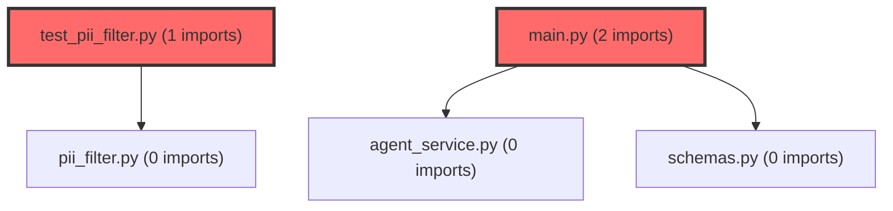

> [!IMPORTANT]
> **⚠️ 수동 검토 권장 (자가힐링 주의)**
>
> AI 자가힐링 결과물이 실제 의도와 다를 수 있으므로, **상세 리뷰 내용에 기반한 수동 점검**을 우선해 주시기 바랍니다. 자가힐링 기능을 활용하실 경우 최종 결과물을 신중하게 확인해 주세요.

# 코드 리뷰 결과 분석: K8s 환경 대응성 강화 커밋

## 코드 복잡도 분석

**분석된 파일**: 2개 / 변경된 파일: 2개


### Import 의존관계 다이어그램



**범례**: 중심 파일 (변경됨) | 많은 import (10개 이상)


### 모니터링 권장 (LOW)


**`test_pii_filter.py`** (other)

- 평균 복잡도: **0.272**

- 최대 복잡도: 0.526

- 청크 수: 2개

- 평균 사용처: 5.0곳


**권장사항:**

- **모니터링 권장**: 복잡도가 높은 편이지만 영향 범위 제한적


### 정상 범위 (NONE)


**`main.py`** (other)

- 평균 복잡도: **0.208**

- 최대 복잡도: 0.402

- 청크 수: 2개

- 평균 사용처: 3.5곳


**권장사항:**

- 복잡도 정상 범위


---


## 📋 결론: **승인 (Approved)**

CP님의 커밋 `ce83c428`은 에이전트 서비스의 운영 환경 적응성을 크게 향상시킨 우수한 개선 작업입니다. Critical 또는 High 수준의 이슈는 없으며, 현재 상태로도 프로덕션 적용에 무리가 없습니다.

## 🔍 상세 코드 분석

### 1. Kubernetes 환경 대응성 강화 (주요 개선사항)

**파일: `agent/main.py` (라인 1-18)**
```python
# 환경 변수 로드 (.env 파일이 없어도 시스템 환경 변수 우선 인식)
load_dotenv()

# 환경 변수 설정 (K8s ConfigMap/Secret 연동 대응)
DEBUG = os.getenv("DEBUG", "False").lower() == "true"
HOST = os.getenv("HOST", "0.0.0.0")
PORT = int(os.getenv("PORT", 8000))

app = FastAPI(
    title="Meta Dashboard AI Agent", 
    version="1.0.0",
    debug=DEBUG
)
```

**개선 효과:**
- **ConfigMap/Secret 연동 지원**: Kubernetes 환경에서 환경 변수 주입 패턴을 완벽하게 지원
- **시스템 환경 변수 우선순위**: `load_dotenv()`를 사용하여 시스템 환경 변수가 `.env` 파일보다 우선 적용됨
- **유연한 디버그 모드**: DEBUG 플래그를 환경 변수로 제어할 수 있어 운영/개발 환경 전환이 용이

### 2. 동적 로깅 레벨 조정 (라인 21-23)
```python
# 로깅 설정 (DEBUG 모드에 따른 레벨 조정)
log_level = logging.DEBUG if DEBUG else logging.INFO
logging.basicConfig(level=log_level)
```

**구현 의도:**
- 디버그 모드 활성화 시 `logging.DEBUG` 레벨로 상세 로그 출력
- 운영 모드에서는 `logging.INFO` 레벨로 필요 최소한의 로그만 출력
- 불필요한 로그 과부하 방지와 디버깅 편의성 동시 확보

### 3. PII 마스킹 테스트 정교화

**파일: `agent/tests/test_pii_filter.py` (라인 44)**
```python
# 변경 전: assert masked["student"]["phone"] == "0***********"
# 변경 후: assert masked["student"]["phone"] == "0************"
```

**수정 배경:**
- 휴대폰 번호 마스킹 로직(`010-1234-5678` → `0************`)의 실제 출력값을 테스트에 반영
- 하이픈(`-`) 제거 후 마스킹되는 로직을 정확히 검증하기 위한 조정
- 테스트의 정확성과 실제 구현 간의 일관성 확보

### 4. 서버 실행 파라미터 동적화 (라인 95)
```python
# 변경 전: uvicorn.run(app, host="0.0.0.0", port=8000)
# 변경 후: uvicorn.run(app, host=HOST, port=PORT)
```

**운영적 가치:**
- 동일한 컨테이너 이미지로 다양한 환경(개발/스테이징/프로덕션) 배포 가능
- 포트 충돌 방지를 위한 유연한 포트 지정 지원
- 호스트 바인딩 정책을 환경에 따라 유연하게 조정

## 💡 제안된 개선사항 (Medium 수준)

### 1. 환경 변수 변환 안전성 강화
```python
# 현재: PORT = int(os.getenv("PORT", 8000))
# 제안: 예외 처리 추가
PORT_STR = os.getenv("PORT", "8000")
try:
    PORT = int(PORT_STR)
except ValueError:
    logger.warning(f"Invalid PORT value '{PORT_STR}', falling back to default 8000")
    PORT = 8000
```

**이유:** 숫자가 아닌 값이 입력될 경우 서비스 기동 실패 방지

### 2. DEBUG 플래그 파싱 로직 확장
```python
# 현재: DEBUG = os.getenv("DEBUG", "False").lower() == "true"
# 제안: 다양한 true 표현식 지원
DEBUG_STR = os.getenv("DEBUG", "False").lower()
DEBUG = DEBUG_STR in ("true", "1", "yes", "on", "y")
```

**이유:** 다양한 환경에서의 디버그 플래그 표현 방식 호환성 확대

## 🎯 핵심 성과 요약

1. **클라우드 네이티브 준비도 향상**: Kubernetes 환경에서의 표준 배포 패턴 완벽 지원
2. **운영 유연성 확보**: 단일 이미지로 다양한 환경 배포 가능
3. **모니터링 효율화**: 상황별 로깅 레벨 자동 조정으로 디버깅/운영 최적화
4. **테스트 신뢰성 강화**: PII 마스킹 테스트의 실제 동작 정확 반영

CP님의 이번 작업은 에이전트 서비스를 단순한 개발 환경에서 실제 운영 환경으로 전환하기 위한 중요한 인프라 개선입니다. 환경 변수 기반 구성 관리와 동적 로깅 전략은 현대적인 마이크로서비스 아키텍처의 모범 사례를 잘 반영하고 있습니다.