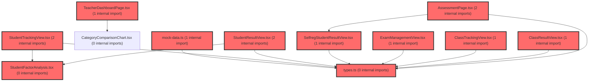

> [!IMPORTANT]
> **⚠️ 수동 검토 권장 (자가힐링 주의)**
>
> AI 자가힐링 결과물이 실제 의도와 다를 수 있으므로, **상세 리뷰 내용에 기반한 수동 점검**을 우선해 주시기 바랍니다. 자가힐링 기능을 활용하실 경우 최종 결과물을 신중하게 확인해 주세요.

# 코드 리뷰 - cfe1944a

## 코드 복잡도 분석

**분석된 파일**: 21개 / 변경된 파일: 41개


### Import 의존관계 다이어그램



**범례**: 중심 파일 (변경됨) | 많은 import (10개 이상)


### 모니터링 권장 (LOW)


**`assessmentpage.tsx`** (component)

- 평균 복잡도: **0.236**

- 최대 복잡도: 0.526

- 청크 수: 64개

- 평균 사용처: 30.8곳


**권장사항:**

- **모니터링 권장**: 복잡도가 높은 편이지만 영향 범위 제한적

- 파일 크기가 큼 (64개 청크) - 파일 분리 검토


### 정상 범위 (NONE)


**`teacherdashboardpage.tsx`** (component)

- 평균 복잡도: **0.303**

- 최대 복잡도: 0.472

- 청크 수: 30개

- 평균 사용처: 45.2곳


**권장사항:**

- 파일 크기가 큼 (30개 청크) - 파일 분리 검토


**`index.ts`** (component)

- 평균 복잡도: **0.128**

- 최대 복잡도: 0.463

- 청크 수: 18개

- 평균 사용처: 9.1곳


**권장사항:**

- 복잡도 정상 범위


**`schoolrecordinfomapper.xml`** (other)

- 평균 복잡도: **0.008**

- 최대 복잡도: 0.008

- 청크 수: 1개


**권장사항:**

- 복잡도 정상 범위


**`schoolrecordcontroller.java`** (other)

- 평균 복잡도: **0.006**

- 최대 복잡도: 0.006

- 청크 수: 5개


**권장사항:**

- 복잡도 정상 범위


**`aiconversationcontroller.java`** (other)

- 평균 복잡도: **0.005**

- 최대 복잡도: 0.006

- 청크 수: 6개


**권장사항:**

- 복잡도 정상 범위


**`aiconversationservice.java`** (other)

- 평균 복잡도: **0.005**

- 최대 복잡도: 0.009

- 청크 수: 16개


**권장사항:**

- 복잡도 정상 범위


**`schoolrecordservice.java`** (other)

- 평균 복잡도: **0.004**

- 최대 복잡도: 0.006

- 청크 수: 9개


**권장사항:**

- 복잡도 정상 범위


**`types.ts`** (other)

- 평균 복잡도: **0.003**

- 최대 복잡도: 0.015

- 청크 수: 29개


**권장사항:**

- 파일 크기가 큼 (29개 청크) - 파일 분리 검토


**`scopetree.tsx`** (component)

- 평균 복잡도: **0.002**

- 최대 복잡도: 0.005

- 청크 수: 15개


**권장사항:**

- 복잡도 정상 범위


**`classtrackingview.tsx`** (component)

- 평균 복잡도: **0.002**

- 최대 복잡도: 0.012

- 청크 수: 55개


**권장사항:**

- 파일 크기가 큼 (55개 청크) - 파일 분리 검토


**`selfregstudentresultview.tsx`** (component)

- 평균 복잡도: **0.002**

- 최대 복잡도: 0.008

- 청크 수: 32개


**권장사항:**

- 파일 크기가 큼 (32개 청크) - 파일 분리 검토


**`studentfactoranalysis.tsx`** (component)

- 평균 복잡도: **0.002**

- 최대 복잡도: 0.008

- 청크 수: 20개


**권장사항:**

- 복잡도 정상 범위


**`mock-data.ts`** (other)

- 평균 복잡도: **0.002**

- 최대 복잡도: 0.012

- 청크 수: 38개


**권장사항:**

- 파일 크기가 큼 (38개 청크) - 파일 분리 검토


**`classresultview.tsx`** (component)

- 평균 복잡도: **0.001**

- 최대 복잡도: 0.011

- 청크 수: 35개


**권장사항:**

- 파일 크기가 큼 (35개 청크) - 파일 분리 검토


**`exammanagementview.tsx`** (component)

- 평균 복잡도: **0.001**

- 최대 복잡도: 0.006

- 청크 수: 18개


**권장사항:**

- 복잡도 정상 범위


**`studentresultview.tsx`** (component)

- 평균 복잡도: **0.001**

- 최대 복잡도: 0.009

- 청크 수: 37개


**권장사항:**

- 파일 크기가 큼 (37개 청크) - 파일 분리 검토


**`studenttrackingview.tsx`** (component)

- 평균 복잡도: **0.001**

- 최대 복잡도: 0.010

- 청크 수: 35개


**권장사항:**

- 파일 크기가 큼 (35개 청크) - 파일 분리 검토


**`classstatusview.tsx`** (component)

- 평균 복잡도: **0.001**

- 최대 복잡도: 0.004

- 청크 수: 32개


**권장사항:**

- 파일 크기가 큼 (32개 청크) - 파일 분리 검토


**`schoolrecordinfomapper.java`** (other)

- 평균 복잡도: **0.000**

- 최대 복잡도: 0.001

- 청크 수: 7개


**권장사항:**

- 복잡도 정상 범위


**`index-cqgbls4t.js`** (other)

- 평균 복잡도: **0.000**

- 최대 복잡도: 0.000

- 청크 수: 14개


**권장사항:**

- 복잡도 정상 범위


---


## 변경 배경

이 커밋은 `vs-develop` 브랜치를 `feature/frontend-architecture`로 병합한 Merge 커밋입니다. 프론트엔드 고도화 작업을 위해 백엔드 API를 보강하고, FE 개발자 전달용 문서를 한 곳에 모았으며, Netlify 배포 설정을 추가했습니다.

- **목적**: AI 대화방 제목 수정/삭제 API 추가, 생기부 고도화 조회 API(리스트/상세) 구현, FE 전달 문서 재구성, Netlify 배포 인프라 구성
- **도메인**: API(백엔드), 인프라(Netlify 배포), 문서화(FE 핸드오프)
- **변경 방향**: 기존에 미구현이었던 생기부 조회 API를 신규 구현하고, AI 대화방 관리 기능(제목 수정/소프트 삭제)을 보강. 문서는 `fe-handoff/` 디렉토리로 통합 관리

---

## [GOOD] 잘된 점

1. **소유권 검증 일관성**: `updateTitle`과 `deleteConversation` 모두 `requireOwnedConversation(conversationId, userNo)`를 통해 본인 소유 대화방만 접근 가능하도록 검증합니다. 기존 `addMessages`와 동일한 패턴을 재사용하여 일관성을 유지했습니다.
2. **소프트 삭제 설계**: 대화방 삭제를 `use_yn='N'`으로 처리하는 소프트 삭제 방식을 채택하여 데이터 보존과 복구 가능성을 확보했습니다. `deleteConversation`에서 `affected <= 0` 시 예외를 던져 이미 삭제된 대화방에 대한 중복 삭제를 방지합니다.
3. **JSON 파싱 폴백 처리**: `parseJsonOrNull` 메서드가 null/빈 문자열/파싱 실패 시 null을 반환하도록 안전하게 처리하여, 데이터 오염 시에도 API가 500을 반환하지 않고 null로 우아하게 폴백합니다.
4. **문서화 정리**: FE 전달 문서를 `fe-handoff/` 디렉토리로 통합하고 README를 추가하여 문서 접근성을 개선했습니다. 기존 문서의 링크 경로도 함께 수정하여 깨진 링크를 방지했습니다.

---

## 변경사항 요약

- AI 대화방 제목 수정(`POST /api/ai/conversations/{id}/title`) 및 삭제(`POST .../delete`) API 추가
- 생기부 고도화 조회 API 2종(학급 리스트 `GET /class/{classId}`, 학생 상세 `GET /student/{studentId}/draft`) 신규 구현
- FE 전달 문서 3종을 `backend/docs/fe-handoff/`로 통합 및 경로 수정
- Netlify 배포 설정(`netlify.toml`) 및 prototype 빌드 산출물 추가

---

## [ISSUE] 개선이 필요한 부분

### Critical (즉시 수정 필요)

없음

### High (우선 수정 권장)

1. **`updateTitle`의 200자 잘림 시 UTF-8 멀티바이트 문자 손상 가능성**
   - `AiConversationService.java`의 `updateTitle` 메서드에서 `title.substring(0, MAX_TITLE_LENGTH)`로 200자 제한을 처리합니다. 이는 **문자(char) 단위** 자르기이므로, 한글 등 UTF-8 멀티바이트 문자가 200번째 위치에 걸쳐 있을 경우 잘린 문자열의 마지막 문자가 깨질 수 있습니다.
   - DB 컬럼이 `VARCHAR(200)`이라면 MySQL은 **바이트 수**가 아닌 **문자 수** 기준으로 길이를 검사하므로, `substring`으로 자른 200자(한글 포함)는 DB에 정상 저장됩니다. 다만, 서로게이트 페어(이모지 등) 문자가 200번째에 걸쳐 잘리면 `StringIndexOutOfBoundsException`이 발생할 위험이 있습니다.
   - **권장 사항**: `substring` 대신 `codePoint` 기반으로 자르거나, `title.length() > MAX_TITLE_LENGTH` 조건에서 `title = title.substring(0, MAX_TITLE_LENGTH)` 대신 `title = truncateByCodePoint(title, MAX_TITLE_LENGTH)` 형태의 안전한 유틸리티를 사용하는 것을 권장합니다.

2. **`SchoolRecordService`의 `ObjectMapper` 인스턴스가 스프링 빈과 별개로 생성됨**
   - `SchoolRecordService.java`에서 `private final ObjectMapper objectMapper = new ObjectMapper();`로 직접 생성하고 있습니다. 이는 스프링 컨테이너가 관리하는 `ObjectMapper` 빈과 별개의 인스턴스로, 프로젝트 전역 설정(예: JavaTimeModule, 커스텀 직렬화 설정)이 적용되지 않을 수 있습니다.
   - `AiConversationService`는 `@RequiredArgsConstructor`로 주입받는 반면, `SchoolRecordService`는 직접 생성하는 방식이라 두 서비스 간 일관성이 없습니다.
   - **권장 사항**: `AiConversationService`처럼 생성자 주입으로 통일하는 것을 권장합니다.

### Medium (개선 권장)

1. **`selectDraftListByClass` 쿼리에 인덱스 활용 가능성**
   - `SchoolRecordInfoMapper.xml`의 `selectDraftListByClass`는 `cla_id + tc_id + category + use_yn` 조건으로 조회합니다. UPSERT 쿼리의 유니크 키가 `(stdt_id, tc_id, category)`이므로, `cla_id` 기준 조회 시 인덱스가 없으면 풀 스캔이 발생할 수 있습니다. 학급당 학생 수가 많지 않다면 문제없지만, 데이터가 커질 경우 `(cla_id, tc_id, category, use_yn)` 복합 인덱스 추가를 검토할 만합니다.

2. **`parseJsonOrNull`의 파싱 실패 로그 레벨**
   - 파싱 실패 시 `log.warn`으로 남기는데, 데이터가 손상된 경우 반복 호출 시 로그가 과도하게 쌓일 수 있습니다. `log.debug`로 낮추거나, 실패 횟수를 제한하는 방식을 고려할 수 있습니다.

3. **`netlify.toml`의 SPA 리다이렉트 설정**
   - `[[redirects]]`에서 `from = "/*"` `to = "/index.html"` `status = 200`으로 설정했습니다. 이는 SPA 라우팅에 적합하지만, 정적 자산(`/assets/*`) 요청도 모두 index.html로 리다이렉트될 수 있으므로, Netlify가 정적 파일을 우선 처리하는 기본 동작을 확인할 필요가 있습니다. 일반적으로 Netlify는 실제 파일이 존재하면 리다이렉트보다 우선하므로 문제없지만, 확인이 필요합니다.

---

## 주요 파일 분석

### 1. `backend/src/main/java/com/vs/meta/api/ai/service/AiConversationService.java`

**변경 내용:**
`updateTitle` 메서드 추가 — 대화방 제목 수정(본인 소유만, 200자 제한).

**개선 제안:**

1. **제목 잘림 시 멀티바이트 문자 안전 처리**
   - **위치**: `updateTitle` 메서드 내 `title.substring(0, MAX_TITLE_LENGTH)` 부분
   - **기존 코드**:
```java
if (title.length() > MAX_TITLE_LENGTH) {
    title = title.substring(0, MAX_TITLE_LENGTH);
}
```
   - **해결 방안**:
```java
if (title.codePointCount(0, title.length()) > MAX_TITLE_LENGTH) {
    title = title.substring(0, title.offsetByCodePoints(0, MAX_TITLE_LENGTH));
}
```
   - `codePointCount`와 `offsetByCodePoints`를 사용하면 서로게이트 페어(이모지 등)가 중간에 잘리지 않도록 안전하게 처리할 수 있습니다.

### 2. `backend/src/main/java/com/vs/meta/api/schoolrecord/service/SchoolRecordService.java`

**변경 내용:**
`getDraftListByClass`, `getDraftByStudent`, `parseJsonOrNull` 메서드 추가 — 생기부 고도화 조회 API 구현.

**개선 제안:**

1. **ObjectMapper를 스프링 빈으로 주입받도록 변경**
   - **위치**: 클래스 필드 선언부
   - **기존 코드**:
```java
private final SchoolRecordInfoMapper schoolRecordMapper;
private final ObjectMapper objectMapper = new ObjectMapper();
```
   - **해결 방안**:
```java
private final SchoolRecordInfoMapper schoolRecordMapper;
private final ObjectMapper objectMapper;
```
   - 생성자 주입을 위해 `@RequiredArgsConstructor`를 추가하거나, Lombok을 사용 중이므로 `final` 필드에 `@RequiredArgsConstructor`를 적용하면 됩니다. 이렇게 하면 스프링이 관리하는 `ObjectMapper` 빈이 주입되어 프로젝트 전역 설정이 일관되게 적용됩니다.

### 3. `backend/src/main/resources/mapper/schoolrecord/SchoolRecordInfoMapper.xml`

**변경 내용:**
`selectDraftListByClass`, `selectDraftByStudent` 쿼리 추가.

**개선 제안:**

1. **리스트 조회 시 `LIMIT` 및 페이징 고려**
   - 현재 `selectDraftListByClass`는 `ORDER BY updated_at DESC`만 있고 `LIMIT`이 없습니다. 학급당 학생 수가 수십 명 수준이면 문제없지만, 대규모 학급이거나 여러 학급을 통합 조회할 경우를 대비해 페이징 파라미터를 추가하는 것을 고려할 수 있습니다.
   - 다만, 현재 요구사항(학급 단위 경량 리스트)에서는 학생 수가 제한적이므로 필수는 아닙니다.

---

## 최종 평가

**결론**:
- [x] [WARN] **조건부 승인 (Approved with Comments)** - Critical/High 이슈 없음

**종합 의견:**

이 커밋은 프론트엔드 고도화를 위한 백엔드 API 보강과 문서화, 배포 인프라 구성을 잘 수행했습니다. 소유권 검증, 소프트 삭제, JSON 파싱 폴백 등 안전장치가 잘 갖춰져 있어 전반적으로 안정적인 코드입니다. 다만, `updateTitle`의 200자 잘림 처리에서 멀티바이트 문자 안전성과 `SchoolRecordService`의 `ObjectMapper` 인스턴스 관리 방식에 대한 개선 여지가 있습니다. 이 두 가지는 기능상 즉각적인 장애를 일으키지는 않지만, 장기적인 유지보수 관점에서 검토를 권장합니다. 전반적으로 실무에서 통용될 수 있는 수준의 품질을 갖추고 있습니다.