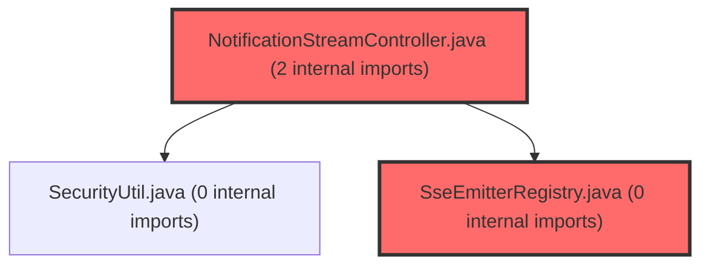

# 코드 리뷰 - d072e7d2

## 코드 복잡도 분석

**분석된 파일**: 37개 / 변경된 파일: 76개


### Import 의존관계 다이어그램



**범례**: 중심 파일 (변경됨) | 많은 import (10개 이상)


### 정상 범위 (NONE)


**`aiprompts.ts`** (other)

- 평균 복잡도: **0.235**

- 최대 복잡도: 0.477

- 청크 수: 98개

- 평균 사용처: 50.5곳


**권장사항:**

- 파일 크기가 큼 (98개 청크) - 파일 분리 검토


**`metaapplication.java`** (other)

- 평균 복잡도: **0.213**

- 최대 복잡도: 0.465

- 청크 수: 4개

- 평균 사용처: 9.8곳


**권장사항:**

- 복잡도 정상 범위


**`securityconfig.java`** (config)

- 평균 복잡도: **0.200**

- 최대 복잡도: 0.464

- 청크 수: 14개

- 평균 사용처: 22.4곳


**권장사항:**

- Config 파일은 높은 연결도가 정상적임


**`groupservice.java`** (other)

- 평균 복잡도: **0.160**

- 최대 복잡도: 0.471

- 청크 수: 6개

- 평균 사용처: 12.5곳


**권장사항:**

- 복잡도 정상 범위


**`routes.tsx`** (other)

- 평균 복잡도: **0.078**

- 최대 복잡도: 0.463

- 청크 수: 16개

- 평균 사용처: 3.5곳


**권장사항:**

- 복잡도 정상 범위


**`notificationstreamcontroller.java`** (other)

- 평균 복잡도: **0.011**

- 최대 복잡도: 0.011

- 청크 수: 1개


**권장사항:**

- 복잡도 정상 범위


**`groupinvitationservice.java`** (other)

- 평균 복잡도: **0.008**

- 최대 복잡도: 0.008

- 청크 수: 1개


**권장사항:**

- 복잡도 정상 범위


**`notificationtesterpagecontroller.java`** (component)

- 평균 복잡도: **0.007**

- 최대 복잡도: 0.008

- 청크 수: 2개


**권장사항:**

- 복잡도 정상 범위


**`notificationdto.java`** (other)

- 평균 복잡도: **0.007**

- 최대 복잡도: 0.010

- 청크 수: 2개


**권장사항:**

- 복잡도 정상 범위


**`groupinvitedevent.java`** (other)

- 평균 복잡도: **0.007**

- 최대 복잡도: 0.007

- 청크 수: 1개


**권장사항:**

- 복잡도 정상 범위


**`studentjoinedgroupevent.java`** (other)

- 평균 복잡도: **0.007**

- 최대 복잡도: 0.007

- 청크 수: 1개


**권장사항:**

- 복잡도 정상 범위


**`notificationeventhandler.java`** (other)

- 평균 복잡도: **0.007**

- 최대 복잡도: 0.008

- 청크 수: 4개


**권장사항:**

- 복잡도 정상 범위


**`notificationretentionscheduler.java`** (other)

- 평균 복잡도: **0.007**

- 최대 복잡도: 0.010

- 청크 수: 2개


**권장사항:**

- 복잡도 정상 범위


**`notificationmapper.xml`** (other)

- 평균 복잡도: **0.007**

- 최대 복잡도: 0.007

- 청크 수: 1개


**권장사항:**

- 복잡도 정상 범위


**`studentkickedevent.java`** (other)

- 평균 복잡도: **0.006**

- 최대 복잡도: 0.006

- 청크 수: 1개


**권장사항:**

- 복잡도 정상 범위


**`studentleftgroupevent.java`** (other)

- 평균 복잡도: **0.006**

- 최대 복잡도: 0.006

- 청크 수: 1개


**권장사항:**

- 복잡도 정상 범위


**`notificationshedlockconfig.java`** (config)

- 평균 복잡도: **0.006**

- 최대 복잡도: 0.008

- 청크 수: 2개


**권장사항:**

- Config 파일은 높은 연결도가 정상적임


**`notificationcategory.java`** (other)

- 평균 복잡도: **0.006**

- 최대 복잡도: 0.006

- 청크 수: 1개


**권장사항:**

- 복잡도 정상 범위


**`notificationheartbeatscheduler.java`** (other)

- 평균 복잡도: **0.005**

- 최대 복잡도: 0.006

- 청크 수: 2개


**권장사항:**

- 복잡도 정상 범위


**`notification.java`** (other)

- 평균 복잡도: **0.005**

- 최대 복잡도: 0.008

- 청크 수: 2개


**권장사항:**

- 복잡도 정상 범위


**`inmemorydispatcher.java`** (other)

- 평균 복잡도: **0.004**

- 최대 복잡도: 0.006

- 청크 수: 2개


**권장사항:**

- 복잡도 정상 범위


**`redispubsubdispatcher.java`** (other)

- 평균 복잡도: **0.004**

- 최대 복잡도: 0.005

- 청크 수: 2개


**권장사항:**

- 복잡도 정상 범위


**`redispubsubsubscriber.java`** (other)

- 평균 복잡도: **0.004**

- 최대 복잡도: 0.005

- 청크 수: 2개


**권장사항:**

- 복잡도 정상 범위


**`notificationlistresponse.java`** (other)

- 평균 복잡도: **0.004**

- 최대 복잡도: 0.004

- 청크 수: 1개


**권장사항:**

- 복잡도 정상 범위


**`notificationservice.java`** (other)

- 평균 복잡도: **0.004**

- 최대 복잡도: 0.008

- 청크 수: 8개


**권장사항:**

- 복잡도 정상 범위


**`notificationcontroller.java`** (other)

- 평균 복잡도: **0.003**

- 최대 복잡도: 0.004

- 청크 수: 4개


**권장사항:**

- 복잡도 정상 범위


**`notificationdebugcontroller.java`** (other)

- 평균 복잡도: **0.003**

- 최대 복잡도: 0.004

- 청크 수: 16개


**권장사항:**

- 복잡도 정상 범위


**`notificationredisconfig.java`** (config)

- 평균 복잡도: **0.003**

- 최대 복잡도: 0.004

- 청크 수: 3개


**권장사항:**

- Config 파일은 높은 연결도가 정상적임


**`redisdispatchmessage.java`** (other)

- 평균 복잡도: **0.003**

- 최대 복잡도: 0.003

- 청크 수: 1개


**권장사항:**

- 복잡도 정상 범위


**`sseemitterregistry.java`** (other)

- 평균 복잡도: **0.003**

- 최대 복잡도: 0.006

- 청크 수: 6개


**권장사항:**

- 복잡도 정상 범위


**`ssepocpage.tsx`** (component)

- 평균 복잡도: **0.003**

- 최대 복잡도: 0.012

- 청크 수: 6개


**권장사항:**

- 복잡도 정상 범위


**`usessepoc.ts`** (other)

- 평균 복잡도: **0.002**

- 최대 복잡도: 0.005

- 청크 수: 11개


**권장사항:**

- 복잡도 정상 범위


**`joingrouppage.tsx`** (component)

- 평균 복잡도: **0.001**

- 최대 복잡도: 0.016

- 청크 수: 77개


**권장사항:**

- 파일 크기가 큼 (77개 청크) - 파일 분리 검토


**`ssepocpanel.tsx`** (other)

- 평균 복잡도: **0.001**

- 최대 복잡도: 0.009

- 청크 수: 14개


**권장사항:**

- 복잡도 정상 범위


**`notificationdispatcher.java`** (other)

- 평균 복잡도: **0.000**

- 최대 복잡도: 0.000

- 청크 수: 1개


**권장사항:**

- 복잡도 정상 범위


**`notificationmapper.java`** (other)

- 평균 복잡도: **0.000**

- 최대 복잡도: 0.002

- 청크 수: 7개


**권장사항:**

- 복잡도 정상 범위


**`studentgroupspage.tsx`** (component)

- 평균 복잡도: **0.000**

- 최대 복잡도: 0.014

- 청크 수: 128개


**권장사항:**

- 파일 크기가 큼 (128개 청크) - 파일 분리 검토


---


## 변경 배경

이 커밋은 학심정(학습심리정서검사) 플랫폼에 실시간 알림(Notification) 기능을 도입하기 위한 설계 문서 및 기반 의존성 추가입니다. MVP는 검사/그룹 2개 카테고리의 교사/학생 알림 이벤트(T1~T6, S1~S6, C1)를 대상으로 하며, SSE 기반 실시간 전달, Redis Pub/Sub을 통한 다중 서버 메시지 공유, ShedLock을 통한 스케줄러 중복 방지 등의 기술 스택을 채택했습니다.

- **목적**: 알림 기능 설계 문서화 및 Redis/ShedLock 의존성 추가
- **도메인**: 설계 문서(Architecture/Design) + 인프라 의존성
- **변경 방향**: 기존에 전무했던 알림 기능의 전체 아키텍처를 문서화하고, Phase 2 구현을 위한 build.gradle 의존성 선행 추가

---

## [GOOD] 잘된 점

**설계 문서의 체계적 구성**
01-spec(기획)부터 10-roadmap(로드맵)까지 10개 문서로 분리하여 각 관심사를 명확히 구분했습니다. 신규 개발자가 온보딩할 때 전체 그림을 빠르게 파악할 수 있는 구조입니다. 특히 README.md에서 각 문서의 목적과 링크를 한눈에 제공하여 문서 간 네비게이션이 용이합니다.

**기술 결정 근거의 명확한 기록**
02-tech-decisions.md에서 SSE vs WebSocket vs 폴링, Redis Pub/Sub vs Kafka, ShedLock vs 수동 구현 등 각 선택지의 장단점과 선택 근거를 상세히 기록했습니다. 이는 향후 아키텍처 변경 시 의사결정 히스토리로 활용 가능한 중요한 자산입니다.

**오픈 이슈 사전 정리**
09-open-questions.md에서 기획/법무/유관팀 확인이 필요한 22개 항목을 Critical/High/Medium/Legal로 우선순위화하여 개발 전 블로킹 이슈를 투명하게 관리했습니다. 특히 Q17(닉네임 박제 법무 검토)과 Q18(90일 보관 법적 근거)은 개발 전 반드시 해결되어야 할 사항을 사전에 식별한 점이 돋보입니다.

**build.gradle 주석의 운영 고려**
Redis 의존성 추가 시 "토글 OFF 시 RedisAutoConfiguration 빈은 등록되지만 Lettuce가 lazy connect라 실제 Redis 미가용 환경에서도 startup 안 깨짐. 기동 회귀 확인 필수."라는 주석을 통해 운영 안정성을 고려한 실용적인 접근을 보였습니다.

---

## 변경사항 요약

- `backend/build.gradle`에 `spring-boot-starter-data-redis`, `shedlock-spring:4.46.0`, `shedlock-provider-jdbc-template:4.46.0` 3개 의존성 추가
- `backend/docs/notification/` 디렉토리 아래 10개의 설계 문서(README.md 포함 11개 파일) 신규 생성

---

## [ISSUE] 개선이 필요한 부분

### Critical (즉시 수정 필요)

없음

### High (우선 수정 권장)

**1. SSE 연결 수 대비 스레드 산정 및 대응 방안 구체화 필요**

02-tech-decisions.md에서 SSE 선택 시 트레이드오프로 "Tomcat blocking I/O 기반이라 연결 1000개 이상 시 스레드 한계 가능"을 언급하고 "Spring Boot 3 + Java 21 (Virtual Threads) 업그레이드 로드맵과 연계"라고만 기술했습니다.

문제는 MVP 시점에 동시 접속자 500명을 가정할 때, Tomcat 기본 max-threads(200)로는 SSE 연결 + 기존 API 요청을 동시에 처리하기 어렵다는 점입니다. 06-checklist-be.md의 application.yml 설정에서 `server.tomcat.threads.max: 500`으로 증가시키는 것만 명시되어 있으나, SSE 연결이 스레드를 점유하는 특성상 단순 max-threads 증가만으로는 근본적 해결이 어렵습니다. 또한 MVP 시점에 폴링 fallback을 지원한다고 했을 때, 폴링 요청까지 더해지면 스레드 고갈 위험이 더 커집니다.

**개선 제안**: MVP 시점의 구체적인 스레드 산정과 대응 방안을 문서에 추가할 것을 권장합니다. 예를 들어 SSE 전용 스레드 풀 분리(`TaskExecutor` 별도 설정), 동시 접속자 수 대비 필요한 스레드 수 계산(SSE 500 + API 100 = 600, max-threads=500이면 부족) 등을 문서화해야 합니다.

**2. ShedLock JDBC 방식과 Redis 인프라의 이중화 비용**

스케줄러 중복 방지를 위해 ShedLock을 JDBC(MySQL) 기반으로 선택했으나, 동시에 Redis 인프라를 별도로 구축하고 있습니다. Redis가 이미 도입되는 상황에서 ShedLock도 Redis 기반(`shedlock-provider-redis-spring`)을 사용하면 인프라를 통일할 수 있습니다. MySQL 기반 ShedLock은 별도의 `shedlock` 테이블 관리가 필요하고, Redis 장애와 MySQL 장애를 각각 대응해야 하는 이중 운영 부담이 발생합니다.

08-checklist-infra.md에서 "ShedLock이나 세션 캐시 같이 쓰면 AOF 필요"라고 언급하며 Redis Persistence 정책을 고민하는 것과 달리, ShedLock은 MySQL에 의존하므로 Redis Persistence 설정을 단순화할 기회를 놓쳤습니다.

**개선 제안**: Redis 기반 ShedLock(`shedlock-provider-redis-spring`)으로 전환을 검토하거나, MySQL 기반을 유지할 명확한 근거(예: "Redis 장애 시에도 스케줄러가 동작해야 함")를 문서에 추가할 것을 권장합니다.

### Medium (개선 권장)

**3. SSE 재연결 시 Last-Event-ID 기반 복구 로직의 구체화 필요**

04-api.md에서 "Last-Event-ID 헤더로 놓친 이벤트 복구 (서버가 해당 ID 이후 DB 조회해서 push)"라고만 기술되어 있습니다. SSE 연결이 끊어졌다가 재연결될 때, 서버가 Last-Event-ID 이후의 알림을 DB에서 조회하여 누락분을 보내주는 로직은 구현 복잡도가 높습니다. 특히 재연결 시점에 이미 읽음 처리된 알림까지 다시 push할지, 미확인 알림만 push할지 등의 정책이 문서에 명시되지 않았습니다. 또한 `SseEmitter` 타임아웃(1시간) 이후 재연결 시에는 DB 조회 범위가 1시간 이상이 될 수 있어 성능 이슈 가능성도 있습니다.

**개선 제안**: 재연결 복구의 구체적인 정책(Last-Event-ID 이후 모든 알림 push vs 미확인 알림만 push, DB 조회 시 limit 설정, 타임아웃 초과 시 fallback 정책)을 문서화할 것을 권장합니다.

**4. `notification` 테이블 `created_at` 인덱스의 선택도 문제**

03-data-model.md에서 `INDEX idx_retention (created_at)`을 90일 삭제 배치용으로 정의했습니다. `created_at` 단일 컬럼 인덱스는 90일 삭제 배치(`DELETE FROM notification WHERE created_at < NOW() - INTERVAL 90 DAY`)에는 적합하지만, `idx_user_created (user_no, created_at DESC)`와 중복되는 부분이 있습니다. 225만 row 중 90일 초과분이 약 25만 row라면, 인덱스가 있어도 25만 건의 레코드를 식별하고 삭제해야 합니다.

**개선 제안**: 배치 DELETE 시 `LIMIT 1000`과 같은 청크 단위 삭제를 권장하는 내용을 05-events.md 또는 06-checklist-be.md의 스케줄러 섹션에 추가할 것을 권장합니다.

**5. build.gradle ShedLock 버전 고정의 장기 관리 리스크**

`backend/build.gradle` 라인 109-110에서 `shedlock-spring:4.46.0`, `shedlock-provider-jdbc-template:4.46.0` 버전이 하드코딩되어 있습니다. ShedLock 버전을 하드코딩하면 의존성 업데이트 시 수동 관리가 필요합니다. 프로젝트에 이미 Spring Boot BOM이 적용되어 있다면, ShedLock도 BOM 스타일로 관리하거나 `gradle.properties`에 버전을 분리하는 것이 유지보수에 유리합니다.

**개선 제안**: 프로젝트의 의존성 버전 관리 방식을 확인하고, 일관된 방식으로 통일할 것을 권장합니다. 예를 들어 `gradle.properties`에 `shedlockVersion=4.46.0`을 정의하고 `implementation "net.javacrumbs.shedlock:shedlock-spring:${shedlockVersion}"` 형태로 사용하는 것을 검토하세요.

---

## 주요 파일 분석

### `backend/build.gradle` (라인 106-110)

**변경 내용:** Redis, ShedLock 3개 의존성 추가

**개선 제안:**
1. ShedLock 버전을 프로젝트의 일관된 버전 관리 방식에 맞출 것 (Medium #5 참조)
   - **위치**: 라인 109-110
   - **기존 코드**:
   ```
   implementation 'net.javacrumbs.shedlock:shedlock-spring:4.46.0'
   implementation 'net.javacrumbs.shedlock:shedlock-provider-jdbc-template:4.46.0'
   ```
   - **해결 방안**: 프로젝트 컨벤션 확인 후 버전 관리 방식 통일

### `backend/docs/notification/` (전체 문서 세트)

**변경 내용:** 10개 설계 문서 신규 생성

**개선 제안:**
1. SSE 연결 수 대비 스레드 산정 및 대응 방안 문서화 (High #1)
2. ShedLock 저장소 선택 근거 문서화 (High #2)
3. SSE 재연결 복구 정책 구체화 (Medium #3)
4. 배치 DELETE 청크 처리 권장 사항 추가 (Medium #4)

---

## 최종 평가

**결론**: [WARN] **조건부 승인 (Approved with Comments)**

**종합 의견:**

이 커밋은 설계 문서와 의존성 추가가 주를 이루므로, 코드 레벨의 버그나 보안 이슈는 존재하지 않습니다. 문서의 체계성과 기술 결정 근거의 명확성은 매우 높은 수준이며, 특히 09-open-questions.md에서 개발 전 확인이 필요한 사항을 사전에 정리한 점이 돋보입니다.

다만 SSE 연결 수 대비 스레드 산정, ShedLock 저장소 선택 근거, 재연결 복구 정책 등 일부 기술적 결정의 구체성과 일관성을 보강하면 더 완성도 높은 설계가 될 것입니다. High 이슈는 존재하지 않으므로 조건부 승인합니다. 위에서 제안한 Medium 수준의 개선 사항들은 Phase 2 구현 전에 반영하면 좋겠습니다.