> [!IMPORTANT]
> **⚠️ 수동 검토 권장 (자가힐링 주의)**
>
> AI 자가힐링 결과물이 실제 의도와 다를 수 있으므로, **상세 리뷰 내용에 기반한 수동 점검**을 우선해 주시기 바랍니다. 자가힐링 기능을 활용하실 경우 최종 결과물을 신중하게 확인해 주세요.

# 코드 리뷰 - d228882e

## 코드 복잡도 분석

**분석된 파일**: 47개 / 변경된 파일: 54개


### Import 의존관계 다이어그램

```mermaid
flowchart TD
    F0["ReportDetail.tsx (2 internal imports)"]:::center
    F1["queryKeys.ts (0 internal imports)"]:::center
    F2["queries.ts (4 internal imports)"]:::center
    F3["buildDeployActivityBody.ts (3 internal imports)"]:::center
    F4["PageContent.tsx (2 internal imports)"]:::center
    F5["DeployPage.tsx (2 internal imports)"]:::center
    F6["StatusPanel.tsx (0 internal imports)"]:::center
    F7["cmsSetService.ts (0 internal imports)"]:::center
    F8["lmsActivityService.ts (0 internal imports)"]:::center
    F9["ReportSummary.tsx (1 internal import)"]:::center
    F10["ResponseGrid.tsx (1 internal import)"]:::center
    F11["StudentDetailReport.tsx (1 internal import)"]:::center
    F12["resolveAssigneeNamesFromGroups.ts (0 internal imports)"]:::center
    F13["ReportCardList.tsx (1 internal import)"]:::center
    F14["ReportBadge.tsx (0 internal imports)"]:::center
    F15["PageList.tsx (1 internal import)"]:::center
    F16["classIdOptions.ts (0 internal imports)"]:::center
    F17["LessonResultContents.tsx (2 internal imports)"]:::center
    F18["StudentTab.tsx (2 internal imports)"]:::center
    F19["ReportCard.tsx (1 internal import)"]:::center
    F2 --> F1
    F2 --> F7
    F2 --> F16
    F2 --> F12
    F3 --> F7
    F3 --> F16
    F3 --> F8
    F5 --> F2
    F5 --> F3
    F17 --> F6
    F17 --> F13
    F4 --> F10
    F4 --> F14
    F15 --> F14
    F19 --> F14
    F13 --> F19
    F0 --> F9
    F0 --> F18
    F9 --> F14
    F10 --> F14
    F18 --> F10
    F18 --> F14
    F11 --> F14
    classDef center fill:#ff6b6b,stroke:#333,stroke-width:3px
    classDef high fill:#ffd93d,stroke:#333,stroke-width:2px
```



**범례**: 중심 파일 (변경됨) | 많은 import (10개 이상)


### 정상 범위 (NONE)


**`dgnssmapper.xml`** (other)

- 평균 복잡도: **0.242**

- 최대 복잡도: 0.473

- 청크 수: 2개

- 평균 사용처: 7.0곳


**권장사항:**

- 복잡도 정상 범위


**`dgnssmapper.java`** (other)

- 평균 복잡도: **0.188**

- 최대 복잡도: 0.466

- 청크 수: 198개

- 평균 사용처: 28.0곳


**권장사항:**

- 파일 크기가 큼 (198개 청크) - 파일 분리 검토


**`dgnssservice.java`** (other)

- 평균 복잡도: **0.111**

- 최대 복잡도: 0.473

- 청크 수: 69개

- 평균 사용처: 12.8곳


**권장사항:**

- 파일 크기가 큼 (69개 청크) - 파일 분리 검토


**`apiresponseaspect.java`** (other)

- 평균 복잡도: **0.097**

- 최대 복잡도: 0.467

- 청크 수: 5개

- 평균 사용처: 11.8곳


**권장사항:**

- 복잡도 정상 범위


**`coachingresponse.java`** (other)

- 평균 복잡도: **0.012**

- 최대 복잡도: 0.012

- 청크 수: 1개


**권장사항:**

- 복잡도 정상 범위


**`studentlearningstatusresponse.java`** (other)

- 평균 복잡도: **0.008**

- 최대 복잡도: 0.008

- 청크 수: 1개


**권장사항:**

- 복잡도 정상 범위


**`dgnssstudentcontroller.java`** (other)

- 평균 복잡도: **0.007**

- 최대 복잡도: 0.008

- 청크 수: 2개


**권장사항:**

- 복잡도 정상 범위


**`tcsubmissionsresponse.java`** (other)

- 평균 복잡도: **0.007**

- 최대 복잡도: 0.007

- 청크 수: 1개


**권장사항:**

- 복잡도 정상 범위


**`schoolcoachingservice.java`** (other)

- 평균 복잡도: **0.006**

- 최대 복잡도: 0.006

- 청크 수: 1개


**권장사항:**

- 복잡도 정상 범위


**`dgnssteachercontroller.java`** (other)

- 평균 복잡도: **0.006**

- 최대 복잡도: 0.008

- 청크 수: 9개


**권장사항:**

- 복잡도 정상 범위


**`reminderresult.java`** (other)

- 평균 복잡도: **0.006**

- 최대 복잡도: 0.006

- 청크 수: 1개


**권장사항:**

- 복잡도 정상 범위


**`resolveassigneenamesfromgroups.ts`** (other)

- 평균 복잡도: **0.006**

- 최대 복잡도: 0.010

- 청크 수: 5개


**권장사항:**

- 복잡도 정상 범위


**`dgnssgraphservice.java`** (other)

- 평균 복잡도: **0.005**

- 최대 복잡도: 0.008

- 청크 수: 8개


**권장사항:**

- 복잡도 정상 범위


**`dgnssgraphcontroller.java`** (other)

- 평균 복잡도: **0.004**

- 최대 복잡도: 0.004

- 청크 수: 2개


**권장사항:**

- 복잡도 정상 범위


**`paperpermissionresponse.java`** (other)

- 평균 복잡도: **0.004**

- 최대 복잡도: 0.004

- 청크 수: 1개


**권장사항:**

- 복잡도 정상 범위


**`paperpermissionservice.java`** (other)

- 평균 복잡도: **0.004**

- 최대 복잡도: 0.004

- 청크 수: 2개


**권장사항:**

- 복잡도 정상 범위


**`cmssetservice.ts`** (other)

- 평균 복잡도: **0.004**

- 최대 복잡도: 0.010

- 청크 수: 12개


**권장사항:**

- 복잡도 정상 범위


**`lmsactivityservice.ts`** (other)

- 평균 복잡도: **0.003**

- 최대 복잡도: 0.007

- 청크 수: 71개


**권장사항:**

- 파일 크기가 큼 (71개 청크) - 파일 분리 검토


**`queries.ts`** (other)

- 평균 복잡도: **0.003**

- 최대 복잡도: 0.012

- 청크 수: 95개


**권장사항:**

- 파일 크기가 큼 (95개 청크) - 파일 분리 검토


**`gnbconfig.ts`** (config)

- 평균 복잡도: **0.003**

- 최대 복잡도: 0.013

- 청크 수: 9개


**권장사항:**

- Config 파일은 높은 연결도가 정상적임


**`index.ts`** (other)

- 평균 복잡도: **0.002**

- 최대 복잡도: 0.011

- 청크 수: 36개


**권장사항:**

- 파일 크기가 큼 (36개 청크) - 파일 분리 검토


**`classidoptions.ts`** (other)

- 평균 복잡도: **0.002**

- 최대 복잡도: 0.004

- 청크 수: 13개


**권장사항:**

- 복잡도 정상 범위


**`mapreportdetail.ts`** (other)

- 평균 복잡도: **0.002**

- 최대 복잡도: 0.007

- 청크 수: 24개


**권장사항:**

- 파일 크기가 큼 (24개 청크) - 파일 분리 검토


**`index.ts`** (other)

- 평균 복잡도: **0.002**

- 최대 복잡도: 0.004

- 청크 수: 4개


**권장사항:**

- 복잡도 정상 범위


**`examreminderservice.java`** (other)

- 평균 복잡도: **0.001**

- 최대 복잡도: 0.001

- 청크 수: 1개


**권장사항:**

- 복잡도 정상 범위


**`builddeployactivitybody.ts`** (other)

- 평균 복잡도: **0.001**

- 최대 복잡도: 0.004

- 청크 수: 12개


**권장사항:**

- 복잡도 정상 범위


**`lessonmypage.tsx`** (component)

- 평균 복잡도: **0.001**

- 최대 복잡도: 0.006

- 청크 수: 17개


**권장사항:**

- 복잡도 정상 범위


**`lessonreportdetailpage.tsx`** (component)

- 평균 복잡도: **0.001**

- 최대 복잡도: 0.004

- 청크 수: 6개


**권장사항:**

- 복잡도 정상 범위


**`lessonresultpage.tsx`** (component)

- 평균 복잡도: **0.001**

- 최대 복잡도: 0.006

- 청크 수: 14개


**권장사항:**

- 복잡도 정상 범위


**`lessonmycontents.tsx`** (utility)

- 평균 복잡도: **0.001**

- 최대 복잡도: 0.004

- 청크 수: 13개


**권장사항:**

- 복잡도 정상 범위


**`pagelist.tsx`** (component)

- 평균 복잡도: **0.001**

- 최대 복잡도: 0.012

- 청크 수: 33개


**권장사항:**

- 파일 크기가 큼 (33개 청크) - 파일 분리 검토


**`reportbadge.tsx`** (other)

- 평균 복잡도: **0.001**

- 최대 복잡도: 0.003

- 청크 수: 33개


**권장사항:**

- 파일 크기가 큼 (33개 청크) - 파일 분리 검토


**`querykeys.ts`** (other)

- 평균 복잡도: **0.000**

- 최대 복잡도: 0.001

- 청크 수: 18개


**권장사항:**

- 복잡도 정상 범위


**`deploypage.tsx`** (component)

- 평균 복잡도: **0.000**

- 최대 복잡도: 0.005

- 청크 수: 177개


**권장사항:**

- 파일 크기가 큼 (177개 청크) - 파일 분리 검토


**`scopetree.tsx`** (other)

- 평균 복잡도: **0.000**

- 최대 복잡도: 0.006

- 청크 수: 68개


**권장사항:**

- 파일 크기가 큼 (68개 청크) - 파일 분리 검토


**`index.ts`** (utility)

- 평균 복잡도: **0.000**

- 최대 복잡도: 0.000

- 청크 수: 2개


**권장사항:**

- 복잡도 정상 범위


**`lessonresultcontents.tsx`** (other)

- 평균 복잡도: **0.000**

- 최대 복잡도: 0.002

- 청크 수: 30개


**권장사항:**

- 파일 크기가 큼 (30개 청크) - 파일 분리 검토


**`pagecontent.tsx`** (component)

- 평균 복잡도: **0.000**

- 최대 복잡도: 0.005

- 청크 수: 32개


**권장사항:**

- 파일 크기가 큼 (32개 청크) - 파일 분리 검토


**`reportcard.tsx`** (other)

- 평균 복잡도: **0.000**

- 최대 복잡도: 0.004

- 청크 수: 44개


**권장사항:**

- 파일 크기가 큼 (44개 청크) - 파일 분리 검토


**`reportcardlist.tsx`** (other)

- 평균 복잡도: **0.000**

- 최대 복잡도: 0.006

- 청크 수: 34개


**권장사항:**

- 파일 크기가 큼 (34개 청크) - 파일 분리 검토


**`reportdetail.tsx`** (other)

- 평균 복잡도: **0.000**

- 최대 복잡도: 0.003

- 청크 수: 26개


**권장사항:**

- 파일 크기가 큼 (26개 청크) - 파일 분리 검토


**`reportsummary.tsx`** (other)

- 평균 복잡도: **0.000**

- 최대 복잡도: 0.004

- 청크 수: 49개


**권장사항:**

- 파일 크기가 큼 (49개 청크) - 파일 분리 검토


**`responsegrid.tsx`** (other)

- 평균 복잡도: **0.000**

- 최대 복잡도: 0.004

- 청크 수: 40개


**권장사항:**

- 파일 크기가 큼 (40개 청크) - 파일 분리 검토


**`statuspanel.tsx`** (other)

- 평균 복잡도: **0.000**

- 최대 복잡도: 0.002

- 청크 수: 52개


**권장사항:**

- 파일 크기가 큼 (52개 청크) - 파일 분리 검토


**`studenttab.tsx`** (other)

- 평균 복잡도: **0.000**

- 최대 복잡도: 0.008

- 청크 수: 85개


**권장사항:**

- 파일 크기가 큼 (85개 청크) - 파일 분리 검토


**`index.ts`** (other)

- 평균 복잡도: **0.000**

- 최대 복잡도: 0.000

- 청크 수: 7개


**권장사항:**

- 복잡도 정상 범위


**`studentdetailreport.tsx`** (other)

- 평균 복잡도: **0.000**

- 최대 복잡도: 0.008

- 청크 수: 71개


**권장사항:**

- 파일 크기가 큼 (71개 청크) - 파일 분리 검토


---


## 변경 배경
이 커밋은 학습심리검사(dgnss) 도메인의 **컨트롤러 책임 분리**와 **개인화 코칭 v2 응답의 타입 안전성 강화**를 목적으로 합니다. 기존의 단일 `DgnssController`가 교사/학생/그래프 운영 API를 모두 담당하던 것을 `DgnssTeacherController`, `DgnssStudentController`, `DgnssGraphController` 3개로 분리하여 관심사를 명확히 구분했습니다. 동시에 `SchoolCoachingService`의 반환 타입을 `Map<String, Object>`에서 타입 안전한 `CoachingResponse` record로 전환하여 API 계약을 명시화했습니다.

- **목적**: 컨트롤러 단일 책임 원칙(SRP) 준수 및 코칭 응답 DTO의 타입 안전성 확보
- **도메인**: API (백엔드 REST 컨트롤러 구조 개선)
- **변경 방향**: 단일 대형 컨트롤러 → 역할별 분리, 비정형 Map 응답 → 정형 record DTO

## [GOOD] 잘된 점
- **컨트롤러 분리가 명확함**: 교사(`/tc/*`), 학생(`/st/*`), 그래프/운영(`/graph/*`, `/lpa/*`) 엔드포인트가 각 컨트롤러로 정확히 분리되어 유지보수성이 크게 향상되었습니다. 각 컨트롤러의 클래스 주석에 역할과 다른 컨트롤러와의 관계가 명시되어 있어 진입 장벽이 낮습니다.
- **record 도입으로 API 계약이 명확해짐**: `CoachingResponse` record는 응답 구조(강점 카드 최대 2개, 코칭 카드 1개)를 컴파일 타임에 강제하여 FE 핸드오프 문서와의 불일치를 사전에 방지합니다. `MapUtils.getString` 기본값 처리로 null 안전성도 유지했습니다.
- **문서 동기화**: `paper-permission-fe-guide.md`에서 `tc/overview` 제거를 반영하고, `README.md`의 API 목록도 함께 갱신하여 FE 핸드오프 문서가 실제 구현과 일치하도록 관리했습니다.

## 변경사항 요약
1. `DgnssController` → `DgnssTeacherController`로 rename하고, 학생/그래프 API를 각각 `DgnssStudentController`, `DgnssGraphController`로 분리
2. `SchoolCoachingService`의 반환 타입을 `Map<String, Object>` → `CoachingResponse` record로 전환
3. FE 핸드오프 문서에서 `tc/overview` API 제거 및 관련 설명 갱신

---

## [ISSUE] 개선이 필요한 부분

### Critical (즉시 수정 필요)
없음

### High (우선 수정 권장)

**1. `tc/overview` 엔드포인트가 완전히 제거됨 — FE 연동 시 404 발생 가능**

Diff에서 `GET /api/dgnss/tc/overview`가 삭제되었고, `DgnssTeacherController`의 `@RequestMapping`에서도 `/api/dgnss/tc/overview` 경로가 제거되었습니다. 문서에서도 `tc/overview` 관련 내용이 삭제되었지만, 이 API가 **기존에 배포되어 FE에서 사용 중이었다면** 이번 커밋으로 인해 해당 기능이 갑자기 사라지게 됩니다.

- **위치**: `DgnssTeacherController.java` — `tchMetaOverview` 메서드 삭제
- **기존 코드**:
```java
@RequestMapping(value = "/api/dgnss/tc/overview", method = {RequestMethod.GET})
public ResponseDTO<CustomBody> tchMetaOverview(...) { ... }
```
- **해결 방안**: 이 API가 더 이상 필요 없다는 것이 명확히 확인된 경우에만 제거가 타당합니다. 만약 FE에서 아직 사용 중이라면, 최소한 **deprecation 경고와 함께 유지**하거나, FE 배포와 동시에 제거하는 **단계적(phased) 전환**이 필요합니다. 이 커밋의 문서 변경(`paper-permission-fe-guide.md`에서 `tc/overview` 제거)은 의도적인 변경으로 보이지만, **FE와의 배포 동기화 여부를 반드시 확인**해야 합니다.

**2. `tc/text/save`, `tc/class-factor-avg`, `st/answer/random`, `mail/test` 엔드포인트가 어디로 이동했는지 불명확**

Diff에서 다음 엔드포인트들이 `DgnssTeacherController`에서 삭제되었습니다:
- `POST /api/dgnss/tc/text/save` (텍스트 저장)
- `GET /api/dgnss/tc/class-factor-avg` (학급별 요인 평균)
- `POST /api/dgnss/st/answer/random` (답안 무작위 입력)
- `POST /api/dgnss/mail/test` (메일 발송 테스트)

`DgnssStudentController`와 `DgnssGraphController`의 신규 파일 내용을 확인한 결과, `st/answer/random`은 `DgnssStudentController`에 **포함되어 있지 않습니다** (신규 파일에는 `st/answer`만 존재). `tc/text/save`, `tc/class-factor-avg`, `mail/test`도 새 컨트롤러에서 발견되지 않았습니다.

- **위치**: `DgnssTeacherController.java` — 삭제된 메서드들
- **해결 방안**: 이 엔드포인트들이 **의도적으로 제거된 것인지, 아니면 다른 컨트롤러로 이동했는지** 확인이 필요합니다. 만약 의도적 제거라면 커밋 메시지나 문서에 그 사유가 명시되어야 합니다. 이동했다면 해당 컨트롤러에서 경로가 올바르게 매핑되었는지 확인하세요. 특히 `st/answer/random`은 개발/테스트용으로 보이므로, 제거 시 테스트 전략에 영향이 없는지 점검이 필요합니다.

### Medium (개선 권장)

**1. `DgnssGraphController`의 `loadLpaGraph`/`loadCoachingV2`가 `@RequestParam Map`을 사용하지만 실제로 파라미터를 사용하지 않음**

- **위치**: `DgnssGraphController.java` 라인 57, 72
- **기존 코드**:
```java
public ResponseDTO<CustomBody> loadLpaGraph(
        @Parameter(hidden = true) @RequestParam Map<String, Object> paramData
) throws Exception {
    Map<String, Object> result = dgnssGraphService.loadLpaGraph();
    return AidtCommonUtil.makeResultSuccess(paramData, result, "LPA 그래프 적재 완료");
}
```
- **해결 방안**: `paramData`가 응답 생성에만 사용되고 요청 처리에는 사용되지 않습니다. `AidtCommonUtil.makeResultSuccess`의 시그니처가 `paramData`를 요구한다면 유지가 불가피하지만, 그렇지 않다면 `new HashMap<>()`로 대체하여 불필요한 파라미터 바인딩을 제거할 수 있습니다. 다만 이는 프로젝트 전반의 응답 유틸 패턴과 일관성을 유지하는 것이 우선이므로, **기존 컨벤션을 따르는 것이 더 적절할 수 있습니다**.

**2. `CoachingResponse` record의 중첩 record가 많아 가독성 저하 가능성**

- **위치**: `CoachingResponse.java` 전체
- **해결 방안**: `StrengthCard`, `CoachingCard`, `Coaching1`, `Coaching2`가 모두 하나의 파일에 중첩되어 있습니다. 파일이 28줄로 짧아 현재는 문제가 없지만, 향후 필드가 추가되면 별도 파일로 분리하는 것을 고려하세요. 현재 구조는 응답 계약을 한눈에 파악할 수 있다는 장점이 있어 **현재 상태를 유지해도 무방**합니다.

**3. `DgnssStudentController.stMetaNew`의 `dgnssResultId` 파라미터가 메서드에서 사용되지 않음**

- **위치**: `DgnssStudentController.java` 라인 63
- **기존 코드**:
```java
public ResponseDTO<CustomBody> stMetaNew(
        @RequestParam(name = "dgnssResultId", required = false) int dgnssResultId,
        @RequestParam(name = "paperIdx", required = false, defaultValue = "0") int paperIdx,
        ...
) throws Exception {
    Map<String, Object> resultMap = dgnssService.selectNewOmr(paramData, pageable);
```
- **해결 방안**: `dgnssResultId`와 `paperIdx`가 메서드 시그니처에 선언되어 있지만 실제로는 `paramData`에 포함되어 서비스로 전달됩니다. 이는 Swagger 문서화를 위한 의도적인 패턴으로 보이므로, **현재 방식을 유지**하되 `@Parameter(hidden = true)`를 추가하여 중복 문서화를 방지할 수 있습니다.

---

## 주요 파일 분석

### DgnssTeacherController.java (rename + 대규모 삭제)
**변경 내용:**
`DgnssController`에서 `DgnssTeacherController`로 rename하고, 학생/그래프/운영 API를 모두 제거하여 교사 전용 컨트롤러로 전환.

**개선 제안:**
1. 삭제된 엔드포인트(`tc/overview`, `tc/text/save`, `tc/class-factor-avg`, `st/answer/random`, `mail/test`)의 **이관 여부와 FE 영향 범위를 명확히 문서화**할 것
   - **위치**: 파일 전체
   - **기존 코드**: 삭제된 메서드들
   - **해결 방안**: 커밋 메시지나 PR 설명에 "제거된 API 목록과 대체 API"를 명시하고, FE 팀과 배포 동기화 일정을 조율하세요.

### DgnssStudentController.java (신규)
**변경 내용:**
학생 응시/결과 조회 API를 별도 컨트롤러로 분리. `st/new`, `st/submit`, `st/analysis`, `st/answer`, `st/info`, `st/start`, `st/resume` 포함.

**개선 제안:**
1. `stMetaNew`의 `dgnssResultId`/`paperIdx` 파라미터가 메서드에서 직접 사용되지 않음
   - **위치**: 라인 63-65
   - **기존 코드**:
```java
public ResponseDTO<CustomBody> stMetaNew(
        @RequestParam(name = "dgnssResultId", required = false) int dgnssResultId,
        @RequestParam(name = "paperIdx", required = false, defaultValue = "0") int paperIdx,
```
   - **해결 방안**: Swagger 문서화 목적이라면 `@Parameter(hidden = true)`를 추가하거나, `paramData`에서 직접 추출하는 방식으로 통일하세요. 현재는 파라미터가 선언만 되고 사용되지 않아 IDE에서 경고가 발생할 수 있습니다.

### DgnssGraphController.java (신규)
**변경 내용:**
Neo4j 그래프 적재 및 LPA 재분류 등 운영/관리용 API를 별도 컨트롤러로 분리.

**개선 제안:**
1. `loadLpaGraph`/`loadCoachingV2`의 `@RequestParam Map` 파라미터가 실제로 사용되지 않음
   - **위치**: 라인 57, 72
   - **기존 코드**:
```java
public ResponseDTO<CustomBody> loadLpaGraph(
        @Parameter(hidden = true) @RequestParam Map<String, Object> paramData
) throws Exception {
```
   - **해결 방안**: `AidtCommonUtil.makeResultSuccess`의 시그니처를 확인하여 `paramData`가 필수인지 검토하세요. 필수가 아니라면 `new HashMap<>()`로 대체할 수 있습니다.

### SchoolCoachingService.java (리팩토링)
**변경 내용:**
`Map<String, Object>` 반환을 `CoachingResponse` record로 전환. `LinkedHashMap` 수동 조립을 제거하고 생성자 기반으로 단순화.

**개선 제안:**
1. `@SuppressWarnings("unchecked")`가 여전히 필요 — `selection.get("strengthFactors")`의 unchecked cast
   - **위치**: 라인 34
   - **기존 코드**:
```java
List<String> strengthFactors = (List<String>) selection.getOrDefault("strengthFactors", new ArrayList<String>());
```
   - **해결 방안**: `DgnssGraphService.selectCoachingSelectionByAnswerIdx`가 `Map<String, Object>`를 반환하는 한 불가피합니다. 장기적으로는 `DgnssGraphService`도 타입 안전한 DTO를 반환하도록 개선하는 것을 고려하세요.

### CoachingResponse.java (신규)
**변경 내용:**
코칭 v2 응답 구조를 정의한 record. 중첩 record로 강점 카드/코칭 카드 구조를 명시.

**개선 제안:**
1. `CoachingCard`의 `coaching1`/`coaching2`가 null 허용인지 명시 필요
   - **위치**: 라인 17-25
   - **기존 코드**:
```java
public record CoachingCard(
        String zFactor, String xFactor, String yFactor, String pathType,
        String interpretation,
        Coaching1 coaching1,
        Coaching2 coaching2
) {}
```
   - **해결 방안**: `buildCoachingCard`에서 `coaching1`/`coaching2`가 항상 생성되므로 현재는 null이 될 수 없지만, `selectModerationText`의 결과에 따라 `coaching1Method` 등이 null일 수 있습니다. `@Nullable` 애노테이션을 추가하거나, record 필드에 대한 null 허용 여부를 Javadoc에 명시하면 FE 개발자에게 더 명확한 계약을 제공할 수 있습니다.

---

## 최종 평가

**결론**: 
- [ ] [OK] **승인 (Approved)** - Critical/High 이슈 없음
- [x] [WARN] **조건부 승인 (Approved with Comments)** - Medium 이하 이슈만 존재
- [ ] [FIX] **수정 필요 (Changes Requested)** - Critical/High 이슈 존재

**종합 의견:**
컨트롤러 분리와 record 도입은 명확한 개선 방향이며, 코드 품질이 전반적으로 우수합니다. 다만 **`tc/overview`를 포함한 여러 엔드포인트가 삭제되었는데, 이들이 FE에서 사용 중인지, 그리고 `tc/text/save`, `tc/class-factor-avg`, `st/answer/random`, `mail/test`가 다른 곳으로 이관되었는지**에 대한 확인이 필요합니다. 이 부분이 명확해지면 바로 승인할 수 있는 수준의 커밋입니다. FE 배포와의 동기화만 확인해 주시기 바랍니다.