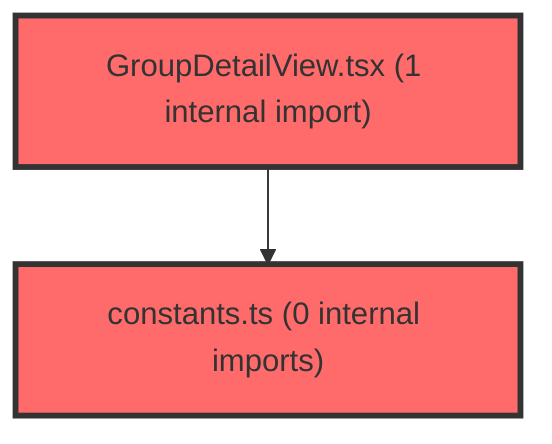

> [!IMPORTANT]
> **⚠️ 수동 검토 권장 (자가힐링 주의)**
>
> AI 자가힐링 결과물이 실제 의도와 다를 수 있으므로, **상세 리뷰 내용에 기반한 수동 점검**을 우선해 주시기 바랍니다. 자가힐링 기능을 활용하실 경우 최종 결과물을 신중하게 확인해 주세요.

# 코드 리뷰 - d4eb0fd1

## 코드 복잡도 분석

**분석된 파일**: 5개 / 변경된 파일: 7개


### Import 의존관계 다이어그램



**범례**: 중심 파일 (변경됨) | 많은 import (10개 이상)


### 정상 범위 (NONE)


**`env.ts`** (config)

- 평균 복잡도: **0.008**

- 최대 복잡도: 0.008

- 청크 수: 1개


**권장사항:**

- Config 파일은 높은 연결도가 정상적임


**`constants.ts`** (other)

- 평균 복잡도: **0.001**

- 최대 복잡도: 0.002

- 청크 수: 7개


**권장사항:**

- 복잡도 정상 범위


**`groupdetailview.tsx`** (component)

- 평균 복잡도: **0.001**

- 최대 복잡도: 0.007

- 청크 수: 25개


**권장사항:**

- 파일 크기가 큼 (25개 청크) - 파일 분리 검토


**`generalsection.tsx`** (other)

- 평균 복잡도: **0.000**

- 최대 복잡도: 0.000

- 청크 수: 36개


**권장사항:**

- 파일 크기가 큼 (36개 청크) - 파일 분리 검토


**`mainlayout.tsx`** (other)

- 평균 복잡도: **0.000**

- 최대 복잡도: 0.008

- 청크 수: 136개


**권장사항:**

- 파일 크기가 큼 (136개 청크) - 파일 분리 검토


---


## 변경 배경

이 커밋은 학습종합검사 및 자기조절학습검사 시스템의 운영 환경 대응을 위한 설정 변경입니다. 기존에 하드코딩된 빈 문자열로 남아있던 교사용 설명서 PDF URL을 환경변수로 전환하고, 운영 환경에서 자기조절학습검사를 숨길 수 있는 기능 플래그를 도입했습니다.

- **목적**: 자기조절학습검사 운영 환경 숨김 처리, 교사용 설명서 PDF URL 환경변수화
- **도메인**: 비즈니스 로직 / UI / 인프라 설정
- **변경 방향**: 하드코딩된 값과 TODO 항목을 환경변수 기반 동적 설정으로 전환하여 환경별 대응 가능

---

## [GOOD] 잘된 점

**1. 환경변수 중앙화 패턴 유지**

`frontend/src/shared/config/env.ts`에 새로운 환경변수를 추가하고, 각 컴포넌트에서는 `ENV` 객체를 통해 참조하는 패턴이 일관성 있게 유지되었습니다. 이는 향후 환경변수 추가/변경 시 한 곳만 수정하면 되는 유지보수성을 확보합니다.

```typescript
// env.ts - 중앙 집중식 환경변수 관리
SELFREG_HIDDEN: import.meta.env.VITE_SELFREG_HIDDEN === 'true',
MANUAL_URL_COMPREHENSIVE: (import.meta.env.VITE_MANUAL_URL_COMPREHENSIVE as string | undefined) ?? '',
MANUAL_URL_SELF_REGULATED: (import.meta.env.VITE_MANUAL_URL_SELF_REGULATED as string | undefined) ?? '',
```

**2. 기능 플래그의 효율적 활용**

`VITE_SELFREG_HIDDEN` 환경변수 하나로 네비게이션 메뉴(`MainLayout.tsx`)와 검사 슬롯 표시(`constants.ts`)를 동시에 제어합니다. 중복된 조건문 없이 단일 진실 공급원(Single Source of Truth)을 유지한 점이 좋습니다.

**3. 기술 부채 해소**

`GeneralSection.tsx`에 남아있던 `// TODO: URL 확정 후 채워넣기` 주석을 실제 구현으로 대체했습니다. TODO를 방치하지 않고 실제 커밋으로 해결한 점이 긍정적입니다.

---

## 변경사항 요약

| 파일 | 변경 내용 |
|------|----------|
| `.env.development`, `.env.production` | 교사용 설명서 PDF URL 2종, 자기조절학습검사 숨김 플래그 추가 |
| `env.ts` | `SELFREG_HIDDEN`, `MANUAL_URL_COMPREHENSIVE`, `MANUAL_URL_SELF_REGULATED` 정의 |
| `constants.ts` | 자기조절학습검사 슬롯 `isComingSoon`을 `ENV.SELFREG_HIDDEN`으로 변경 |
| `MainLayout.tsx` | 네비게이션 메뉴 조건부 렌더링 적용 |
| `GroupDetailView.tsx`, `GeneralSection.tsx` | PDF URL을 환경변수로 대체 |

---

## [ISSUE] 개선이 필요한 부분

### Critical (즉시 수정 필요)

없음

### High (우선 수정 권장)

**1. `isComingSoon` 의미와 기능 플래그 목적의 불일치**

**파일**: `frontend/src/features/assessment-v2/constants.ts`
**위치**: 31번째 줄(S1 슬롯), 56번째 줄(S2 슬롯)

**문제 분석**:

`ExamSlotDefinition` 인터페이스에서 `isComingSoon`은 "아직 출시되지 않았지만 곧 출시될 기능"을 의미합니다. UI에서는 이 값이 `true`일 때 "준비 중" 뱃지를 표시하는 방식으로 사용됩니다.

그런데 이번 변경에서 `isComingSoon`에 `ENV.SELFREG_HIDDEN`을 할당했습니다. `SELFREG_HIDDEN`은 "운영 정책상 이 검사를 완전히 숨김"을 의미하는 기능 플래그입니다. 두 개념이 의미적으로 일치하지 않습니다.

더 큰 문제는 일관성입니다. `MainLayout.tsx`에서는 동일한 `ENV.SELFREG_HIDDEN` 플래그를 사용하여 네비게이션 메뉴 항목 자체를 **아예 제거**합니다.

```typescript
// MainLayout.tsx - 네비게이션에서 항목 자체를 제거
const DASHBOARD_SUB_ITEMS: NavSubItem[] = [
  { label: '학습종합검사', path: '/dashboard/comprehensive' },
  ...(!ENV.SELFREG_HIDDEN ? [{ label: '자기조절학습검사', path: '/dashboard/selfreg' }] : []),
];
```

반면 `constants.ts`에서는 슬롯을 "준비 중" 상태로 표시하여 사용자에게는 보이지만 클릭할 수 없는 상태로 만듭니다.

```typescript
// constants.ts - 슬롯은 존재하지만 "준비 중"으로 표시
isComingSoon: ENV.SELFREG_HIDDEN,
```

이로 인해 두 계층(네비게이션 vs 검사 슬롯)에서 동일한 플래그를 다르게 해석하는 불일치가 발생합니다. 네비게이션에서는 항목이 아예 보이지 않지만, 만약 사용자가 직접 URL(`/dashboard/selfreg`)로 접근하면 검사 슬롯은 "준비 중" 상태로 표시됩니다.

**해결 방안**:

`EXAM_SLOTS` 배열 자체를 필터링하여 슬롯을 아예 제거하는 방식으로 변경하는 것이 좋습니다. 이렇게 하면 `MainLayout.tsx`의 처리 방식과 일관성을 유지할 수 있습니다.

**기존 코드**:
```typescript
export const EXAM_SLOTS: ExamSlotDefinition[] = [
  {
    id: 'S1',
    kind: 'self',
    // ...
    isComingSoon: ENV.SELFREG_HIDDEN,  // 의미 불일치
  },
  {
    id: 'S2',
    kind: 'self',
    // ...
    isComingSoon: ENV.SELFREG_HIDDEN,  // 의미 불일치
  },
];
```

**수정 코드**:
```typescript
// 1. types.ts에 visible 필드 추가 (선택 사항)
// 2. constants.ts에서 필터링 적용
export const EXAM_SLOTS: ExamSlotDefinition[] = [
  // ... 기존 슬롯 정의 (isComingSoon은 원래 의미 그대로 false 유지)
].filter(slot => !(slot.kind === 'self' && ENV.SELFREG_HIDDEN));
```

이렇게 하면 `isComingSoon`의 원래 의미("준비 중")를 유지하면서, 환경변수에 따라 슬롯 자체를 제거할 수 있습니다. `MainLayout.tsx`의 네비게이션 처리 방식과도 완전히 일관성을 갖게 됩니다.

---

### Medium (개선 권장)

**2. PDF URL 기본값이 빈 문자열일 때의 사용자 경험**

**파일**: `frontend/src/shared/config/env.ts` (23~24번째 줄)
**파일**: `frontend/src/features/assessment-v2/ui/GroupDetailView.tsx` (178~181번째 줄)
**파일**: `frontend/src/features/assessment/ui/GeneralSection.tsx` (181~184번째 줄)

**문제 분석**:

`MANUAL_URL_COMPREHENSIVE`와 `MANUAL_URL_SELF_REGULATED`의 기본값이 빈 문자열(`''`)입니다. 이 경우 `GroupDetailView.tsx`와 `GeneralSection.tsx`에서 `PdfBtn` / `ManualBtn`의 `href`가 빈 문자열이 되어, 사용자가 버튼을 클릭하면 현재 페이지로 이동하거나 빈 페이지가 열리게 됩니다.

```typescript
// env.ts
MANUAL_URL_COMPREHENSIVE: (import.meta.env.VITE_MANUAL_URL_COMPREHENSIVE as string | undefined) ?? '',
MANUAL_URL_SELF_REGULATED: (import.meta.env.VITE_MANUAL_URL_SELF_REGULATED as string | undefined) ?? '',
```

```typescript
// GroupDetailView.tsx - URL이 빈 문자열이면 현재 페이지로 이동
<PdfBtn href={MANUAL_URL_COMPREHENSIVE} target="_blank" rel="noopener noreferrer">
```

**해결 방안**:

PDF 버튼 자체를 조건부 렌더링하여 URL이 없으면 버튼을 표시하지 않는 것이 좋습니다.

**수정 코드 (GroupDetailView.tsx, 178번째 줄 근처)**:
```typescript
{MANUAL_URL_COMPREHENSIVE && (
  <PdfBtn href={MANUAL_URL_COMPREHENSIVE} target="_blank" rel="noopener noreferrer">
    ...
  </PdfBtn>
)}
{MANUAL_URL_SELF_REGULATED && (
  <PdfBtn href={MANUAL_URL_SELF_REGULATED} target="_blank" rel="noopener noreferrer">
    ...
  </PdfBtn>
)}
```

동일한 패턴을 `GeneralSection.tsx`의 181번째 줄과 184번째 줄에도 적용해야 합니다.

---

## 주요 파일 분석

### frontend/src/shared/config/env.ts

**변경 내용**: `SELFREG_HIDDEN`, `MANUAL_URL_COMPREHENSIVE`, `MANUAL_URL_SELF_REGULATED` 3개 환경변수 추가

**분석**:
- `SELFREG_HIDDEN`의 타입 변환(`=== 'true'`)은 적절합니다. `VITE_SELFREG_HIDDEN`이 설정되지 않은 경우 `undefined === 'true'`는 `false`가 되어 기본적으로 숨김 해제 상태가 됩니다. 이는 개발 환경에서 기본적으로 모든 기능을 볼 수 있게 하는 의도된 동작입니다.
- PDF URL 환경변수는 `as string | undefined` 타입 캐스팅 후 `?? ''`로 기본값 처리하여 타입 안전성을 확보했습니다.

### frontend/src/widgets/layout/MainLayout.tsx

**변경 내용**: 네비게이션 메뉴에서 자기조절학습검사 항목을 조건부 렌더링

**분석**:
- 스프레드 연산자와 조건부 배열을 활용한 `...(!ENV.SELFREG_HIDDEN ? [...] : [])` 패턴은 간결하고 효과적입니다.
- 이 방식은 항목 자체를 배열에서 제거하므로, 사용자가 네비게이션에서 해당 메뉴를 아예 볼 수 없게 됩니다.

### frontend/src/features/assessment-v2/constants.ts

**변경 내용**: 자기조절학습검사 슬롯(S1, S2)의 `isComingSoon`을 `ENV.SELFREG_HIDDEN`으로 변경

**분석**:
- 위 **High 이슈 #1**에서 언급한 대로, `isComingSoon`의 의미와 기능 플래그의 목적이 불일치합니다.
- `MainLayout.tsx`에서는 항목을 제거하는 반면, 여기서는 "준비 중"으로 표시하여 두 계층 간 불일치가 발생합니다.
- 필터링 방식으로 변경하여 일관성을 확보하는 것을 권장합니다.

---

## 최종 평가

**결론**:
- [ ] [OK] **승인 (Approved)**
- [ ] [WARN] **조건부 승인 (Approved with Comments)**
- [X] [FIX] **수정 필요 (Changes Requested)** - High 이슈 존재

**종합 의견**:

전반적으로 환경변수 기반 설정 전환이 체계적으로 이루어졌고, 기존 TODO를 해소한 점은 긍정적입니다. 특히 `env.ts` 중앙화 패턴을 일관되게 유지한 점과 단일 환경변수로 여러 UI 요소를 제어하는 설계는 효율적입니다.

다만 `isComingSoon` 필드를 기능 플래그 용도로 재사용한 부분은 의미적 불일치가 있습니다. `MainLayout.tsx`에서는 항목을 제거하는 반면 `constants.ts`에서는 "준비 중"으로 표시하여 두 계층 간 동작이 일치하지 않습니다. `EXAM_SLOTS` 배열을 필터링하는 방식으로 변경하면 이 불일치가 해소되고, `isComingSoon`의 원래 의미도 보존할 수 있습니다.

이 High 이슈만 보완되면 바로 승인 가능한 수준의 깔끔한 변경입니다.