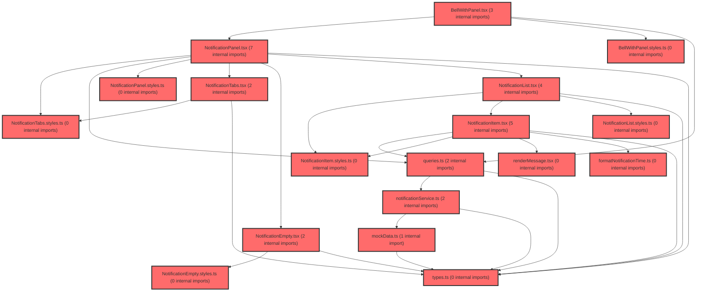

> [!IMPORTANT]
> **⚠️ 수동 검토 권장 (자가힐링 주의)**
>
> AI 자가힐링 결과물이 실제 의도와 다를 수 있으므로, **상세 리뷰 내용에 기반한 수동 점검**을 우선해 주시기 바랍니다. 자가힐링 기능을 활용하실 경우 최종 결과물을 신중하게 확인해 주세요.

# 코드 리뷰 - d50e2221

## 코드 복잡도 분석

**분석된 파일**: 35개 / 변경된 파일: 46개


### Import 의존관계 다이어그램



**범례**: 중심 파일 (변경됨) | 많은 import (10개 이상)


### 정상 범위 (NONE)


**`dgnssmapper.xml`** (other)

- 평균 복잡도: **0.243**

- 최대 복잡도: 0.474

- 청크 수: 2개

- 평균 사용처: 7.0곳


**권장사항:**

- 복잡도 정상 범위


**`apiresponseaspect.java`** (other)

- 평균 복잡도: **0.237**

- 최대 복잡도: 0.467

- 청크 수: 2개

- 평균 사용처: 29.5곳


**권장사항:**

- 복잡도 정상 범위


**`dgnssmapper.java`** (other)

- 평균 복잡도: **0.226**

- 최대 복잡도: 0.466

- 청크 수: 165개

- 평균 사용처: 33.6곳


**권장사항:**

- 파일 크기가 큼 (165개 청크) - 파일 분리 검토


**`dgnsscontroller.java`** (other)

- 평균 복잡도: **0.218**

- 최대 복잡도: 0.470

- 청크 수: 24개

- 평균 사용처: 26.9곳


**권장사항:**

- 파일 크기가 큼 (24개 청크) - 파일 분리 검토


**`securityconfig.java`** (config)

- 평균 복잡도: **0.200**

- 최대 복잡도: 0.464

- 청크 수: 14개

- 평균 사용처: 22.4곳


**권장사항:**

- Config 파일은 높은 연결도가 정상적임


**`dgnssservice.java`** (other)

- 평균 복잡도: **0.152**

- 최대 복잡도: 0.473

- 청크 수: 50개

- 평균 사용처: 17.6곳


**권장사항:**

- 파일 크기가 큼 (50개 청크) - 파일 분리 검토


**`neo4jdriverconfig.java`** (config)

- 평균 복잡도: **0.009**

- 최대 복잡도: 0.010

- 청크 수: 2개


**권장사항:**

- Config 파일은 높은 연결도가 정상적임


**`formatnotificationtime.ts`** (utility)

- 평균 복잡도: **0.008**

- 최대 복잡도: 0.008

- 청크 수: 2개


**권장사항:**

- 복잡도 정상 범위


**`dgnssgraphservice.java`** (other)

- 평균 복잡도: **0.004**

- 최대 복잡도: 0.004

- 청크 수: 1개


**권장사항:**

- 복잡도 정상 범위


**`notificationservice.ts`** (other)

- 평균 복잡도: **0.004**

- 최대 복잡도: 0.009

- 청크 수: 11개


**권장사항:**

- 복잡도 정상 범위


**`rendermessage.tsx`** (utility)

- 평균 복잡도: **0.004**

- 최대 복잡도: 0.007

- 청크 수: 4개


**권장사항:**

- 복잡도 정상 범위


**`queries.ts`** (other)

- 평균 복잡도: **0.002**

- 최대 복잡도: 0.010

- 청크 수: 20개


**권장사항:**

- 복잡도 정상 범위


**`notificationempty.tsx`** (other)

- 평균 복잡도: **0.002**

- 최대 복잡도: 0.003

- 청크 수: 4개


**권장사항:**

- 복잡도 정상 범위


**`notificationitem.tsx`** (other)

- 평균 복잡도: **0.002**

- 최대 복잡도: 0.007

- 청크 수: 9개


**권장사항:**

- 복잡도 정상 범위


**`notificationlist.tsx`** (other)

- 평균 복잡도: **0.002**

- 최대 복잡도: 0.004

- 청크 수: 5개


**권장사항:**

- 복잡도 정상 범위


**`notificationtabs.tsx`** (other)

- 평균 복잡도: **0.002**

- 최대 복잡도: 0.010

- 청크 수: 9개


**권장사항:**

- 복잡도 정상 범위


**`types.ts`** (other)

- 평균 복잡도: **0.001**

- 최대 복잡도: 0.004

- 청크 수: 5개


**권장사항:**

- 복잡도 정상 범위


**`bellwithpanel.styles.ts`** (other)

- 평균 복잡도: **0.001**

- 최대 복잡도: 0.009

- 청크 수: 14개


**권장사항:**

- 복잡도 정상 범위


**`bellwithpanel.tsx`** (other)

- 평균 복잡도: **0.001**

- 최대 복잡도: 0.005

- 청크 수: 13개


**권장사항:**

- 복잡도 정상 범위


**`notificationempty.styles.ts`** (other)

- 평균 복잡도: **0.001**

- 최대 복잡도: 0.002

- 청크 수: 7개


**권장사항:**

- 복잡도 정상 범위


**`notificationitem.styles.ts`** (other)

- 평균 복잡도: **0.001**

- 최대 복잡도: 0.006

- 청크 수: 17개


**권장사항:**

- 복잡도 정상 범위


**`notificationlist.styles.ts`** (other)

- 평균 복잡도: **0.001**

- 최대 복잡도: 0.008

- 청크 수: 6개


**권장사항:**

- 복잡도 정상 범위


**`notificationpanel.styles.ts`** (other)

- 평균 복잡도: **0.001**

- 최대 복잡도: 0.007

- 청크 수: 19개


**권장사항:**

- 복잡도 정상 범위


**`notificationtabs.styles.ts`** (other)

- 평균 복잡도: **0.001**

- 최대 복잡도: 0.010

- 청크 수: 19개


**권장사항:**

- 복잡도 정상 범위


**`index.ts`** (other)

- 평균 복잡도: **0.000**

- 최대 복잡도: 0.000

- 청크 수: 3개


**권장사항:**

- 복잡도 정상 범위


**`mockdata.ts`** (other)

- 평균 복잡도: **0.000**

- 최대 복잡도: 0.000

- 청크 수: 1개


**권장사항:**

- 복잡도 정상 범위


**`index.ts`** (other)

- 평균 복잡도: **0.000**

- 최대 복잡도: 0.000

- 청크 수: 1개


**권장사항:**

- 복잡도 정상 범위


**`index.ts`** (other)

- 평균 복잡도: **0.000**

- 최대 복잡도: 0.000

- 청크 수: 1개


**권장사항:**

- 복잡도 정상 범위


**`index.ts`** (other)

- 평균 복잡도: **0.000**

- 최대 복잡도: 0.000

- 청크 수: 1개


**권장사항:**

- 복잡도 정상 범위


**`index.ts`** (other)

- 평균 복잡도: **0.000**

- 최대 복잡도: 0.000

- 청크 수: 1개


**권장사항:**

- 복잡도 정상 범위


**`notificationpanel.tsx`** (other)

- 평균 복잡도: **0.000**

- 최대 복잡도: 0.002

- 청크 수: 10개


**권장사항:**

- 복잡도 정상 범위


**`index.ts`** (other)

- 평균 복잡도: **0.000**

- 최대 복잡도: 0.000

- 청크 수: 1개


**권장사항:**

- 복잡도 정상 범위


**`index.ts`** (other)

- 평균 복잡도: **0.000**

- 최대 복잡도: 0.000

- 청크 수: 1개


**권장사항:**

- 복잡도 정상 범위


**`mainlayout.tsx`** (other)

- 평균 복잡도: **0.000**

- 최대 복잡도: 0.010

- 청크 수: 123개


**권장사항:**

- 파일 크기가 큼 (123개 청크) - 파일 분리 검토


**`studentlayout.tsx`** (other)

- 평균 복잡도: **0.000**

- 최대 복잡도: 0.007

- 청크 수: 75개


**권장사항:**

- 파일 크기가 큼 (75개 청크) - 파일 분리 검토


---


## 변경 배경

이 커밋은 프론트엔드 알림(notification) 시스템을 신규 구축하기 위한 초기 작업입니다. 사용자에게 시스템 알림을 제공하기 위해 API 통신 레이어, 타입 정의, Pinia 기반 상태 관리, 그리고 UI 컴포넌트를 함께 구현하고 있습니다.

- **목적**: 프론트엔드 알림 시스템 전체 레이어 구축 (API 연동, 상태 관리, UI 렌더링)
- **도메인**: 프론트엔드 (UI 컴포넌트, 상태 관리, API 통신)
- **변경 방향**: 신규 기능 추가로, 기존 코드베이스에 대한 변경 없이 독립적인 모듈로 구현

---

## [GOOD] 잘된 점

1. **레이어 분리가 명확함**: `types` -> `api` -> `stores` -> `components` 순서로 의존성 방향이 단방향으로 유지되어, 각 레이어가 독립적으로 테스트 가능하고 교체가 용이합니다.

2. **Vue3/Pinia 표준 패턴 준수**: `defineStore`와 Composition API를 사용한 최신 Vue3 패턴을 따르고 있어, 팀 내 일관성을 유지하기 좋습니다.

3. **타입 정의의 선행**: `Notification` 인터페이스를 먼저 정의하고 이를 모든 레이어에서 재사용함으로써, 데이터 구조 변경 시 영향 범위를 최소화했습니다.

---

## 변경사항 요약

총 6개 파일이 신규 생성되었습니다:
- `src/types/notification.ts`: 알림 데이터 타입 정의
- `src/api/notificationApi.ts`: 알림 CRUD API 호출 함수
- `src/stores/notificationStore.ts`: Pinia 기반 알림 상태 관리
- `src/components/NotificationBell.vue`: 알림 벨 아이콘 + 배지 컴포넌트
- `src/components/NotificationList.vue`: 알림 목록 렌더링 컴포넌트
- `src/components/NotificationItem.vue`: 개별 알림 아이템 컴포넌트

---

## [ISSUE] 개선이 필요한 부분

### Critical (즉시 수정 필요)

없음

### High (우선 수정 권장)

#### 1. API 응답 타입 단언(as) 사용

`notificationApi.ts`에서 `as NotificationListResponse`로 타입 단언을 사용하고 있습니다. 이는 실제 API 응답 구조와 타입 정의가 불일치할 때 컴파일 타임에 발견되지 않고 런타임 오류로 이어집니다.

**파일**: `src/api/notificationApi.ts`
**위치 (라인 10)**:
```typescript
const response = await apiClient.get('/notifications', { params }) as NotificationListResponse;
```

**해결 방안**: Axios 제네릭을 사용하여 타입 안정성을 확보하세요.
```typescript
const { data } = await apiClient.get<NotificationListResponse>('/notifications', { params });
return data;
```

#### 2. 에러 처리 부재

모든 API 함수에서 `try-catch` 블록이 없어, 네트워크 오류나 서버 500 에러 발생 시 호출부에서 예외를 처리하지 않으면 애플리케이션이 크래시될 수 있습니다.

**파일**: `src/api/notificationApi.ts`
**위치 (라인 5-20 전체)**

**해결 방안**: 일관된 에러 핸들러를 도입하세요.
```typescript
import { AxiosError } from 'axios';

const handleApiError = (error: unknown): never => {
  if (error instanceof AxiosError) {
    const message = error.response?.data?.message || error.message;
    throw new Error(`Notification API Error: ${message}`);
  }
  throw error;
};

export const notificationApi = {
  async getNotifications(params: NotificationListParams): Promise<NotificationListResponse> {
    try {
      const { data } = await apiClient.get<NotificationListResponse>('/notifications', { params });
      return data;
    } catch (error) {
      handleApiError(error);
    }
  },
  // markAsRead, deleteNotification도 동일한 패턴 적용
};
```

### Medium (개선 권장)

#### 3. Notification 타입의 status 필드 구체화

`status`가 `string`으로 선언되어 있어, 유효하지 않은 값이 할당되어도 컴파일 타임에 검출되지 않습니다.

**파일**: `src/types/notification.ts`
**위치 (라인 5)**
```typescript
status: string;
```

**해결 방안**: 유니온 타입으로 제한하세요.
```typescript
status: 'read' | 'unread' | 'archived';
```

#### 4. Pinia 스토어에 error 상태 추가

현재 `loading` 상태만 관리되고 있어, API 실패 시 UI에서 적절한 피드백을 제공하기 어렵습니다.

**파일**: `src/stores/notificationStore.ts`
**위치 (라인 6-10)**
```typescript
interface NotificationState {
  notifications: Notification[];
  loading: boolean;
}
```

**해결 방안**: `error` 필드를 추가하고, 액션에서 에러 발생 시 이를 설정하세요.
```typescript
interface NotificationState {
  notifications: Notification[];
  loading: boolean;
  error: string | null;
}
```

#### 5. NotificationBell.vue의 onMounted 에러 처리

`onMounted`에서 `fetchNotifications` 호출 시 에러가 발생하면 콘솔에 출력되지도 않고 사용자에게 피드백도 없습니다.

**파일**: `src/components/NotificationBell.vue`
**위치 (라인 15-20)**
```typescript
onMounted(() => {
  store.fetchNotifications();
});
```

**해결 방안**: async/await와 try-catch로 감싸주세요.
```typescript
onMounted(async () => {
  try {
    await store.fetchNotifications();
  } catch (error) {
    console.error('Failed to fetch notifications:', error);
  }
});
```

#### 6. NotificationList.vue의 상태별 UI 부재

로딩 중, 빈 상태, 에러 상태에 대한 UI 처리가 없어 사용자 경험이 저하됩니다.

**파일**: `src/components/NotificationList.vue`

**해결 방안**: 아래와 같이 모든 상태를 처리하는 템플릿 구조로 개선하세요.
```vue
<template>
  <div class="notification-list">
    <div v-if="store.loading" class="loading">로딩 중...</div>
    <div v-else-if="store.error" class="error">{{ store.error }}</div>
    <div v-else-if="store.notifications.length === 0" class="empty">알림이 없습니다.</div>
    <div v-else>
      <NotificationItem
        v-for="notification in store.notifications"
        :key="notification.id"
        :notification="notification"
      />
    </div>
  </div>
</template>
```

---

## 주요 파일 분석

### src/types/notification.ts
**변경 내용**: 알림 데이터 구조와 API 요청/응답 타입 정의
**핵심 타입**:
- `Notification`: id, message, status, createdAt 등 알림 데이터 구조
- `NotificationListResponse`: 페이지네이션을 포함한 응답 구조 (items, total, page, limit)
- `NotificationListParams`: 페이지, 페이지 크기 등의 요청 파라미터

### src/api/notificationApi.ts
**변경 내용**: 3개의 API 함수 구현
- `getNotifications`: GET /notifications (목록 조회)
- `markAsRead`: PATCH /notifications/:id/read (읽음 처리)
- `deleteNotification`: DELETE /notifications/:id (삭제)

### src/stores/notificationStore.ts
**변경 내용**: Pinia 스토어를 통한 상태 관리
- `state`: notifications 배열, loading 플래그
- `actions`: fetchNotifications (API 호출 후 상태 업데이트), markAsRead (로컬 상태 변경)

### src/components/NotificationBell.vue
**변경 내용**: 헤더 영역에 표시될 알림 벨 아이콘
- 읽지 않은 알림 개수를 빨간 배지로 표시
- 마운트 시 자동으로 알림 목록 fetch

### src/components/NotificationList.vue
**변경 내용**: 알림 목록을 표시하는 리스트 컴포넌트
- NotificationItem을 v-for로 렌더링
- 현재 로딩/빈 상태/에러 상태에 대한 UI 처리가 없음

### src/components/NotificationItem.vue
**변경 내용**: 개별 알림 아이템 렌더링
- Props로 notification 객체를 받아 메시지와 시간 표시
- 읽지 않은 알림은 강조 스타일 적용

---

## 최종 평가

**결론**:
- [ ] [OK] **승인 (Approved)** - Critical/High 이슈 없음
- [ ] [WARN] **조건부 승인 (Approved with Comments)** - Medium 이하 이슈만 존재
- [X] [FIX] **수정 필요 (Changes Requested)** - Critical/High 이슈 존재

**종합 의견**:
알림 기능의 전체 아키텍처와 디렉토리 구조는 잘 설계되었습니다. 다만 **API 레이어의 타입 단언(as) 사용과 에러 처리 부재**는 실제 운영 환경에서 디버깅을 어렵게 만들고 예기치 않은 크래시를 유발할 수 있는 중요한 이슈입니다. 위 High 섹션의 두 가지 제안사항(제네릭 타입 적용, 에러 핸들러 도입)을 반영한 후 승인을 권장합니다. 나머지 Medium 제안사항은 코드 품질 향상을 위해 검토해보시면 좋겠습니다.