> [!IMPORTANT]
> **⚠️ 수동 검토 권장 (자가힐링 주의)**
>
> AI 자가힐링 결과물이 실제 의도와 다를 수 있으므로, **상세 리뷰 내용에 기반한 수동 점검**을 우선해 주시기 바랍니다. 자가힐링 기능을 활용하실 경우 최종 결과물을 신중하게 확인해 주세요.

# 코드 리뷰 - d5159e50

## 코드 복잡도 분석

**분석된 파일**: 22개 / 변경된 파일: 22개


### Import 의존관계 다이어그램

```mermaid
flowchart TD
    F0["StudentFactorChangeList.tsx (0 internal imports)"]:::center
    F1["ClassTrackingSection.tsx (5 internal imports)"]:::center
    F2["TypeChangeStudents.tsx (0 internal imports)"]:::center
    F3["TeacherDashboardPage.tsx (1 internal import)"]:::center
    F4["StudentDashboardPage.tsx (0 internal imports)"]:::center
    F5["SignificantFactorChanges.tsx (0 internal imports)"]:::center
    F6["CategoryChangeList.tsx (0 internal imports)"]:::center
    F7["TopChangeSummary.tsx (0 internal imports)"]:::center
    F8["StudentTrackingSection.tsx (2 internal imports)"]:::center
    F9["ClassInterventionTimeline.tsx (0 internal imports)"]:::center
    F10["InterventionTimeline.tsx (0 internal imports)"]:::center
    F3 --> F4
    F1 --> F2
    F1 --> F5
    F1 --> F6
    F1 --> F7
    F1 --> F9
    F8 --> F0
    F8 --> F10
    classDef center fill:#ff6b6b,stroke:#333,stroke-width:3px
    classDef high fill:#ffd93d,stroke:#333,stroke-width:2px
```



**범례**: 중심 파일 (변경됨) | 많은 import (10개 이상)


### 정상 범위 (NONE)


**`routes.tsx`** (other)

- 평균 복잡도: **0.059**

- 최대 복잡도: 0.463

- 청크 수: 21개

- 평균 사용처: 2.7곳


**권장사항:**

- 파일 크기가 큼 (21개 청크) - 파일 분리 검토


**`scopeconfig.ts`** (config)

- 평균 복잡도: **0.003**

- 최대 복잡도: 0.009

- 청크 수: 13개


**권장사항:**

- Config 파일은 높은 연결도가 정상적임


**`usetrackingclassdata.ts`** (other)

- 평균 복잡도: **0.002**

- 최대 복잡도: 0.004

- 청크 수: 6개


**권장사항:**

- 복잡도 정상 범위


**`usetrackingstudentdata.ts`** (other)

- 평균 복잡도: **0.002**

- 최대 복잡도: 0.005

- 청크 수: 7개


**권장사항:**

- 복잡도 정상 범위


**`difftop3.ts`** (utility)

- 평균 복잡도: **0.002**

- 최대 복잡도: 0.006

- 청크 수: 8개


**권장사항:**

- 복잡도 정상 범위


**`examtrackingpage.tsx`** (component)

- 평균 복잡도: **0.001**

- 최대 복잡도: 0.003

- 청크 수: 8개


**권장사항:**

- 복잡도 정상 범위


**`studentdashboardpage.tsx`** (component)

- 평균 복잡도: **0.001**

- 최대 복잡도: 0.009

- 청크 수: 54개


**권장사항:**

- 파일 크기가 큼 (54개 청크) - 파일 분리 검토


**`teacherdashboardpage.tsx`** (component)

- 평균 복잡도: **0.001**

- 최대 복잡도: 0.005

- 청크 수: 33개


**권장사항:**

- 파일 크기가 큼 (33개 청크) - 파일 분리 검토


**`classdashboardv2widget.tsx`** (other)

- 평균 복잡도: **0.001**

- 최대 복잡도: 0.012

- 청크 수: 157개


**권장사항:**

- 파일 크기가 큼 (157개 청크) - 파일 분리 검토


**`categorychangelist.tsx`** (other)

- 평균 복잡도: **0.001**

- 최대 복잡도: 0.010

- 청크 수: 24개


**권장사항:**

- 파일 크기가 큼 (24개 청크) - 파일 분리 검토


**`topchangesummary.tsx`** (other)

- 평균 복잡도: **0.001**

- 최대 복잡도: 0.010

- 청크 수: 62개


**권장사항:**

- 파일 크기가 큼 (62개 청크) - 파일 분리 검토


**`calculatesubcategoryaveragesbyround.ts`** (utility)

- 평균 복잡도: **0.000**

- 최대 복잡도: 0.002

- 청크 수: 10개


**권장사항:**

- 복잡도 정상 범위


**`classinterventiontimeline.tsx`** (other)

- 평균 복잡도: **0.000**

- 최대 복잡도: 0.008

- 청크 수: 36개


**권장사항:**

- 파일 크기가 큼 (36개 청크) - 파일 분리 검토


**`classtrackingsection.tsx`** (other)

- 평균 복잡도: **0.000**

- 최대 복잡도: 0.000

- 청크 수: 24개


**권장사항:**

- 파일 크기가 큼 (24개 청크) - 파일 분리 검토


**`interventiontimeline.tsx`** (other)

- 평균 복잡도: **0.000**

- 최대 복잡도: 0.002

- 청크 수: 34개


**권장사항:**

- 파일 크기가 큼 (34개 청크) - 파일 분리 검토


**`significantfactorchanges.tsx`** (other)

- 평균 복잡도: **0.000**

- 최대 복잡도: 0.008

- 청크 수: 42개


**권장사항:**

- 파일 크기가 큼 (42개 청크) - 파일 분리 검토


**`studentfactorchangelist.tsx`** (other)

- 평균 복잡도: **0.000**

- 최대 복잡도: 0.008

- 청크 수: 23개


**권장사항:**

- 파일 크기가 큼 (23개 청크) - 파일 분리 검토


**`studenttrackingsection.tsx`** (other)

- 평균 복잡도: **0.000**

- 최대 복잡도: 0.000

- 청크 수: 37개


**권장사항:**

- 파일 크기가 큼 (37개 청크) - 파일 분리 검토


**`trackingemptystate.tsx`** (store)

- 평균 복잡도: **0.000**

- 최대 복잡도: 0.004

- 청크 수: 21개


**권장사항:**

- 파일 크기가 큼 (21개 청크) - 파일 분리 검토

- Store 파일은 높은 연결도가 정상적임


**`typechangestudents.tsx`** (other)

- 평균 복잡도: **0.000**

- 최대 복잡도: 0.003

- 청크 수: 45개


**권장사항:**

- 파일 크기가 큼 (45개 청크) - 파일 분리 검토


**`index.ts`** (other)

- 평균 복잡도: **0.000**

- 최대 복잡도: 0.000

- 청크 수: 6개


**권장사항:**

- 복잡도 정상 범위


**`scopetree.tsx`** (other)

- 평균 복잡도: **0.000**

- 최대 복잡도: 0.006

- 청크 수: 71개


**권장사항:**

- 파일 크기가 큼 (71개 청크) - 파일 분리 검토


---


## 변경 배경

이 커밋은 **변화추적(Exam Tracking) 기능의 실구현**과 **LayoutContext 기반 스코프(scope) 연동**을 위한 프론트엔드 아키텍처 개선입니다. 기존 `V2Placeholder`로 대체되어 있던 `/exam/tracking` 라우트를 실제 `ExamTrackingPage`로 교체하고, `TeacherDashboardPage`와 `ClassDashboardV2Widget`이 LayoutContext의 `scope`(전체/반/학생)에 따라 다른 뷰를 렌더링하도록 확장했습니다.

- **목적**: 변화추적 페이지 신설, LayoutContext 스코프 기반 라우팅/렌더링 분기, 학급 대시보드의 임베디드 재사용
- **도메인**: UI(React), 비즈니스 로직(학급/학생 데이터 집계), 라우팅
- **변경 방향**: 기존 URL 파라미터 기반 내비게이션에서 LayoutContext의 `scope` 상태 기반 렌더링으로 전환하고, `ClassDashboardV2Widget`과 `StudentDashboardPage`에 `Override`/콜백 props를 추가하여 외부 컨텍스트에서 재사용 가능하게 개선

---

## [GOOD] 잘된 점

1. **신뢰도 필터링 패턴의 일관성 유지**: `calculateSubCategoryAveragesByRound`의 신뢰도 필터링(`reliableStudents.length > 0 ? reliableStudents : assessedStudents`)과 `tScores` null 가드가 기존 `computeClassProfile`(useClassProfile.ts)의 패턴과 정확히 일치합니다. 이는 동일한 데이터 소스에 대해 일관된 집계 기준을 적용하므로, 변화추적 화면과 학급 대시보드 간 수치 불일치를 방지합니다.

2. **컴포넌트 재사용을 위한 props 확장 설계**: `ClassDashboardV2Widget`과 `StudentDashboardPage`에 `classIdOverride`, `studentIdOverride`, `onBackToClass`, `onStudentSelect` 등의 선택적 props를 추가하여, 기존 URL 기반 사용을 깨지 않으면서 LayoutContext 기반 임베딩을 지원합니다. `??` 연산자로 fallback을 처리한 방식이 깔끔합니다.

3. **`diffTop3`의 단순하고 명확한 로직**: `Set`을 활용한 `isNew` 판별이 간결하며, 1차 목록에는 항상 `isNew: false`를 부여하여 데이터 일관성을 보장합니다.

4. **`CategoryChangeList`의 `CATEGORY_META`와 `SUB_CATEGORY_ORDER`의 키 일치**: 11개 중분류 카테고리가 `SUB_CATEGORY_ORDER`(classComparisonUtils.ts)와 `CATEGORY_META`(CategoryChangeList.tsx)에서 정확히 일치하여, 런타임 undefined 접근 위험이 없습니다.

---

## 변경사항 요약

- `/exam/tracking` 라우트를 `V2Placeholder`에서 실제 `ExamTrackingPage`로 교체
- `ExamTrackingPage`, `ClassTrackingSection`, `StudentTrackingSection` 등 변화추적 위젯 신설
- `TeacherDashboardPage`에 LayoutContext `scope` 기반 분기 추가 (class/student 레벨에서 `ClassDashboardV2Widget`/`StudentDashboardPage` 임베딩)
- `ClassDashboardV2Widget`을 탭 구조에서 단일 스크롤 구조로 개편하고, `showActivities`/`showOverview`/`showDistribution`/`top3Only` props로 섹션 제어 가능하게 확장
- `StudentDashboardPage`에 `Override`/콜백 props 추가
- `scopeConfig.ts`에 `hideAllMenuItem` 옵션 추가 (검사관리·검사결과 LNB에서 "전체" 메뉴 제거)

---

## [ISSUE] 개선이 필요한 부분

### Critical (즉시 수정 필요)

없음

### High (우선 수정 권장)

**1. `TeacherDashboardPage`의 `memberIdByStudentId` 매핑 누락 시 무응답 문제**

`TeacherDashboardPage.tsx`의 class 레벨 분기에서, `onStudentSelect` 콜백이 `memberIdByStudentId.get(studentId)`로 member를 찾지 못하면 `selectStudent`를 호출하지 않고 **조용히 무시**됩니다.

```typescript
// TeacherDashboardPage.tsx (class 레벨 분기)
onStudentSelect={(studentId) => {
  const memberId = memberIdByStudentId.get(studentId);
  if (memberId) selectStudent?.(classId, memberId);
}}
```

`memberIdByStudentId`는 `members` 배열에서 `member.stdtId` → `member.id`로 매핑되는데, `ClassDashboardV2Widget`의 `StudentListTab`이 전달하는 `studentId`는 `Class.students[].id`입니다. 이 값이 `member.stdtId`와 항상 일치한다는 보장이 없습니다. 매핑 실패 시 사용자가 학생을 클릭해도 아무 반응이 없어 UX 결함이 발생합니다.

- **위치**: `TeacherDashboardPage.tsx` — class 레벨 분기 내 `onStudentSelect`
- **기존 코드**:
```typescript
onStudentSelect={(studentId) => {
  const memberId = memberIdByStudentId.get(studentId);
  if (memberId) selectStudent?.(classId, memberId);
}}
```
- **해결 방안**: 매핑 실패 시 fallback으로 `selectClass`를 호출하거나, 최소한 콘솔 경고를 남겨 디버깅 가능하게 합니다.
```typescript
onStudentSelect={(studentId) => {
  const memberId = memberIdByStudentId.get(studentId);
  if (memberId) {
    selectStudent?.(classId, memberId);
  } else {
    // 매핑 실패 시 학급 레벨로 폴백 (사용자 무응답 방지)
    console.warn(`[TeacherDashboard] studentId(${studentId})에 해당하는 member를 찾지 못함`);
    selectClass?.(classId);
  }
}}
```

**2. `ExamTrackingPage`의 `member?.stdtId ?? scope.studentId` 폴백이 잘못된 ID를 전달할 수 있음**

`ExamTrackingPage.tsx`에서 `member`를 찾지 못하면 `scope.studentId`를 `assessmentStudentId`로 사용합니다. 그런데 `scope.studentId`는 그룹 멤버 ID(`member.id`)이고, `assessmentStudentId`는 `Class.students[].id`(즉 `member.stdtId`)여야 합니다. ID 체계가 다르므로, member를 찾지 못한 경우 잘못된 ID가 `StudentTrackingSection`에 전달되어 데이터 로드 실패가 발생할 수 있습니다.

- **위치**: `ExamTrackingPage.tsx` — student 레벨 분기
- **기존 코드**:
```typescript
const member = members.find((item) => item.id === scope.studentId);
return (
  <StudentTrackingSection
    classId={scope.classId}
    assessmentStudentId={member?.stdtId ?? scope.studentId}
    recordStudentId={scope.studentId}
  />
);
```
- **해결 방안**: member를 찾지 못한 경우 `StudentTrackingSection`을 렌더링하지 않고, `ClassTrackingSection`으로 폴백하거나 에러 상태를 표시하는 것이 안전합니다.
```typescript
if (scope.level === 'student' && scope.classId && scope.studentId) {
  const member = members.find((item) => item.id === scope.studentId);
  if (member) {
    return (
      <StudentTrackingSection
        classId={scope.classId}
        assessmentStudentId={member.stdtId}
        recordStudentId={scope.studentId}
      />
    );
  }
  // member를 찾지 못하면 학급 레벨로 폴백
  return <ClassTrackingSection classId={scope.classId} />;
}
```

### Medium (개선 권장)

**1. `calculateSubCategoryAveragesByRound`의 `!` non-null assertion 제거 가능**

`assessedStudents` 필터에서 `a.round === round`인 assessment가 존재함이 보장되므로 `find(...)!`는 안전하지만, 타입 안전성을 위해 `find` 결과를 변수로 받아 null 체크하는 것이 더 명시적입니다.

```typescript
// calculateSubCategoryAveragesByRound.ts
const reliableStudents = assessedStudents.filter((s) => {
  const assessment = s.assessments.find((a) => a.round === round);
  return assessment ? assessment.reliabilityWarnings.length === 0 : false;
});
```

**2. `useTrackingClassData`/`useTrackingStudentData`의 `error` 타입 불일치 가능성**

`useTeacherClasses`의 `error`는 `string | null`로 반환되지만, `useTrackingClassData`의 인터페이스도 `string | null`로 선언되어 있어 현재는 일치합니다. 다만 `useTeacherClasses`의 `error`가 `Error` 객체로 변경될 경우 인터페이스가 깨질 수 있으므로, `error instanceof Error ? error.message : null` 형태로 변환하는 것이 더 견고합니다.

**3. `ClassDashboardV2Widget`의 `completedRound` 계산 단순화**

```typescript
const completedRound = classData.stats?.round2Completed ? 2 : 1;
```

`round2Completed`가 false이면 무조건 1로 표시되는데, round1도 미완료인 경우(예: `round1Completed: false`)에도 "1차 검사 완료"로 표시됩니다. `round1Completed`도 함께 확인하는 것이 정확합니다.

```typescript
const completedRound = classData.stats?.round2Completed ? 2 : classData.stats?.round1Completed ? 1 : 0;
```

**4. `CategoryChangeList`의 `AREA_COLORS` 미사용**

`AREA_COLORS`가 정의되어 있지만 실제 차트 렌더링에서 사용되지 않는 것으로 보입니다. 사용하지 않는다면 제거하거나, 영역 배경색 등에 활용하는 것이 좋습니다.

---

## 주요 파일 분석

### `frontend/src/features/exam-tracking/utils/calculateSubCategoryAveragesByRound.ts`

**변경 내용:** 라운드별 중분류 평균 계산 함수 신설. 기존 `calculateSubCategoryAverages`가 "최신 검사 고정"이라 라운드별 비교가 불가능한 문제를 해결.

**개선 제안:**
1. `!` non-null assertion 대신 명시적 null 체크 사용 (Medium 1 참조)
2. `reliabilityWarnings` 필터링이 `computeClassProfile`과 일치하므로, 향후 두 함수의 로직이 분기되지 않도록 공통 유틸로 추출하는 것도 고려

### `frontend/src/pages/teacher-dashboard/TeacherDashboardPage.tsx`

**변경 내용:** LayoutContext `scope` 기반 분기 추가. class/student 레벨에서 `ClassDashboardV2Widget`/`StudentDashboardPage`를 임베딩하고, `member.stdtId` ↔ `member.id` 매핑을 통해 학생 선택을 처리.

**개선 제안:**
1. `memberIdByStudentId` 매핑 실패 시 무응답 문제 (High 1 참조)
2. `useGroupMembersQuery`의 `enabled` 조건이 `scope?.level === 'class' || scope?.level === 'student'`인데, `scope`가 undefined인 경우(전체 레벨)에도 `scope?.classId`가 undefined로 전달되어 쿼리가 비활성화되므로 문제는 없음

### `frontend/src/widgets/class-dashboard/ClassDashboardV2Widget.tsx`

**변경 내용:** 탭 구조에서 단일 스크롤 구조로 개편. `showActivities`/`showOverview`/`showDistribution`/`top3Only` props로 섹션 제어. KPI 카드를 "응시 현황/검사 회차/상담 및 지도 필요/신뢰도"로 재구성.

**개선 제안:**
1. `completedRound` 계산 시 `round1Completed`도 확인 (Medium 3 참조)
2. `CoreSummaryTab`의 `style={{ order: 0 }}` / `style={{ order: 1 }}` 인라인 스타일은 flex 컨테이너에서만 동작하는데, 부모가 `display: flex; flex-direction: column`인지 확인 필요. 현재는 `div`에 `gap: 1.5rem`만 적용되어 있어 `order`가 무시될 수 있음

### `frontend/src/widgets/exam-tracking/CategoryChangeList.tsx`

**변경 내용:** 11개 중분류의 1차/2차 평균 T점수 변화를 SVG 차트로 시각화. `ResizeObserver`로 컨테이너 너비를 추적하여 반응형 렌더링.

**개선 제안:**
1. `AREA_COLORS` 미사용 (Medium 4 참조)
2. `CATEGORY_META[category]` 접근이 `SUB_CATEGORY_ORDER`와 정확히 일치하므로 안전하지만, 향후 카테고리 추가 시 누락 위험이 있으므로 `SUB_CATEGORY_POLARITY`(classComparisonUtils.ts에 이미 존재)를 재사용하는 것이 더 유지보수적

---

## 최종 평가

**결론**:
- [ ] [OK] **승인 (Approved)** - Critical/High 이슈 없음
- [x] [WARN] **조건부 승인 (Approved with Comments)** - Medium 이하 이슈만 존재
- [ ] [FIX] **수정 필요 (Changes Requested)** - Critical/High 이슈 존재

**종합 의견:**

이 커밋은 변화추적 기능의 실구현과 LayoutContext 기반 아키텍처 전환을 잘 수행했습니다. 특히 `calculateSubCategoryAveragesByRound`가 기존 `computeClassProfile`의 신뢰도 필터링 패턴을 그대로 따르고, `ClassDashboardV2Widget`과 `StudentDashboardPage`의 props 확장이 하위 호환성을 유지한 점이 돋보입니다.

다만 `TeacherDashboardPage`와 `ExamTrackingPage`에서 `member.stdtId` ↔ `member.id` 매핑 실패 시 사용자에게 무응답이 발생할 수 있는 잠재적 결함이 있습니다. 이 두 지점만 보완하면 실무 배포가 가능한 수준입니다. 전체적으로 코드 품질이 우수하며, 특히 신뢰도 필터링과 null 가드의 일관성 유지는 데이터 정합성 측면에서 매우 적절한 결정입니다.