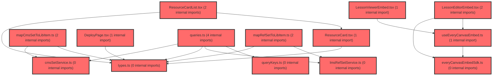

> [!IMPORTANT]
> **⚠️ 수동 검토 권장 (자가힐링 주의)**
>
> AI 자가힐링 결과물이 실제 의도와 다를 수 있으므로, **상세 리뷰 내용에 기반한 수동 점검**을 우선해 주시기 바랍니다. 자가힐링 기능을 활용하실 경우 최종 결과물을 신중하게 확인해 주세요.

# 코드 리뷰 - d5293a05

## 코드 복잡도 분석

**분석된 파일**: 22개 / 변경된 파일: 26개


### Import 의존관계 다이어그램



**범례**: 중심 파일 (변경됨) | 많은 import (10개 이상)


### 정상 범위 (NONE)


**`routes.tsx`** (other)

- 평균 복잡도: **0.059**

- 최대 복잡도: 0.463

- 청크 수: 21개

- 평균 사용처: 2.7곳


**권장사항:**

- 파일 크기가 큼 (21개 청크) - 파일 분리 검토


**`index.ts`** (component)

- 평균 복잡도: **0.029**

- 최대 복잡도: 0.461

- 청크 수: 32개

- 평균 사용처: 1.9곳


**권장사항:**

- 파일 크기가 큼 (32개 청크) - 파일 분리 검토


**`env.ts`** (config)

- 평균 복잡도: **0.006**

- 최대 복잡도: 0.006

- 청크 수: 1개


**권장사항:**

- Config 파일은 높은 연결도가 정상적임


**`lessonviewerembed.tsx`** (component)

- 평균 복잡도: **0.003**

- 최대 복잡도: 0.014

- 청크 수: 12개


**권장사항:**

- 복잡도 정상 범위


**`lessonviewerpage.tsx`** (component)

- 평균 복잡도: **0.003**

- 최대 복잡도: 0.008

- 청크 수: 7개


**권장사항:**

- 복잡도 정상 범위


**`cmssetservice.ts`** (other)

- 평균 복잡도: **0.002**

- 최대 복잡도: 0.005

- 청크 수: 5개


**권장사항:**

- 복잡도 정상 범위


**`lmsrefsetservice.ts`** (other)

- 평균 복잡도: **0.002**

- 최대 복잡도: 0.004

- 청크 수: 11개


**권장사항:**

- 복잡도 정상 범위


**`queries.ts`** (other)

- 평균 복잡도: **0.002**

- 최대 복잡도: 0.008

- 청크 수: 16개


**권장사항:**

- 복잡도 정상 범위


**`everycanvasembedsdk.ts`** (utility)

- 평균 복잡도: **0.002**

- 최대 복잡도: 0.005

- 청크 수: 13개


**권장사항:**

- 복잡도 정상 범위


**`mapcmssettolibitem.ts`** (utility)

- 평균 복잡도: **0.002**

- 최대 복잡도: 0.005

- 청크 수: 6개


**권장사항:**

- 복잡도 정상 범위


**`maprefsettolibitem.ts`** (utility)

- 평균 복잡도: **0.002**

- 최대 복잡도: 0.005

- 청크 수: 6개


**권장사항:**

- 복잡도 정상 범위


**`types.ts`** (other)

- 평균 복잡도: **0.002**

- 최대 복잡도: 0.008

- 청크 수: 10개


**권장사항:**

- 복잡도 정상 범위


**`lessoneditorpage.tsx`** (component)

- 평균 복잡도: **0.002**

- 최대 복잡도: 0.010

- 청크 수: 9개


**권장사항:**

- 복잡도 정상 범위


**`querykeys.ts`** (other)

- 평균 복잡도: **0.001**

- 최대 복잡도: 0.002

- 청크 수: 3개


**권장사항:**

- 복잡도 정상 범위


**`index.ts`** (other)

- 평균 복잡도: **0.001**

- 최대 복잡도: 0.005

- 청크 수: 20개


**권장사항:**

- 복잡도 정상 범위


**`useeverycanvasembed.ts`** (utility)

- 평균 복잡도: **0.001**

- 최대 복잡도: 0.009

- 청크 수: 12개


**권장사항:**

- 복잡도 정상 범위


**`lessoneditorembed.tsx`** (other)

- 평균 복잡도: **0.001**

- 최대 복잡도: 0.006

- 청크 수: 12개


**권장사항:**

- 복잡도 정상 범위


**`lessonlibrarycontents.tsx`** (utility)

- 평균 복잡도: **0.001**

- 최대 복잡도: 0.004

- 청크 수: 11개


**권장사항:**

- 복잡도 정상 범위


**`deploypage.tsx`** (component)

- 평균 복잡도: **0.000**

- 최대 복잡도: 0.005

- 청크 수: 178개


**권장사항:**

- 파일 크기가 큼 (178개 청크) - 파일 분리 검토


**`resourcecard.tsx`** (other)

- 평균 복잡도: **0.000**

- 최대 복잡도: 0.010

- 청크 수: 38개


**권장사항:**

- 파일 크기가 큼 (38개 청크) - 파일 분리 검토


**`resourcecardlist.tsx`** (other)

- 평균 복잡도: **0.000**

- 최대 복잡도: 0.000

- 청크 수: 23개


**권장사항:**

- 파일 크기가 큼 (23개 청크) - 파일 분리 검토


**`lessonmypage.tsx`** (component)

- 평균 복잡도: **0.000**

- 최대 복잡도: 0.007

- 청크 수: 21개


**권장사항:**

- 파일 크기가 큼 (21개 청크) - 파일 분리 검토


---


## 변경 배경

이 커밋은 lesson 기능의 LMS/CMS API 연동과 Editor/Viewer 독립 라우트 전환을 위한 작업입니다.

- **목적**: everyCanvas Editor/Viewer를 독립 fullscreen 라우트 페이지로 분리하고, LMS ref-set API(`POST/GET /api/ref-set`)와 CMS 세트 목록 API(`GET /api/sets`)를 연동
- **도메인**: API 연동(비즈니스 로직) + 라우팅(UI 구조)
- **변경 방향**: 기존 `LessonMyPage`의 인라인 `mode` state 기반 오버레이 렌더링을 독립 라우트로 전환하고, 목업 데이터를 실제 LMS/CMS API로 대체

## [GOOD] 잘된 점

- `lessonKeys` factory 패턴을 도입하여 기존 `assessmentKeys`, `groupKeys`와 일관된 query key 구조를 유지함
- `lmsFetch` 헬퍼로 LMS envelope(`{ success, resultCode, resultData }`) 공통 처리를 추상화하여 GET/POST 중복 코드를 제거함
- `useCmsSetListQuery`에서 `keepPreviousData` + `AbortSignal`을 활용한 레이스 방지 설계가 명확함
- `SavedPayload`에 `lcmsSetId`/`lessonMeta`를 비파괴적으로 추가하여 기존 `slideId`만 읽던 코드와 하위 호환을 유지함

## 변경사항 요약

Editor/Viewer 독립 라우트(`/lesson/editor`, `/lesson/editor/:slideId`, `/lesson/viewer/:slideId`)를 `TeacherFullscreenLayout` 하위에 추가하고, LMS ref-set 등록/조회 및 CMS 세트 목록 조회 API를 신규 연동했습니다. env에 `SP_LMS_API_URL`, `CMS_API_URL`을 추가했습니다.

---

## [ISSUE] 개선이 필요한 부분

### Critical (즉시 수정 필요)

**1. `queries.ts` `useRegisterRefSetMutation`의 중복 방지 로직에서 TypeError 발생 가능**

`cached?.list.some(...)` 구문에서 `cached`가 `undefined`(아직 목록을 fetch하지 않은 상태)이면 `cached?.list`도 `undefined`가 되어 `.some()` 호출 시 `Cannot read properties of undefined (reading 'some')` 에러가 발생합니다. 이는 `onSaved`가 최초 저장 시점(목록 조회 전)에 호출되는 일반적인 시나리오에서 발생할 수 있는 명백한 버그입니다.

- **위치**: `frontend/src/features/lesson/api/queries.ts` 28행
- **기존 코드**:
```ts
const alreadyRegistered = cached?.list.some(
  (item) => item.lcmsSetId === body.lcmsSetId,
);
```
- **해결 방안**:
```ts
const alreadyRegistered = cached?.list?.some(
  (item) => item.lcmsSetId === body.lcmsSetId,
) ?? false;
```

### High (우선 수정 권장)

**1. `useCmsSetListQuery`의 queryKey에 객체 참조 직접 사용으로 인한 무한 refetch 위험**

`queryKey: [...lessonKeys.cmsSets(), filters, sort]`에서 `filters`(객체)와 `sort`(문자열)를 직접 넣습니다. `filters`가 매 렌더마다 새 객체 참조로 생성되면 queryKey가 매번 달라져 무한 refetch가 발생할 수 있습니다. `useLibraryFilters`가 안정적인 참조를 반환하는지 확인이 필요하며, 안정적이지 않다면 직렬화된 값(예: `JSON.stringify(filters)`)을 key로 사용해야 합니다.

- **위치**: `frontend/src/features/lesson/api/queries.ts` 45행

**2. env 기본값이 빈 문자열로 설정되어 있어 API 호출 실패 위험**

`env.ts`에서 `SP_LMS_API_URL`과 `CMS_API_URL`의 기본값이 `''`로 설정되어 있습니다. `.env.development`/`.env.production`에 값이 정의되어 있지만, 만약 env 파일이 누락되거나 값이 로드되지 않으면 `https:///api/ref-set` 같은 잘못된 URL로 호출됩니다. 기본값을 실제 개발용 URL로 설정하거나, 빈 값일 때 명시적으로 에러를 던지는 가드를 추가하는 것이 안전합니다.

- **위치**: `frontend/src/shared/config/env.ts` 29~33행

### Medium (개선 권장)

**1. `mapRefSetToLibItem`의 `id` 매핑 불일치**

`mapRefSetToLibItem`에서 `id: item.lcmsSetId`로 매핑하는 반면, 추가계획7에서 `ResourceCard` '수정하기'는 `item.id`를 `slideId`로 사용합니다. `lcmsSetId`가 `slideId`와 동일한 값인지 확인이 필요합니다. 만약 다르다면 편집 라우트로 잘못된 ID가 전달될 수 있습니다.

- **위치**: `frontend/src/features/lesson/model/mapRefSetToLibItem.ts` 20행

**2. `onStartLesson`이 `console.log`로만 처리되어 실제 수업 화면 전환이 미구현**

`LessonEditorPage`의 `onStartLesson`이 `console.log` 후 no-op입니다. 계획 문서에도 "수업 화면 라우트 확정 후 교체 예정"으로 명시되어 있으나, 사용자가 '수업하기' 버튼을 눌렀을 때 아무 동작이 없어 UX상 혼란을 줄 수 있습니다. 최소한 안내 토스트나 placeholder 화면이라도 제공하는 것이 좋습니다.

---

## 주요 파일 분석

### frontend/src/features/lesson/api/queries.ts

**변경 내용:** LMS ref-set 조회/등록 훅과 CMS 세트 목록 조회 훅을 신규 추가.

**개선 제안:**

1. 중복 방지 로직의 `cached?.list.some` TypeError 수정 (Critical 참조)
   - **위치 (28행)**: `cached?.list.some(...)` → `cached?.list?.some(...) ?? false`
2. `useCmsSetListQuery` queryKey의 객체 참조 안정성 확인 필요
   - **위치 (45행)**: `filters` 객체가 매 렌더 새 참조면 무한 refetch 위험. `useLibraryFilters`의 반환 참조 안정성 확인 후 필요 시 직렬화.

### frontend/src/features/lesson/api/lmsRefSetService.ts

**변경 내용:** LMS envelope 공통 처리 `lmsFetch` 헬퍼와 `getRefSetList`/`registerRefSet` 구현.

**개선 제안:**

- `lmsFetch`에서 `res.json()` 파싱 시 실패(비 JSON 응답)에 대한 try/catch가 없어, 게이트웨이 오류 시 파싱 에러가 원래 에러를 가릴 수 있습니다. `cmsSetService`처럼 파싱 예외를 처리하는 것이 일관적입니다.

### frontend/src/app/router/routes.tsx

**변경 내용:** `TeacherFullscreenLayout` 하위에 editor/viewer 라우트를 `FEATURES.IA_V2` 조건으로 추가.

**개선 제안:**

- `FEATURES.IA_V2` 조건으로 감싸면서 기존 `LessonDeployPage` 라우트도 함께 조건부로 이동되었습니다. 이는 의도된 변경인지 확인이 필요합니다. 만약 `IA_V2`가 비활성화되면 기존에 동작하던 `/lesson/deploy/:itemId` 라우트가 사라지는 회귀가 발생할 수 있습니다.

---

## 최종 평가

**결론**:
- [ ] [OK] **승인 (Approved)** - Critical/High 이슈 없음
- [ ] [WARN] **조건부 승인 (Approved with Comments)** - Medium 이하 이슈만 존재
- [x] [FIX] **수정 필요 (Changes Requested)** - Critical/High 이슈 존재

**종합 의견:**

전반적으로 API 연동 구조(`lessonKeys` factory, `lmsFetch` 헬퍼, 레이스 방지 설계)가 기존 패턴과 잘 맞아 견고하게 설계되었습니다. 다만 `useRegisterRefSetMutation`의 중복 방지 로직에서 `cached`가 undefined일 때 발생하는 TypeError는 최초 저장 시나리오에서 반드시 발생할 수 있는 명백한 버그이므로, 이 부분을 먼저 수정한 후 승인하는 것을 권장합니다. `useCmsSetListQuery`의 queryKey 객체 참조 안정성과 env 기본값 처리도 함께 점검하면 좋겠습니다.