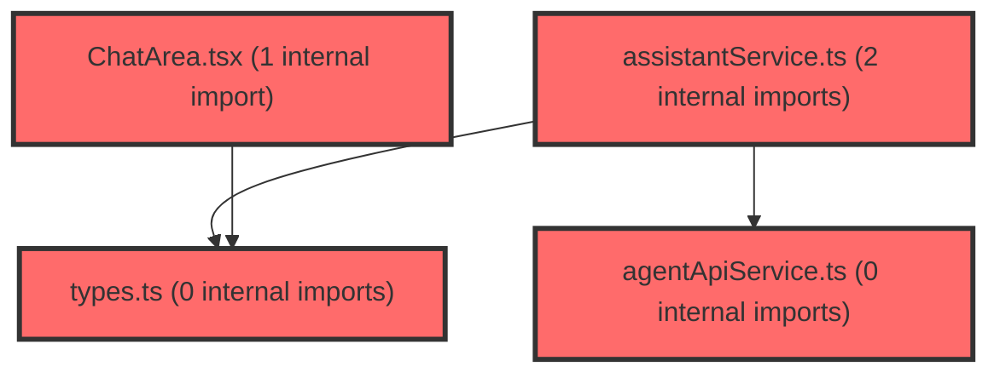

> [!IMPORTANT]
> **⚠️ 수동 검토 권장 (자가힐링 주의)**
>
> AI 자가힐링 결과물이 실제 의도와 다를 수 있으므로, **상세 리뷰 내용에 기반한 수동 점검**을 우선해 주시기 바랍니다. 자가힐링 기능을 활용하실 경우 최종 결과물을 신중하게 확인해 주세요.

# 코드 리뷰 - d5647950

## 코드 복잡도 분석

**분석된 파일**: 13개 / 변경된 파일: 15개


### Import 의존관계 다이어그램



**범례**: 중심 파일 (변경됨) | 많은 import (10개 이상)


### 정상 범위 (NONE)


**`routes.tsx`** (other)

- 평균 복잡도: **0.069**

- 최대 복잡도: 0.463

- 청크 수: 18개

- 평균 사용처: 3.1곳


**권장사항:**

- 복잡도 정상 범위


**`captureregion.ts`** (utility)

- 평균 복잡도: **0.004**

- 최대 복잡도: 0.012

- 청크 수: 8개


**권장사항:**

- 복잡도 정상 범위


**`agentapiservice.ts`** (other)

- 평균 복잡도: **0.003**

- 최대 복잡도: 0.011

- 청크 수: 9개


**권장사항:**

- 복잡도 정상 범위


**`useconversations.ts`** (other)

- 평균 복잡도: **0.002**

- 최대 복잡도: 0.010

- 청크 수: 68개


**권장사항:**

- 파일 크기가 큼 (68개 청크) - 파일 분리 검토


**`types.ts`** (other)

- 평균 복잡도: **0.002**

- 최대 복잡도: 0.004

- 청크 수: 10개


**권장사항:**

- 복잡도 정상 범위


**`authcontext.tsx`** (other)

- 평균 복잡도: **0.002**

- 최대 복잡도: 0.008

- 청크 수: 16개


**권장사항:**

- 복잡도 정상 범위


**`assistantservice.ts`** (other)

- 평균 복잡도: **0.001**

- 최대 복잡도: 0.007

- 청크 수: 14개


**권장사항:**

- 복잡도 정상 범위


**`usecapturestore.ts`** (store)

- 평균 복잡도: **0.001**

- 최대 복잡도: 0.004

- 청크 수: 8개


**권장사항:**

- Store 파일은 높은 연결도가 정상적임


**`captureoverlay.tsx`** (other)

- 평균 복잡도: **0.001**

- 최대 복잡도: 0.004

- 청크 수: 25개


**권장사항:**

- 파일 크기가 큼 (25개 청크) - 파일 분리 검토


**`floatingcapturebutton.tsx`** (other)

- 평균 복잡도: **0.001**

- 최대 복잡도: 0.007

- 청크 수: 15개


**권장사항:**

- 복잡도 정상 범위


**`chatarea.tsx`** (other)

- 평균 복잡도: **0.000**

- 최대 복잡도: 0.008

- 청크 수: 81개


**권장사항:**

- 파일 크기가 큼 (81개 청크) - 파일 분리 검토


**`airoomchatarea.tsx`** (other)

- 평균 복잡도: **0.000**

- 최대 복잡도: 0.000

- 청크 수: 52개


**권장사항:**

- 파일 크기가 큼 (52개 청크) - 파일 분리 검토


**`index.ts`** (other)

- 평균 복잡도: **0.000**

- 최대 복잡도: 0.000

- 청크 수: 2개


**권장사항:**

- 복잡도 정상 범위


---


## 변경 배경

이 커밋은 AI Room 채팅에 **화면 캡처(Screen Capture) 기능**을 추가하는 기능성 커밋입니다. 사용자가 대시보드의 특정 영역을 드래그하여 선택하면 해당 영역을 스크린샷으로 캡처하고, 이를 data URI 형태로 AI 에이전트에 첨부하여 질문할 수 있도록 합니다.

- **목적**: AI Room에서 시각적 컨텍스트(화면 캡처 이미지)를 첨부하여 질문할 수 있는 기능 추가
- **도메인**: UI (프론트엔드) / 비즈니스 로직 (AI Room 채팅)
- **변경 방향**: 전역 플로팅 버튼 + 영역 선택 오버레이 -> Zustand store로 상태 관리 -> API 레이어까지 images 파라미터 전파 -> 채팅 UI에 이미지 표시

## [GOOD] 잘된 점

1. **레이어드 아키텍처 준수**: Store(`useCaptureStore`) -> Lib(`captureRegion`) -> Widget(`CaptureOverlay`, `FloatingCaptureButton`) -> Feature(`useConversations`, `ChatArea`) -> API(`agentApiService`)로 이어지는 데이터 흐름이 명확하게 계층화되어 있습니다. 각 레이어의 책임이 분명합니다.

2. **Race condition 방어 설계**: `CaptureOverlay`에서 `captureTokenRef`를 사용한 캡처 시도 단위 무효화(token-based invalidation)는 `html2canvas`의 취소 불가 특성을 고려한 현명한 설계입니다. ESC 취소 후 재시도 시 이전 프로미스가 뒤늦게 완료되어 상태를 오염시키는 상황을 방지합니다.

3. **보안/프라이버시 고려**: `AuthContext`의 `logout` 콜백에서 `useCaptureStore.getState().reset()`을 호출하여 로그아웃 시 대기 중인 캡처 이미지를 초기화하는 처리가 포함되어 있습니다. 같은 브라우저를 다른 교사가 사용할 때 이전 사용자의 데이터가 노출되는 것을 방지합니다.

4. **용량 제한 처리**: `captureRegion`에서 PNG -> JPEG(0.85) -> JPEG(0.7) 순차 폴백(fallback)과 5MB 제한 검증은 서버 측(`image_validation.py`)과 일관된 기준을 적용하여 불필요한 네트워크 오류를 사전에 차단합니다.

## 변경사항 요약

- `html2canvas` 패키지 추가 및 화면 영역 캡처 유틸리티(`captureRegion.ts`) 구현
- Zustand store(`useCaptureStore`)로 캡처 상태(overlayOpen, pendingImage) 전역 관리
- `CaptureOverlay`(드래그 선택 오버레이) + `FloatingCaptureButton`(전역 플로팅 버튼) 위젯 생성
- `ProtectedLayout`에 `FloatingCaptureButton`과 `CaptureOverlay`를 마운트하여 모든 보호된 페이지에서 캡처 가능
- `ChatMessage` 타입에 `images` 필드 추가 및 API 레이어(`agentApiService`, `assistantService`)까지 images 파라미터 전파
- `useConversations.handleSend`에서 pendingImage를 읽어 전송하고, `ChatArea`에서 이미지 렌더링
- `AIRoomChatArea` 입력 영역에 캡처 버튼 및 첨부 칩(CaptureChip) UI 추가

---

## [ISSUE] 개선이 필요한 부분

### Critical (즉시 수정 필요)

없음

### High (우선 수정 권장)

**1. `CaptureOverlay`의 `handleMouseUp`에서 `rect`가 `null`일 때의 동작**

- **파일**: `frontend/src/widgets/screen-capture/CaptureOverlay.tsx`
- **위치 (라인 번호)**: 131-133
- **문제**: `handleMouseUp`에서 `if (!rect)` 조건으로 `closeOverlay()`를 호출하는데, 이는 사용자가 오버레이를 클릭만 하고 드래그 없이 마우스를 놓았을 때 오버레이를 닫습니다. 하지만 이 경우 사용자가 실수로 클릭한 것인지, 의도적으로 취소하려 한 것인지 구분이 어렵습니다. ESC 키가 이미 취소 기능을 제공하고 있으므로, 단순 클릭으로 오버레이가 닫히면 사용자가 의도치 않게 캡처를 포기하게 될 수 있습니다.

- **기존 코드**:
```typescript
if (!rect) {
  closeOverlay();
  return;
}
```

- **해결 방안 (수정 코드)**: `rect`가 `null`인 경우(드래그 없이 클릭만 한 경우) 아무 동작도 하지 않고 리턴하여, 사용자가 다시 드래그를 시도할 수 있도록 하는 것이 더 나은 UX입니다. ESC만이 유일한 취소 수단이어야 합니다.

```typescript
if (!rect) {
  // 드래그 없이 클릭만 한 경우 -- 아무 동작도 하지 않음 (ESC만 취소로 취급)
  return;
}
```

### Medium (개선 권장)

**1. `CaptureOverlay`의 `Backdrop`에 `onMouseUp` 이벤트가 오버레이 영역 밖에서 발생할 수 있음**

- **파일**: `frontend/src/widgets/screen-capture/CaptureOverlay.tsx`
- **위치 (라인 번호)**: 148-152
- **문제**: `Backdrop`은 `position: fixed; inset: 0`으로 전체 화면을 덮지만, 마우스가 브라우저 창 밖으로 나간 상태에서 버튼을 놓으면 `mouseup` 이벤트가 `Backdrop`이 아닌 `window`나 `document`에서 발생할 수 있습니다. 이 경우 `handleMouseUp`이 호출되지 않고 드래그 상태가 그대로 남아 사용자가 혼란스러울 수 있습니다.

- **기존 코드**:
```typescript
<Backdrop
  $dimmed={!!rect}
  data-capture-ignore='true'
  onMouseDown={handleMouseDown}
  onMouseMove={handleMouseMove}
  onMouseUp={handleMouseUp}
>
```

- **해결 방안 (수정 코드)**: `window`에 `mouseup` 이벤트 리스너를 추가하여 오버레이 밖에서 마우스를 놓아도 캡처가 완료되도록 합니다. 단, `handleMouseUp`의 로직을 재사용 가능한 함수로 추출하는 리팩토링이 선행되어야 합니다.

```typescript
// CaptureOverlay 컴포넌트 내부, handleMouseUp 로직을 추출한 공통 핸들러
const performCapture = useCallback(async (currentRect: DragRect) => {
  if (currentRect.w < MIN_SIZE || currentRect.h < MIN_SIZE) {
    setStart(null);
    setRect(null);
    return;
  }
  setCapturing(true);
  const myToken = ++captureTokenRef.current;
  try {
    const result = await captureRegion(currentRect);
    if (captureTokenRef.current !== myToken) return;
    setPendingImage(result.dataUri, { w: result.w, h: result.h });
    if (!location.pathname.startsWith('/ai-room')) {
      navigate('/ai-room');
    }
  } catch (error) {
    if (captureTokenRef.current !== myToken) return;
    console.error('화면 캡처 실패:', error);
    const message = error instanceof Error ? error.message : '화면 캡처에 실패했습니다.';
    toast.error(message);
    closeOverlay();
  }
}, [rect, navigate, location.pathname, setPendingImage, closeOverlay]);

// window mouseup 이벤트 리스너
useEffect(() => {
  if (!overlayOpen || !start || capturing) return;
  const handleWindowMouseUp = () => {
    if (rect) {
      performCapture(rect);
    }
  };
  window.addEventListener('mouseup', handleWindowMouseUp);
  return () => window.removeEventListener('mouseup', handleWindowMouseUp);
}, [overlayOpen, start, rect, capturing, performCapture]);
```

**2. `captureRegion`에서 `html2canvas`의 `useCORS: true` 설정 관련 잠재적 이슈**

- **파일**: `frontend/src/shared/lib/captureRegion.ts`
- **위치 (라인 번호)**: 35
- **문제**: `useCORS: true`는 외부 이미지 리소스에 대해 CORS 요청을 시도하지만, 모든 이미지 서버가 적절한 CORS 헤더를 반환하는 것은 아닙니다. 특히 `data-capture-ignore` 속성이 없는 외부 이미지(예: 프로필 사진, CDN 이미지 등)가 CORS 정책 위반으로 캔버스가 `tainted`되어 `toDataURL` 호출 시 `SecurityError`가 발생할 수 있습니다.

- **개선 제안**: `try-catch`로 `toDataURL` 호출을 감싸거나, `html2canvas`의 `onclone` 옵션을 사용하여 캡처 전에 외부 이미지를 프록시 처리하는 방안을 고려하세요. 현재는 이 오류가 발생하면 `captureRegion`이 예외를 던지고 `CaptureOverlay`의 `catch` 블록에서 `toast.error`로 표시되므로 기능 자체는 보호됩니다. **현재 수준에서 Critical은 아니며, 추후 개선 항목으로 기록하는 것을 권장합니다.**

---

## 최종 평가

**결론**:
- [ ] [OK] **승인 (Approved)** - Critical/High 이슈 없음
- [x] [WARN] **조건부 승인 (Approved with Comments)** - Medium 이하 이슈만 존재
- [ ] [FIX] **수정 필요 (Changes Requested)** - Critical/High 이슈 존재

**종합 의견:**

전반적으로 잘 설계된 기능 추가 커밋입니다. 레이어드 아키텍처를 준수하고, race condition 방어, 보안(로그아웃 시 데이터 초기화), 용량 제한 등 실무에서 중요한 부분을 꼼꼼히 처리했습니다. `CaptureOverlay`의 `handleMouseUp`에서 `rect`가 `null`일 때 `closeOverlay()`를 호출하는 부분(단순 클릭 시 오버레이 종료)과 브라우저 창 밖에서 마우스를 놓을 때의 `mouseup` 미발생 문제는 UX 측면에서 개선 여지가 있으나, 기능 동작 자체에 치명적이지는 않습니다. 위 Medium 제안들을 참고하여 점진적으로 개선하시면 좋겠습니다.