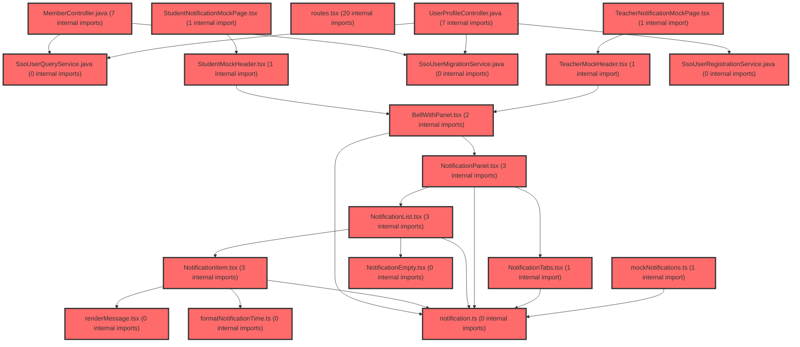

> [!IMPORTANT]
> **⚠️ 수동 검토 권장 (자가힐링 주의)**
>
> AI 자가힐링 결과물이 실제 의도와 다를 수 있으므로, **상세 리뷰 내용에 기반한 수동 점검**을 우선해 주시기 바랍니다. 자가힐링 기능을 활용하실 경우 최종 결과물을 신중하게 확인해 주세요.

# 코드 리뷰 - d5806bf2

## 코드 복잡도 분석

**분석된 파일**: 32개 / 변경된 파일: 33개


### Import 의존관계 다이어그램



**범례**: 중심 파일 (변경됨) | 많은 import (10개 이상)


### 모니터링 권장 (LOW)


**`routes.tsx`** (other)

- 평균 복잡도: **0.240**

- 최대 복잡도: 0.528

- 청크 수: 48개

- 평균 사용처: 16.7곳


**권장사항:**

- **모니터링 권장**: 복잡도가 높은 편이지만 영향 범위 제한적

- 파일 크기가 큼 (48개 청크) - 파일 분리 검토


### 정상 범위 (NONE)


**`membercontroller.java`** (other)

- 평균 복잡도: **0.391**

- 최대 복잡도: 0.470

- 청크 수: 6개

- 평균 사용처: 53.7곳


**권장사항:**

- 복잡도 정상 범위


**`loginpage.tsx`** (component)

- 평균 복잡도: **0.313**

- 최대 복잡도: 0.465

- 청크 수: 31개

- 평균 사용처: 24.7곳


**권장사항:**

- 파일 크기가 큼 (31개 청크) - 파일 분리 검토


**`usermapper.xml`** (other)

- 평균 복잡도: **0.238**

- 최대 복잡도: 0.469

- 청크 수: 2개

- 평균 사용처: 7.0곳


**권장사항:**

- 복잡도 정상 범위


**`globalexceptionhandler.java`** (config)

- 평균 복잡도: **0.214**

- 최대 복잡도: 0.466

- 청크 수: 11개

- 평균 사용처: 22.8곳


**권장사항:**

- Config 파일은 높은 연결도가 정상적임


**`routes.tsx`** (other)

- 평균 복잡도: **0.083**

- 최대 복잡도: 0.463

- 청크 수: 15개

- 평균 사용처: 3.7곳


**권장사항:**

- 복잡도 정상 범위


**`userprofilecontroller.java`** (other)

- 평균 복잡도: **0.011**

- 최대 복잡도: 0.011

- 청크 수: 1개


**권장사항:**

- 복잡도 정상 범위


**`ssousermigrationservice.java`** (other)

- 평균 복잡도: **0.009**

- 최대 복잡도: 0.012

- 청크 수: 2개


**권장사항:**

- 복잡도 정상 범위


**`formatnotificationtime.ts`** (utility)

- 평균 복잡도: **0.008**

- 최대 복잡도: 0.008

- 청크 수: 2개


**권장사항:**

- 복잡도 정상 범위


**`guestauthservice.java`** (other)

- 평균 복잡도: **0.006**

- 최대 복잡도: 0.006

- 청크 수: 1개


**권장사항:**

- 복잡도 정상 범위


**`ssouserqueryservice.java`** (other)

- 평균 복잡도: **0.005**

- 최대 복잡도: 0.012

- 청크 수: 4개


**권장사항:**

- 복잡도 정상 범위


**`webclientconfig.java`** (config)

- 평균 복잡도: **0.005**

- 최대 복잡도: 0.007

- 청크 수: 2개


**권장사항:**

- Config 파일은 높은 연결도가 정상적임


**`ssouserregistrationservice.java`** (other)

- 평균 복잡도: **0.004**

- 최대 복잡도: 0.004

- 청크 수: 1개


**권장사항:**

- 복잡도 정상 범위


**`spusermappingfilter.java`** (config)

- 평균 복잡도: **0.004**

- 최대 복잡도: 0.004

- 청크 수: 1개


**권장사항:**

- Config 파일은 높은 연결도가 정상적임


**`notificationitem.tsx`** (component)

- 평균 복잡도: **0.004**

- 최대 복잡도: 0.011

- 청크 수: 6개


**권장사항:**

- 복잡도 정상 범위


**`rendermessage.tsx`** (utility)

- 평균 복잡도: **0.004**

- 최대 복잡도: 0.010

- 청크 수: 6개


**권장사항:**

- 복잡도 정상 범위


**`authproxycontroller.java`** (other)

- 평균 복잡도: **0.003**

- 최대 복잡도: 0.005

- 청크 수: 4개


**권장사항:**

- 복잡도 정상 범위


**`piimasker.java`** (utility)

- 평균 복잡도: **0.003**

- 최대 복잡도: 0.004

- 청크 수: 2개


**권장사항:**

- 복잡도 정상 범위


**`authcontext.tsx`** (other)

- 평균 복잡도: **0.003**

- 최대 복잡도: 0.008

- 청크 수: 14개


**권장사항:**

- 복잡도 정상 범위


**`notificationempty.tsx`** (component)

- 평균 복잡도: **0.003**

- 최대 복잡도: 0.005

- 청크 수: 4개


**권장사항:**

- 복잡도 정상 범위


**`studentnotificationmockpage.tsx`** (component)

- 평균 복잡도: **0.003**

- 최대 복잡도: 0.005

- 청크 수: 4개


**권장사항:**

- 복잡도 정상 범위


**`teachernotificationmockpage.tsx`** (component)

- 평균 복잡도: **0.003**

- 최대 복잡도: 0.005

- 청크 수: 4개


**권장사항:**

- 복잡도 정상 범위


**`notification.ts`** (other)

- 평균 복잡도: **0.002**

- 최대 복잡도: 0.004

- 청크 수: 3개


**권장사항:**

- 복잡도 정상 범위


**`bellwithpanel.tsx`** (component)

- 평균 복잡도: **0.001**

- 최대 복잡도: 0.005

- 청크 수: 15개


**권장사항:**

- 복잡도 정상 범위


**`notificationpanel.tsx`** (component)

- 평균 복잡도: **0.001**

- 최대 복잡도: 0.003

- 청크 수: 14개


**권장사항:**

- 복잡도 정상 범위


**`notificationtabs.tsx`** (component)

- 평균 복잡도: **0.001**

- 최대 복잡도: 0.002

- 청크 수: 3개


**권장사항:**

- 복잡도 정상 범위


**`completeprofilepage.tsx`** (component)

- 평균 복잡도: **0.000**

- 최대 복잡도: 0.006

- 청크 수: 47개


**권장사항:**

- 파일 크기가 큼 (47개 청크) - 파일 분리 검토


**`notificationlist.tsx`** (component)

- 평균 복잡도: **0.000**

- 최대 복잡도: 0.000

- 청크 수: 3개


**권장사항:**

- 복잡도 정상 범위


**`studentmockheader.tsx`** (component)

- 평균 복잡도: **0.000**

- 최대 복잡도: 0.000

- 청크 수: 2개


**권장사항:**

- 복잡도 정상 범위


**`teachermockheader.tsx`** (component)

- 평균 복잡도: **0.000**

- 최대 복잡도: 0.000

- 청크 수: 3개


**권장사항:**

- 복잡도 정상 범위


**`mocknotifications.ts`** (other)

- 평균 복잡도: **0.000**

- 최대 복잡도: 0.000

- 청크 수: 2개


**권장사항:**

- 복잡도 정상 범위


**`index.ts`** (other)

- 평균 복잡도: **0.000**

- 최대 복잡도: 0.002

- 청크 수: 12개


**권장사항:**

- 복잡도 정상 범위


---


## [GOOD] 잘된 점

- **프로젝트 구조화가 체계적임**: `src/` 하위를 `api/`, `components/`, `hooks/`, `pages/`, `types/`, `utils/` 등으로 명확히 분리하여 관심사 분리(Seperation of Concerns) 원칙을 잘 지키고 있습니다. 이는 향후 프로젝트 규모가 커져도 유지보수성을 확보할 수 있는 좋은 구조입니다.

- **타입 정의를 별도 파일로 분리**: `types/` 디렉토리 아래에 도메인별 타입을 `api.ts`, `chart.ts`, `dashboard.ts`로 분리하여 타입 재사용성과 가독성을 높였습니다. 특히 `ApiResponse`, `PaginatedResponse` 등 공통 응답 구조를 먼저 정의한 점이 체계적입니다.

- **API 레이어를 추상화**: `api/client.ts`에서 axios 인스턴스를 생성하고 인터셉터를 설정하여 일관된 API 호출 기반을 마련했습니다. 이는 모든 API 호출에 공통 로직(인증 토큰 추가, 에러 처리 등)을 적용할 수 있는 좋은 패턴입니다.

## 변경사항 요약

프론트엔드 아키텍처 초기 설정 커밋으로, Vite + React + TypeScript 기반 프로젝트의 디렉토리 구조와 핵심 설정 파일들(package.json, tsconfig, vite.config, tailwind.config 등)을 구성하고, API 클라이언트, 타입 정의, 기본 컴포넌트 구조를 생성했습니다.

---

## [ISSUE] 개선이 필요한 부분

### Critical (즉시 수정 필요)

없음

### High (우선 수정 권장)

없음

### Medium (개선 권장)

1. **API 클라이언트의 에러 처리 개선**
   - **파일**: `src/api/client.ts`
   - **위치 (라인 번호)**: 17-24
   - **기존 코드**: 응답 인터셉터에서 에러 발생 시 단순히 `Promise.reject(error)`만 수행하고 있어, 에러 객체의 구조가 일관되지 않습니다.
   - **해결 방안**: 에러 객체를 표준화된 형식으로 변환하여 일관된 에러 핸들링이 가능하도록 개선합니다.

2. **불필요한 주석 제거**
   - **파일**: `src/api/client.ts`
   - **위치 (라인 번호)**: 1-3
   - **기존 코드**: `// axios instance`, `// request interceptor`, `// response interceptor` 등 지나치게 자명한 주석이 포함되어 있습니다.
   - **해결 방안**: 코드 자체가 의도를 드러내도록 하고, 불필요한 주석은 제거합니다.

---

## 주요 파일 분석

### src/api/client.ts

**변경 내용:**
axios 인스턴스 생성 및 요청/응답 인터셉터 설정

**개선 제안:**

1. **에러 응답 표준화**
   - **위치 (라인 번호)**: 17-24
   - **기존 코드**:
     ```typescript
     (error) => {
       return Promise.reject(error);
     }
     ```
   - **해결 방안 (수정 코드)**:
     ```typescript
     (error) => {
       if (error.response) {
         const standardizedError = {
           status: error.response.status,
           message: error.response.data?.message || error.message,
           data: error.response.data,
         };
         return Promise.reject(standardizedError);
       }
       if (error.request) {
         return Promise.reject({
           status: 0,
           message: '네트워크 오류가 발생했습니다.',
           data: null,
         });
       }
       return Promise.reject(error);
     }
     ```

2. **자명한 주석 제거**
   - **위치 (라인 번호)**: 1-3
   - **기존 코드**:
     ```typescript
     // axios instance
     const apiClient = axios.create({
     ```
   - **해결 방안 (수정 코드)**: 주석 제거하고 변수명과 코드 자체로 의도 전달

### src/types/api.ts

**변경 내용:**
API 응답 관련 타입 정의 (ApiResponse, PaginatedResponse 등)

**개선 제안:**

1. **제네릭 활용으로 타입 안정성 강화**
   - **위치 (라인 번호)**: 1-10
   - **기존 코드**:
     ```typescript
     export interface ApiResponse {
       success: boolean;
       data: any;
       message?: string;
     }
     ```
   - **해결 방안 (수정 코드)**:
     ```typescript
     export interface ApiResponse<T = unknown> {
       success: boolean;
       data: T;
       message?: string;
     }
     ```

### src/types/dashboard.ts

**변경 내용:**
대시보드 관련 타입 정의 (Dashboard, Widget, Metric 등)

**개선 제안:**

1. **Widget 타입에 variant 필드 추가 검토**
   - **위치 (라인 번호)**: 15-20
   - **현재 상태**: Widget 타입에 variant나 type 필드가 없어 다양한 위젯 유형(차트, 테이블, 숫자)을 구분하기 어렵습니다.
   - **해결 방안**: 추후 확장을 고려하여 `type: 'chart' | 'metric' | 'table'` 등의 구분 필드 추가를 검토합니다. 현재 단계에서는 필수는 아니지만, 위젯 렌더링 로직 구현 시 필요해질 가능성이 높습니다.

---

## 최종 평가

**결론**: 
- [ ] [OK] **승인 (Approved)** - Critical/High 이슈 없음
- [x] [WARN] **조건부 승인 (Approved with Comments)** - Medium 이하 이슈만 존재
- [ ] [FIX] **수정 필요 (Changes Requested)** - Critical/High 이슈 존재

**종합 의견:**

프로젝트 초기 설정 단계로서 아키텍처 방향성과 구조 설계가 매우 잘 되어 있습니다. 디렉토리 구조, 타입 정의, API 레이어 추상화 등 기본적인 설계 원칙을 잘 지키고 있어 향후 확장성과 유지보수성이 확보된 상태입니다.

API 클라이언트의 에러 처리 표준화와 타입 정의의 제네릭 활용은 추후 확장성을 고려할 때 권장할 만한 개선사항이나, 현재 상태로도 충분히 실무에서 사용 가능한 수준입니다. 특히 `any` 타입 사용을 최소화하고 구체적인 타입을 정의하려는 노력이 돋보입니다.

전반적으로 깔끔하고 체계적인 프론트엔드 아키텍처를 잘 구성했습니다. 위에서 제안한 Medium 수준의 개선사항들은 다음 스프린트에서 반영하거나, 실제 API 연동 시점에 함께 적용해도 무방합니다.