> [!IMPORTANT]
> **⚠️ 수동 검토 권장 (자가힐링 주의)**
>
> AI 자가힐링 결과물이 실제 의도와 다를 수 있으므로, **상세 리뷰 내용에 기반한 수동 점검**을 우선해 주시기 바랍니다. 자가힐링 기능을 활용하실 경우 최종 결과물을 신중하게 확인해 주세요.

# 코드 리뷰 - ddb40802

## 코드 복잡도 분석

**분석된 파일**: 57개 / 변경된 파일: 90개


### Import 의존관계 다이어그램

```mermaid
flowchart TD
    F0["queries.ts (3 internal imports)"]:::center
    F1["routers (1 internal import)"]:::center
    F2["ResourceCardList.tsx (3 internal imports)"]:::center
    F3["school-record/types.ts (0 internal imports)"]:::center
    F4["tools (1 internal import)"]:::center
    F5["utils (2 internal imports)"]:::center
    F6["queryKeys.ts (0 internal imports)"]:::center
    F7["ResourceCard.tsx (0 internal imports)"]:::center
    F8["SrlProfileTable.tsx (0 internal imports)"]:::center
    F9["domain_knowledge_tools.py (0 internal imports)"]:::center
    F10["SelfregAssessmentPage.tsx (2 internal imports)"]:::center
    F11["record_validator.py (0 internal imports)"]:::center
    F12["DeployPage.tsx (3 internal imports)"]:::center
    F13["model/types.ts (0 internal imports)"]:::center
    F14["SelfregClassTrackingView.tsx (1 internal import)"]:::center
    F15["ExamShareModal.tsx (0 internal imports)"]:::center
    F16["SelfregClassResultView.tsx (1 internal import)"]:::center
    F17["mapLibraryItemToLibItem.ts (2 internal imports)"]:::center
    F18["SelfregStudentResultView.tsx (2 internal imports)"]:::center
    F19["ExamManagementView.tsx (1 internal import)"]:::center
    F20["SelfregOverviewChart.tsx (2 internal imports)"]:::center
    F21["buildObservationInput.ts (1 internal import)"]:::center
    F22["InfoTooltip.tsx (0 internal imports)"]:::center
    F23["school_record.py (0 internal imports)"]:::center
    F24["SelfregStudentTrackingView.tsx (2 internal imports)"]:::center
    F25["srlDefinitions.ts (0 internal imports)"]:::center
    F26["lmsLibraryItemService.ts (0 internal imports)"]:::center
    F5 --> F11
    F1 --> F23
    F4 --> F9
    F0 --> F13
    F0 --> F26
    F0 --> F6
    F17 --> F13
    F17 --> F26
    F12 --> F0
    F12 --> F13
    F12 --> F17
    F2 --> F7
    F2 --> F2
    F2 --> F13
    F21 --> F3
    F19 --> F15
    F14 --> F8
    F20 --> F25
    F20 --> F22
    F18 --> F20
    F18 --> F8
    F24 --> F8
    F24 --> F14
    F10 --> F16
    F10 --> F18
    F16 --> F18
    classDef center fill:#ff6b6b,stroke:#333,stroke-width:3px
    classDef high fill:#ffd93d,stroke:#333,stroke-width:2px
```



**범례**: 중심 파일 (변경됨) | 많은 import (10개 이상)


### 정상 범위 (NONE)


**`dgnssmapper.xml`** (other)

- 평균 복잡도: **0.242**

- 최대 복잡도: 0.473

- 청크 수: 2개

- 평균 사용처: 7.0곳


**권장사항:**

- 복잡도 정상 범위


**`main.py`** (other)

- 평균 복잡도: **0.204**

- 최대 복잡도: 0.471

- 청크 수: 7개

- 평균 사용처: 6.9곳


**권장사항:**

- 복잡도 정상 범위


**`dgnsscontroller.java`** (other)

- 평균 복잡도: **0.202**

- 최대 복잡도: 0.470

- 청크 수: 26개

- 평균 사용처: 24.8곳


**권장사항:**

- 파일 크기가 큼 (26개 청크) - 파일 분리 검토


**`dgnssmapper.java`** (other)

- 평균 복잡도: **0.185**

- 최대 복잡도: 0.466

- 청크 수: 201개

- 평균 사용처: 27.6곳


**권장사항:**

- 파일 크기가 큼 (201개 청크) - 파일 분리 검토


**`__init__.py`** (utility)

- 평균 복잡도: **0.157**

- 최대 복잡도: 0.304

- 청크 수: 2개

- 평균 사용처: 3.0곳


**권장사항:**

- 복잡도 정상 범위


**`dgnssservice.java`** (other)

- 평균 복잡도: **0.110**

- 최대 복잡도: 0.473

- 청크 수: 70개

- 평균 사용처: 12.6곳


**권장사항:**

- 파일 크기가 큼 (70개 청크) - 파일 분리 검토


**`index.ts`** (component)

- 평균 복잡도: **0.092**

- 최대 복잡도: 0.463

- 청크 수: 25개

- 평균 사용처: 6.6곳


**권장사항:**

- 파일 크기가 큼 (25개 청크) - 파일 분리 검토


**`agent_service.py`** (other)

- 평균 복잡도: **0.080**

- 최대 복잡도: 0.464

- 청크 수: 18개

- 평균 사용처: 3.1곳


**권장사항:**

- 복잡도 정상 범위


**`routes.tsx`** (other)

- 평균 복잡도: **0.054**

- 최대 복잡도: 0.463

- 청크 수: 23개

- 평균 사용처: 2.4곳


**권장사항:**

- 파일 크기가 큼 (23개 청크) - 파일 분리 검토


**`__init__.py`** (other)

- 평균 복잡도: **0.006**

- 최대 복잡도: 0.006

- 청크 수: 1개


**권장사항:**

- 복잡도 정상 범위


**`school_record.py`** (other)

- 평균 복잡도: **0.005**

- 최대 복잡도: 0.009

- 청크 수: 3개


**권장사항:**

- 복잡도 정상 범위


**`agent_graph.py`** (other)

- 평균 복잡도: **0.004**

- 최대 복잡도: 0.007

- 청크 수: 6개


**권장사항:**

- 복잡도 정상 범위


**`school_record_policy.py`** (other)

- 평균 복잡도: **0.004**

- 최대 복잡도: 0.008

- 청크 수: 5개


**권장사항:**

- 복잡도 정상 범위


**`__init__.py`** (other)

- 평균 복잡도: **0.004**

- 최대 복잡도: 0.004

- 청크 수: 1개


**권장사항:**

- 복잡도 정상 범위


**`school_record_service.py`** (other)

- 평균 복잡도: **0.004**

- 최대 복잡도: 0.010

- 청크 수: 10개


**권장사항:**

- 복잡도 정상 범위


**`domain_knowledge_index.py`** (other)

- 평균 복잡도: **0.004**

- 최대 복잡도: 0.009

- 청크 수: 6개


**권장사항:**

- 복잡도 정상 범위


**`test_domain_knowledge_index.py`** (other)

- 평균 복잡도: **0.004**

- 최대 복잡도: 0.009

- 청크 수: 7개


**권장사항:**

- 복잡도 정상 범위


**`test_school_record.py`** (other)

- 평균 복잡도: **0.004**

- 최대 복잡도: 0.010

- 청크 수: 33개


**권장사항:**

- 파일 크기가 큼 (33개 청크) - 파일 분리 검토


**`examreminderservice.java`** (other)

- 평균 복잡도: **0.004**

- 최대 복잡도: 0.004

- 청크 수: 1개


**권장사항:**

- 복잡도 정상 범위


**`buildobservationinput.ts`** (utility)

- 평균 복잡도: **0.004**

- 최대 복잡도: 0.007

- 청크 수: 6개


**권장사항:**

- 복잡도 정상 범위


**`school_record.py`** (other)

- 평균 복잡도: **0.003**

- 최대 복잡도: 0.006

- 청크 수: 10개


**권장사항:**

- 복잡도 정상 범위


**`lmslibraryitemservice.ts`** (utility)

- 평균 복잡도: **0.003**

- 최대 복잡도: 0.007

- 청크 수: 26개


**권장사항:**

- 파일 크기가 큼 (26개 청크) - 파일 분리 검토


**`queries.ts`** (other)

- 평균 복잡도: **0.003**

- 최대 복잡도: 0.012

- 청크 수: 41개


**권장사항:**

- 파일 크기가 큼 (41개 청크) - 파일 분리 검토


**`schoolrecordapi.ts`** (other)

- 평균 복잡도: **0.003**

- 최대 복잡도: 0.007

- 청크 수: 9개


**권장사항:**

- 복잡도 정상 범위


**`buildagentrequest.ts`** (utility)

- 평균 복잡도: **0.003**

- 최대 복잡도: 0.009

- 청크 수: 25개


**권장사항:**

- 파일 크기가 큼 (25개 청크) - 파일 분리 검토


**`srlprofiletable.tsx`** (component)

- 평균 복잡도: **0.003**

- 최대 복잡도: 0.010

- 청크 수: 21개


**권장사항:**

- 파일 크기가 큼 (21개 청크) - 파일 분리 검토


**`level.ts`** (utility)

- 평균 복잡도: **0.003**

- 최대 복잡도: 0.004

- 청크 수: 4개


**권장사항:**

- 복잡도 정상 범위


**`domain_knowledge_tools.py`** (other)

- 평균 복잡도: **0.002**

- 최대 복잡도: 0.002

- 청크 수: 1개


**권장사항:**

- 복잡도 정상 범위


**`record_validator.py`** (utility)

- 평균 복잡도: **0.002**

- 최대 복잡도: 0.006

- 청크 수: 5개


**권장사항:**

- 복잡도 정상 범위


**`types.ts`** (other)

- 평균 복잡도: **0.002**

- 최대 복잡도: 0.008

- 청크 수: 12개


**권장사항:**

- 복잡도 정상 범위


**`schoolrecordagentapi.ts`** (other)

- 평균 복잡도: **0.002**

- 최대 복잡도: 0.006

- 청크 수: 18개


**권장사항:**

- 복잡도 정상 범위


**`types.ts`** (other)

- 평균 복잡도: **0.002**

- 최대 복잡도: 0.006

- 청크 수: 15개


**권장사항:**

- 복잡도 정상 범위


**`infotooltip.tsx`** (component)

- 평균 복잡도: **0.002**

- 최대 복잡도: 0.009

- 청크 수: 10개


**권장사항:**

- 복잡도 정상 범위


**`selfregclasstrackingview.tsx`** (component)

- 평균 복잡도: **0.002**

- 최대 복잡도: 0.011

- 청크 수: 30개


**권장사항:**

- 파일 크기가 큼 (30개 청크) - 파일 분리 검토


**`selfregoverviewchart.tsx`** (component)

- 평균 복잡도: **0.002**

- 최대 복잡도: 0.010

- 청크 수: 24개


**권장사항:**

- 파일 크기가 큼 (24개 청크) - 파일 분리 검토


**`selfregstudentresultview.tsx`** (component)

- 평균 복잡도: **0.002**

- 최대 복잡도: 0.008

- 청크 수: 20개


**권장사항:**

- 복잡도 정상 범위


**`selfregstudenttrackingview.tsx`** (component)

- 평균 복잡도: **0.002**

- 최대 복잡도: 0.010

- 청크 수: 27개


**권장사항:**

- 파일 크기가 큼 (27개 청크) - 파일 분리 검토


**`srldefinitions.ts`** (component)

- 평균 복잡도: **0.002**

- 최대 복잡도: 0.003

- 청크 수: 7개


**권장사항:**

- 복잡도 정상 범위


**`selfregclassresultview.tsx`** (component)

- 평균 복잡도: **0.002**

- 최대 복잡도: 0.011

- 청크 수: 61개


**권장사항:**

- 파일 크기가 큼 (61개 청크) - 파일 분리 검토


**`examtypecontext.tsx`** (other)

- 평균 복잡도: **0.002**

- 최대 복잡도: 0.004

- 청크 수: 6개


**권장사항:**

- 복잡도 정상 범위


**`selfregfactors.ts`** (other)

- 평균 복잡도: **0.002**

- 최대 복잡도: 0.007

- 청크 수: 19개


**권장사항:**

- 복잡도 정상 범위


**`querykeys.ts`** (other)

- 평균 복잡도: **0.001**

- 최대 복잡도: 0.003

- 청크 수: 5개


**권장사항:**

- 복잡도 정상 범위


**`index.ts`** (other)

- 평균 복잡도: **0.001**

- 최대 복잡도: 0.005

- 청크 수: 24개


**권장사항:**

- 파일 크기가 큼 (24개 청크) - 파일 분리 검토


**`maplibraryitemtolibitem.ts`** (utility)

- 평균 복잡도: **0.001**

- 최대 복잡도: 0.004

- 청크 수: 7개


**권장사항:**

- 복잡도 정상 범위


**`lessonviewerembed.tsx`** (component)

- 평균 복잡도: **0.001**

- 최대 복잡도: 0.003

- 청크 수: 10개


**권장사항:**

- 복잡도 정상 범위


**`lessoneditorpage.tsx`** (component)

- 평균 복잡도: **0.001**

- 최대 복잡도: 0.011

- 청크 수: 27개


**권장사항:**

- 파일 크기가 큼 (27개 청크) - 파일 분리 검토


**`lessonmypage.tsx`** (component)

- 평균 복잡도: **0.001**

- 최대 복잡도: 0.010

- 청크 수: 26개


**권장사항:**

- 파일 크기가 큼 (26개 청크) - 파일 분리 검토


**`schoolrecordpage.tsx`** (component)

- 평균 복잡도: **0.001**

- 최대 복잡도: 0.009

- 청크 수: 29개


**권장사항:**

- 파일 크기가 큼 (29개 청크) - 파일 분리 검토


**`studentwritingsection.tsx`** (other)

- 평균 복잡도: **0.001**

- 최대 복잡도: 0.008

- 청크 수: 202개


**권장사항:**

- 파일 크기가 큼 (202개 청크) - 파일 분리 검토


**`exammanagementview.tsx`** (component)

- 평균 복잡도: **0.001**

- 최대 복잡도: 0.006

- 청크 수: 22개


**권장사항:**

- 파일 크기가 큼 (22개 청크) - 파일 분리 검토


**`examsharemodal.tsx`** (component)

- 평균 복잡도: **0.001**

- 최대 복잡도: 0.004

- 청크 수: 4개


**권장사항:**

- 복잡도 정상 범위


**`selfregassessmentpage.tsx`** (component)

- 평균 복잡도: **0.001**

- 최대 복잡도: 0.007

- 청크 수: 52개


**권장사항:**

- 파일 크기가 큼 (52개 청크) - 파일 분리 검토


**`deploypage.tsx`** (component)

- 평균 복잡도: **0.000**

- 최대 복잡도: 0.005

- 청크 수: 173개


**권장사항:**

- 파일 크기가 큼 (173개 청크) - 파일 분리 검토


**`resourcecard.tsx`** (other)

- 평균 복잡도: **0.000**

- 최대 복잡도: 0.003

- 청크 수: 44개


**권장사항:**

- 파일 크기가 큼 (44개 청크) - 파일 분리 검토


**`resourcecardlist.tsx`** (other)

- 평균 복잡도: **0.000**

- 최대 복잡도: 0.008

- 청크 수: 29개


**권장사항:**

- 파일 크기가 큼 (29개 청크) - 파일 분리 검토


**`bulkgeneratesection.tsx`** (other)

- 평균 복잡도: **0.000**

- 최대 복잡도: 0.003

- 청크 수: 82개


**권장사항:**

- 파일 크기가 큼 (82개 청크) - 파일 분리 검토


**`index-7pq3_6we.js`** (other)

- 평균 복잡도: **0.000**

- 최대 복잡도: 0.000

- 청크 수: 14개


**권장사항:**

- 복잡도 정상 범위


---


## 변경 배경

이 커밋은 AI 어시스턴트가 학습심리정서검사(META 학습종합검사) 도메인 지식을 갖추도록 시스템 프롬프트에 도메인 참고 문서를 주입하고, 생활기록부 문구 생성 API의 사용법을 README에 문서화한 변경입니다.

- **목적**: LLM이 교사 상담·코칭 시 검사 개념, 척도 정의, 점수 체계(T점수/백분위), 해석 절차에 대한 정확한 지식을 바탕으로 답변할 수 있도록 시스템 프롬프트에 도메인 지식(3개 .md 파일)을 추가하고, 신규 생활기록부 문구 생성 API(`/school-record/generate`)의 요청/응답 계약과 `is_positive` 방향 보정 로직을 문서화
- **도메인**: AI Agent (LLM 프롬프트 엔지니어링) + API 문서화
- **변경 방향**: 기존에는 `role_and_rules.md` + `tool_policy_*.md`만으로 시스템 프롬프트를 구성했으나, 이번 변경으로 `domain_knowledge_basic_info.md`(11.1KB), `domain_knowledge_operations.md`(8.4KB), `domain_knowledge_ai_assistant.md`(19.6KB) 3개 파일을 추가로 주입하여 LLM의 도메인 이해도를 높임. 또한 `teacher_guide.json`(3886줄)을 신규 추가하여 교사용 설명서 원문 데이터를 구조화된 JSON으로 보관

## [GOOD] 잘된 점

1. **도메인 지식의 외부 파일 분리**: `load_prompt()`를 통해 .md 파일을 읽는 기존 패턴을 그대로 따르면서, 도메인 지식을 별도 파일로 분리했습니다. 기획자가 Python 코드 수정 없이 프롬프트 문구를 개선할 수 있는 기존 설계 철학과 일관됩니다.
2. **PII 원칙의 명확한 문서화**: README에 "요청 스키마에 학생 이름·학번이 아예 없습니다(마스킹이 아니라 미전송)"라고 명시하여, 개인정보 보호 원칙을 API 계약 수준에서 강제하고 있습니다. `student_id`가 PII가 아닌 매핑용 식별자임을 명확히 구분한 점이 좋습니다.
3. **`is_positive` 방향 보정 로직의 문서화**: `t_score_to_level(t_score, is_positive)`에서 `is_positive: false`인 요인은 `100 - t_score`로 뒤집어 매핑한다는 설계 의도를 README에 상세히 기록했습니다. 또한 실제 응답에서 "시험불안" 요인이 "불안감을 이겨내려는 성실함"으로 서술된 관찰 사항을 명시하여, 프롬프트 데이터 보정의 한계를 투명하게 공유하고 있습니다.

## 변경사항 요약

- `agent/app/core/agent_graph.py`: `_build_system_prompt()`에 `domain_knowledge_basic_info`, `domain_knowledge_operations`, `domain_knowledge_ai_assistant` 3개 프롬프트를 "## 학습심리정서 도메인 참고 문서" 섹션으로 주입
- `agent/app/core/data/domain_knowledge/teacher_guide.json`: 교사용 사용 설명서(40슬라이드)를 구조화된 JSON으로 신규 추가 (3886줄)
- `agent/README.md`: 생활기록부 문구 생성 API(`/school-record/generate`, `/generate/stream`) 문서화 및 `is_positive` 방향 보정 확인용 curl 예시 추가

---

## [ISSUE] 개선이 필요한 부분

### Critical (즉시 수정 필요)

없음

### High (우선 수정 권장)

1. **`_build_system_prompt()`가 모든 모드에서 도메인 지식을 무조건 주입 — 토큰 비용 증가**
   - `agent_graph.py`의 `_build_system_prompt()`는 `mode`(student/class/all/none)와 무관하게 항상 `domain_knowledge` 3개 파일(총 약 39KB)을 시스템 프롬프트에 포함합니다. `mode == "all"`(담당 교사 식별자만 있는 경우)이나 `tool_policy_none`(프로필 없는 호출) 상황에서도 동일하게 주입됩니다.
   - 이 3개 파일은 각각 11.1KB + 8.4KB + 19.6KB = 약 39KB로, 한글 기준 약 13,000자에 해당합니다. GPT-4 계열 토큰으로 환산하면 약 6,500~10,000 토큰이 매 요청마다 시스템 프롬프트에 포함됩니다. `mode`가 "all"인 교사 모드나 프로필이 없는 호출에서는 이 도메인 지식이 불필요할 가능성이 높습니다.
   - **위치**: `agent/app/core/agent_graph.py` 라인 142~146
   - **기존 코드**:
```python
    domain_knowledge = (
        f"{load_prompt('domain_knowledge_basic_info')}\n\n"
        f"{load_prompt('domain_knowledge_operations')}\n\n"
        f"{load_prompt('domain_knowledge_ai_assistant')}"
    )

    return (
        f"{load_prompt('role_and_rules')}\n\n"
        "## 학습심리정서 도메인 참고 문서\n"
        f"{domain_knowledge}\n\n"
        f"{profile_block}"
        f"## Tool 호출 정책\n{tool_policy}\n"
        "\n## 학생 컨텍스트 (마크다운)\n"
        f"{context_text}"
    )
```
   - **해결 방안 (수정 코드)**: `mode`에 따라 도메인 지식 주입 여부를 조건부로 처리합니다. `mode == "student"` 또는 `mode in (None, "student")`일 때만 주입하고, `class`/`all` 모드에서는 생략하거나 축약본을 사용합니다.
```python
    # mode가 student(또는 기본값)일 때만 도메인 지식 주입 — class/all 모드는
    # 학급/교사 단위 질의가 주를 이루므로 도메인 지식이 불필요하거나 과함.
    if mode in (None, "student"):
        domain_knowledge = (
            f"{load_prompt('domain_knowledge_basic_info')}\n\n"
            f"{load_prompt('domain_knowledge_operations')}\n\n"
            f"{load_prompt('domain_knowledge_ai_assistant')}"
        )
        domain_block = f"## 학습심리정서 도메인 참고 문서\n{domain_knowledge}\n\n"
    else:
        domain_block = ""

    return (
        f"{load_prompt('role_and_rules')}\n\n"
        f"{domain_block}"
        f"{profile_block}"
        f"## Tool 호출 정책\n{tool_policy}\n"
        "\n## 학생 컨텍스트 (마크다운)\n"
        f"{context_text}"
    )
```
   - **부작용 확인**: `mode`가 `None`인 기존 호출자(레거시 `dataHelperService`)는 `mode in (None, "student")` 조건에 포함되므로 기존 동작이 유지됩니다. `mode == "class"`인 경우 도메인 지식이 빠지지만, 학급 단위 질의(반 평균, 학급 특성)는 개별 학생의 심리 요인 해석보다는 집계 데이터에 의존하므로 영향이 제한적입니다. 다만 이 판단은 비즈니스 요구에 따라 조정이 필요할 수 있습니다.

2. **`teacher_guide.json`의 활용처가 명시되지 않음 — 데드 코드 가능성**
   - `agent/app/core/data/domain_knowledge/teacher_guide.json`(3886줄)이 이번 커밋에서 신규 추가되었지만, Diff에서 이 파일을 읽어 사용하는 코드 경로가 확인되지 않습니다. `domain_knowledge_*.md` 파일들은 `load_prompt()`로 직접 로드되지만, `teacher_guide.json`은 별도 로더가 없습니다.
   - 이 파일이 향후 RAG(검색 증강 생성) 인덱싱이나 Tool 호출에 사용될 예정이라면 그 계획을 명시해야 하고, 당장 사용하지 않는다면 별도 커밋으로 분리하거나 README에 용도를 문서화하는 것이 좋습니다.
   - **위치**: `agent/app/core/data/domain_knowledge/teacher_guide.json` (신규 파일 전체)
   - **해결 방안**: 파일 상단 `_meta`에 "용도: AI 어시스턴트 참고용 (운영본)"이라고 명시되어 있으나, 실제 코드에서 이 파일을 참조하는 경로가 없습니다. 최소한 이 파일을 로드하는 유틸리티 함수나 인덱싱 스크립트를 추가하거나, README에 "이 파일은 현재 참고용으로만 보관되며, 추후 RAG 인덱싱에 사용 예정"임을 명시하세요.

### Medium (개선 권장)

1. **`load_prompt()`의 파일 IO가 3회 중복 발생**
   - `_build_system_prompt()`에서 `load_prompt()`를 3번 호출하여 매 요청마다 3개의 .md 파일을 디스크에서 읽습니다. `load_prompt()`는 캐싱이 없는 설계(주석에 명시)이므로, 요청량이 많은 서비스에서는 파일 IO가 반복됩니다. `functools.lru_cache`를 도입하거나, 모듈 로드 시 1회 읽어 상수로 보관하는 방식을 고려할 수 있습니다. 다만 기존 설계 의도(planner가 파일 수정 시 서버 재시작 없이 반영)를 훼손하지 않도록, 캐시 도입 시 TTL이나 파일 mtime 기반 무효화를 함께 고려해야 합니다.

2. **README의 응답 예시가 "로컬 기동 후 실제 호출로 확인"이라는 임시 문구 포함**
   - README 3.4절과 11번 예시에 "응답 (로컬 기동 후 실제 호출로 확인)"이라는 문구가 있습니다. 문서가 확정된 이후에는 이 임시 문구를 제거하고 실제 응답만 남기는 것이 좋습니다. 또한 두 곳(3.4절과 11번)에 동일한 응답 JSON이 중복되어 있으므로, 한 곳에서만 상세히 보여주고 다른 곳에서는 참조 링크로 대체하는 것이 문서 유지보수에 유리합니다.

---

## 주요 파일 분석

### agent/app/core/agent_graph.py

**변경 내용:**
`_build_system_prompt()`에 도메인 지식 3개 파일을 시스템 프롬프트에 주입하는 로직 추가 (라인 142~146)

**개선 제안:**
1. `mode`에 따른 조건부 주입 (위 High 이슈 1번 참조)
   - **위치**: `agent/app/core/agent_graph.py` 라인 142~146
   - **기존 코드**:
```python
    domain_knowledge = (
        f"{load_prompt('domain_knowledge_basic_info')}\n\n"
        f"{load_prompt('domain_knowledge_operations')}\n\n"
        f"{load_prompt('domain_knowledge_ai_assistant')}"
    )
```
   - **해결 방안 (수정 코드)**:
```python
    # mode가 student(또는 기본값)일 때만 도메인 지식 주입
    if mode in (None, "student"):
        domain_knowledge = (
            f"{load_prompt('domain_knowledge_basic_info')}\n\n"
            f"{load_prompt('domain_knowledge_operations')}\n\n"
            f"{load_prompt('domain_knowledge_ai_assistant')}"
        )
        domain_block = f"## 학습심리정서 도메인 참고 문서\n{domain_knowledge}\n\n"
    else:
        domain_block = ""
```
   - **부작용 확인**: `mode == "class"` 또는 `mode == "all"`인 경우 도메인 지식이 빠지므로, 해당 모드에서 LLM이 검사 개념에 대한 질문을 받았을 때 답변 품질이 저하될 수 있습니다. 이는 비즈니스 요구에 따라 조정이 필요하며, 만약 모든 모드에서 도메인 지식이 필요하다면 이 제안은 적용하지 않는 것이 좋습니다.

### agent/app/core/data/domain_knowledge/teacher_guide.json

**변경 내용:**
교사용 사용 설명서(40슬라이드)를 구조화된 JSON으로 신규 추가 (3886줄)

**개선 제안:**
1. 이 파일을 실제로 사용하는 코드 경로가 없으므로, 용도와 활용 계획을 명확히 문서화하거나 로더를 추가하세요.
   - **위치**: 파일 전체
   - **기존 코드**: (신규 파일이므로 해당 없음)
   - **해결 방안**: `agent/app/core/data/domain_knowledge/` 디렉토리에 이 JSON을 로드하는 유틸리티 모듈을 추가하거나, README에 "현재 참고용 보관, 추후 RAG 인덱싱 예정"임을 명시하세요.

### agent/README.md

**변경 내용:**
생활기록부 문구 생성 API 문서화 (3.4절, 11번 예시) 및 `is_positive` 방향 보정 설명 추가

**개선 제안:**
1. "로컬 기동 후 실제 호출로 확인"이라는 임시 문구 제거
   - **위치**: README 3.4절 응답 예시 및 11번 예시
   - **기존 코드**:
```
**응답 (Response)** — 로컬 기동 후 실제 호출로 확인:
```
   - **해결 방안 (수정 코드)**:
```
**응답 (Response)**:
```
2. 3.4절과 11번에 중복된 응답 JSON을 한 곳으로 통합
   - **위치**: README 3.4절과 11번 예시
   - **해결 방안**: 3.4절에서 상세 응답을 보여주고, 11번 예시에서는 "3.4절 참고"로 대체

---

## 최종 평가

**결론**: 
- [ ] [OK] **승인 (Approved)** - Critical/High 이슈 없음
- [x] [WARN] **조건부 승인 (Approved with Comments)** - Medium 이하 이슈만 존재
- [ ] [FIX] **수정 필요 (Changes Requested)** - Critical/High 이슈 존재

**종합 의견:**
이 커밋은 AI 어시스턴트의 도메인 이해도를 높이기 위한 프롬프트 엔지니어링 개선과 신규 API 문서화를 잘 수행했습니다. `is_positive` 방향 보정 로직의 설계 의도와 PII 원칙을 README에 명확히 기록한 점, 그리고 실제 응답에서 관찰된 한계(요인명 어휘 연상)를 투명하게 공유한 점이 특히 좋습니다. 다만 `_build_system_prompt()`가 모든 모드에서 약 39KB의 도메인 지식을 무조건 주입하는 점은 토큰 비용 측면에서 검토가 필요하며, `teacher_guide.json`의 실제 활용 경로가 없는 점은 후속 작업으로 명확히 해야 합니다. 전반적으로 실무에서 통용될 수 있는 품질을 갖추었으며, 위 Medium 이슈들을 후속 커밋에서 정리하면 더 완성도 높은 변경이 될 것입니다.