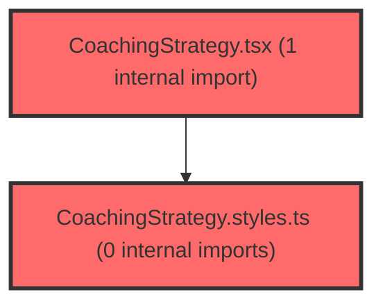

> [!IMPORTANT]
> **⚠️ 수동 검토 권장 (자가힐링 주의)**
>
> AI 자가힐링 결과물이 실제 의도와 다를 수 있으므로, **상세 리뷰 내용에 기반한 수동 점검**을 우선해 주시기 바랍니다. 자가힐링 기능을 활용하실 경우 최종 결과물을 신중하게 확인해 주세요.

# 코드 리뷰 - e0d52e4e

## 코드 복잡도 분석

**분석된 파일**: 8개 / 변경된 파일: 8개


### Import 의존관계 다이어그램



**범례**: 중심 파일 (변경됨) | 많은 import (10개 이상)


### 정상 범위 (NONE)


**`usecoachingstrategy.ts`** (other)

- 평균 복잡도: **0.004**

- 최대 복잡도: 0.013

- 청크 수: 3개


**권장사항:**

- 복잡도 정상 범위


**`dashboardservice.ts`** (other)

- 평균 복잡도: **0.003**

- 최대 복잡도: 0.011

- 청크 수: 50개


**권장사항:**

- 파일 크기가 큼 (50개 청크) - 파일 분리 검토


**`index.ts`** (other)

- 평균 복잡도: **0.001**

- 최대 복잡도: 0.002

- 청크 수: 2개


**권장사항:**

- 복잡도 정상 범위


**`coachingstrategy.styles.ts`** (other)

- 평균 복잡도: **0.001**

- 최대 복잡도: 0.010

- 청크 수: 154개


**권장사항:**

- 파일 크기가 큼 (154개 청크) - 파일 분리 검토


**`studentdashboardpage.tsx`** (component)

- 평균 복잡도: **0.001**

- 최대 복잡도: 0.006

- 청크 수: 40개


**권장사항:**

- 파일 크기가 큼 (40개 청크) - 파일 분리 검토


**`coachingstrategy.tsx`** (other)

- 평균 복잡도: **0.000**

- 최대 복잡도: 0.002

- 청크 수: 5개


**권장사항:**

- 복잡도 정상 범위


**`index.ts`** (other)

- 평균 복잡도: **0.000**

- 최대 복잡도: 0.000

- 청크 수: 1개


**권장사항:**

- 복잡도 정상 범위


**`coachingstrategy.tsx`** (other)

- 평균 복잡도: **0.000**

- 최대 복잡도: 0.002

- 청크 수: 125개


**권장사항:**

- 파일 크기가 큼 (125개 청크) - 파일 분리 검토


---


## 변경 배경

이 커밋은 **지식그래프(Neo4j) 기반 코칭 전략 기능**을 프론트엔드에 통합하는 작업입니다. 기존에는 프론트엔드에서 `interventionRanker` 유틸리티로 T점수 기반 개입 전략을 자체 계산했으나, 이제는 백엔드 Neo4j API(`graphYn='Y'`)가 제공하는 추천 경로(`ModerationPath`)를 직접 표시하도록 전환합니다.

- **목적**: 백엔드 지식그래프 기반 추천 경로를 UI에 표시하고, 기존 프론트엔드 자체 계산 로직을 제거
- **도메인**: UI 컴포넌트 리팩토링 + API 데이터 연동
- **변경 방향**: 프론트엔드 계산 -> 백엔드 API 응답 기반으로 전환, 스타일드 컴포넌트 테마 시스템 활용도 향상

---

## [GOOD] 잘된 점

**1. 타입 정의의 명확성**

`ModerationPath`, `GraphRecommendation`, `RecommendationByOrd` 인터페이스가 `dashboardService.ts`에 잘 정의되어 있어 데이터 구조가 명확합니다. 특히 `y?`를 옵셔널로 처리한 점이 실제 데이터 스키마를 잘 반영합니다.

```typescript
// frontend/src/shared/services/dashboardService.ts (라인 112-125)
export interface ModerationPath {
  id: string;
  pathType: string;
  x: string;
  z: string;
  y?: string;          // outcome이 없는 경로도 존재
  strategy: string;
  keywordInterp?: string;
  keywordStrat?: string;
  interpretation?: string;
  pathColor?: string;
  className?: string;
  schoolLevel?: string;
  classDescription?: string;
}
```

**2. 점진적 마이그레이션 전략**

기존 `CoachingStrategy` 컴포넌트의 Props에 `moderationPaths`, `typeName` 등 새로운 Props를 추가하면서도, 레거시 Props(`predictedType`, `schoolLevel`, `tScores`)를 fallback으로 남겨둔 점이 안정적인 전환을 가능하게 합니다. 이는 다른 페이지에서 아직 기존 방식을 사용 중일 수 있음을 고려한 설계입니다.

**3. 스타일 일관성 개선**

하드코딩된 CSS 값(`padding: 1rem`, `border-radius: 0.5rem` 등)을 테마 시스템(`theme.spacing.md`, `theme.radius.md`)으로 일괄 전환하여 디자인 일관성을 높였습니다. 스크롤바 커스터마이징과 반응형 레이아웃(`@media (max-width: 768px)`)도 잘 추가되었습니다.

---

## 변경사항 요약

- `CoachingStrategy` 컴포넌트를 프론트엔드 자체 계산 방식에서 백엔드 Neo4j API 응답 기반으로 전환
- `useCoachingStrategy` 훅을 추가하여 API 호출 및 상태 관리 분리
- `dashboardService.ts`에 Neo4j 지식그래프 관련 타입 정의 추가
- `StudentDashboardPage`에 코칭 전략 버튼 및 모달 연동

---

## [ISSUE] 개선이 필요한 부분

### Critical (즉시 수정 필요)

없음

### High (우선 수정 권장)

**1. `useCoachingStrategy`에서 `paperIdx` 하드코딩 (`'1'`)**

`useCoachingStrategy` 훅이 `fetchStudentAnalysis`를 호출할 때 `paperIdx`를 `'1'`로 고정하고 있습니다. `StudentDashboardPage`에서는 `selectedRound`(1 또는 2)를 인자로 전달하지만, `paperIdx`는 항상 `'1'`입니다.

`fetchStudentAnalysis` 함수의 시그니처를 보면 `paperIdx`와 `ordNo`(round)는 독립적인 파라미터입니다:

```typescript
// frontend/src/shared/services/dashboardService.ts (라인 366-377)
export async function fetchStudentAnalysis(
  classId: string,
  stdtId: string,
  paperIdx: string = '1',   // paperIdx
  ordNo: number = 1,         // round
  graphYn: 'Y' | 'N' = 'N',
): Promise<{ ... }>
```

만약 2회차 평가에서 `paperIdx`가 `'1'`이 아닌 다른 값이 필요하거나, `paperIdx`가 `round`와 독립적인 개념이라면 이는 잠재적 버그입니다.

- **파일**: `frontend/src/features/student-dashboard/api/useCoachingStrategy.ts`
- **위치 (라인 24)**: `'1', // paperIdx`
- **기존 코드**:
```typescript
const data = await fetchStudentAnalysis(
  classId,
  studentId,
  '1', // paperIdx
  round,
  'Y', // graphYn='Y' -> Neo4j 추천 포함
);
```
- **해결 방안**: `paperIdx`를 파라미터로 받거나, `round`와 동일한 값으로 처리할지 명확히 해야 합니다. 만약 `paperIdx`가 항상 `'1'`이 맞다면, 주석에 그 이유를 명시하거나 상수로 추출하여 의도를 분명히 하세요.
```typescript
export function useCoachingStrategy(
  classId: string,
  studentId: string,
  round: 1 | 2 = 1,
  paperIdx: string = '1',  // paperIdx 파라미터 추가 (기본값 '1')
) {
  // ...
  const data = await fetchStudentAnalysis(
    classId,
    studentId,
    paperIdx,
    round,
    'Y',
  );
```

**2. `strategy.split(/(?<=\.) /)` 정규식의 문장 분할 오류 가능성**

`CoachingStrategy.tsx`에서 `selectedPath.strategy`를 문장 단위로 분할할 때 `split(/(?<=\.) /)`를 사용하고 있습니다. 이는 마침표 뒤에 공백이 있는 경우에만 분할되므로, 다음과 같은 문제가 있습니다:

- 문장 끝에 마침표가 없거나 줄바꿈(`\n`)으로 끝나는 경우 분할되지 않음
- `e.g.`나 `i.e.` 같은 약어가 포함된 경우 의도치 않게 분할됨
- 느낌표(`!`)나 물음표(`?`)로 끝나는 문장은 분할되지 않음

- **파일**: `frontend/src/features/knowledge-graph/ui/CoachingStrategy/CoachingStrategy.tsx`
- **위치 (라인 155)**: `{selectedPath.strategy.split(/(?<=\.) /).map(...)}`
- **기존 코드**:
```typescript
{selectedPath.strategy.split(/(?<=\.) /).map((sentence, i) => (
  <S.StrategyParagraph key={i}>
    {sentence}
  </S.StrategyParagraph>
))}
```
- **해결 방안**: 더 포괄적인 문장 분할 정규식을 사용하거나, 백엔드에서 이미 배열로 내려주는 `keywordStrat` 필드를 활용하는 것을 고려하세요.
```typescript
// 옵션 1: 더 포괄적인 문장 분할
{selectedPath.strategy
  .split(/(?<=[.!?])\s+/)
  .filter(Boolean)
  .map((sentence, i) => (
    <S.StrategyParagraph key={i}>
      {sentence}
    </S.StrategyParagraph>
  ))}

// 옵션 2: keywordStrat 필드가 배열이라면 우선 활용
// (ModerationPath에 keywordStrat?: string 으로 정의되어 있으나
//  실제로 배열인지 문자열인지 확인 필요)
```

### Medium (개선 권장)

**1. `CoachingStrategy.styles.ts`의 `InterpretationBox`에 하드코딩된 border 색상**

`InterpretationBox`의 `border: 1px solid #fbbf24`가 테마 컬러가 아닌 하드코딩된 값입니다. 다른 스타일은 모두 테마를 사용하고 있으므로 일관성을 위해 테마 값으로 변경하는 것이 좋습니다.

- **파일**: `frontend/src/features/knowledge-graph/ui/CoachingStrategy/CoachingStrategy.styles.ts`
- **위치 (라인 340)**: `border: 1px solid #fbbf24;`
- **기존 코드**:
```typescript
export const InterpretationBox = styled.div`
  padding: ${({ theme }) => theme.spacing.md};
  background: ${({ theme }) => theme.colors.warning.light};
  border: 1px solid #fbbf24;
  border-radius: ${({ theme }) => theme.radius.md};
```
- **해결 방안**: 테마에 `warning` 관련 border 색상이 있다면 활용하고, 없다면 상수로 추출하거나 주석으로 의도를 남기세요.
```typescript
export const InterpretationBox = styled.div`
  padding: ${({ theme }) => theme.spacing.md};
  background: ${({ theme }) => theme.colors.warning.light};
  border: 1px solid ${({ theme }) => theme.colors.warning.main || '#fbbf24'};
  border-radius: ${({ theme }) => theme.radius.md};
```

**2. `CoachingStrategy.tsx`에서 `key={path.id}` 사용 시 중복 가능성**

`moderationPaths.map((path, idx) => ...)`에서 `key={path.id}`를 사용하고 있습니다. `path.id`가 백엔드에서 고유하게 보장된다면 문제없지만, 만약 중복될 가능성이 있다면 `idx`를 조합하는 것이 안전합니다.

- **파일**: `frontend/src/features/knowledge-graph/ui/CoachingStrategy/CoachingStrategy.tsx`
- **위치 (라인 103)**: `key={path.id}`
- **제안**: `key={`${path.id}-${idx}`}` 또는 `key={idx}` (경로 목록은 순서가 고정되어 재정렬되지 않으므로 idx도 무방)

---

## 주요 파일 분석

### `frontend/src/features/student-dashboard/api/useCoachingStrategy.ts` (신규)

**변경 내용**: 코칭 전략 데이터를 조회하는 커스텀 훅. 버튼 클릭 시 `fetchStudentAnalysis`를 `graphYn='Y'`로 호출하여 Neo4j 추천 경로를 조회합니다.

**개선 제안**:
1. `paperIdx` 하드코딩 -> 파라미터화 (High 이슈 #1 참조)
2. `recommendations` 접근 시 타입 안전성 개선: `data.recommendations`가 `RecommendationByOrd | undefined` 타입이므로, `data.recommendations?.[String(round)]`로 안전하게 접근하고 있습니다. 이 부분은 잘 처리되었습니다.

### `frontend/src/features/knowledge-graph/ui/CoachingStrategy/CoachingStrategy.tsx` (신규)

**변경 내용**: 지식그래프 기반 코칭 전략 모달 컴포넌트. 좌측 패널(경로 리스트) + 우측 패널(상세 정보) 레이아웃.

**개선 제안**:
1. `strategy.split(/(?<=\.) /)` 정규식 보강 (High 이슈 #2 참조)
2. `key={path.id}` -> `key={`${path.id}-${idx}`}` (Medium 이슈 #2 참조)

### `frontend/src/features/student-dashboard/ui/CoachingStrategy.tsx` (수정)

**변경 내용**: 기존 컴포넌트를 새로운 API 기반으로 전환. Props 인터페이스 변경, 스타일 테마 시스템 적용, 레거시 로직(`rankInterventions`, `getRelevanceBarColor` 등) 제거.

**개선 제안**: 레거시 Props(`predictedType`, `schoolLevel`, `tScores`)가 fallback으로 남아있지만, 실제로는 사용되지 않고 있습니다. 향후 완전히 제거할 계획이라면 `@deprecated` JSDoc 태그를 추가하는 것이 좋습니다.

---

## 최종 평가

**결론**:
- [ ] [OK] **승인 (Approved)**
- [ ] [WARN] **조건부 승인 (Approved with Comments)**
- [X] [FIX] **수정 필요 (Changes Requested)** - High 이슈 2건 존재

**종합 의견:**

전체적으로 아키텍처 전환 방향이 명확하고 코드 품질도 양호합니다. 특히 타입 정의의 명확성과 점진적 마이그레이션 전략은 모범적인 접근법입니다.

다만 다음 2건의 High 이슈는 운영 환경에서 실제 문제로 이어질 수 있으므로, 배포 전에 반드시 검토 및 수정이 필요합니다:

1. **`paperIdx` 하드코딩 (`'1'`)**: `useCoachingStrategy` 훅에서 `paperIdx`를 `'1'`로 고정하고 있어, 2회차 평가나 다른 `paperIdx`가 필요한 시나리오에서 데이터 불일치가 발생할 수 있습니다. `paperIdx`를 파라미터로 추출하거나, 항상 `'1'`이 맞다면 그 이유를 명확히 문서화하세요.

2. **`strategy` 문장 분할 정규식**: `split(/(?<=\.) /)`는 마침표+공백 패턴에만 의존하므로, 느낌표/물음표로 끝나는 문장이나 줄바꿈이 포함된 경우 분할되지 않습니다. 백엔드 데이터의 실제 포맷을 확인하고 이에 맞는 정규식으로 보강하세요.

위 2건의 High 이슈만 해결되면 바로 승인 가능한 수준입니다. 수고하셨습니다.