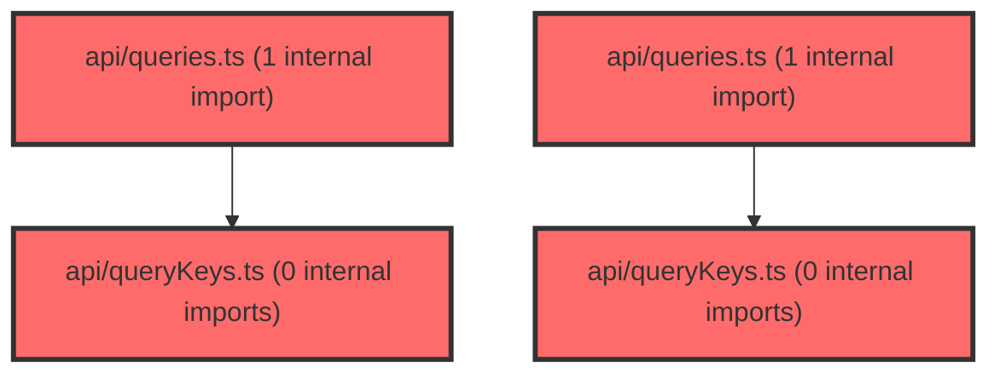

> [!IMPORTANT]
> **⚠️ 수동 검토 권장 (자가힐링 주의)**
>
> AI 자가힐링 결과물이 실제 의도와 다를 수 있으므로, **상세 리뷰 내용에 기반한 수동 점검**을 우선해 주시기 바랍니다. 자가힐링 기능을 활용하실 경우 최종 결과물을 신중하게 확인해 주세요.

# 코드 리뷰 - e0ebc4f6

## 코드 복잡도 분석

**분석된 파일**: 10개 / 변경된 파일: 10개


### Import 의존관계 다이어그램



**범례**: 중심 파일 (변경됨) | 많은 import (10개 이상)


### 정상 범위 (NONE)


**`usescopesync.ts`** (other)

- 평균 복잡도: **0.005**

- 최대 복잡도: 0.013

- 청크 수: 11개


**권장사항:**

- 복잡도 정상 범위


**`scopeutils.ts`** (utility)

- 평균 복잡도: **0.004**

- 최대 복잡도: 0.009

- 청크 수: 13개


**권장사항:**

- 복잡도 정상 범위


**`queries.ts`** (other)

- 평균 복잡도: **0.003**

- 최대 복잡도: 0.012

- 청크 수: 42개


**권장사항:**

- 파일 크기가 큼 (42개 청크) - 파일 분리 검토


**`useapidata.ts`** (other)

- 평균 복잡도: **0.002**

- 최대 복잡도: 0.010

- 청크 수: 59개


**권장사항:**

- 파일 크기가 큼 (59개 청크) - 파일 분리 검토


**`querykeys.ts`** (other)

- 평균 복잡도: **0.002**

- 최대 복잡도: 0.002

- 청크 수: 2개


**권장사항:**

- 복잡도 정상 범위


**`assessmentpage.tsx`** (component)

- 평균 복잡도: **0.002**

- 최대 복잡도: 0.011

- 청크 수: 48개


**권장사항:**

- 파일 크기가 큼 (48개 청크) - 파일 분리 검토


**`layoutcontext.tsx`** (other)

- 평균 복잡도: **0.002**

- 최대 복잡도: 0.009

- 청크 수: 17개


**권장사항:**

- 복잡도 정상 범위


**`queries.ts`** (other)

- 평균 복잡도: **0.001**

- 최대 복잡도: 0.004

- 청크 수: 6개


**권장사항:**

- 복잡도 정상 범위


**`querykeys.ts`** (other)

- 평균 복잡도: **0.001**

- 최대 복잡도: 0.002

- 청크 수: 3개


**권장사항:**

- 복잡도 정상 범위


**`index.ts`** (other)

- 평균 복잡도: **0.000**

- 최대 복잡도: 0.000

- 청크 수: 3개


**권장사항:**

- 복잡도 정상 범위


---


## 변경 배경

이 커밋은 두 가지 주요 리팩토링 목적을 가지고 있습니다. 첫째, 그룹 관련 React Query 키(`queryKeys`)와 훅(`queries`)을 `@features/groups` 도메인으로 응집시켜 도메인 간 의존성을 정리합니다. 둘째, Scope 동기화 로직을 `useScopeSync` 훅으로 단일화하여 `LayoutContext`의 복잡도를 낮추고, URL과 애플리케이션 상태 간의 동기화 방식을 단방향 데이터 흐름으로 단순화합니다.

- **목적**: 그룹 쿼리 키/훅의 도메인 응집도 향상 및 Scope 동기화 로직 단순화
- **도메인**: API (React Query), 비즈니스 로직 (Scope 관리)
- **변경 방향**: assessment 도메인에 분산된 그룹 관련 쿼리를 groups 도메인으로 이동, LayoutContext 내 중복된 URL 동기화 로직을 useScopeSync 훅으로 통합

---

## [GOOD] 잘된 점

**1. 도메인 응집도 향상**

`useAssessmentGroupMembersQuery`를 assessment 도메인에서 제거하고 `useGroupMembersQuery`를 groups 도메인에 새로 생성한 점이 적절합니다. `groupKeys` 객체도 함께 groups 도메인에 위치시켜, 그룹 데이터에 대한 쿼리 키와 훅이 한 곳에서 관리되도록 개선했습니다.

변경 전: `@features/assessment/api/queries.ts`에 `useAssessmentGroupMembersQuery` 존재
변경 후: `@features/groups/api/queries.ts`에 `useGroupMembersQuery` 존재, `@features/groups/index.ts`에서 export

이를 통해 `AssessmentPage.tsx`의 import가 `@features/assessment`에서 `@features/groups`로 변경되어, 페이지 컴포넌트가 올바른 도메인에 의존하게 되었습니다.

**2. useScopeSync 훅 단순화 (양방향 -> 단방향)**

이전 버전의 `useScopeSync`는 `scope`와 `setScope`를 props로 받아 양방향 동기화를 수행했으며, `isSyncingRef`를 사용한 복잡한 무한 루프 방지 로직이 포함되어 있었습니다.

```typescript
// 이전: 양방향 동기화 + useRef 기반 동기화 방지
export function useScopeSync({ scope, setScope, enabled }: UseScopeSyncOptions): UseScopeSyncReturn {
  const isSyncingRef = useRef(false);
  const lastScopeRef = useRef<Scope>(scope);
  // ... 복잡한 useEffect 두 개
}
```

새 버전은 단순히 `urlScope`(읽기 전용)와 `updateURL`(쓰기 전용)만 반환하는 단방향 데이터 흐름으로 단순화했습니다. 이제 `LayoutContext`가 단일 진실 공급원(Single Source of Truth) 역할을 하며, URL은 단순히 상태를 영속화(persist)하는 매체로만 사용됩니다.

```typescript
// 현재: 단방향 데이터 흐름
export function useScopeSync(): UseScopeSyncReturn {
  const [searchParams, setSearchParams] = useSearchParams();
  const urlScope = useMemo(
    () => parseScopeFromSearchParams(new URLSearchParams(searchParams.toString())),
    [searchParams.toString()],
  );
  // ...
  return { urlScope, updateURL };
}
```

**3. adjustScopeForMenu 메모리 일관성 강화**

`level === 'class' && !menuConfig.class` 분기에서 `scopeMemory.lastClassId === classId` 조건을 추가하여, 다른 classId의 메모리가 잘못 복원되는 것을 방지했습니다. 또한 `isScopeMemoryEqual` 함수를 새로 추가하여 `scopeMemory`의 변경 여부를 정확히 비교할 수 있게 되어, 불필요한 상태 업데이트를 방지합니다.

---

## 변경사항 요약

| 파일 | 변경 유형 | 설명 |
|------|----------|------|
| `useApiData.ts` | 수정 | `'my-groups'` 문자열 키 -> `groupKeys.myGroups(userId)` |
| `assessment/api/queries.ts` | 수정 | `useAssessmentGroupMembersQuery` 제거 |
| `assessment/api/queryKeys.ts` | 수정 | `groupMembers` 키 제거 |
| `groups/api/queries.ts` | 신규 생성 | `useGroupMembersQuery` 추가 |
| `groups/api/queryKeys.ts` | 신규 생성 | `groupKeys` 객체 추가 |
| `groups/index.ts` | 수정 | queries, queryKeys export 추가 |
| `AssessmentPage.tsx` | 수정 | import 변경 (assessment -> groups) |
| `scopeUtils.ts` | 수정 | `adjustScopeForMenu` 메모리 조건 강화, `isScopeMemoryEqual` 추가 |
| `useScopeSync.ts` | 수정 | 양방향 -> 단방향 리팩토링 |
| `LayoutContext.tsx` | 수정 | `useScopeSync` 적용, URL 동기화 로직 단순화 |

---

## [ISSUE] 개선이 필요한 부분

### Critical (즉시 수정 필요)

없음

### High (우선 수정 권장)

**1. `useScopeSync`의 `serializedSearchParams`로 인한 불필요한 객체 생성**

`useScopeSync`에서 `searchParams.toString()`을 변수에 할당하고, 이를 `useMemo`와 `useCallback`의 의존성으로 사용하고 있습니다. 문제는 `serializedSearchParams`가 컴포넌트 렌더링마다 새로운 문자열을 생성하고, `useMemo` 내부에서 `new URLSearchParams(serializedSearchParams)`로 다시 파싱하는 불필요한 연산이 발생한다는 점입니다.

- **위치**: `frontend/src/shared/scope/useScopeSync.ts`, 라인 17-18
- **기존 코드**:
```typescript
export function useScopeSync(): UseScopeSyncReturn {
  const [searchParams, setSearchParams] = useSearchParams();
  const serializedSearchParams = searchParams.toString();
  const urlScope = useMemo(
    () => parseScopeFromSearchParams(new URLSearchParams(serializedSearchParams)),
    [serializedSearchParams],
  );
```
- **해결 방안**: `searchParams` 객체 자체를 `useMemo`의 의존성으로 사용하고, 내부에서 직접 `parseScopeFromSearchParams`에 전달하면 됩니다. `parseScopeFromSearchParams`는 `URLSearchParams`의 `get()` 메서드만 사용하므로, `searchParams` 객체를 직접 전달해도 안전합니다.
```typescript
export function useScopeSync(): UseScopeSyncReturn {
  const [searchParams, setSearchParams] = useSearchParams();
  const urlScope = useMemo(
    () => parseScopeFromSearchParams(searchParams),
    [searchParams],
  );
```
이렇게 수정하면 `serializedSearchParams` 변수와 `new URLSearchParams()` 재파싱을 모두 제거할 수 있습니다. `updateURL`의 `useCallback` 의존성도 `[searchParams, setSearchParams]`로 변경해야 합니다.

**2. `LayoutContext.setScope`에서 `scope` 상태 업데이트 누락**

`setScope` 콜백이 `updateURL(newScope)`만 호출하고 `setScopeState(newScope)`를 호출하지 않습니다. URL 업데이트 후 `useEffect`에서 `urlScope` 변경을 감지하여 `setScopeState`가 호출되는 구조이지만, 이는 `useEffect`의 비동기적 특성상 한 박자 늦게 상태가 반영됩니다.

- **위치**: `frontend/src/widgets/layout/v2/LayoutContext.tsx`, 라인 48-52
- **기존 코드**:
```typescript
  const setScope = useCallback(
    (newScope: Scope) => {
      if (!isScopeEqual(newScope, scope)) {
        updateURL(newScope);
      }
    },
    [scope, updateURL],
  );
```
- **해결 방안**: `updateURL` 호출과 함께 `setScopeState`도 즉시 호출하여 상태를 동기화합니다.
```typescript
  const setScope = useCallback(
    (newScope: Scope) => {
      if (!isScopeEqual(newScope, scope)) {
        setScopeState(newScope);
        updateURL(newScope);
      }
    },
    [scope, updateURL],
  );
```
**영향 분석**: 현재 구조에서 `selectAll()`이나 `selectClass()` 호출 시 `scope` 상태가 즉시 변경되지 않아, 동일 렌더링 사이클에서 `scope`를 읽는 다른 로직이 이전 값을 참조할 수 있습니다. 예를 들어, `selectAll()` 호출 후 바로 `scope.level`을 읽으면 여전히 이전 값(`'class'` 또는 `'student'`)이 반환됩니다. `useEffect`에서 URL 변경을 감지하여 `setScopeState`가 호출되기까지 최소 한 번의 추가 렌더링이 필요합니다.

### Medium (개선 권장)

**3. `useMyGroups`의 `staleTime: 0` 재검토**

`useMyGroups`가 `staleTime: 0`으로 설정되어 있어 페이지 포커스 시마다(`refetchOnWindowFocus: true`) 항상 네트워크 요청이 발생합니다. 그룹 목록은 일반적으로 자주 변경되지 않는 데이터이므로, 적절한 `staleTime`을 설정하면 불필요한 API 호출을 줄일 수 있습니다.

- **위치**: `frontend/src/features/api/useApiData.ts`, 라인 548-549
- **제안**: `staleTime: 5 * 60 * 1000` (5분) 정도로 설정하는 것을 검토해보세요. 단, 이는 그룹 목록의 실시간성이 요구되는 정도에 따라 판단이 필요하므로, 팀 내 협의 후 적용하시기 바랍니다.

---

## 주요 파일 분석

### `frontend/src/shared/scope/useScopeSync.ts`

**변경 내용:** 양방향 동기화 훅에서 단순 읽기 전용 `urlScope` + 쓰기 전용 `updateURL`로 단순화

**개선 제안:**
1. `serializedSearchParams` 변수 제거 및 `searchParams` 직접 사용 (위 High #1 참조)
2. `buildScopeQueryString`과 `parseScopeFromSearchParams` 유틸 함수가 이 파일에 남아있는데, `scopeUtils.ts`로 이동하거나 별도 파일로 분리하는 것이 더 일관성 있습니다. 현재 `scopeUtils.ts`는 순수 함수만 포함하고, `useScopeSync.ts`는 훅과 유틸 함수가 혼재되어 있습니다.

### `frontend/src/widgets/layout/v2/LayoutContext.tsx`

**변경 내용:** `useSearchParams` 직접 사용 대신 `useScopeSync` 훅 사용, URL 동기화 로직 단순화

**개선 제안:**
1. `setScope` 콜백에서 `setScopeState` 누락 (위 High #2 참조)
2. `useEffect`의 의존성 배열이 `[currentMenuConfig, scope, scopeMemory, updateURL, urlScope]`로 변경되었습니다. 이전에는 `searchParams`와 `location.pathname`이 별도로 있었는데, 이제 `urlScope`가 pathname 변경을 반영하지 못할 수 있습니다. `urlScope`는 `searchParams` 변경만 반영하고, `location.pathname` 변경은 `currentMenuConfig`(내부적으로 `getMenuKeyFromPath(location.pathname)`)를 통해 간접적으로 반영됩니다. 이 구조가 의도된 것인지 확인이 필요합니다. 만약 pathname 변경 시에도 scope가 초기화되어야 한다면, `urlScope` 대신 `location.pathname`을 별도 의존성으로 추가하는 것을 고려해야 합니다.

### `frontend/src/features/groups/api/queries.ts` (신규)

**변경 내용:** `useGroupMembersQuery` 훅 생성

**개선 제안:**
- `queryFn`에서 `groupId!`와 `userId!`를 non-null assertion으로 사용하고 있습니다. `enabled: !!groupId && !!userId`로 가드되어 있지만, TypeScript의 타입 내로잉이 `queryFn` 클로저까지 전파되지 않아 어쩔 수 없는 선택입니다. `enabled` 조건과 `queryFn`의 타입 안전성을 위해 `groupId`와 `userId`를 별도 변수로 추출하는 패턴을 고려할 수 있습니다.
```typescript
export const useGroupMembersQuery = (
  groupId: string | null | undefined,
  userId: string | undefined,
) => {
  const enabled = !!groupId && !!userId;
  const safeGroupId = groupId ?? '';
  const safeUserId = userId ?? '';
  
  return useQuery({
    queryKey: groupKeys.members(safeGroupId, safeUserId),
    queryFn: () => getGroupMembers(safeGroupId, safeUserId),
    enabled,
  });
};
```
단, 이는 코드 스타일의 차이이므로 필수 수정 사항은 아닙니다.

---

## 최종 평가

**결론**:
- [ ] [OK] **승인 (Approved)** - Critical/High 이슈 없음
- [ ] [WARN] **조건부 승인 (Approved with Comments)** - Medium 이하 이슈만 존재
- [X] [FIX] **수정 필요 (Changes Requested)** - Critical/High 이슈 존재

**종합 의견:**

전반적으로 도메인 응집도 향상과 코드 단순화라는 명확한 목표를 가진 좋은 리팩토링입니다. 특히 `useScopeSync`를 양방향에서 단방향으로 전환한 결정과, 그룹 관련 쿼리를 올바른 도메인으로 이동시킨 점은 아키텍처 측면에서 올바른 방향입니다.

다만 두 가지 High 이슈가 확인되었습니다. 첫째, `useScopeSync`에서 `serializedSearchParams`를 통한 불필요한 객체 생성과 재파싱은 `searchParams`를 직접 사용하는 것으로 간단히 해결할 수 있습니다. 둘째, `LayoutContext.setScope`에서 `setScopeState` 누락은 잠재적인 상태 지연 문제를 일으킬 수 있으므로, `updateURL` 호출과 함께 즉시 상태를 업데이트하는 것이 안전합니다.

위 두 가지 High 이슈만 해결되면 바로 승인 가능한 수준의 코드 품질을 갖추고 있습니다.