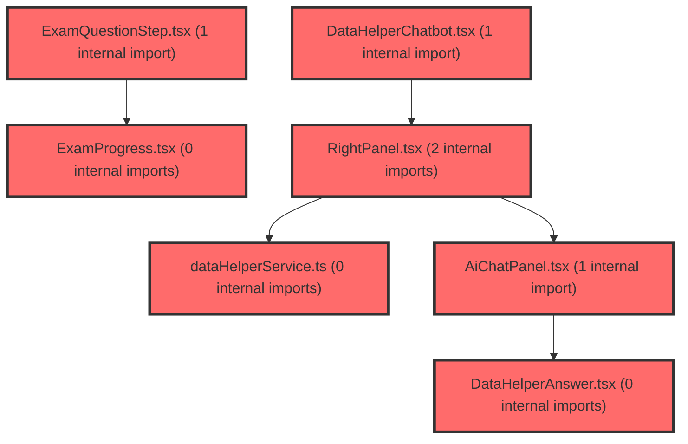

> [!IMPORTANT]
> **⚠️ 수동 검토 권장 (자가힐링 주의)**
>
> AI 자가힐링 결과물이 실제 의도와 다를 수 있으므로, **상세 리뷰 내용에 기반한 수동 점검**을 우선해 주시기 바랍니다. 자가힐링 기능을 활용하실 경우 최종 결과물을 신중하게 확인해 주세요.

# 코드 리뷰 - e2011141

## 코드 복잡도 분석

**분석된 파일**: 20개 / 변경된 파일: 21개


### Import 의존관계 다이어그램



**범례**: 중심 파일 (변경됨) | 많은 import (10개 이상)


### 정상 범위 (NONE)


**`groupcontroller.java`** (other)

- 평균 복잡도: **0.224**

- 최대 복잡도: 0.467

- 청크 수: 21개

- 평균 사용처: 27.2곳


**권장사항:**

- 파일 크기가 큼 (21개 청크) - 파일 분리 검토


**`securityutil.java`** (utility)

- 평균 복잡도: **0.177**

- 최대 복잡도: 0.475

- 청크 수: 8개

- 평균 사용처: 19.5곳


**권장사항:**

- 복잡도 정상 범위


**`dgnssservice.java`** (other)

- 평균 복잡도: **0.120**

- 최대 복잡도: 0.473

- 청크 수: 64개

- 평균 사용처: 13.8곳


**권장사항:**

- 파일 크기가 큼 (64개 청크) - 파일 분리 검토


**`dgnssgraphservice.java`** (other)

- 평균 복잡도: **0.005**

- 최대 복잡도: 0.008

- 청크 수: 7개


**권장사항:**

- 복잡도 정상 범위


**`dgnsslpaservice.java`** (other)

- 평균 복잡도: **0.004**

- 최대 복잡도: 0.007

- 청크 수: 20개


**권장사항:**

- 복잡도 정상 범위


**`rpgroupclient.java`** (other)

- 평균 복잡도: **0.003**

- 최대 복잡도: 0.007

- 청크 수: 10개


**권장사항:**

- 복잡도 정상 범위


**`examservice.ts`** (other)

- 평균 복잡도: **0.003**

- 최대 복잡도: 0.011

- 청크 수: 37개


**권장사항:**

- 파일 크기가 큼 (37개 청크) - 파일 분리 검토


**`groupondemandsyncservice.java`** (other)

- 평균 복잡도: **0.002**

- 최대 복잡도: 0.002

- 청크 수: 2개


**권장사항:**

- 복잡도 정상 범위


**`useexamstate.ts`** (store)

- 평균 복잡도: **0.002**

- 최대 복잡도: 0.011

- 청크 수: 31개


**권장사항:**

- 파일 크기가 큼 (31개 청크) - 파일 분리 검토

- Store 파일은 높은 연결도가 정상적임


**`datahelperservice.ts`** (utility)

- 평균 복잡도: **0.002**

- 최대 복잡도: 0.008

- 청크 수: 32개


**권장사항:**

- 파일 크기가 큼 (32개 청크) - 파일 분리 검토


**`exampage.tsx`** (component)

- 평균 복잡도: **0.002**

- 최대 복잡도: 0.013

- 청크 수: 40개


**권장사항:**

- 파일 크기가 큼 (40개 청크) - 파일 분리 검토


**`datahelperanswer.tsx`** (utility)

- 평균 복잡도: **0.001**

- 최대 복잡도: 0.014

- 청크 수: 35개


**권장사항:**

- 파일 크기가 큼 (35개 청크) - 파일 분리 검토


**`datahelperchatbot.tsx`** (utility)

- 평균 복잡도: **0.001**

- 최대 복잡도: 0.003

- 청크 수: 18개


**권장사항:**

- 복잡도 정상 범위


**`studentdashboardpage.tsx`** (component)

- 평균 복잡도: **0.001**

- 최대 복잡도: 0.008

- 청크 수: 48개


**권장사항:**

- 파일 크기가 큼 (48개 청크) - 파일 분리 검토


**`examprogress.tsx`** (other)

- 평균 복잡도: **0.000**

- 최대 복잡도: 0.004

- 청크 수: 27개


**권장사항:**

- 파일 크기가 큼 (27개 청크) - 파일 분리 검토


**`examquestionstep.tsx`** (other)

- 평균 복잡도: **0.000**

- 최대 복잡도: 0.000

- 청크 수: 30개


**권장사항:**

- 파일 크기가 큼 (30개 청크) - 파일 분리 검토


**`aichatpanel.tsx`** (other)

- 평균 복잡도: **0.000**

- 최대 복잡도: 0.004

- 청크 수: 47개


**권장사항:**

- 파일 크기가 큼 (47개 청크) - 파일 분리 검토


**`rightpanel.tsx`** (other)

- 평균 복잡도: **0.000**

- 최대 복잡도: 0.005

- 청크 수: 38개


**권장사항:**

- 파일 크기가 큼 (38개 청크) - 파일 분리 검토


**`myexamlistpage.tsx`** (component)

- 평균 복잡도: **0.000**

- 최대 복잡도: 0.005

- 청크 수: 105개


**권장사항:**

- 파일 크기가 큼 (105개 청크) - 파일 분리 검토


**`myresultpage.tsx`** (component)

- 평균 복잡도: **0.000**

- 최대 복잡도: 0.008

- 청크 수: 91개


**권장사항:**

- 파일 크기가 큼 (91개 청크) - 파일 분리 검토


---


## 변경 배경

이 커밋은 크게 세 가지 기능 변경을 포함합니다:

1. **자기조절학습검사(paperIdx=2) 지원**: LPA(Latent Profile Analysis) 분류와 그래프 추천을 종합검사(paperIdx=1)로 제한하여, 자기조절검사에서는 불필요한 LPA 분류 시도와 그래프 추천 응답을 제거합니다.
2. **그룹 on-demand 동기화(group-from-idp) 도입**: 사용자가 그룹 목록 조회 시점에 Auth(IdP)에서 본인 그룹을 즉시 당겨와 로컬 DB에 반영하여, 기존 1분 폴링의 지연을 사용자 체감상 0으로 단축합니다.
3. **프론트엔드 검사 페이지 리팩토링**: 자기조절검사와 학습종합검사의 페이징/UI 로직을 paperIdx로 분기하고, AI 채팅 패널을 별도 컴포넌트로 분리합니다.

- **도메인**: 비즈니스 로직(진단검사 LPA/그래프) + API/인프라(그룹 동기화) + UI(프론트엔드)
- **변경 방향**: 예외 throw 대신 빈 응답 반환(탄력적 처리), 조건부 실행(paperIdx 분기), on-demand 동기화 도입

---

## [GOOD] 잘된 점

### 1. DgnssGraphService: 예외를 빈 응답으로 대체한 설계

`selectRecommendationByAnswerIdx`에서 LPA 결과나 유형이 없는 경우(자기조절검사, 미분류 등) `IllegalArgumentException`을 throw하던 것을 `emptyRecommendation()` 메서드로 대체했습니다.

```java
// 변경 전: 예외 throw
if (MapUtils.isEmpty(lpaResult)) {
    throw new IllegalArgumentException("answerIdx에 대한 LPA 결과가 없습니다. answerIdx=" + answerIdx);
}
// ... 중간 코드 ...
if (StringUtils.isBlank(className)) {
    throw new IllegalArgumentException("LPA 유형(typeName)이 비어 있습니다. answerIdx=" + answerIdx);
}

// 변경 후: 빈 응답 반환
String className = MapUtils.isEmpty(lpaResult) ? "" : MapUtils.getString(lpaResult, "typeName", "");
if (MapUtils.isEmpty(lpaResult) || StringUtils.isBlank(className)) {
    return emptyRecommendation(answerIdx, lpaResult);
}
```

이 변경의 장점은 두 가지입니다. 첫째, `DgnssService.fetchGraphRecommendationByOrd`에서 try-catch로 예외를 흡수하고 빈 Map을 넣던 로직이 더 이상 필요 없어집니다(정상 흐름으로 처리). 둘째, `DgnssController`의 직접 API(`/api/dgnss/graph/recommendation/by-answer/{answerIdx}`)를 호출하는 클라이언트도 항상 일관된 응답 구조(`strengths`, `weaknesses`, `typeDeviations`, `moderationPaths` 필드를 포함한 Map)를 받을 수 있습니다.

### 2. GroupOnDemandSyncService: 장애 격리와 디바운스 설계

새로 추가된 `GroupOnDemandSyncService`는 다음과 같은 적절한 설계 결정을 포함합니다:

- **장애 격리**: 모든 예외를 try-catch로 흡수하여 화면 로딩을 차단하지 않음. 폴링이 백업 역할을 수행.
- **디바운스**: `ConcurrentHashMap` 기반 30초 최소 간격으로 동일 사용자의 연속 호출을 방지.
- **PII 마스킹**: 로그에 `PiiMasker.maskUuid(spUserId)`를 사용하여 개인정보 보호.
- **기능 플래그**: `GroupSyncProperties.isEnabled()`로 운영/개발 환경에서 점진적 배포 가능.

```java
public void syncMyGroups(String spUserId, String userType, String bearerToken) {
    if (!props.isEnabled() || spUserId == null || bearerToken == null) {
        return;
    }
    if (!isDue(spUserId)) {
        return; // 디바운스
    }
    try {
        // ... 동기화 로직 ...
    } catch (Exception e) {
        log.warn("[GROUP-SYNC] on-demand 실패(스킵): spUserId={}, userType={}, error={}",
                PiiMasker.maskUuid(spUserId), userType, e.getMessage());
    }
}
```

### 3. 프론트엔드 paperIdx 분기 처리의 일관성

`examService.ts`의 `fetchQuestions`, `resetExam`, `getPageFromAnsweredCount` 함수와 `ExamProgress`, `ExamQuestionStep` 컴포넌트에 걸쳐 paperIdx 파라미터를 일관되게 전달하고, 학습종합검사(paperIdx='1')와 자기조절검사(그 외)의 페이징/제출 로직을 명확히 분기한 점이 체계적입니다.

특히 `ExamQuestionStep`의 제출 조건 분기가 현실적입니다:

```typescript
const canSubmit =
    allCurrentPageAnswered &&
    (answeredCount >= totalQuestions || (paperIdx === '1' && answeredCount >= 124));
```

학습종합검사(124문항)는 API의 fullCount가 부정확할 수 있어 124 fallback을 유지하고, 자기조절검사는 API 응답 기반 `totalQuestions`를 그대로 사용합니다.

---

## 변경사항 요약

백엔드 7개 파일, 프론트엔드 7개 파일이 변경되었습니다. 주요 변경사항은 다음과 같습니다:

| 파일 | 변경 유형 | 핵심 내용 |
|------|----------|-----------|
| `DgnssGraphService.java` | 수정 | LPA 결과/유형 없을 때 예외 대신 빈 추천 반환 |
| `DgnssLpaService.java` | 수정 | LPA 분류를 paperIdx=1로 제한, 고등학교 미지원 처리 |
| `DgnssService.java` | 수정 | 그래프 추천을 paperIdx=1일 때만 포함 |
| `GroupController.java` | 수정 | 그룹 목록 조회 시 on-demand 동기화 호출 |
| `RpGroupClient.java` | 수정 | 교사/학생 본인 그룹 ID 목록 조회 메서드 추가 |
| `GroupOnDemandSyncService.java` | 신규 | on-demand 그룹 동기화 서비스 |
| `SecurityUtil.java` | 수정 | 현재 Bearer 토큰 추출 메서드 추가 |
| `examService.ts` | 수정 | 자기조절검사 페이징 지원 |
| `AiChatPanel.tsx` | 신규 | AI 채팅 패널 컴포넌트 |
| `DataHelperChatbot.tsx` | 수정 | AI 채팅 기능을 AiChatPanel로 분리 리팩토링 |
| `RightPanel.tsx` | 수정 | AI 챗봇 탭 추가, 레이아웃 개선 |

---

## [ISSUE] 개선이 필요한 부분

### Critical (즉시 수정 필요)

없음

### High (우선 수정 권장)

#### 1. GroupOnDemandSyncService의 디바운스가 멀티인스턴스 환경에서 무력화됨

**문제**: `GroupOnDemandSyncService`는 `ConcurrentHashMap<String, Long> lastSyncAt`을 인메모리로 관리합니다. 동일 사용자의 요청이 여러 인스턴스에 분산되어 도착하면 각 인스턴스가 독립적으로 30초 디바운스를 적용하므로, 실제로는 더 짧은 간격으로 RP API가 중복 호출될 수 있습니다.

**분석**: Javadoc에 "재기동/멀티인스턴스에 느슨해도 무방(호출 줄이기 목적)"이라고 명시되어 있어 의도된 설계임을 인지하고 있습니다. 기능상 문제(데이터 정합성)보다는 RP API 호출량 증가로 이어집니다. Redis나 DB 기반 분산 락으로 전환할 수도 있지만, 현재 단계에서는 오버엔지니어링일 수 있습니다.

**권장 사항**: **현행 유지**. 다만, 모니터링을 위해 `syncMyGroups`의 호출 건수와 디바운스로 스킵된 건수를 메트릭으로 수집하는 것을 검토하세요. 호출량이 예상보다 많다면 그때 분산 디바운스 도입을 고려해도 늦지 않습니다.

#### 2. DgnssGraphService: schoolLevel 빈 값에 대한 방어 로직 부재

**문제**: `selectRecommendationByAnswerIdx`에서 LPA 결과는 존재하지만 `schoolLevel`이 빈 문자열인 경우, 이후 `queryGroupTScores(className, "")`와 `queryModerationPaths(className, "", limit)`가 호출됩니다. Neo4j 쿼리에서 `$schoolLevel = ''` 조건으로 처리되므로 SQL 인젝션 위험은 없지만, 의도치 않은 결과(전체 학교급 대상 조회)를 반환할 수 있습니다.

**분석**: `selectRecommendationByType` 메서드(L49)에서는 `schoolLevel`이 빈 문자열이어도 동일한 쿼리 패턴으로 처리되므로, 기존 코드와 일관성은 있습니다. 그러나 `selectModerationPathsByClass` 메서드(L30)도 동일한 패턴을 사용하므로, schoolLevel이 빈 값으로 전달될 경우의 비즈니스적 의미를 명확히 할 필요가 있습니다.

**권장 사항**: schoolLevel이 빈 경우 로그 경고를 남기거나, 최소한 `selectRecommendationByAnswerIdx`의 schoolLevel 추출 직후에 방어 코드를 추가하는 것을 검토하세요.

```java
String schoolLevel = MapUtils.getString(lpaResult, "schoolLevel", "");
if (StringUtils.isBlank(schoolLevel)) {
    log.warn("schoolLevel이 비어 있습니다. answerIdx={}, className={}", answerIdx, className);
    // 필요 시 빈 추천 반환 또는 기본값 할당
}
```

### Medium (개선 권장)

#### 1. DgnssLpaService.resolveModelSchoolLevel: 고등학교 미지원의 명시적 표현

`resolveModelSchoolLevel`에서 고등학교("high")에 대한 분기를 제거하고 빈 문자열을 반환하도록 변경했습니다. 주석으로 의도는 명확하나, 빈 문자열보다는 별도의 상수(예: `"unsupported"`)나 enum을 사용하는 것이 가독성과 추적성에 더 좋습니다. 현재는 `resolveTargetClasses("")`가 `Collections.emptyList()`를 반환하고, 이후 `upsertUnsupportedResult(studentInfo, storedSchoolLevel, "UNSUPPORTED")`로 이어지므로 동작에는 문제가 없습니다. 선택적 개선 사항입니다.

#### 2. 프론트엔드 useExamState 초기값 변경의 UI 글리치 가능성

`useExamState.ts`에서 `totalQuestions: 124` → `totalQuestions: 0`, `totalPages: 7` → `totalPages: 0`으로 변경되었습니다. `ExamProgress` 컴포넌트에서 `totalQuestions > 0 ? (answeredCount / totalQuestions) * 100 : 0`으로 분기 처리되어 있어 0으로 나누기 문제는 없습니다. 그러나 초기 렌더링 시 `0/0`으로 표시되었다가 API 응답 후 갱신되는 순간적인 UI 변화(깜빡임)가 발생할 수 있습니다. Skeleton UI나 로딩 상태에서 Progress를 아예 표시하지 않는 방법을 고려해볼 수 있습니다.

---

## 최종 평가

**결론**: 
- [ ] [OK] **승인 (Approved)** - Critical/High 이슈 없음
- [x] [WARN] **조건부 승인 (Approved with Comments)** - Medium 이하 이슈만 존재
- [ ] [FIX] **수정 필요 (Changes Requested)** - Critical/High 이슈 존재

**종합 의견:**

전반적으로 코드 품질이 우수하고, 각 변경의 의도가 코드와 주석에 잘 드러나 있습니다. 특히 다음과 같은 점이 인상적입니다:

- `DgnssGraphService`의 예외 throw를 빈 응답 반환으로 전환한 것은 API 설계 원칙(일관된 응답 구조, 클라이언트 오류 처리 단순화)에 부합하는 좋은 결정입니다.
- `GroupOnDemandSyncService`의 장애 격리, 디바운스, PII 마스킹, 기능 플래그 설계는 실무에서 바로 운영에 투입해도 무방할 정도로 견고합니다.
- 프론트엔드의 paperIdx 분기 처리가 서비스/컴포넌트 전반에 걸쳐 일관성 있게 적용되어 유지보수성이 높습니다.

멀티인스턴스 환경에서의 디바운스 한계는 Javadoc에 이미 인지하고 명시된 사항이며, 현재 수준에서 기능상 문제가 없으므로 승인해도 무방합니다. High 이슈로 지적한 schoolLevel 방어 로직 부재는 실제 장애로 이어질 가능성이 낮지만, 코드의 예측 가능성을 높이기 위해 검토를 권장합니다.