> [!IMPORTANT]
> **수동 검토 대상 (자가힐링 주의)**
>
> 이 커밋은 변경 범위가 넓거나 로직의 복잡도가 높아 AI 자가힐링이 완벽하지 않을 수 있습니다.
> 아래 리뷰 내용을 바탕으로 **수동 검토를 우선**하시고, 자가힐링 기능을 사용하실 경우 결과물을 신중히 확인해 주시기 바랍니다.

# 코드 리뷰 - e2a3eec4

## 코드 복잡도 분석

**분석된 파일**: 13개 / 변경된 파일: 18개

### Import 의존관계 다이어그램

```mermaid
flowchart TD
    F0["JwtExpiredException.java (0 imports)"]
    F1["AidtCommonUtil.java (0 imports)"]
    F2["GuestAuthController.java (4 imports)"]:::center
    F3["GroupMemberMapper.java (1 imports)"]:::center
    F4["GroupService.java (18 imports)"]:::center
    F5["EmailVerificationService.java (0 imports)"]
    F6["RefreshTokenMapper.java (1 imports)"]:::center
    F7["GuestAuthService.java (8 imports)"]:::center
    F8["ConvertUtils.java (0 imports)"]
    F9["UserMapper.java (0 imports)"]
    F10["CustomBody.java (0 imports)"]
    F11["JwtAuthenticationFilter.java (3 imports)"]:::center
    F12["AuthFailedException.java (0 imports)"]
    F13["RefreshToken.java (0 imports)"]:::center
    F14["ResponseDTO.java (0 imports)"]
    F15["GroupInfoMapper.java (0 imports)"]
    F16["JwtUtil.java (2 imports)"]:::center
    F17["MemberService.java (11 imports)"]:::center
    F18["GroupQueryMapper.java (0 imports)"]
    F19["DgnssService.java (0 imports)"]
    F4 --> F8
    F4 --> F9
    F4 --> F5
    F4 --> F7
    F4 --> F17
    F4 --> F18
    F4 --> F3
    F4 --> F19
    F4 --> F15
    F6 --> F13
    F17 --> F12
    F17 --> F9
    F17 --> F16
    F17 --> F0
    F17 --> F13
    F17 --> F6
    F11 --> F12
    F11 --> F16
    F11 --> F0
    F16 --> F12
    F16 --> F0
    F2 --> F10
    F2 --> F7
    F2 --> F1
    F2 --> F14
    F7 --> F16
    F7 --> F5
    F7 --> F13
    F7 --> F6
    F7 --> F3
    F7 --> F15
    classDef center fill:#ff6b6b,stroke:#333,stroke-width:3px
    classDef high fill:#ffd93d,stroke:#333,stroke-width:2px
```

**범례**: 중심 파일 (변경됨) | 많은 import (10개 이상)

### 모니터링 권장 (LOW)

**`groupmembermapper.java`** (other)

- 평균 복잡도: **0.266**

- 최대 복잡도: 0.520

- 청크 수: 2개

- 평균 사용처: 34.0곳

**권장사항:**

- **모니터링 권장**: 복잡도가 높은 편이지만 영향 범위 제한적

**`groupservice.java`** (other)

- 평균 복잡도: **0.264**

- 최대 복잡도: 0.518

- 청크 수: 2개

- 평균 사용처: 15.0곳

**권장사항:**

- **모니터링 권장**: 복잡도가 높은 편이지만 영향 범위 제한적

**`memberservice.java`** (other)

- 평균 복잡도: **0.264**

- 최대 복잡도: 0.518

- 청크 수: 2개

- 평균 사용처: 15.5곳

**권장사항:**

- **모니터링 권장**: 복잡도가 높은 편이지만 영향 범위 제한적

**`refreshtokenmapper.java`** (other)

- 평균 복잡도: **0.263**

- 최대 복잡도: 0.517

- 청크 수: 2개

- 평균 사용처: 36.0곳

**권장사항:**

- **모니터링 권장**: 복잡도가 높은 편이지만 영향 범위 제한적

**`groupmembermapper.xml`** (other)

- 평균 복잡도: **0.262**

- 최대 복잡도: 0.516

- 청크 수: 2개

- 평균 사용처: 7.0곳

**권장사항:**

- **모니터링 권장**: 복잡도가 높은 편이지만 영향 범위 제한적

**`refreshtokenmapper.xml`** (other)

- 평균 복잡도: **0.262**

- 최대 복잡도: 0.516

- 청크 수: 2개

- 평균 사용처: 7.0곳

**권장사항:**

- **모니터링 권장**: 복잡도가 높은 편이지만 영향 범위 제한적

**`refreshtoken.java`** (other)

- 평균 복잡도: **0.261**

- 최대 복잡도: 0.515

- 청크 수: 2개

- 평균 사용처: 8.5곳

**권장사항:**

- **모니터링 권장**: 복잡도가 높은 편이지만 영향 범위 제한적

### 정상 범위 (NONE)

**`jwtutil.java`** (utility)

- 평균 복잡도: **0.269**

- 최대 복잡도: 0.523

- 청크 수: 2개

- 평균 사용처: 27.0곳

**권장사항:**

- 복잡도 정상 범위

**`securityutil.java`** (utility)

- 평균 복잡도: **0.268**

- 최대 복잡도: 0.522

- 청크 수: 2개

- 평균 사용처: 14.5곳

**권장사항:**

- 복잡도 정상 범위

**`jwtauthenticationfilter.java`** (config)

- 평균 복잡도: **0.265**

- 최대 복잡도: 0.519

- 청크 수: 2개

- 평균 사용처: 22.0곳

**권장사항:**

- Config 파일은 높은 연결도가 정상적임

**`securityconfig.java`** (config)

- 평균 복잡도: **0.262**

- 최대 복잡도: 0.516

- 청크 수: 2개

- 평균 사용처: 15.0곳

**권장사항:**

- Config 파일은 높은 연결도가 정상적임

**`guestauthservice.java`** (other)

- 평균 복잡도: **0.012**

- 최대 복잡도: 0.012

- 청크 수: 1개

**권장사항:**

- 복잡도 정상 범위

**`guestauthcontroller.java`** (other)

- 평균 복잡도: **0.011**

- 최대 복잡도: 0.011

- 청크 수: 1개

**권장사항:**

- 복잡도 정상 범위

---

## [STATUS] 심각도별 이슈 요약

### 🔴 Critical (즉시 수정 필요)
1. **JWT 토큰 타입 검증 누락**: `JwtAuthenticationFilter`에서 토큰 타입 검증 로직이 미흡하여 권한 우회 가능성 존재
2. **데이터베이스 무결성 위반**: `refresh_token` 테이블에 `user_no` NULL 허용으로 인한 참조 무결성 문제

### 🟠 High (우선 수정 권장)
1. **공개 API 보안 취약점**: `/guest/exists` API에서 초대코드 무차별 대입 공격 가능
2. **민감 정보 노출**: 로그 및 디버깅 정보에 토큰 값이 노출될 위험
3. **에러 처리 미흡**: 게스트 인증 실패 시 상세 정보 노출로 정보 수집 가능

### 🟡 Medium (개선 권장)
1. **코드 중복**: `MemberService`와 `GuestAuthService` 간 유사 로직 중복
2. **비즈니스 로직 분산**: 게스트 관련 로직이 여러 서비스에 분산되어 유지보수 어려움
3. **트랜잭션 관리 미비**: 게스트 가입과 토큰 발급 간 원자성 보장 필요

### [LOW] Low (참고 사항)
1. **문서화 개선점**: API 문서와 실제 구현 간 일부 불일치 발견
2. **코드 가독성**: 일부 메서드가 너무 길어 분리 필요
3. **테스트 커버리지**: 새로 추가된 게스트 기능에 대한 테스트 케이스 부재

## 변경사항 요약
본 커밋은 게스트(비회원)가 심리검사를 응시할 수 있도록 하는 전체 프로세스를 구현합니다. 주요 변경사항으로는:
- 게스트 인증 API 2종 신규 추가 (`/guest/exists`, `/guest/auth`)
- JWT 이중 모드 구현 (MEMBER/GUEST 토큰 타입 분기)
- `refresh_token` 테이블 구조 변경 (게스트 지원)
- `group/join-guest` API 확장 (토큰 발급 추가)
- 상세 프로세스 문서(`guest-process.md`) 작성

## 파일별 상세 분석

### backend/src/main/java/com/vs/meta/api/guest/controller/GuestAuthController.java
**변경 내용:**
신규 게스트 인증 컨트롤러로 공개 API 2개 구현

**[PROBLEM] 발견된 문제:**
1. **[보안 취약점 - 정보 노출]**: `GET /guest/exists` API에서 존재 여부를 상세하게 반환
   - **위치**: 전체 메서드
   - **위험도**: High
   - **영향**: 공격자가 유효한 초대코드와 이메일 조합을 무차별 대입하여 그룹 정보 수집 가능
   - **해결 방안**: 존재 여부만 boolean으로 반환하거나, 레이트 리밋팅 적용

2. **[인증 우회 가능성]**: `POST /guest/auth`에서 이메일 인증 상태를 확인하지 않음
   - **위치**: `reauth()` 메서드
   - **위험도**: High
   - **영향**: 인증되지 않은 이메일로 토큰 발급 가능
   - **해결 방안**: 이메일 인증 완료 상태를 검증하는 로직 추가

### backend/src/main/java/com/vs/meta/common/security/JwtUtil.java
**변경 내용:**
JWT 토큰 타입(MEMBER/GUEST)을 지원하도록 확장

**[PROBLEM] 발견된 문제:**
1. **[토큰 변조 위험]**: 토큰 타입 검증 로직이 필터에서 충분히 검증되지 않음
   - **위치**: `JwtAuthenticationFilter`
   - **위험도**: Critical
   - **영향**: GUEST 토큰으로 MEMBER 전용 API 접근 가능
   - **해결 방안**: 토큰 타입을 기반으로 한 권한 체크 메커니즘 강화

2. **[토큰 만료 정책 문제]**: 게스트와 회원의 토큰 만료 정책이 동일
   - **위치**: 토큰 생성 메서드
   - **위험도**: Medium
   - **영향**: 게스트는 일시적 사용자이므로 더 짧은 만료 시간 필요
   - **해결 방안**: 토큰 타입별 다른 만료 시간 적용

### backend/src/main/java/com/vs/meta/api/member/service/MemberService.java
**변경 내용:**
게스트 토큰 갱신 기능 추가, 기존 로직 수정

**[PROBLEM] 발견된 문제:**
1. **[코드 중복]**: `refreshAccessToken()` 메서드에서 게스트/회원 로직 중복
   - **위치**: `refreshAccessToken()` 메서드
   - **위험도**: Medium
   - **영향**: 유지보수 어려움, 버그 발생 가능성 증가
   - **해결 방안**: 공통 로직 추출, 전략 패턴 적용

2. **[트랜잭션 문제]**: 토큰 갱신과 검증이 단일 트랜잭션으로 처리되지 않음
   - **위치**: 여러 데이터베이스 연산
   - **위험도**: Medium
   - **영향**: 데이터 불일치 발생 가능
   - **해결 방안**: `@Transactional` 적용으로 원자성 보장

### backend/docs/meta_api_ddl_v3.sql
**변경 내용:**
`refresh_token` 테이블에 `stdt_id` 추가, `user_no` NULL 허용

**[PROBLEM] 발견된 문제:**
1. **[데이터 무결성 위반]**: `user_no`가 NULL 허용으로 변경되어 참조 무결성 문제
   - **위치**: 테이블 구조 변경
   - **위험도**: Critical
   - **영향**: 데이터 정합성 저하, 조인 쿼리 실패 가능
   - **해결 방안**: 게스트 전용 테이블 분리 또는 별도 식별자 체계 도입

2. **[인덱스 설계 문제]**: `stdt_id`에 대한 인덱스가 부재
   - **위치**: 테이블 정의
   - **위험도**: Medium
   - **영향**: 게스트 토큰 조회 성능 저하
   - **해결 방안**: `stdt_id` 컬럼에 인덱스 추가

## 보안 분석
**발견된 보안 취약점:**
1. **초대코드 무차별 대입 공격**
   - **공격 시나리오**: 공격자가 `/guest/exists` API를 이용해 유효한 초대코드를 찾은 후, 해당 그룹 정보 수집
   - **수정 방법**: 레이트 리밋팅 적용, CAPTCHA 도입, 존재 여부만 간략히 반환

2. **토큰 타입 우회 공격**
   - **공격 시나리오**: GUEST 토큰으로 생성하지만 클레임을 변조하여 MEMBER 권한으로 동작
   - **수정 방법**: 토큰 서명 검증 강화, 토큰 타입별 엔드포인트 접근 제어

3. **이메일 인증 우회**
   - **공격 시나리오**: 인증되지 않은 이메일로 `/guest/auth` 호출하여 토큰 획득
   - **수정 방법**: 이메일 인증 상태를 세션 또는 데이터베이스에서 확인

**보안 체크리스트:**
- [ ] 인증/인가 검증: 토큰 타입별 권한 체크 미비
- [✓] 입력 검증 및 Sanitization: 기본적인 검증 존재
- [ ] 민감 정보 보호: 로그에 토큰 노출 위험
- [✓] HTTPS/암호화 사용: 기본 적용 가정

## 버그 가능성 분석
**잠재적 버그:**
1. **동시성 문제**: 동일 게스트의 중복 가입 가능
   - **재현 조건**: 두 사용자가 동시에 같은 이메일로 게스트 가입 시도
   - **예상 결과**: 중복 `stdt_id` 생성 또는 데이터 불일치
   - **수정 방법**: 유니크 제약조건 추가, 낙관적 락 적용

2. **토큰 만료 처리 버그**
   - **재현 조건**: refreshToken이 만료된 게스트가 `/guest/auth` 호출
   - **예상 결과**: 기존 토큰 정보와 충돌
   - **수정 방법**: 만료된 토큰 정리 프로세스 구현

**Edge Case 검증:**
- [ ] Null/Undefined 처리: `user_no` NULL 처리 로직 검증 필요
- [ ] 빈 배열/객체 처리: 그룹 멤버 목록 빈 경우 처리
- [ ] 경계값 (0, 음수, 최대값): 토큰 만료 시간 경계값
- [ ] 동시성 문제: 위에서 언급한 동시 가입 문제

## 성능 분석
**성능 이슈:**
1. **데이터베이스 조회 성능**
   - **영향**: 게스트 증가 시 `refresh_token` 테이블 조회 성능 저하
   - **개선 방법**: `stdt_id` 인덱스 추가, 파티셔닝 고려

2. **JWT 파싱 오버헤드**
   - **영향**: 모든 요청에서 토큰 타입 확인으로 인한 성능 저하
   - **개선 방법**: 토큰 정보 캐싱, 필터 최적화

**성능 체크리스트:**
- [ ] 불필요한 연산 제거: 중복 검증 로직 존재
- [ ] 캐싱 활용: 게스트 정보 캐싱 미적용
- [✓] 비동기 처리: 기본적으로 동기 처리
- [ ] 메모리 효율성: 토큰 관리 방식 개선 필요

## 코드 품질 평가
- **가독성**: 7/10점 - 대체로 잘 구조화되었으나 일부 긴 메서드 존재
- **유지보수성**: 6/10점 - 게스트 로직이 여러 서비스에 분산되어 파악 어려움
- **테스트 커버리지**: 3/10점 - 새 기능에 대한 테스트 코드 부재
- **문서화**: 9/10점 - `guest-process.md` 문서가 상세하고 이해하기 쉬움

## 개선 제안 (우선순위별)

### 필수 (Must Fix)
1. **보안 강화**: `/guest/exists` API 보안 취약점 수정 (레이트 리밋팅, 정보 노출 최소화)
2. **데이터 무결성**: `refresh_token` 테이블 구조 재설계 (게스트 전용 테이블 또는 식별자 체계)
3. **토큰 검증 강화**: JWT 토큰 타입 검증 로직 보완

### 권장 (Should Fix)
1. **코드 리팩토링**: 중복 로직 제거, 게스트 서비스 통합
2. **트랜잭션 관리**: `@Transactional` 적용으로 데이터 정합성 보장
3. **에러 처리 개선**: 상세 에러 메시지 노출 최소화

### 선택 (Nice to Have)
1. **성능 최적화**: 데이터베이스 인덱스 추가, 캐싱 도입
2. **모니터링 강화**: 게스트 활동 로깅 및 모니터링
3. **테스트 코드 작성**: 게스트 관련 기능에 대한 단위/통합 테스트 추가

## 🎯 최종 평가

**종합 점수**: 65/100점

**결론**: 
- [ ] [OK] **승인 (Approved)** - 문제 없음
- [ ] [WARN] **조건부 승인 (Approved with Comments)** - 경미한 이슈만 존재
- [✓] [FIX] **수정 필요 (Changes Requested)** - 중요 이슈 수정 후 재검토
- [ ] [REJECT] **거부 (Rejected)** - 치명적 이슈로 인한 병합 불가

**핵심 코멘트:**
게스트 기능의 기본 구조와 프로세스는 잘 설계되었으나, 보안과 데이터 무결성 측면에서 중요한 결함이 발견되었습니다. 특히 공개 API의 정보 노출 문제와 데이터베이스 구조의 무결성 문제는 운영 환경에서 심각한 보안 위협이 될 수 있습니다. 문서화는 매우 훌륭하나, 실제 구현의 견고성이 뒤따라야 합니다.

**리뷰어 노트:**
- 검토 시간: 약 45분
- 우선 수정 항목:
  1. `/guest/exists` API 보안 강화 (정보 노출 최소화)
  2. `refresh_token` 테이블 구조 재설계
  3. JWT 토큰 타입 검증 로직 보완

CP님의 게스트 기능 구현은 사용자 경험 측면에서 잘 고려된 설계를 보여주지만, 프로덕션 환경에서는 보안과 데이터 무결성을 반드시 강화해야 합니다. 현재 상태로는 운영 환경 배포에 적합하지 않습니다.