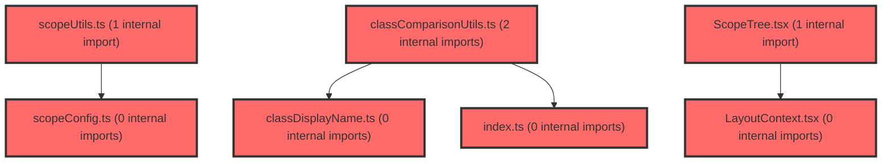

> [!IMPORTANT]
> **⚠️ 수동 검토 권장 (자가힐링 주의)**
>
> AI 자가힐링 결과물이 실제 의도와 다를 수 있으므로, **상세 리뷰 내용에 기반한 수동 점검**을 우선해 주시기 바랍니다. 자가힐링 기능을 활용하실 경우 최종 결과물을 신중하게 확인해 주세요.

# 코드 리뷰 - e2c6c8e4

## 코드 복잡도 분석

**분석된 파일**: 20개 / 변경된 파일: 22개


### Import 의존관계 다이어그램



**범례**: 중심 파일 (변경됨) | 많은 import (10개 이상)


### 정상 범위 (NONE)


**`scopeutils.ts`** (utility)

- 평균 복잡도: **0.004**

- 최대 복잡도: 0.009

- 청크 수: 13개


**권장사항:**

- 복잡도 정상 범위


**`dashboardservice.ts`** (other)

- 평균 복잡도: **0.004**

- 최대 복잡도: 0.010

- 청크 수: 68개


**권장사항:**

- 파일 크기가 큼 (68개 청크) - 파일 분리 검토


**`scopeconfig.ts`** (config)

- 평균 복잡도: **0.003**

- 최대 복잡도: 0.009

- 청크 수: 13개


**권장사항:**

- Config 파일은 높은 연결도가 정상적임


**`index.ts`** (other)

- 평균 복잡도: **0.003**

- 최대 복잡도: 0.011

- 청크 수: 92개


**권장사항:**

- 파일 크기가 큼 (92개 청크) - 파일 분리 검토


**`useapidata.ts`** (other)

- 평균 복잡도: **0.002**

- 최대 복잡도: 0.010

- 청크 수: 60개


**권장사항:**

- 파일 크기가 큼 (60개 청크) - 파일 분리 검토


**`aggregatetypedistributionbyround.ts`** (utility)

- 평균 복잡도: **0.002**

- 최대 복잡도: 0.008

- 청크 수: 11개


**권장사항:**

- 복잡도 정상 범위


**`classcomparisonutils.ts`** (utility)

- 평균 복잡도: **0.002**

- 최대 복잡도: 0.008

- 청크 수: 25개


**권장사항:**

- 파일 크기가 큼 (25개 청크) - 파일 분리 검토


**`layoutcontext.tsx`** (other)

- 평균 복잡도: **0.002**

- 최대 복잡도: 0.010

- 청크 수: 23개


**권장사항:**

- 파일 크기가 큼 (23개 청크) - 파일 분리 검토


**`studentmanagementpanel.tsx`** (other)

- 평균 복잡도: **0.001**

- 최대 복잡도: 0.004

- 청크 수: 8개


**권장사항:**

- 복잡도 정상 범위


**`categorycomparisonchart.tsx`** (other)

- 평균 복잡도: **0.001**

- 최대 복잡도: 0.004

- 청크 수: 12개


**권장사항:**

- 복잡도 정상 범위


**`typedistributionchart.tsx`** (other)

- 평균 복잡도: **0.001**

- 최대 복잡도: 0.010

- 청크 수: 23개


**권장사항:**

- 파일 크기가 큼 (23개 청크) - 파일 분리 검토


**`classdisplayname.ts`** (utility)

- 평균 복잡도: **0.001**

- 최대 복잡도: 0.001

- 청크 수: 3개


**권장사항:**

- 복잡도 정상 범위


**`koreannamesearch.ts`** (utility)

- 평균 복잡도: **0.001**

- 최대 복잡도: 0.002

- 청크 수: 3개


**권장사항:**

- 복잡도 정상 범위


**`classdashboardv2widget.tsx`** (other)

- 평균 복잡도: **0.001**

- 최대 복잡도: 0.012

- 청크 수: 178개


**권장사항:**

- 파일 크기가 큼 (178개 청크) - 파일 분리 검토


**`classdashboardwidget.tsx`** (other)

- 평균 복잡도: **0.001**

- 최대 복잡도: 0.009

- 청크 수: 132개


**권장사항:**

- 파일 크기가 큼 (132개 청크) - 파일 분리 검토


**`studentpickermodal.tsx`** (other)

- 평균 복잡도: **0.000**

- 최대 복잡도: 0.007

- 청크 수: 89개


**권장사항:**

- 파일 크기가 큼 (89개 청크) - 파일 분리 검토


**`examclassmanagementview.tsx`** (component)

- 평균 복잡도: **0.000**

- 최대 복잡도: 0.005

- 청크 수: 77개


**권장사항:**

- 파일 크기가 큼 (77개 청크) - 파일 분리 검토


**`schedulestudentpicker.tsx`** (other)

- 평균 복잡도: **0.000**

- 최대 복잡도: 0.007

- 청크 수: 103개


**권장사항:**

- 파일 크기가 큼 (103개 청크) - 파일 분리 검토


**`selfregclassdashboardwidget.tsx`** (other)

- 평균 복잡도: **0.000**

- 최대 복잡도: 0.007

- 청크 수: 112개


**권장사항:**

- 파일 크기가 큼 (112개 청크) - 파일 분리 검토


**`scopetree.tsx`** (other)

- 평균 복잡도: **0.000**

- 최대 복잡도: 0.006

- 청크 수: 65개


**권장사항:**

- 파일 크기가 큼 (65개 청크) - 파일 분리 검토


---


## 변경 배경

이 커밋은 세 가지 개선 작업을 포함합니다. 첫째, **HSJ-118**로 반 표기를 그룹관리에서 설정한 그룹명(`Class.name`)으로 통일하고, 그룹명이 없을 때만 기존 `${grade}-${classNumber}반` 조합값으로 폴백하도록 합니다. 둘째, **HSJ-119**로 "전체" 스코프를 지원하지 않는 검사관리 메뉴에서 LNB 미선택 상태를 유지하지 않고 첫 번째 반을 자동 선택하도록 합니다. 셋째, 이름 검색에 **초성 검색**을 도입하여 사용자 검색 편의성을 높입니다.

- **목적**: 반 표기 통일(HSJ-118), 전체 스코프 미지원 메뉴의 UX 개선(HSJ-119), 초성 기반 이름 검색
- **도메인**: UI / 비즈니스 로직 (프론트엔드)
- **변경 방향**: 하드코딩된 문자열 조합을 공용 유틸(`getClassDisplayName`)로 추출하고, 검색 로직을 공용 유틸(`matchesNameSearch`)로 통합하여 일관성과 재사용성을 높임

## [GOOD] 잘된 점

- **공용 유틸 추출로 중복 제거**: `getClassDisplayName`과 `matchesNameSearch`를 `@shared/utils`에 추출하여 여러 위젯/피처에서 동일 로직을 재사용함. 특히 `getClassDisplayName`은 `Class.name` 폴백 로직을 한 곳에 모아 향후 표기 규칙 변경 시 유지보수가 용이함.
- **정렬 로직 개선**: `TypeDistributionChart`에서 기존 `name.split('-')[1]` 문자열 파싱 방식 대신 `sortKey: grade * 100 + classNumber` 숫자 연산으로 변경하여, 그룹명 표기로 바뀐 후에도 안정적으로 정렬되도록 함. 이는 HSJ-118과 자연스럽게 연계된 좋은 대응.
- **캐시 공유 인지**: `LayoutContext`에서 `useMyGroupsQuery`를 사용하면서 ScopeTree와 동일한 queryKey를 쓴다는 점을 주석으로 명시하여 중복 호출 우려를 사전에 해소함.
- **초성 검색의 안전한 폴백**: `matchesNameSearch`가 일반 부분일치를 먼저 확인하고 초성 검색을 보조로 사용하여, 기존 검색 동작을 깨지 않으면서 기능을 확장함.

## 변경사항 요약

반 표기를 그룹명으로 통일하는 `getClassDisplayName` 유틸을 신설하고 `Class` 타입에 `name` 필드를 추가하여 여러 차트/유틸에 적용했습니다. "전체" 스코프 미지원 메뉴에서 첫 번째 반을 자동 선택하도록 `adjustScopeForMenu`에 `firstClassId` 파라미터를 추가했습니다. `es-hangul` 라이브러리를 도입해 `matchesNameSearch` 초성 검색 유틸을 만들어 7개 검색 지점에 적용했습니다.

---

## [ISSUE] 개선이 필요한 부분

### Critical (즉시 수정 필요)

없음

### High (우선 수정 권장)

- **`matchesNameSearch`의 초성 검색이 영문/숫자 검색에 부작용을 일으킬 수 있음**: `ExamClassManagementView.tsx`와 `StudentManagementPanel.tsx`에서 `row.name.toLocaleLowerCase('ko-KR')` 또는 `(m.name ?? '').toLowerCase()`로 소문자 변환한 값을 `matchesNameSearch`에 전달합니다. `getChoseong`은 한글 문자열의 초성을 추출하는 함수인데, 영문/숫자/특수문자에 대해서는 어떻게 동작하는지가 명확하지 않습니다. 특히 `ExamClassManagementView`에서는 `String(row.number).includes(term)`과 OR로 연결되어 있어 숫자 검색은 별도 처리되지만, 이름에 영문이 포함된 경우 `getChoseong`이 예상치 못한 결과를 반환할 수 있습니다. `es-hangul`의 `getChoseong`이 비한글 문자를 그대로 통과시키는지 확인이 필요합니다.

### Medium (개선 권장)

- **`matchesNameSearch`의 초성 검색이 과도하게 매칭될 가능성**: `getChoseong(name).includes(getChoseong(keyword))` 로직에서, keyword가 한 글자 초성(예: "ㄱ")일 때 이름의 어느 위치에든 "ㄱ" 초성이 있으면 매칭됩니다. 이는 의도된 동작일 수 있으나, 검색어가 짧을수록 결과가 과도하게 많아질 수 있습니다. 검색 UX 관점에서 최소 검색어 길이(예: 2자 이상) 제한을 고려할 수 있습니다.
- **`firstClassId`가 로딩 전에 `undefined`일 때의 동작**: `LayoutContext`에서 `groups`가 로딩되기 전에는 `firstClassId`가 `undefined`가 되어 `adjustScopeForMenu`가 `{ level: 'all' }`을 유지합니다. 이후 그룹이 로드되면 effect가 다시 실행되어 첫 반으로 전환됩니다. 이는 의도된 동작이지만, 사용자가 잠깐 "전체" 상태를 보게 되는 깜빡임(flash)이 발생할 수 있습니다. 로딩 상태를 함께 고려한 처리가 있으면 더 좋겠습니다.

---

## 주요 파일 분석

### frontend/src/shared/utils/koreanNameSearch.ts

**변경 내용:**
`es-hangul`의 `getChoseong`을 활용한 초성 검색 유틸 신설.

**개선 제안:**

1. 비한글 문자에 대한 `getChoseong` 동작 확인 필요
   - **위치 (라인 번호)**: 10
   - **기존 코드**:
```
return getChoseong(name).includes(getChoseong(keyword));
```
   - **해결 방안 (수정 코드)**: `es-hangul`의 `getChoseong`이 비한글 문자를 그대로 유지하는지 확인한 후, 만약 그렇지 않다면 한글 초성만 추출하도록 가드 추가를 고려하세요. 다만 이는 라이브러리 동작 확인 후 결정해야 하므로, 현재로서는 **[수정 코드 제시 불가 — 문맥 파악 불충분]** 입니다.

### frontend/src/features/teacher-dashboard/ui/TypeDistributionChart.tsx

**변경 내용:**
`sortKey: grade * 100 + classNumber`로 정렬 방식을 개선하고 `getClassDisplayName` 적용.

**개선 제안:**

1. `sortKey` 계산의 잠재적 충돌 가능성
   - **위치 (라인 번호)**: 84
   - **기존 코드**:
```
sortKey: cls.grade * 100 + cls.classNumber,
```
   - **해결 방안 (수정 코드)**: `grade * 100 + classNumber` 방식은 grade가 100 이상이거나 classNumber가 100 이상이면 충돌할 수 있습니다. 실제 데이터 범위(grade는 1~6, classNumber는 1~20 수준)에서는 문제없지만, 안전하게 문자열 정렬이나 `grade * 1000 + classNumber`로 여유를 두는 것을 고려할 수 있습니다. 다만 현재 데이터 범위에서는 실질적 문제가 없으므로 선택적 개선입니다.

### frontend/src/shared/scope/scopeUtils.ts

**변경 내용:**
`firstClassId` 파라미터를 추가하여 "전체" 스코프 미지원 메뉴에서 첫 반 자동 선택 로직 추가.

**개선 제안:**

1. `firstClassId`가 없을 때 `{ level: 'all' }` 유지 로직의 명확성
   - **위치 (라인 번호)**: 21-29
   - **기존 코드**:
```
if (level === 'all' && !menuConfig.all) {
  adjustedScope = firstClassId ? { level: 'class', classId: firstClassId } : { level: 'all' };
  updatedMemory.current = adjustedScope;
  if (firstClassId) {
    updatedMemory.lastClassId = firstClassId;
  }
  return { adjustedScope, updatedMemory };
}
```
   - **해결 방안 (수정 코드)**: 로직 자체는 명확하고 의도된 동작입니다. 다만 `firstClassId`가 없을 때 `{ level: 'all' }`을 유지하는 것은 "전체" 스코프 미지원 메뉴에서 잠시 잘못된 상태를 보여줄 수 있습니다. 로딩 상태를 상위에서 처리하거나, `firstClassId`가 없을 때는 스코프 변경을 보류하는 방식도 고려할 수 있습니다. 현재 구현도 동작상 문제는 없으므로 선택적 개선입니다.

---

## 최종 평가

**결론**:
- [x] [WARN] **조건부 승인 (Approved with Comments)** - Medium 이하 이슈만 존재

**종합 의견:**

이 커밋은 반 표기 통일, 스코프 자동 선택, 초성 검색이라는 세 가지 개선을 공용 유틸 추출과 함께 깔끔하게 처리했습니다. 특히 `getClassDisplayName`과 `matchesNameSearch`의 공용화는 유지보수성을 크게 높였고, `TypeDistributionChart`의 정렬 로직 개선은 HSJ-118과의 연계를 잘 고려한 좋은 대응입니다. 다만 `matchesNameSearch`의 비한글 문자 처리와 `firstClassId` 로딩 전 깜빡임은 실제 사용 환경에서 확인이 필요한 부분이므로, 테스트를 통해 검증하시길 권장합니다. 전반적으로 실무에서 통용될 수 있는 수준의 양호한 변경입니다.