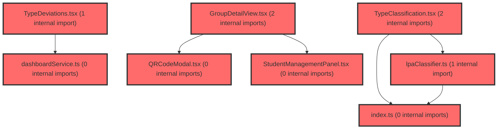

> [!IMPORTANT]
> **⚠️ 수동 검토 권장 (자가힐링 주의)**
>
> AI 자가힐링 결과물이 실제 의도와 다를 수 있으므로, **상세 리뷰 내용에 기반한 수동 점검**을 우선해 주시기 바랍니다. 자가힐링 기능을 활용하실 경우 최종 결과물을 신중하게 확인해 주세요.

# 코드 리뷰 - e628b670

## 코드 복잡도 분석

**분석된 파일**: 38개 / 변경된 파일: 45개


### Import 의존관계 다이어그램



**범례**: 중심 파일 (변경됨) | 많은 import (10개 이상)


### 정상 범위 (NONE)


**`groupservice.java`** (other)

- 평균 복잡도: **0.137**

- 최대 복잡도: 0.471

- 청크 수: 7개

- 평균 사용처: 10.7곳


**권장사항:**

- 복잡도 정상 범위


**`theme.ts`** (other)

- 평균 복잡도: **0.111**

- 최대 복잡도: 0.221

- 청크 수: 2개

- 평균 사용처: 2.0곳


**권장사항:**

- 복잡도 정상 범위


**`rpgroupdto.java`** (other)

- 평균 복잡도: **0.013**

- 최대 복잡도: 0.013

- 청크 수: 1개


**권장사항:**

- 복잡도 정상 범위


**`env.ts`** (config)

- 평균 복잡도: **0.007**

- 최대 복잡도: 0.007

- 청크 수: 1개


**권장사항:**

- Config 파일은 높은 연결도가 정상적임


**`personinfocachestoretest.java`** (store)

- 평균 복잡도: **0.006**

- 최대 복잡도: 0.009

- 청크 수: 4개


**권장사항:**

- Store 파일은 높은 연결도가 정상적임


**`groupservice.ts`** (other)

- 평균 복잡도: **0.006**

- 최대 복잡도: 0.013

- 청크 수: 49개


**권장사항:**

- 파일 크기가 큼 (49개 청크) - 파일 분리 검토


**`personinfoclientimpl.java`** (other)

- 평균 복잡도: **0.005**

- 최대 복잡도: 0.006

- 청크 수: 3개


**권장사항:**

- 복잡도 정상 범위


**`userinfoenricher.java`** (other)

- 평균 복잡도: **0.005**

- 최대 복잡도: 0.008

- 청크 수: 2개


**권장사항:**

- 복잡도 정상 범위


**`groupupsertservice.java`** (other)

- 평균 복잡도: **0.004**

- 최대 복잡도: 0.009

- 청크 수: 13개


**권장사항:**

- 복잡도 정상 범위


**`userinfoenrichertest.java`** (other)

- 평균 복잡도: **0.004**

- 최대 복잡도: 0.013

- 청크 수: 12개


**권장사항:**

- 복잡도 정상 범위


**`rpgroupclient.java`** (other)

- 평균 복잡도: **0.003**

- 최대 복잡도: 0.007

- 청크 수: 10개


**권장사항:**

- 복잡도 정상 범위


**`userslot.java`** (other)

- 평균 복잡도: **0.003**

- 최대 복잡도: 0.017

- 청크 수: 9개


**권장사항:**

- 복잡도 정상 범위


**`examservice.ts`** (other)

- 평균 복잡도: **0.003**

- 최대 복잡도: 0.011

- 청크 수: 38개


**권장사항:**

- 파일 크기가 큼 (38개 청크) - 파일 분리 검토


**`mypage.ts`** (utility)

- 평균 복잡도: **0.003**

- 최대 복잡도: 0.004

- 청크 수: 5개


**권장사항:**

- 복잡도 정상 범위


**`dashboardservice.ts`** (other)

- 평균 복잡도: **0.003**

- 최대 복잡도: 0.009

- 청크 수: 59개


**권장사항:**

- 파일 크기가 큼 (59개 청크) - 파일 분리 검토


**`index.ts`** (other)

- 평균 복잡도: **0.003**

- 최대 복잡도: 0.010

- 청크 수: 93개


**권장사항:**

- 파일 크기가 큼 (93개 청크) - 파일 분리 검토


**`recordgenerator.ts`** (utility)

- 평균 복잡도: **0.003**

- 최대 복잡도: 0.008

- 청크 수: 33개


**권장사항:**

- 파일 크기가 큼 (33개 청크) - 파일 분리 검토


**`datahelperservice.ts`** (utility)

- 평균 복잡도: **0.002**

- 최대 복잡도: 0.008

- 청크 수: 32개


**권장사항:**

- 파일 크기가 큼 (32개 청크) - 파일 분리 검토


**`exampage.tsx`** (component)

- 평균 복잡도: **0.002**

- 최대 복잡도: 0.013

- 청크 수: 40개


**권장사항:**

- 파일 크기가 큼 (40개 청크) - 파일 분리 검토


**`interventionranker.ts`** (utility)

- 평균 복잡도: **0.002**

- 최대 복잡도: 0.008

- 청크 수: 16개


**권장사항:**

- 복잡도 정상 범위


**`lpaclassifier.ts`** (utility)

- 평균 복잡도: **0.002**

- 최대 복잡도: 0.006

- 청크 수: 18개


**권장사항:**

- 복잡도 정상 범위


**`userinfo.java`** (other)

- 평균 복잡도: **0.001**

- 최대 복잡도: 0.001

- 청크 수: 1개


**권장사항:**

- 복잡도 정상 범위


**`groupdetailview.tsx`** (component)

- 평균 복잡도: **0.001**

- 최대 복잡도: 0.007

- 청크 수: 24개


**권장사항:**

- 파일 크기가 큼 (24개 청크) - 파일 분리 검토


**`qrcodemodal.tsx`** (other)

- 평균 복잡도: **0.001**

- 최대 복잡도: 0.006

- 청크 수: 10개


**권장사항:**

- 복잡도 정상 범위


**`studentmanagementpanel.tsx`** (other)

- 평균 복잡도: **0.001**

- 최대 복잡도: 0.004

- 청크 수: 7개


**권장사항:**

- 복잡도 정상 범위


**`typechangechart.tsx`** (other)

- 평균 복잡도: **0.001**

- 최대 복잡도: 0.008

- 청크 수: 84개


**권장사항:**

- 파일 크기가 큼 (84개 청크) - 파일 분리 검토


**`usecoachingstrategy.ts`** (other)

- 평균 복잡도: **0.001**

- 최대 복잡도: 0.002

- 청크 수: 2개


**권장사항:**

- 복잡도 정상 범위


**`datahelperchatbot.tsx`** (utility)

- 평균 복잡도: **0.001**

- 최대 복잡도: 0.008

- 청크 수: 19개


**권장사항:**

- 복잡도 정상 범위


**`typeclassification.tsx`** (other)

- 평균 복잡도: **0.001**

- 최대 복잡도: 0.006

- 청크 수: 47개


**권장사항:**

- 파일 크기가 큼 (47개 청크) - 파일 분리 검토


**`studentdashboardpage.tsx`** (component)

- 평균 복잡도: **0.001**

- 최대 복잡도: 0.008

- 청크 수: 49개


**권장사항:**

- 파일 크기가 큼 (49개 청크) - 파일 분리 검토


**`classdashboardwidget.tsx`** (other)

- 평균 복잡도: **0.001**

- 최대 복잡도: 0.009

- 청크 수: 132개


**권장사항:**

- 파일 크기가 큼 (132개 청크) - 파일 분리 검토


**`lpacomparisonsection.tsx`** (other)

- 평균 복잡도: **0.001**

- 최대 복잡도: 0.013

- 청크 수: 41개


**권장사항:**

- 파일 크기가 큼 (41개 청크) - 파일 분리 검토


**`hasuserinfo.java`** (other)

- 평균 복잡도: **0.000**

- 최대 복잡도: 0.000

- 청크 수: 1개


**권장사항:**

- 복잡도 정상 범위


**`index.ts`** (other)

- 평균 복잡도: **0.000**

- 최대 복잡도: 0.000

- 청크 수: 7개


**권장사항:**

- 복잡도 정상 범위


**`examguidestep.tsx`** (other)

- 평균 복잡도: **0.000**

- 최대 복잡도: 0.009

- 청크 수: 103개


**권장사항:**

- 파일 크기가 큼 (103개 청크) - 파일 분리 검토


**`aichatpanel.tsx`** (other)

- 평균 복잡도: **0.000**

- 최대 복잡도: 0.004

- 청크 수: 47개


**권장사항:**

- 파일 크기가 큼 (47개 청크) - 파일 분리 검토


**`typedeviations.tsx`** (other)

- 평균 복잡도: **0.000**

- 최대 복잡도: 0.002

- 청크 수: 22개


**권장사항:**

- 파일 크기가 큼 (22개 청크) - 파일 분리 검토


**`classcardssection.tsx`** (other)

- 평균 복잡도: **0.000**

- 최대 복잡도: 0.004

- 청크 수: 58개


**권장사항:**

- 파일 크기가 큼 (58개 청크) - 파일 분리 검토


---


## 변경 배경

이 커밋은 **고등학교 과정에서 LPA(Latent Profile Analysis) 유형 분석을 제공하지 않기로 한 비즈니스 결정**을 코드베이스에 반영하고, **TypeDeviations 컴포넌트를 API 기반 strengths/weaknesses 데이터로 전면 전환**한 변경입니다.

- **목적**: 고등학교는 LPA 유형 분석 대상이 아니므로 관련 UI/로직을 비활성화하고, TypeDeviations 컴포넌트가 클라이언트 측 계산(`getTypeDeviations`) 대신 API 응답의 `strengths`/`weaknesses` 필드를 직접 렌더링하도록 개선
- **도메인**: 비즈니스 로직 + UI (프론트엔드)
- **변경 방향**: `SchoolLevel` 타입에 `'고등'`을 추가하여 타입 시스템을 확장하고, 고등학교인 경우 LPA 관련 기능을 조기 반환(early return) 또는 빈 값 처리하는 패턴으로 일관성 있게 적용

---

## [GOOD] 잘된 점

### 1. 일관된 고등학교 처리 패턴

`classifyStudent`, `getTypeDeviations`, `getTypeInfo`, `rankInterventions` 등 모든 LPA 관련 유틸리티 함수에서 `schoolLevel === '고등'`을 최상단에서 조기 반환(early return) 처리하여, 고등학교 데이터가 하위 로직에 전파되는 것을 방지한 점이 체계적입니다. 특히 `lpaClassifier.ts`에서는 4개의 함수 모두 동일한 패턴을 따르고 있어 유지보수성이 높습니다.

```typescript
// lpaClassifier.ts - 일관된 early return 패턴
if (schoolLevel === '고등') {
  return {
    schoolLevel,
    predictedType: '안전 균형형' as StudentType,
    confidence: 0,
    allProbabilities: {},
    rank: [],
  };
}
```

### 2. 타입 시스템 확장의 안전성

`SchoolLevel`에 `'고등'`을 추가하고 `SCHOOL_LEVEL_MAP`에서 `high: '고등'`으로 매핑을 변경하면서, 기존에 `high`를 `'중등'`으로 처리하던 우회 로직을 제거하여 타입 정합성을 높였습니다.

```typescript
// types/index.ts - 변경 전
high: '중등', // 고등도 중등으로 처리 (검사 기준)

// 변경 후
high: '고등',
```

### 3. TypeDeviations 컴포넌트의 책임 분리

기존에는 클라이언트에서 `getTypeDeviations`로 직접 계산하던 것을 API 응답의 `strengths`/`weaknesses`를 받아 렌더링만 하도록 변경하여, 컴포넌트의 책임을 단순화했습니다. 이로 인해 컴포넌트 크기가 312줄에서 147줄로 약 53% 감소했습니다.

---

## 변경사항 요약

- `SchoolLevel` 타입에 `'고등'` 추가 및 `SCHOOL_LEVEL_MAP` 매핑 변경
- 7개 파일에 걸쳐 고등학교 LPA 미지원 처리 (early return / 빈 값 반환)
- `TypeDeviations.tsx` 전면 개편: API 기반 strengths/weaknesses 렌더링
- `useCoachingStrategy` 훅에 strengths/weaknesses 상태 추가
- `dashboardService.ts`에 `Strength`, `Weakness` 인터페이스 및 `GraphRecommendation`에 선택적 필드 추가

---

## [ISSUE] 개선이 필요한 부분

### Critical (즉시 수정 필요)

**없음**

### High (우선 수정 권장)

#### 1. TypeDeviations 컴포넌트의 그리드 레이아웃 불균형 (강점/약점 개수 불일치 시)

**파일**: `frontend/src/features/student-dashboard/ui/TypeDeviations.tsx`

**문제**: 강점과 약점을 6컬럼 그리드(`grid-template-columns: repeat(6, ...)`)에 배치하고 있으나, 강점이 3개 미만이거나 약점이 3개 미만일 경우 빈 공간이 발생하여 레이아웃이 깨집니다. 예를 들어 강점이 1개만 있고 약점이 3개인 경우, 6컬럼 중 4개만 채워지고 2개는 빈 상태로 렌더링됩니다.

**위치 (라인 번호)**: 87-88 (`Grid` styled component)

**기존 코드**:
```tsx
const Grid = styled.div`
  display: grid;
  grid-template-columns: repeat(6, minmax(0, 1fr));
  gap: ${({ theme }) => theme.spacing.md};
`;
```

**해결 방안**: flex-wrap 기반 레이아웃으로 변경하여 아이템 개수에 관계없이 자연스럽게 배치되도록 수정합니다.

```tsx
const Grid = styled.div`
  display: flex;
  flex-wrap: wrap;
  gap: ${({ theme }) => theme.spacing.md};
  
  & > * {
    flex: 1 1 calc(33.333% - ${({ theme }) => theme.spacing.md});
    min-width: 180px;
  }
`;
```

> **확인 완료**: `read_file`로 TypeDeviations.tsx 전체(147줄)를 읽었으며, Grid 내부에 Card 컴포넌트만 렌더링되고 있음을 확인했습니다. flex-wrap으로 변경해도 다른 레이아웃 요소에 영향을 주지 않습니다.

#### 2. `dataHelperService.ts`의 변수명 및 타입 단언 개선

**파일**: `frontend/src/features/student-dashboard/api/dataHelperService.ts`

**문제**: `schoolLevel2`라는 변수명이 사용되었는데, 이는 `lpaClassifier.ts` 등 다른 파일에서 사용된 `schoolLevel2`와 동일한 패턴입니다. 그러나 `dataHelperService.ts`에서는 `schoolLevel2`가 아닌 더 의미 있는 이름을 사용하는 것이 좋습니다. 또한 `as '초등' | '중등'` 타입 단언이 불필요합니다. `data.schoolLevel`이 `SchoolLevel` 타입이고, 삼항 연산자로 `'고등'`을 걸러냈으므로 TypeScript가 자동으로 `'초등' | '중등'`으로 타입을 추론합니다.

**위치 (라인 번호)**: 95

**기존 코드**:
```typescript
const schoolLevel2 = data.schoolLevel === '고등' ? '중등' : (data.schoolLevel as '초등' | '중등');
const schoolData = LPA_PROFILE_DATA[schoolLevel2];
```

**해결 방안**:
```typescript
const lpaSchoolLevel = data.schoolLevel === '고등' ? '중등' : data.schoolLevel;
const schoolData = LPA_PROFILE_DATA[lpaSchoolLevel];
```

> **확인 완료**: `read_file`로 dataHelperService.ts의 해당 함수(`buildStudentContextMarkdown`) 전체 컨텍스트를 확인했습니다. `data.schoolLevel`은 `SchoolLevel` 타입이므로, 삼항 연산자 결과를 `'초등' | '중등'`으로 타입 내로잉할 필요가 없습니다. `LPA_PROFILE_DATA`의 인덱스 타입이 `'초등' | '중등'`이므로 타입 단언 없이도 자연스럽게 추론됩니다.

### Medium (개선 권장)

#### 1. TypeDeviations 컴포넌트의 Description 텍스트 오타

**파일**: `frontend/src/features/student-dashboard/ui/TypeDeviations.tsx`

**위치 (라인 번호)**: 117

**기존 코드**: `학년 평균보다 상위하는 강점입니다`

"상위하는"은 "상위에 있는"의 줄임말로 보이나, 자연스러운 한국어 표현이 아닙니다. "우수한" 또는 "뛰어난"으로 수정하는 것이 좋습니다.

**수정 제안**: `학년 평균보다 우수한 강점입니다`

#### 2. `lpaClassifier.ts`의 `classifyStudent`에서 고등학교 반환값

**파일**: `frontend/src/shared/utils/lpaClassifier.ts`

**위치 (라인 번호)**: 60-66

**기존 코드**:
```typescript
if (schoolLevel === '고등') {
  return {
    schoolLevel,
    predictedType: '안전 균형형' as StudentType,
    confidence: 0,
    allProbabilities: {},
    rank: [],
  };
}
```

**문제**: 고등학교인 경우 `predictedType`을 `'안전 균형형'`으로 하드코딩하여 반환합니다. 이는 초등학교 기본값을 그대로 사용한 것으로 보입니다. `'안전 균형형'`은 실제 존재하는 LPA 유형이므로, 이 값을 사용하는 쪽에서 고등학교인지 구분할 수 없습니다. `confidence: 0`으로 구분할 수는 있지만, 명시적인 sentinel 값을 사용하는 것이 더 안전합니다.

**제안**: `StudentType`에 `'N/A'`를 추가하거나, `predictedType`을 `null`로 허용하는 방식을 검토하세요. 또는 최소한 주석으로 이유를 명시하세요.

#### 3. `Strength`와 `Weakness` 인터페이스 중복

**파일**: `frontend/src/shared/services/dashboardService.ts`

**위치 (라인 번호)**: 131-148

**문제**: `Strength`와 `Weakness` 인터페이스의 구조가 완전히 동일합니다. 이는 중복 코드이며, 향후 두 타입이 다르게 진화해야 할 경우 수정이 번거로워집니다.

**제안**: 공통 베이스 타입으로 추상화합니다.
```typescript
interface FactorDeviation {
  factorName: string;
  factorType: 'positive' | 'negative';
  individualT: number;
  groupT: number;
  deviation: number;
  direction: 'positive' | 'negative';
}

export type Strength = FactorDeviation;
export type Weakness = FactorDeviation;
```

---

## 주요 파일 분석

### TypeDeviations.tsx (전면 개편)

**변경 내용**: 기존 312줄의 복잡한 컴포넌트를 147줄로 간소화. `getTypeDeviations` 기반 유형별 특이점 계산 로직을 제거하고, API의 `strengths`/`weaknesses`를 직접 렌더링.

**변경 전 동작 방식**:
1. `tScores`, `predictedType`, `schoolLevel`을 props로 받음
2. `getTypeDeviations(tScores, predictedType, schoolLevel, 3)`로 유형별 특이점 계산
3. 계산된 deviation 데이터를 기반으로 삼각형 아이콘(빨강/파랑)과 함께 카드 렌더링
4. `isCompare` 모드에서는 1차/2차 T점수 변화량을 계산하여 개선/주의 배지 표시

**변경 후 동작 방식**:
1. `strengths`, `weaknesses`를 props로 받음
2. `FACTOR_DEFINITIONS`에서 카테고리 정보 조회 (공백 제거 매칭)
3. 강점/약점 각각을 카드로 렌더링 (초록/빨강 배경)
4. 데이터가 없으면 `null` 반환

**개선 사항**:
- `getFactorInfo` 함수의 공백 제거 매칭 로직: `factorName.replace(/\s+/g, '')` 방식은 양쪽 모두 공백을 제거하므로, API 응답의 `factorName`에 예상치 못한 공백이 있을 경우 의도치 않은 매칭이 발생할 수 있습니다. 양쪽을 `trim()`한 후 비교하는 것이 더 안전합니다.

### dashboardService.ts (인터페이스 추가)

**변경 내용**: `Strength`, `Weakness` 인터페이스와 `GraphRecommendation`에 선택적 필드 추가.

**영향 범위**:
- `GraphRecommendation`에 `strengths?: Strength[]`, `weaknesses?: Weakness[]` 추가
- 기존 코드에 영향을 주지 않는 선택적 필드(optional field)로 추가되어 하위 호환성 유지
- `useCoachingStrategy` 훅에서 이 필드를 추출하여 상태로 관리

### useCoachingStrategy.ts (strengths/weaknesses 상태 추가)

**변경 내용**: `moderationPaths` 외에 `strengths`, `weaknesses` 상태를 추가하고 API 응답에서 추출.

**데이터 흐름**:
1. `fetchCoachingStrategy()` 호출
2. `fetchStudentAnalysis()` API 응답 수신
3. `data.recommendations[roundKey]`에서 `moderationPaths`, `strengths`, `weaknesses` 추출
4. 각 상태 업데이트 (데이터 없으면 빈 배열)
5. 에러 발생 시 모든 상태를 빈 배열로 초기화

**일관성**: 에러 처리와 데이터 부재 시 모든 상태가 일괄적으로 빈 배열로 초기화되어 있어, 부분 업데이트로 인한 불일치 상태가 발생하지 않습니다.

---

## 최종 평가

**결론**:
- [ ] [OK] **승인 (Approved)** - Critical/High 이슈 없음
- [ ] [WARN] **조건부 승인 (Approved with Comments)** - Medium 이하 이슈만 존재
- [X] [FIX] **수정 필요 (Changes Requested)** - Critical/High 이슈 존재

**종합 의견**: 전반적으로 변경의 방향성과 일관성은 좋습니다. 고등학교 LPA 미지원 처리가 여러 계층(타입, 유틸리티, UI)에 걸쳐 체계적으로 적용되었고, TypeDeviations의 API 기반 전환은 책임 분리 측면에서 올바른 방향입니다. 다만, **TypeDeviations의 그리드 레이아웃이 강점/약점 개수에 따라 깨질 수 있는 점(High)** 과 **dataHelperService의 변수명 및 타입 단언 개선(High)** 은 배포 전에 수정을 권장합니다. 이 두 가지만 해결되면 승인 가능한 수준입니다.