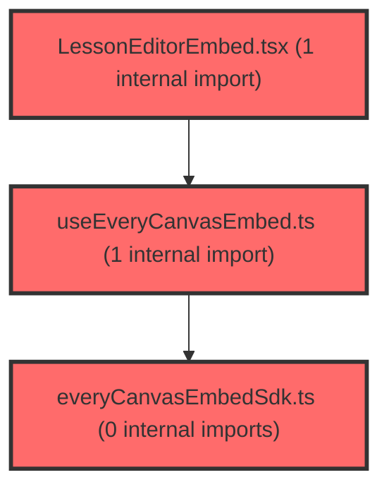

# 코드 리뷰 - e88ab284

## 코드 복잡도 분석

**분석된 파일**: 5개 / 변경된 파일: 6개


### Import 의존관계 다이어그램



**범례**: 중심 파일 (변경됨) | 많은 import (10개 이상)


### 정상 범위 (NONE)


**`env.ts`** (config)

- 평균 복잡도: **0.006**

- 최대 복잡도: 0.006

- 청크 수: 1개


**권장사항:**

- Config 파일은 높은 연결도가 정상적임


**`everycanvasembedsdk.ts`** (utility)

- 평균 복잡도: **0.002**

- 최대 복잡도: 0.005

- 청크 수: 13개


**권장사항:**

- 복잡도 정상 범위


**`useeverycanvasembed.ts`** (utility)

- 평균 복잡도: **0.001**

- 최대 복잡도: 0.004

- 청크 수: 11개


**권장사항:**

- 복잡도 정상 범위


**`lessoneditorembed.tsx`** (other)

- 평균 복잡도: **0.001**

- 최대 복잡도: 0.007

- 청크 수: 11개


**권장사항:**

- 복잡도 정상 범위


**`lessoneditorpage.tsx`** (component)

- 평균 복잡도: **0.001**

- 최대 복잡도: 0.009

- 청크 수: 26개


**권장사항:**

- 파일 크기가 큼 (26개 청크) - 파일 분리 검토


---


## 변경 배경

이 커밋은 everyCanvas SDK 1.5 스펙 변경에 대응하는 작업입니다. SDK에서 `startLesson` 이벤트가 `startLessonRequested`로 변경되고, `SavedPayload`에 `trigger`(manual/auto) 필드가 추가된 것을 실제 코드에 반영했습니다. 또한 LMS API 스펙이 확정됨에 따라 문서(plan.md)에 새 API(`/api/v1/activities`, `/api/v1/library-items`) 매핑 계획과 옛 API(`/api/ref-set`) 마이그레이션 계획(추가계획14)을 상세히 기록했습니다.

- **목적**: everyCanvas SDK 1.5 이벤트/페이로드 스펙 변경 반영 및 LMS 새 API 마이그레이션 계획 문서화
- **도메인**: UI(embed SDK 연동) + API(문서/계획)
- **변경 방향**: 이벤트명·prop명을 SDK 1.5 실제 스펙에 맞추고, 자동저장(auto) 시 불필요한 모달 표시를 제거하는 방향으로 개선

---

## [GOOD] 잘된 점

1. **`SavedPayload.trigger` 활용한 UX 세분화**: 자동저장(`auto`) 시에는 저장 완료 모달을 띄우지 않고, 수동 저장(`manual`)일 때만 모달을 표시하도록 분기 처리한 점이 좋습니다. 사용자가 직접 저장 버튼을 눌렀을 때만 피드백을 주는 것이 UX적으로 적절합니다.

2. **SDK 1.5 스펙 정확한 반영**: 이벤트명(`startLesson` → `startLessonRequested`)과 prop명(`onExitRequested` → `onExit`)을 SDK 1.5 실제 스펙에 맞춰 정확히 변경했습니다. 특히 `LessonEditorEmbed.tsx`에서 주석 처리된 임시 코드를 제거하고 실제 스펙에 맞는 핸들러만 남긴 점이 깔끔합니다.

3. **문서화를 통한 마이그레이션 계획 명확화**: plan.md에 새 LMS API(`/api/v1/activities`, `/api/v1/library-items`)의 엔드포인트, 요청/응답 타입, Phase A/B 구현 순서, 절대 규칙까지 상세히 기록했습니다. 특히 추가계획14에서 옛 API(`/api/ref-set`)의 봉투(`resultData` → `data`), ID(`refSetId` → `libraryItemId`), 에러 처리(`errorCode`) 변경까지 구체적으로 정리한 점이 팀 협업에 매우 유용합니다.

---

## 변경사항 요약

everyCanvas SDK 1.5 스펙 변경(이벤트명·페이로드 필드)을 실제 코드에 반영하고, LMS 새 API 마이그레이션 계획을 문서화한 커밋입니다. 실제 코드 변경은 5개 파일로 제한적이며, 대부분은 문서(plan.md) 변경입니다.

---

## [ISSUE] 개선이 필요한 부분

### Critical (즉시 수정 필요)

없음

### High (우선 수정 권장)

없음

### Medium (개선 권장)

1. **`SavedPayload` 타입 변경의 하위 호환성 검토 필요** (`everyCanvasEmbedSdk.ts`)

   `lcmsSetId`와 `title`이 선택적(`?`)에서 필수로 변경되었습니다. `LessonEditorPage.handleSaved`에서 `p.lcmsSetId` 체크는 여전히 존재하지만, `p.title`은 `p.title ?? ''`로 처리되어 있어 런타임 안전성은 확보되어 있습니다. 다만 타입을 필수로 바꾼 만큼 SDK 1.5 실제 페이로드에서 이 필드들이 항상 포함되는지 스펙 문서로 확인할 필요가 있습니다.

   - **위치**: `everyCanvasEmbedSdk.ts` SavedPayload 타입 정의
   - **제안**: SDK 1.5에서 `lcmsSetId`/`title`이 항상 포함되는지 확인하고, 불확실하면 `lcmsSetId?: string`으로 유지하는 것이 안전합니다.

2. **`handleSaved`의 `trigger` 분기와 `navigate` 로직의 상호작용** (`LessonEditorPage.tsx`)

   `onSuccess`에서 `p.trigger === 'manual'`일 때만 모달을 띄우지만, `navigate`(URL 변경)는 `trigger`와 무관하게 항상 실행됩니다. 자동저장 시에도 URL이 변경되는 동작이 의도된 것인지 확인이 필요합니다.

   - **위치**: `LessonEditorPage.tsx` handleSaved 함수 내부
   - **제안**: 자동저장 시에도 URL replace가 필요한지 의도를 명확히 하거나, `trigger === 'manual'`일 때만 navigate하도록 통일하는 것을 검토하세요.

3. **`console.log`/`console.warn` 디버그 코드 잔존** (`LessonEditorPage.tsx`)

   `handleSaved`의 `console.log('[LessonEditorPage] handleSaved', p)`와 `handleStartLesson`의 `console.log`가 그대로 남아 있습니다. 이전 커밋에서 DEV 가드(`import.meta.env.DEV`)를 제거했는데, 프로덕션 빌드에서도 로그가 출력됩니다.

   - **위치**: `LessonEditorPage.tsx` handleSaved, handleStartLesson
   - **기존 코드**:
   ```ts
   const handleSaved = (p: SavedPayload) => {
     console.log('[LessonEditorPage] handleSaved', p);
     ...
   };
   ```
   - **해결 방안**:
   ```ts
   const handleSaved = (p: SavedPayload) => {
     if (import.meta.env.DEV) console.log('[LessonEditorPage] handleSaved', p);
     ...
   };
   ```

---

## 주요 파일 분석

### frontend/src/features/lesson/lib/everyCanvasEmbedSdk.ts

**변경 내용:**
`SavedPayload`에 `trigger: 'manual' | 'auto'` 추가, `lcmsSetId`/`title`을 필수 필드로 변경.

**개선 제안:**
1. `lcmsSetId`/`title` 필수화의 하위 호환성 확인
   - **위치**: SavedPayload 타입 정의
   - **기존 코드**:
   ```ts
   export type SavedPayload = {
     trigger: 'manual' | 'auto';
     slideId: string;
     lcmsSetId: string;
     title: string;
     thumbnail?: string;
     lessonMeta?: LessonMeta;
   };
   ```
   - **해결 방안**: SDK 1.5 스펙에서 `lcmsSetId`/`title`이 항상 포함되는지 확인 후, 불확실하면 선택적(`?`)으로 유지하는 것이 안전합니다. 확정 스펙이 있다면 현재 필수화는 적절합니다.

### frontend/src/features/lesson/ui/LessonEditorEmbed.tsx

**변경 내용:**
prop명 `onExitRequested` → `onExit`으로 변경, 핸들러 매핑에서 `startLessonRequested` 이벤트를 `onStartLesson`에 연결.

**개선 제안:**
1. `onExit` prop명이 SDK 이벤트명(`exitRequested`)과 달라 혼동 가능
   - **위치**: LessonEditorEmbedProps 타입 및 핸들러 매핑
   - **제안**: prop명을 `onExitRequested`로 유지하거나, SDK 이벤트명과 일관되게 맞추는 것을 고려하세요. 다만 이는 개인 선호도 영역으로, 현재 `onExit`이 더 간결하다면 유지해도 무방합니다.

### frontend/src/pages/lesson/LessonEditorPage.tsx

**변경 내용:**
`handleSaved`에서 `p.trigger === 'manual'`일 때만 저장 모달 표시, `onExitRequested` → `onExit` prop 변경.

**개선 제안:**
1. 디버그 로그 제거 또는 DEV 가드 적용
   - **위치**: handleSaved, handleStartLesson 내부
   - **기존 코드**:
   ```ts
   const handleSaved = (p: SavedPayload) => {
     console.log('[LessonEditorPage] handleSaved', p);
     ...
   };
   ```
   - **해결 방안**:
   ```ts
   const handleSaved = (p: SavedPayload) => {
     if (import.meta.env.DEV) console.log('[LessonEditorPage] handleSaved', p);
     ...
   };
   ```

### frontend/src/features/lesson/lib/useEveryCanvasEmbed.ts

**변경 내용:**
`KNOWN_EVENTS`와 `EmbedEventHandlers`에서 이벤트명 `startLesson` → `startLessonRequested`로 변경.

**개선 제안:**
없음. SDK 1.5 스펙에 맞춘 정확한 변경입니다.

### frontend/src/shared/config/env.ts

**변경 내용:**
포맷팅만 변경 (라인 병합). 기능적 변경 없음.

**개선 제안:**
없음.

---

## 최종 평가

**결론**:
- [x] [OK] **승인 (Approved)** - Critical/High 이슈 없음

**종합 의견:**

이 커밋은 everyCanvas SDK 1.5 스펙 변경을 정확히 반영한 안정적인 변경입니다. 이벤트명·prop명을 실제 SDK 스펙에 맞춘 점과 `trigger` 필드를 활용한 UX 세분화가 좋습니다. 문서(plan.md)에 새 LMS API 마이그레이션 계획을 상세히 기록한 것도 팀 협업에 유용합니다.

남은 개선 사항(디버그 로그, 타입 하위 호환성 확인)은 사소한 수준으로, 다음 커밋에서 반영하면 충분합니다. 특히 `SavedPayload`의 `lcmsSetId`/`title` 필수화는 SDK 실제 페이로드와의 일치 여부를 한 번 더 확인하는 것이 좋겠습니다. 전반적으로 코드 품질과 문서화 수준이 우수한 커밋입니다.