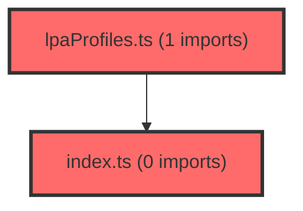

> [!IMPORTANT]
> **⚠️ 수동 검토 권장 (자가힐링 주의)**
>
> AI 자가힐링 결과물이 실제 의도와 다를 수 있으므로, **상세 리뷰 내용에 기반한 수동 점검**을 우선해 주시기 바랍니다. 자가힐링 기능을 활용하실 경우 최종 결과물을 신중하게 확인해 주세요.

# 코드 리뷰 - e9f36034

## 코드 복잡도 분석

**분석된 파일**: 5개 / 변경된 파일: 13개

### Import 의존관계 다이어그램

**범례**: 중심 파일 (변경됨) | 많은 import (10개 이상)

### 모니터링 권장 (LOW)

**`coachingstrategy.tsx`** (component)

- 평균 복잡도: **0.264**

- 최대 복잡도: 0.534

- 청크 수: 23개

- 평균 사용처: 23.3곳

**권장사항:**

- **모니터링 권장**: 복잡도가 높은 편이지만 영향 범위 제한적

- 파일 크기가 큼 (23개 청크) - 파일 분리 검토

**`index.ts`** (other)

- 평균 복잡도: **0.255**

- 최대 복잡도: 0.526

- 청크 수: 188개

- 평균 사용처: 28.1곳

**권장사항:**

- **모니터링 권장**: 복잡도가 높은 편이지만 영향 범위 제한적

- 파일 크기가 큼 (188개 청크) - 파일 분리 검토

**`lpaprofiles.ts`** (other)

- 평균 복잡도: **0.253**

- 최대 복잡도: 0.586

- 청크 수: 72개

- 평균 사용처: 31.2곳

**권장사항:**

- **모니터링 권장**: 복잡도가 높은 편이지만 영향 범위 제한적

- 파일 크기가 큼 (72개 청크) - 파일 분리 검토

### 정상 범위 (NONE)

**`corsconfig.java`** (config)

- 평균 복잡도: **0.265**

- 최대 복잡도: 0.519

- 청크 수: 2개

- 평균 사용처: 6.0곳

**권장사항:**

- Config 파일은 높은 연결도가 정상적임

**`coachingstrategymodal.tsx`** (component)

- 평균 복잡도: **0.001**

- 최대 복잡도: 0.005

- 청크 수: 10개

**권장사항:**

- 복잡도 정상 범위

---

## 변경사항 요약
에이전트 서비스의 README 문서에 Python 환경 설정 가이드(pyenv, venv 사용법)와 테스트 실행 방법(pytest를 통한 전체 테스트, API 통합 테스트, PII 필터 단위 테스트)을 상세히 추가하였습니다.

---

## [ISSUE] 발견된 이슈

1. **[문제]**: README 내부 링크가 절대 경로(file://)로 지정되어 다른 개발자 환경에서 접근 불가
   - **위치 (라인 번호)**: agent/README.md 118번 줄
   - **기존 코드**: `[tests/README.md](file:///Users/jay/github/work/meta-dashboard/agent/tests/README.md)`
   - **해결 방안 (수정 코드)**: `[tests/README.md](./tests/README.md)` 또는 `[tests/README.md](tests/README.md)`

---

## [CHECK] 확인 사항
- [x] 문법 오류 없음
- [x] 명백한 버그 없음
- [x] 기본적인 코드 스타일 준수

---

## 최종 평가

**결론**: 
- [ ] [OK] **승인 (Approved)**
- [x] [WARN] **조건부 승인 (Approved with Comments)**
- [ ] [FIX] **수정 필요 (Changes Requested)**

**코멘트:**
문서 개선 내용은 훌륭하나, 절대 경로 링크를 상대 경로로 수정해야 다른 환경에서도 정상 동작합니다.