> [!IMPORTANT]
> **⚠️ 수동 검토 권장 (자가힐링 주의)**
>
> AI 자가힐링 결과물이 실제 의도와 다를 수 있으므로, **상세 리뷰 내용에 기반한 수동 점검**을 우선해 주시기 바랍니다. 자가힐링 기능을 활용하실 경우 최종 결과물을 신중하게 확인해 주세요.

# 코드 리뷰 최종 분석: 커밋 eab4602d

## 코드 복잡도 분석

**분석된 파일**: 1개 / 변경된 파일: 1개


### Import 의존관계 다이어그램

```mermaid
flowchart TD
    F0["GroupQueryMapper.java (0 imports)"]
    F1["GroupInfoMapper.java (0 imports)"]
    F2["User.java (0 imports)"]
    F3["SchoolLevel.java (0 imports)"]
    F4["GroupService.java (17 imports)"]:::center
    F5["MemberService.java (0 imports)"]
    F6["ConvertUtils.java (0 imports)"]
    F7["GroupInfo.java (0 imports)"]
    F8["MemberType.java (0 imports)"]
    F9["EmailVerificationService.java (0 imports)"]
    F10["UserStatus.java (0 imports)"]
    F11["MemberStatus.java (0 imports)"]
    F12["GroupMemberMapper.java (0 imports)"]
    F13["UserMapper.java (0 imports)"]
    F14["IdGenerator.java (0 imports)"]
    F15["GroupMember.java (0 imports)"]
    F16["PageUtil.java (0 imports)"]
    F17["DgnssService.java (0 imports)"]
    F4 --> F0
    F4 --> F1
    F4 --> F2
    F4 --> F3
    F4 --> F5
    F4 --> F6
    F4 --> F7
    F4 --> F8
    F4 --> F9
    F4 --> F10
    F4 --> F11
    F4 --> F12
    F4 --> F13
    F4 --> F14
    F4 --> F15
    F4 --> F16
    F4 --> F17
    classDef center fill:#ff6b6b,stroke:#333,stroke-width:3px
    classDef high fill:#ffd93d,stroke:#333,stroke-width:2px
```



**범례**: 중심 파일 (변경됨) | 많은 import (10개 이상)


### 모니터링 권장 (LOW)


**`groupservice.java`** (other)

- 평균 복잡도: **0.264**

- 최대 복잡도: 0.518

- 청크 수: 2개

- 평균 사용처: 15.0곳


**권장사항:**

- **모니터링 권장**: 복잡도가 높은 편이지만 영향 범위 제한적


---


## 결론 요약

**CP님**, 커밋 `eab4602d`는 교사(TEACHER) 역할 사용자의 타 그룹 참여를 차단하는 비즈니스 요구사항을 구현했으나, **중요한 보안 및 비즈니스 로직 누수**가 발견되어 **수정 필요(Changes Requested)** 상태입니다. 현재 구현은 기본적인 TEACHER 역할만 차단하며, PRINCIPAL, SUPERINTENDENT, ADMIN 등 다른 교사 역할 계열과 게스트 참여 경로를 통한 우회가 가능합니다.

---

## 변경 내용 분석

### 1. 구현된 변경사항
```java
// backend/src/main/java/com/vs/meta/api/group/service/GroupService.java
// joinGroupAsPlayer 메서드 내 추가된 코드 (라인 125-128)
if ("TEACHER".equals(user.getRoleCode())) {
    throw new IllegalStateException("교사 계정은 다른 교사의 그룹에 참여할 수 없습니다. 직접 그룹을 생성해주세요.");
}
```
- **목적**: 교사 역할 사용자가 다른 교사가 생성한 그룹에 초대코드로 참여하는 것을 방지
- **위치**: 사용자 조회 후, 초대코드 검증 전
- **장점**: 불필요한 DB 조회를 방지하는 효율적인 검증 순서

### 2. 발견된 치명적 문제점

#### 문제 1: 불완전한 역할 검증 범위
- **현재**: `"TEACHER"` 문자열만 하드코딩 검증
- **문제점**: `IdGenerator.java`에 정의된 `TEACHER_ROLES` 세트(`"TEACHER", "PRINCIPAL", "SUPERINTENDENT", "ADMIN"`) 중 TEACHER만 차단
- **위험**: PRINCIPAL, SUPERINTENDENT, ADMIN 역할 사용자가 그룹 참여 가능 → 비즈니스 규칙 우회

#### 문제 2: 게스트 참여 경로 검증 누락
- **위치**: `joinGroupAsGuest` 메서드
- **현재**: 게스트 참여 시 역할 검증 없음
- **공격 시나리오**: 교사 역할 사용자가 새 이메일로 인증 후 게스트로 참여 가능
- **코드 조각**:
```java
// joinGroupAsGuest 메서드 내
User existingUser = userMapper.findByEmail(email);
if (existingUser != null) {
    throw new IllegalArgumentException("이미 가입된 회원 이메일입니다.");
}
// 교사 역할 검증 없음!
```

#### 문제 3: 예외 처리의 일관성 부재
- **현재**: `IllegalStateException` 사용
- **적절성**: 비즈니스 규칙 위반은 `IllegalArgumentException`이나 사용자 정의 예외가 더 적합
- **영향**: 예외 계층 구조의 의미론적 오류, 통일된 예외 처리 정책 위반

#### 문제 4: 코드 품질 이슈
- **하드코딩 문자열**: `"TEACHER"` 상수화 부재
- **Null 안전성**: `user.getRoleCode()` null 처리 불명확
- **가독성**: 의도가 명확하지 않은 null-safe 비교 방식

---

## 보안 취약점 분석

### 1. 인가(Authorization) 우회 (High Risk)
- **취약점**: 역할 검증 범위 불완전
- **공격 벡터**: PRINCIPAL, SUPERINTENDENT, ADMIN 역할 사용자
- **비즈니스 영향**: 교사 역할 계열 전체가 참여 차단되어야 하는 정책 위반

### 2. 게스트 경로 우회 (Medium Risk)
- **취약점**: `joinGroupAsGuest` 메서드 검증 누락
- **공격 벡터**: 교사 역할 사용자의 새 이메일 등록
- **방어 방법**: 이메일 기반 기존 사용자 역할 조회 및 검증 필요

---

## 버그 가능성 시나리오

### 시나리오 1: 역할 코드 null 사용자
- **조건**: `user.getRoleCode()`가 null인 사용자
- **결과**: 역할 검증 통과 (null-safe 비교로 인해 false)
- **영향**: 역할 미할당 사용자의 비정상적 동작 가능성

### 시나리오 2: 호스트 역할 기반 차별화 부재
- **현재**: 호스트 역할에 관계없이 모든 TEACHER 역할 차단
- **비즈니스 요구사항 확인 필요**: 
  - 호스트가 STUDENT일 경우 TEACHER 참여 허용?
  - 호스트가 TEACHER일 경우 다른 TEACHER 참여 차단?

---

## 코드 품질 평가 요약

| 항목 | 점수(10점 만점) | 평가 근거 |
|------|----------------|-----------|
| 가독성 | 7 | 조건문 명확하나 상수화 부재 |
| 유지보수성 | 6 | 하드코딩 문자열, 불완전 검증 |
| 테스트 커버리지 | 평가 불가 | 테스트 코드 확인 필요 |
| 문서화 | 5 | 주석 없음, 예외 메시지만 존재 |

---

## 우선순위별 개선 제안

### 필수 수정 (Must Fix)
1. **역할 검증 범위 확장**
   ```java
   // 수정 전
   if ("TEACHER".equals(user.getRoleCode())) { ... }
   
   // 수정 후
   if (IdGenerator.isTeacherRole(user.getRoleCode())) { ... }
   ```

2. **게스트 참여 경로 검증 추가**
   ```java
   // joinGroupAsGuest 메서드 내 이메일 인증 후 추가
   User existingUser = userMapper.findByEmail(email);
   if (existingUser != null && IdGenerator.isTeacherRole(existingUser.getRoleCode())) {
       throw new IllegalArgumentException("교사 계정은 게스트로 그룹에 참여할 수 없습니다.");
   }
   ```

### 권장 수정 (Should Fix)
3. **예외 타입 정정**
   ```java
   // IllegalStateException → IllegalArgumentException
   throw new IllegalArgumentException("교사 계정은 다른 교사의 그룹에 참여할 수 없습니다. 직접 그룹을 생성해주세요.");
   ```

4. **상수화 적용**
   ```java
   // 클래스 레벨에 상수 정의
   private static final String TEACHER_ROLE = "TEACHER";
   // 또는 IdGenerator.isTeacherRole() 사용
   ```

### 선택적 개선 (Nice to Have)
5. **Null 안전성 강화**
6. **호스트 역할 기반 정책 검토**

---

## 최종 평가 및 권장 조치

### 종합 평가
- **종합 점수**: 65/100
- **결정**: [FIX] **수정 필요 (Changes Requested)**
- **핵심 이슈**: 보안 및 비즈니스 로직의 불완전한 구현

### CP님을 위한 실행 계획
1. **즉시 수정**: `IdGenerator.isTeacherRole()` 활용한 역할 검증 확장
2. **병행 수정**: `joinGroupAsGuest` 메서드 검증 추가
3. **코드 품질 개선**: 예외 타입, 상수화 등 부수적 이슈 해결
4. **테스트 검증**: 수정 후 역할 기반 테스트 케이스 추가 권장

### 예상 소요 시간
- **수정 개발**: 1-2시간
- **테스트**: 1시간
- **검증**: 30분

이 커밋은 비즈니스 요구사항의 기본 골격은 구현했으나, **보안 완결성**과 **코드 품질** 측면에서 중요한 개선이 필요합니다. CP님의 검토 후 수정을 진행하시기를 권장합니다.