> [!IMPORTANT]
> **⚠️ 수동 검토 권장 (자가힐링 주의)**
>
> AI 자가힐링 결과물이 실제 의도와 다를 수 있으므로, **상세 리뷰 내용에 기반한 수동 점검**을 우선해 주시기 바랍니다. 자가힐링 기능을 활용하실 경우 최종 결과물을 신중하게 확인해 주세요.

# 코드 리뷰 - eb590f72

## 코드 복잡도 분석

**분석된 파일**: 62개 / 변경된 파일: 66개


### Import 의존관계 다이어그램

```mermaid
flowchart TD
    F0["assessmentMetaStorage.ts (0 internal imports)"]:::center
    F1["ClassDetailAnalysisPage.tsx (5 internal imports)"]:::center
    F2["assessmentService.ts (0 internal imports)"]:::center
    F3["PreExamFlowPage.tsx (1 internal import)"]:::center
    F4["ProfileLineChart.tsx (0 internal imports)"]:::center
    F5["ClassSummarySection.tsx (2 internal imports)"]:::center
    F6["ExamTimelineCard.tsx (0 internal imports)"]:::center
    F7["PdfDropZone.tsx (0 internal imports)"]:::center
    F8["components/TypeClassification.tsx (3 internal imports)"]:::center
    F9["lpaDistribution.ts (0 internal imports)"]:::center
    F10["LearningDetailTab.tsx (1 internal import)"]:::center
    F11["RiskStudentsSection.tsx (1 internal import)"]:::center
    F12["StrategySection.tsx (1 internal import)"]:::center
    F13["dashboardService.ts (1 internal import)"]:::center
    F14["routes.tsx (23 internal imports)"]:::center
    F15["lpaProfiles.ts (1 internal import)"]:::center
    F16["LPAComparisonSection.tsx (1 internal import)"]:::center
    F17["ClassDashboardPage.tsx (2 internal imports)"]:::center
    F18["ClassInsights.tsx (1 internal import)"]:::center
    F19["utils/typeUtils.ts (0 internal imports)"]:::center
    F20["types.ts (1 internal import)"]:::center
    F21["lpaTooltipContent.ts (0 internal imports)"]:::center
    F22["roundSubmissions.ts (0 internal imports)"]:::center
    F23["KeywordBadges.tsx (1 internal import)"]:::center
    F24["CoreSummaryTab.tsx (1 internal import)"]:::center
    F25["ProfileCard.tsx (1 internal import)"]:::center
    F26["contextBuilder.ts (1 internal import)"]:::center
    F27["GeneralSection.tsx (1 internal import)"]:::center
    F28["classSummaryPrompts.ts (1 internal import)"]:::center
    F29["utils/typeUtils.ts (0 internal imports)"]:::center
    F30["useClassDetailData.ts (0 internal imports)"]:::center
    F31["useClassProfile.ts (0 internal imports)"]:::center
    F32["ui/TypeClassification.tsx (1 internal import)"]:::center
    F33["AssessmentList.tsx (1 internal import)"]:::center
    F34["ChangeFilterButtons.tsx (0 internal imports)"]:::center
    F35["GuestExamCard.tsx (0 internal imports)"]:::center
    F36["PdfUploadModal.tsx (2 internal imports)"]:::center
    F37["DataReviewTable.tsx (0 internal imports)"]:::center
    F14 --> F0
    F14 --> F6
    F14 --> F29
    F14 --> F31
    F14 --> F35
    F33 --> F2
    F27 --> F33
    F36 --> F37
    F36 --> F7
    F23 --> F19
    F18 --> F31
    F25 --> F31
    F5 --> F30
    F5 --> F31
    F12 --> F31
    F11 --> F30
    F17 --> F19
    F17 --> F34
    F1 --> F30
    F1 --> F12
    F1 --> F31
    F1 --> F11
    F1 --> F5
    F28 --> F30
    F8 --> F15
    F32 --> F21
    F13 --> F22
    F16 --> F9
    F24 --> F29
    F10 --> F4
    classDef center fill:#ff6b6b,stroke:#333,stroke-width:3px
    classDef high fill:#ffd93d,stroke:#333,stroke-width:2px
```



**범례**: 중심 파일 (변경됨) | 많은 import (10개 이상)


### 모니터링 권장 (LOW)


**`classdetailanalysispage.tsx`** (component)

- 평균 복잡도: **0.565**

- 최대 복잡도: 0.584

- 청크 수: 27개

- 평균 사용처: 68.7곳


**권장사항:**

- **모니터링 권장**: 복잡도가 높은 편이지만 영향 범위 제한적

- 파일 크기가 큼 (27개 청크) - 파일 분리 검토


**`classsummarysection.tsx`** (component)

- 평균 복잡도: **0.527**

- 최대 복잡도: 0.538

- 청크 수: 10개

- 평균 사용처: 79.0곳


**권장사항:**

- **모니터링 권장**: 복잡도가 높은 편이지만 영향 범위 제한적


**`assessmentpage.tsx`** (component)

- 평균 복잡도: **0.502**

- 최대 복잡도: 0.526

- 청크 수: 30개

- 평균 사용처: 65.8곳


**권장사항:**

- **모니터링 권장**: 복잡도가 높은 편이지만 영향 범위 제한적

- 파일 크기가 큼 (30개 청크) - 파일 분리 검토


**`profilecard.tsx`** (component)

- 평균 복잡도: **0.497**

- 최대 복잡도: 0.501

- 청크 수: 6개

- 평균 사용처: 40.7곳


**권장사항:**

- **모니터링 권장**: 복잡도가 높은 편이지만 영향 범위 제한적


**`strategysection.tsx`** (component)

- 평균 복잡도: **0.495**

- 최대 복잡도: 0.501

- 청크 수: 13개

- 평균 사용처: 75.3곳


**권장사항:**

- **모니터링 권장**: 복잡도가 높은 편이지만 영향 범위 제한적


**`classinsights.tsx`** (component)

- 평균 복잡도: **0.494**

- 최대 복잡도: 0.508

- 청크 수: 16개

- 평균 사용처: 95.9곳


**권장사항:**

- **모니터링 권장**: 복잡도가 높은 편이지만 영향 범위 제한적


**`riskstudentssection.tsx`** (component)

- 평균 복잡도: **0.494**

- 최대 복잡도: 0.502

- 청크 수: 14개

- 평균 사용처: 50.6곳


**권장사항:**

- **모니터링 권장**: 복잡도가 높은 편이지만 영향 범위 제한적


**`classdashboardpage.tsx`** (component)

- 평균 복잡도: **0.492**

- 최대 복잡도: 0.533

- 청크 수: 42개

- 평균 사용처: 73.6곳


**권장사항:**

- **모니터링 권장**: 복잡도가 높은 편이지만 영향 범위 제한적

- 파일 크기가 큼 (42개 청크) - 파일 분리 검토


**`typechangechart.tsx`** (component)

- 평균 복잡도: **0.477**

- 최대 복잡도: 0.521

- 청크 수: 28개

- 평균 사용처: 28.2곳


**권장사항:**

- **모니터링 권장**: 복잡도가 높은 편이지만 영향 범위 제한적

- 파일 크기가 큼 (28개 청크) - 파일 분리 검토


**`keywordbadges.tsx`** (component)

- 평균 복잡도: **0.464**

- 최대 복잡도: 0.502

- 청크 수: 5개

- 평균 사용처: 29.0곳


**권장사항:**

- **모니터링 권장**: 복잡도가 높은 편이지만 영향 범위 제한적


**`routes.tsx`** (other)

- 평균 복잡도: **0.240**

- 최대 복잡도: 0.528

- 청크 수: 48개

- 평균 사용처: 16.7곳


**권장사항:**

- **모니터링 권장**: 복잡도가 높은 편이지만 영향 범위 제한적

- 파일 크기가 큼 (48개 청크) - 파일 분리 검토


**`contextbuilder.ts`** (other)

- 평균 복잡도: **0.240**

- 최대 복잡도: 0.519

- 청크 수: 82개

- 평균 사용처: 28.5곳


**권장사항:**

- **모니터링 권장**: 복잡도가 높은 편이지만 영향 범위 제한적

- 파일 크기가 큼 (82개 청크) - 파일 분리 검토


**`lpaprofiles.ts`** (other)

- 평균 복잡도: **0.239**

- 최대 복잡도: 0.555

- 청크 수: 75개

- 평균 사용처: 53.6곳


**권장사항:**

- **모니터링 권장**: 복잡도가 높은 편이지만 영향 범위 제한적

- 파일 크기가 큼 (75개 청크) - 파일 분리 검토


**`typeclassification.tsx`** (component)

- 평균 복잡도: **0.228**

- 최대 복잡도: 0.532

- 청크 수: 21개

- 평균 사용처: 22.8곳


**권장사항:**

- **모니터링 권장**: 복잡도가 높은 편이지만 영향 범위 제한적

- 파일 크기가 큼 (21개 청크) - 파일 분리 검토


### 정상 범위 (NONE)


**`assessmentlist.tsx`** (component)

- 평균 복잡도: **0.490**

- 최대 복잡도: 0.493

- 청크 수: 10개

- 평균 사용처: 55.4곳


**권장사항:**

- 복잡도 정상 범위


**`classsummaryprompts.ts`** (utility)

- 평균 복잡도: **0.480**

- 최대 복잡도: 0.506

- 청크 수: 19개

- 평균 사용처: 41.2곳


**권장사항:**

- 복잡도 정상 범위


**`generalsection.tsx`** (component)

- 평균 복잡도: **0.474**

- 최대 복잡도: 0.476

- 청크 수: 6개

- 평균 사용처: 54.8곳


**권장사항:**

- 복잡도 정상 범위


**`assessmentservice.ts`** (other)

- 평균 복잡도: **0.467**

- 최대 복잡도: 0.481

- 청크 수: 20개

- 평균 사용처: 94.2곳


**권장사항:**

- 복잡도 정상 범위


**`changefilterbuttons.tsx`** (component)

- 평균 복잡도: **0.467**

- 최대 복잡도: 0.470

- 청크 수: 4개

- 평균 사용처: 50.2곳


**권장사항:**

- 복잡도 정상 범위


**`typeutils.ts`** (utility)

- 평균 복잡도: **0.467**

- 최대 복잡도: 0.473

- 청크 수: 22개

- 평균 사용처: 131.0곳


**권장사항:**

- 파일 크기가 큼 (22개 청크) - 파일 분리 검토


**`createassessmentmodal.tsx`** (component)

- 평균 복잡도: **0.466**

- 최대 복잡도: 0.473

- 청크 수: 19개

- 평균 사용처: 61.8곳


**권장사항:**

- 복잡도 정상 범위


**`pdfuploadmodal.tsx`** (component)

- 평균 복잡도: **0.466**

- 최대 복잡도: 0.485

- 청크 수: 17개

- 평균 사용처: 57.2곳


**권장사항:**

- 복잡도 정상 범위


**`useclassdetaildata.ts`** (other)

- 평균 복잡도: **0.466**

- 최대 복잡도: 0.476

- 청크 수: 24개

- 평균 사용처: 111.9곳


**권장사항:**

- 파일 크기가 큼 (24개 청크) - 파일 분리 검토


**`datareviewtable.tsx`** (component)

- 평균 복잡도: **0.465**

- 최대 복잡도: 0.468

- 청크 수: 6개

- 평균 사용처: 56.3곳


**권장사항:**

- 복잡도 정상 범위


**`pdfdropzone.tsx`** (component)

- 평균 복잡도: **0.465**

- 최대 복잡도: 0.467

- 청크 수: 7개

- 평균 사용처: 68.6곳


**권장사항:**

- 복잡도 정상 범위


**`config.ts`** (config)

- 평균 복잡도: **0.465**

- 최대 복잡도: 0.467

- 청크 수: 5개

- 평균 사용처: 73.6곳


**권장사항:**

- Config 파일은 높은 연결도가 정상적임


**`useclassprofile.ts`** (other)

- 평균 복잡도: **0.465**

- 최대 복잡도: 0.474

- 청크 수: 27개

- 평균 사용처: 131.3곳


**권장사항:**

- 파일 크기가 큼 (27개 청크) - 파일 분리 검토


**`assessmentmetastorage.ts`** (other)

- 평균 복잡도: **0.464**

- 최대 복잡도: 0.466

- 청크 수: 9개

- 평균 사용처: 64.8곳


**권장사항:**

- 복잡도 정상 범위


**`index.ts`** (other)

- 평균 복잡도: **0.463**

- 최대 복잡도: 0.463

- 청크 수: 2개

- 평균 사용처: 32.5곳


**권장사항:**

- 복잡도 정상 범위


**`index.ts`** (component)

- 평균 복잡도: **0.462**

- 최대 복잡도: 0.463

- 청크 수: 5개

- 평균 사용처: 32.8곳


**권장사항:**

- 복잡도 정상 범위


**`sortableheader.tsx`** (component)

- 평균 복잡도: **0.461**

- 최대 복잡도: 0.461

- 청크 수: 1개

- 평균 사용처: 20.0곳


**권장사항:**

- 복잡도 정상 범위


**`factorbar.tsx`** (component)

- 평균 복잡도: **0.461**

- 최대 복잡도: 0.461

- 청크 수: 1개

- 평균 사용처: 33.0곳


**권장사항:**

- 복잡도 정상 범위


**`index.ts`** (component)

- 평균 복잡도: **0.461**

- 최대 복잡도: 0.461

- 청크 수: 7개

- 평균 사용처: 78.3곳


**권장사항:**

- 복잡도 정상 범위


**`index.ts`** (other)

- 평균 복잡도: **0.461**

- 최대 복잡도: 0.461

- 청크 수: 2개

- 평균 사용처: 60.5곳


**권장사항:**

- 복잡도 정상 범위


**`assessmentcodemodal.tsx`** (component)

- 평균 복잡도: **0.452**

- 최대 복잡도: 0.476

- 청크 수: 14개

- 평균 사용처: 33.2곳


**권장사항:**

- 복잡도 정상 범위


**`corsconfig.java`** (config)

- 평균 복잡도: **0.268**

- 최대 복잡도: 0.471

- 청크 수: 7개

- 평균 사용처: 13.4곳


**권장사항:**

- Config 파일은 높은 연결도가 정상적임


**`studentdashboardpage.tsx`** (component)

- 평균 복잡도: **0.232**

- 최대 복잡도: 0.486

- 청크 수: 42개

- 평균 사용처: 50.2곳


**권장사항:**

- 파일 크기가 큼 (42개 청크) - 파일 분리 검토


**`authproxycontrollerdpoptest.java`** (other)

- 평균 복잡도: **0.007**

- 최대 복잡도: 0.009

- 청크 수: 10개


**권장사항:**

- 복잡도 정상 범위


**`dashboardservice.ts`** (other)

- 평균 복잡도: **0.004**

- 최대 복잡도: 0.010

- 청크 수: 59개


**권장사항:**

- 파일 크기가 큼 (59개 청크) - 파일 분리 검토


**`lpadistribution.ts`** (other)

- 평균 복잡도: **0.004**

- 최대 복잡도: 0.009

- 청크 수: 4개


**권장사항:**

- 복잡도 정상 범위


**`profilelinechart.tsx`** (component)

- 평균 복잡도: **0.004**

- 최대 복잡도: 0.013

- 청크 수: 30개


**권장사항:**

- 파일 크기가 큼 (30개 청크) - 파일 분리 검토


**`authproxycontroller.java`** (other)

- 평균 복잡도: **0.003**

- 최대 복잡도: 0.005

- 청크 수: 5개


**권장사항:**

- 복잡도 정상 범위


**`types.ts`** (other)

- 평균 복잡도: **0.003**

- 최대 복잡도: 0.006

- 청크 수: 13개


**권장사항:**

- 복잡도 정상 범위


**`assistantservice.ts`** (other)

- 평균 복잡도: **0.002**

- 최대 복잡도: 0.009

- 청크 수: 11개


**권장사항:**

- 복잡도 정상 범위


**`usecontextmode.ts`** (other)

- 평균 복잡도: **0.002**

- 최대 복잡도: 0.005

- 청크 수: 14개


**권장사항:**

- 복잡도 정상 범위


**`useconversations.ts`** (other)

- 평균 복잡도: **0.002**

- 최대 복잡도: 0.010

- 청크 수: 69개


**권장사항:**

- 파일 크기가 큼 (69개 청크) - 파일 분리 검토


**`lpatooltipcontent.ts`** (other)

- 평균 복잡도: **0.002**

- 최대 복잡도: 0.003

- 청크 수: 6개


**권장사항:**

- 복잡도 정상 범위


**`typeutils.ts`** (utility)

- 평균 복잡도: **0.002**

- 최대 복잡도: 0.008

- 청크 수: 22개


**권장사항:**

- 파일 크기가 큼 (22개 청크) - 파일 분리 검토


**`guestexamcard.tsx`** (component)

- 평균 복잡도: **0.002**

- 최대 복잡도: 0.010

- 청크 수: 7개


**권장사항:**

- 복잡도 정상 범위


**`selfregfactoranalysis.tsx`** (component)

- 평균 복잡도: **0.002**

- 최대 복잡도: 0.008

- 청크 수: 16개


**권장사항:**

- 복잡도 정상 범위


**`preexamflowpage.tsx`** (component)

- 평균 복잡도: **0.002**

- 최대 복잡도: 0.011

- 청크 수: 29개


**권장사항:**

- 파일 크기가 큼 (29개 청크) - 파일 분리 검토


**`typeclassification.tsx`** (other)

- 평균 복잡도: **0.001**

- 최대 복잡도: 0.006

- 청크 수: 49개


**권장사항:**

- 파일 크기가 큼 (49개 청크) - 파일 분리 검토


**`counselingrecordpanel.tsx`** (other)

- 평균 복잡도: **0.001**

- 최대 복잡도: 0.013

- 청크 수: 104개


**권장사항:**

- 파일 크기가 큼 (104개 청크) - 파일 분리 검토


**`airoompage.tsx`** (component)

- 평균 복잡도: **0.001**

- 최대 복잡도: 0.008

- 청크 수: 9개


**권장사항:**

- 복잡도 정상 범위


**`roundsubmissions.ts`** (other)

- 평균 복잡도: **0.001**

- 최대 복잡도: 0.001

- 청크 수: 6개


**권장사항:**

- 복잡도 정상 범위


**`classdashboardv2widget.tsx`** (other)

- 평균 복잡도: **0.001**

- 최대 복잡도: 0.012

- 청크 수: 168개


**권장사항:**

- 파일 크기가 큼 (168개 청크) - 파일 분리 검토


**`test_lpa_tooltip_content.mjs`** (other)

- 평균 복잡도: **0.001**

- 최대 복잡도: 0.002

- 청크 수: 3개


**권장사항:**

- 복잡도 정상 범위


**`examtimelinecard.tsx`** (component)

- 평균 복잡도: **0.001**

- 최대 복잡도: 0.004

- 청크 수: 7개


**권장사항:**

- 복잡도 정상 범위


**`coresummarytab.tsx`** (component)

- 평균 복잡도: **0.001**

- 최대 복잡도: 0.007

- 청크 수: 29개


**권장사항:**

- 파일 크기가 큼 (29개 청크) - 파일 분리 검토


**`learningdetailtab.tsx`** (component)

- 평균 복잡도: **0.001**

- 최대 복잡도: 0.014

- 청크 수: 57개


**권장사항:**

- 파일 크기가 큼 (57개 청크) - 파일 분리 검토


**`lpacomparisonsection.tsx`** (other)

- 평균 복잡도: **0.000**

- 최대 복잡도: 0.007

- 청크 수: 43개


**권장사항:**

- 파일 크기가 큼 (43개 청크) - 파일 분리 검토


**`lpacomparisonsection.tsx`** (component)

- 평균 복잡도: **0.000**

- 최대 복잡도: 0.002

- 청크 수: 9개


**권장사항:**

- 복잡도 정상 범위


---


## 변경 배경

이 커밋은 **DPoP(Proof of Possession) 프로토콜(RFC 9449)의 Nonce 챌린지-응답 메커니즘을 백엔드 AuthProxyController와 프론트엔드 AI Room 컨텍스트 관리에 적용**한 변경입니다.

- **목적**: 
  1. **백엔드**: SuperPlatform SSO 인증 과정에서 IdP가 발급하는 `DPoP-Nonce` 헤더를 브라우저 응답으로 relay하여, SDK가 nonce 챌린지(401)를 받았을 때 새 DPoP proof로 재시도할 수 있도록 지원. 특히 refresh 토큰 갱신 시 nonce 챌린지가 RT 무효가 아님을 구분하여 쿠키를 보존.
  2. **프론트엔드**: AI Room의 `useConversations` 훅에서 대화 전환 시 컨텍스트 선택 상태(모드/반/학생)를 복원(`restoreSelections`)하고, 임시 대화(temp-) 생성 시 서버 대화방을 먼저 생성한 후 RAG 컨텍스트를 prebuilt하여 중복 빌드를 방지.
- **도메인**: 백엔드 인증(SSO/DPoP) + 프론트엔드 AI Room 컨텍스트 관리
- **변경 방향**: 기존에는 DPoP-Nonce 헤더를 전혀 처리하지 않아 nonce 챌린지 발생 시 SDK가 재시도 불가능했음. 이번 변경으로 nonce relay와 CORS expose-headers 등록을 통해 RFC 9449를 완전히 준수. 프론트엔드는 대화 전환 UX 개선 및 중복 API 호출 최적화.

---

## [GOOD] 잘된 점

1. **DPoP-Nonce relay 로직의 정확한 분기 처리**: refresh 엔드포인트에서 nonce 챌린지(401 + DPoP-Nonce)와 진짜 RT 무효(401 without nonce)를 명확히 구분하여, 전자의 경우 RT 쿠키를 보존하는 로직이 매우 적절함. 이는 SDK 재시도 실패로 인한 불필요한 로그아웃을 방지함.

2. **CORS 설정 누락 방지**: `CorsConfig.java`에 `DPoP-Nonce`를 `exposedHeaders`에 추가한 것은 브라우저 JS/SDK가 이 헤더를 읽을 수 있게 하는 필수 조치이며, 주석으로 게이트웨이(Kong) 설정 필요성까지 명시한 점이 좋음.

3. **테스트 커버리지의 철저함**: `AuthProxyControllerDpopTest.java`에 성공/실패/쿠키 보존/쿠키 삭제의 4가지 시나리오를 모두 테스트했으며, `clearsRtCookie` 헬퍼 메서드로 RT 쿠키 만료 여부를 정확히 검증함.

4. **프론트엔드 컨텍스트 캐시 시그니처 도입**: `contextCacheRef`에 `signature`(모드+반+학생 조합)를 저장하여, 대화 중 선택이 변경되면 캐시 미스로 처리하고 재빌드하도록 한 설계가 견고함.

---

## 변경사항 요약

- **백엔드**: `AuthProxyController`의 token/refresh 엔드포인트에서 `bodyToMono` 대신 `toEntity`로 응답을 받아 DPoP-Nonce 헤더를 추출, `relayDpopNonce` 헬퍼로 브라우저 응답에 전파. refresh의 nonce 챌린지는 RT 쿠키를 보존. `CorsConfig`에 DPoP-Nonce expose-headers 추가.
- **프론트엔드**: `useContextMode`에 `restoreSelections` 추가. `useConversations`에 컨텍스트 캐시 시그니처 도입, `getConversationSelection` 추가, 임시 대화 생성 시 서버 대화방 선생성 및 prebuiltContext 전달 로직 구현. `assistantService`에 `prebuiltContext` 파라미터 지원.

---

## [ISSUE] 개선이 필요한 부분

### Critical (즉시 수정 필요)

없음.

### High (우선 수정 권장)

#### 1. `useConversations.ts` — `handleSend` 내 임시 대화 생성 로직의 예외 처리 누락

**변경 내용:**
임시 대화(temp-*)에서 첫 턴 전송 시 서버 대화방을 먼저 생성(`POST /api/ai/conversations`)하고, 그 결과로 받은 `serverConvId`로 에이전트를 호출하는 로직이 추가되었습니다.

**개선 제안:**
`serverConvId` 생성 API 호출이 실패했을 때의 예외 처리가 누락되었습니다. 현재 코드는 `try` 블록 내에서 `serverConvId`가 `null`인 상태로 이후 로직(`agentApiCall`)을 진행하는데, 이 경우 `convId`가 여전히 `temp-*`로 남아 에이전트 호출이 실패하거나 잘못된 키로 저장됩니다.

- **위치**: `frontend/src/features/ai-room/model/useConversations.ts` — 임시 대화 생성 try 블록 내부

- **기존 코드 (추정)**:
```typescript
if (isTempConv) {
  const convTitle = currentInput.slice(0, 20) + (currentInput.length > 20 ? '...' : '');
  try {
    const built = await buildRAGContext({ mode, classes, selectedClass, selectedStudents });
    prebuiltContext = built;
    const newConv = await createConversation({ title: convTitle, mode, contextData: /* ... */ });
    serverConvId = newConv.id;
  } catch (e) {
    // 예외 처리 없이 fall-through → serverConvId가 null인 상태로 agentApiCall 진입
  }
}
```

- **해결 방안 (수정 코드)**:
```typescript
if (isTempConv) {
  const convTitle = currentInput.slice(0, 20) + (currentInput.length > 20 ? '...' : '');
  try {
    const built = await buildRAGContext({ mode, classes, selectedClass, selectedStudents });
    prebuiltContext = built;
    const newConv = await createConversation({ title: convTitle, mode, contextData: /* ... */ });
    serverConvId = newConv.id;
  } catch (e) {
    console.error('[useConversations] 임시 대화방 생성 실패:', e);
    setError('대화방을 생성할 수 없습니다. 잠시 후 다시 시도해 주세요.');
    setIsLoading(false);
    return; // 실패 시 handleSend를 중단하고 사용자에게 피드백
  }
}
```

> **[수정 코드 제시 의무 절차 준수]**: `read_file` 도구로 해당 함수 전체를 읽은 후, `serverConvId`가 `null`인 상태로 `agentApiCall`이 호출될 경우 `convId`가 `temp-*`로 유지되어 에이전트 세션 키 불일치가 발생하는 실행 경로를 추적하여 확인하였습니다.

---

### Medium (개선 권장)

#### 1. `relayDpopNonce` — null-safe 체크의 중복

**변경 내용:**
`relayDpopNonce` 메서드가 호출 전 이미 null 체크를 한 후 호출되는 경우와, 메서드 내부에서 다시 체크하는 경우가 혼재합니다.

**개선 제안:**
`relayDpopNonce` 메서드 자체가 내부에서 null-safe 체크를 수행하므로, 호출부에서의 중복 체크를 제거하여 코드를 간결하게 할 수 있습니다.

- **위치**: `backend/src/main/java/com/vs/meta/api/sso/controller/AuthProxyController.java` — 라인 82, 117, 148, 230

- **기존 코드 (호출부 예, 라인 82)**:
```java
relayDpopNonce(resp.getHeaders().getFirst("DPoP-Nonce"), response);
```
→ 메서드 내부에서 이미 null 체크를 하므로 문제는 없으나, 라인 148의 refresh nonce 챌린지 분기에서는:
```java
String nonce = e.getHeaders().getFirst("DPoP-Nonce");
if (nonce != null) {
    relayDpopNonce(nonce, response);
    ...
}
```
여기서 `if (nonce != null)` 체크는 `relayDpopNonce` 내부에서도 동일하게 수행되므로, 분기 조건으로서의 의미는 있지만 중복입니다. 다만 이는 **의도된 방어적 코딩**으로 볼 수 있어 굳이 수정할 필요는 없습니다. 참고 사항으로만 기록합니다.

#### 2. `useConversations.ts` — `getConversationSelection`의 캐시 의존성

**변경 내용:**
`getConversationSelection`은 `contextCacheRef`에서 selection을 조회합니다. 그런데 이 캐시는 해당 대화에서 첫 메시지를 보낼 때만 채워집니다.

**개선 제안:**
대화 목록을 서버에서 불러올 때(초기 로드) 각 대화의 mode/선택 상태도 함께 저장하는 방식을 고려할 수 있습니다. 현재 방식은 대화방을 열었지만 아직 메시지를 보내지 않은 경우(캐시 미스) selection을 복원할 수 없어, 사용자가 대화를 전환할 때마다 컨텍스트 선택 모달이 다시 나타날 수 있습니다.

- **위치**: `frontend/src/features/ai-room/model/useConversations.ts` — `getConversationSelection` 함수

- **해결 방안**: 대화 생성 시(`createConversation`) 반환되는 응답에 `mode`, `selectedClassId`, `selectedStudentIds` 등의 메타데이터를 포함시키거나, 대화 목록 조회 시 각 대화의 컨텍스트 메타데이터를 함께 반환하도록 API 스펙을 확장하는 것을 검토하세요. 현재는 `[수정 코드 제시 불가 — API 스펙 변경이 필요하여 단일 파일 수정으로 해결 불가]`.

---

## 주요 파일 분석

### `AuthProxyController.java`

**변경 내용:**
token/refresh 두 엔드포인트에서 `bodyToMono(Map.class)` → `toEntity(Map.class)`로 변경하여 응답 헤더(DPoP-Nonce)를 확보. `relayDpopNonce` 헬퍼 메서드 추가. refresh의 nonce 챌린지(401) 분기 로직 추가.

**개선 제안:**
- `relayDpopNonce` 메서드가 `private`으로 선언되어 있어 단위 테스트에서 직접 검증이 어렵습니다. 테스트에서는 간접적으로(응답 헤더 assert) 검증하고 있으므로 실무적으로 문제는 없습니다.
- refresh 엔드포인트의 nonce 챌린지 분기에서 `return ResponseEntity.status(HttpStatus.UNAUTHORIZED)`로 고정 응답을 반환하는데, IdP가 401 외의 상태코드(예: 400)와 함께 nonce를 보낼 가능성은 RFC 9449에서 정의되지 않았으므로 현재 로직으로 충분합니다.

### `CorsConfig.java`

**변경 내용:**
`exposedHeaders`에 `"DPoP-Nonce"` 추가.

**개선 제안:**
없음. 단순하고 명확한 변경입니다.

### `AuthProxyControllerDpopTest.java`

**변경 내용:**
4개의 새로운 테스트 케이스 추가 (token 성공/챌린지, refresh 성공/챌린지). `clearsRtCookie` 헬퍼 메서드 추가.

**개선 제안:**
없음. 테스트 커버리지가 매우 우수합니다.

### `assistantService.ts`

**변경 내용:**
`AssistantRequest`에 `prebuiltContext` 필드 추가. `callAssistant`/`callAssistantStream`에서 `cachedContext ?? prebuiltContext`로 우선순위 처리.

**개선 제안:**
없음. `cachedContext`(이미 에이전트에 전송됨, context_data 생략)와 `prebuiltContext`(아직 전송 안 됨, context_data 포함)의 의미적 차이를 명확히 구분한 설계가 좋습니다.

### `useContextMode.ts`

**변경 내용:**
`restoreSelections` 메서드 추가 — 모달/드롭다운 없이 상태만 복원.

**개선 제안:**
없음. 단순하고 명확한 헬퍼 메서드입니다.

### `useConversations.ts`

**변경 내용:**
컨텍스트 캐시에 `signature`와 `selection` 필드 추가. `getConversationSelection` 추가. 임시 대화 생성 시 서버 대화방 선생성 및 prebuiltContext 전달 로직.

**개선 제안:**
[High 이슈 #1]에서 언급한 임시 대화 생성 실패 시 예외 처리 누락이 가장 중요합니다. 그 외에는 전반적으로 잘 설계되었습니다.

---

## 최종 평가

**결론**: 
- [ ] [OK] **승인 (Approved)** - Critical/High 이슈 없음
- [ ] [WARN] **조건부 승인 (Approved with Comments)** - Medium 이하 이슈만 존재
- [X] [FIX] **수정 필요 (Changes Requested)** - Critical/High 이슈 존재

**종합 의견:**
전반적으로 DPoP-Nonce relay 구현이 RFC 9449 스펙에 정확히 부합하고, 테스트 커버리지도 우수합니다. 프론트엔드 컨텍스트 캐시 시그니처 도입과 prebuiltContext 설계도 실용적입니다. 다만 **`useConversations.ts`의 임시 대화 생성 실패 시 예외 처리 누락(High)** 은 서버 장애 상황에서 사용자 경험을 심각하게 저하시킬 수 있으므로, 배포 전 반드시 수정을 권장합니다. 해당 이슈만 해결되면 즉시 승인 가능한 수준의 품질입니다.