> [!IMPORTANT]
> **⚠️ 수동 검토 권장 (자가힐링 주의)**
>
> AI 자가힐링 결과물이 실제 의도와 다를 수 있으므로, **상세 리뷰 내용에 기반한 수동 점검**을 우선해 주시기 바랍니다. 자가힐링 기능을 활용하실 경우 최종 결과물을 신중하게 확인해 주세요.

# 코드 리뷰 - ed163c14

## 코드 복잡도 분석

**분석된 파일**: 33개 / 변경된 파일: 45개


### Import 의존관계 다이어그램

```mermaid
flowchart TD
    F0["ResourceCard.tsx (2 internal imports)"]:::center
    F1["queryKeys.ts (0 internal imports)"]:::center
    F2["buildObservationInput.ts (1 internal import)"]:::center
    F3["useEveryCanvasEmbed.ts (1 internal import)"]:::center
    F4["mapCmsSetToLibItem.ts (2 internal imports)"]:::center
    F5["ResourceCardList.tsx (2 internal imports)"]:::center
    F6["model/types.ts (0 internal imports)"]:::center
    F7["LessonEditorEmbed.tsx (1 internal import)"]:::center
    F8["queries.ts (4 internal imports)"]:::center
    F9["lmsRefSetService.ts (0 internal imports)"]:::center
    F10["matchLibraryFilters.ts (1 internal import)"]:::center
    F11["everyCanvasEmbedSdk.ts (0 internal imports)"]:::center
    F12["mapRefSetToLibItem.ts (2 internal imports)"]:::center
    F13["mockLibraryItems.ts (1 internal import)"]:::center
    F14["school-record/types.ts (0 internal imports)"]:::center
    F15["formatCreatedAt.ts (0 internal imports)"]:::center
    F16["DeployPage.tsx (4 internal imports)"]:::center
    F17["cmsSetService.ts (0 internal imports)"]:::center
    F18["LessonViewerEmbed.tsx (1 internal import)"]:::center
    F8 --> F1
    F8 --> F9
    F8 --> F6
    F8 --> F17
    F3 --> F11
    F4 --> F6
    F4 --> F17
    F12 --> F9
    F12 --> F6
    F10 --> F6
    F13 --> F6
    F16 --> F4
    F16 --> F8
    F16 --> F12
    F16 --> F6
    F7 --> F3
    F18 --> F3
    F0 --> F15
    F0 --> F6
    F5 --> F0
    F5 --> F6
    F2 --> F14
    classDef center fill:#ff6b6b,stroke:#333,stroke-width:3px
    classDef high fill:#ffd93d,stroke:#333,stroke-width:2px
```



**범례**: 중심 파일 (변경됨) | 많은 import (10개 이상)


### 정상 범위 (NONE)


**`button.tsx`** (other)

- 평균 복잡도: **0.234**

- 최대 복잡도: 0.471

- 청크 수: 20개

- 평균 사용처: 18.1곳


**권장사항:**

- 복잡도 정상 범위


**`routes.tsx`** (other)

- 평균 복잡도: **0.057**

- 최대 복잡도: 0.463

- 청크 수: 22개

- 평균 사용처: 2.5곳


**권장사항:**

- 파일 크기가 큼 (22개 청크) - 파일 분리 검토


**`env.ts`** (config)

- 평균 복잡도: **0.006**

- 최대 복잡도: 0.006

- 청크 수: 1개


**권장사항:**

- Config 파일은 높은 연결도가 정상적임


**`cmssetservice.ts`** (other)

- 평균 복잡도: **0.004**

- 최대 복잡도: 0.010

- 청크 수: 9개


**권장사항:**

- 복잡도 정상 범위


**`buildobservationinput.ts`** (utility)

- 평균 복잡도: **0.004**

- 최대 복잡도: 0.007

- 청크 수: 6개


**권장사항:**

- 복잡도 정상 범위


**`lessonviewerembed.tsx`** (component)

- 평균 복잡도: **0.003**

- 최대 복잡도: 0.015

- 청크 수: 12개


**권장사항:**

- 복잡도 정상 범위


**`schoolrecordapi.ts`** (other)

- 평균 복잡도: **0.003**

- 최대 복잡도: 0.007

- 청크 수: 9개


**권장사항:**

- 복잡도 정상 범위


**`buildagentrequest.ts`** (utility)

- 평균 복잡도: **0.003**

- 최대 복잡도: 0.009

- 청크 수: 25개


**권장사항:**

- 파일 크기가 큼 (25개 청크) - 파일 분리 검토


**`lessonviewerpage.tsx`** (component)

- 평균 복잡도: **0.003**

- 최대 복잡도: 0.010

- 청크 수: 8개


**권장사항:**

- 복잡도 정상 범위


**`lmsrefsetservice.ts`** (other)

- 평균 복잡도: **0.002**

- 최대 복잡도: 0.003

- 청크 수: 16개


**권장사항:**

- 복잡도 정상 범위


**`queries.ts`** (other)

- 평균 복잡도: **0.002**

- 최대 복잡도: 0.007

- 청크 수: 26개


**권장사항:**

- 파일 크기가 큼 (26개 청크) - 파일 분리 검토


**`everycanvasembedsdk.ts`** (utility)

- 평균 복잡도: **0.002**

- 최대 복잡도: 0.005

- 청크 수: 13개


**권장사항:**

- 복잡도 정상 범위


**`formatcreatedat.ts`** (utility)

- 평균 복잡도: **0.002**

- 최대 복잡도: 0.002

- 청크 수: 2개


**권장사항:**

- 복잡도 정상 범위


**`mapcmssettolibitem.ts`** (utility)

- 평균 복잡도: **0.002**

- 최대 복잡도: 0.005

- 청크 수: 6개


**권장사항:**

- 복잡도 정상 범위


**`maprefsettolibitem.ts`** (utility)

- 평균 복잡도: **0.002**

- 최대 복잡도: 0.004

- 청크 수: 6개


**권장사항:**

- 복잡도 정상 범위


**`matchlibraryfilters.ts`** (utility)

- 평균 복잡도: **0.002**

- 최대 복잡도: 0.006

- 청크 수: 9개


**권장사항:**

- 복잡도 정상 범위


**`types.ts`** (other)

- 평균 복잡도: **0.002**

- 최대 복잡도: 0.008

- 청크 수: 10개


**권장사항:**

- 복잡도 정상 범위


**`schoolrecordagentapi.ts`** (other)

- 평균 복잡도: **0.002**

- 최대 복잡도: 0.006

- 청크 수: 18개


**권장사항:**

- 복잡도 정상 범위


**`types.ts`** (other)

- 평균 복잡도: **0.002**

- 최대 복잡도: 0.006

- 청크 수: 15개


**권장사항:**

- 복잡도 정상 범위


**`lessoneditorpage.tsx`** (component)

- 평균 복잡도: **0.002**

- 최대 복잡도: 0.007

- 청크 수: 7개


**권장사항:**

- 복잡도 정상 범위


**`querykeys.ts`** (other)

- 평균 복잡도: **0.001**

- 최대 복잡도: 0.003

- 청크 수: 5개


**권장사항:**

- 복잡도 정상 범위


**`index.ts`** (other)

- 평균 복잡도: **0.001**

- 최대 복잡도: 0.005

- 청크 수: 22개


**권장사항:**

- 파일 크기가 큼 (22개 청크) - 파일 분리 검토


**`useeverycanvasembed.ts`** (utility)

- 평균 복잡도: **0.001**

- 최대 복잡도: 0.003

- 청크 수: 11개


**권장사항:**

- 복잡도 정상 범위


**`lessoneditorembed.tsx`** (other)

- 평균 복잡도: **0.001**

- 최대 복잡도: 0.005

- 청크 수: 11개


**권장사항:**

- 복잡도 정상 범위


**`lessonmypage.tsx`** (component)

- 평균 복잡도: **0.001**

- 최대 복잡도: 0.010

- 청크 수: 23개


**권장사항:**

- 파일 크기가 큼 (23개 청크) - 파일 분리 검토


**`schoolrecordpage.tsx`** (component)

- 평균 복잡도: **0.001**

- 최대 복잡도: 0.009

- 청크 수: 29개


**권장사항:**

- 파일 크기가 큼 (29개 청크) - 파일 분리 검토


**`studentwritingsection.tsx`** (other)

- 평균 복잡도: **0.001**

- 최대 복잡도: 0.008

- 청크 수: 202개


**권장사항:**

- 파일 크기가 큼 (202개 청크) - 파일 분리 검토


**`mocklibraryitems.ts`** (utility)

- 평균 복잡도: **0.000**

- 최대 복잡도: 0.000

- 청크 수: 1개


**권장사항:**

- 복잡도 정상 범위


**`deploypage.tsx`** (component)

- 평균 복잡도: **0.000**

- 최대 복잡도: 0.005

- 청크 수: 167개


**권장사항:**

- 파일 크기가 큼 (167개 청크) - 파일 분리 검토


**`resourcecard.tsx`** (other)

- 평균 복잡도: **0.000**

- 최대 복잡도: 0.000

- 청크 수: 19개


**권장사항:**

- 복잡도 정상 범위


**`resourcecardlist.tsx`** (other)

- 평균 복잡도: **0.000**

- 최대 복잡도: 0.000

- 청크 수: 24개


**권장사항:**

- 파일 크기가 큼 (24개 청크) - 파일 분리 검토


**`lessonlibrarycontents.tsx`** (utility)

- 평균 복잡도: **0.000**

- 최대 복잡도: 0.004

- 청크 수: 10개


**권장사항:**

- 복잡도 정상 범위


**`bulkgeneratesection.tsx`** (other)

- 평균 복잡도: **0.000**

- 최대 복잡도: 0.003

- 청크 수: 82개


**권장사항:**

- 파일 크기가 큼 (82개 청크) - 파일 분리 검토


---


## 변경 배경

이 커밋은 **LMS `ref-set` API 계약 변경**(`title`/`subjectCd`/`schoolLevelCd` 컬럼 제거 → `options` store-and-echo 방식 도입)과 **CMS `GET /api/sets` 응답 형태 변경**(배열 → 페이지 객체 `{ list, pageNo, pageSize, totalCount }`)을 실제 코드에 반영한 것입니다. 또한 everyCanvas SDK 1.5.0(`openSet` 도입, `onSaved` 제거)에 대비한 마이그레이션 계획을 문서화했습니다.

- **목적**: LMS/CMS API 실측 계약에 맞춘 DTO·매퍼·서비스 코드 정합성 확보
- **도메인**: API 연동 (LMS/CMS), 프론트엔드 데이터 계층
- **변경 방향**: API 응답 구조 변화에 맞춰 타입·매핑 로직을 갱신하고, 문서(plan.md)에 신규 계약과 마이그레이션 체크리스트를 명시

---

## [GOOD] 잘된 점

1. **실측 응답 기반 계약 반영**: CMS `GET /api/sets`가 배열이 아닌 페이지 객체를 반환한다는 사실을 실측(2026-08-14)으로 확인하고 `CmsSetListData` 타입으로 정확히 파싱했습니다. 추측이 아닌 실제 응답을 기준으로 코드를 수정한 점이 좋습니다.
2. **`options` 계약을 명확히 정의**: LMS가 스키마 검증 없이 store-and-echo하는 `options`에 대해 `RefSetOptions { title: string; thumbnailUrl?: string }`로 계약을 고정하고, GET/POST 양쪽에 일관되게 적용했습니다.
3. **문서와 코드의 동기화**: `lesson-everycanvas-lms-integration.plan.md`와 `lesson-library.plan.md`에 변경 사항을 상세히 기록하고, SDK 1.5.0 마이그레이션 체크리스트(§4.3.7)를 별도로 문서화하여 "지금은 문서만, 코드는 추후"라는 단계적 접근을 명확히 했습니다.

---

## 변경사항 요약

- `.env.development` / `.env.production`에 `VITE_CMS_FILE_URL` 추가
- `lmsRefSetService.ts`: `RefSetItem`/`RegisterRefSetBody`에서 `title`/`subjectCd`/`schoolLevelCd` 제거, `options` 필드 도입, `getRefSet`/`deleteRefSet` 추가
- `mapRefSetToLibItem.ts`: `id←lcmsSetId`, `title/thumbnailUrl←options` 매핑으로 갱신
- `cmsSetService.ts`: `CmsSetListData` 페이지 객체 파싱, `CmsSetDetail` 단건 타입 추가
- 두 plan.md 문서에 API 계약 변경 및 SDK 1.5.0 마이그레이션 계획 반영

---

## [ISSUE] 개선이 필요한 부분

### Critical (즉시 수정 필요)

없음

### High (우선 수정 권장)

1. **`mapRefSetToLibItem`의 `title` fallback이 빈 문자열** — `lmsRefSetService.ts`의 `RefSetItem.options`는 `RefSetOptions | null`로 nullable입니다. `mapRefSetToLibItem`에서 `item.options?.title ?? ''`로 처리하는데, `options`가 `null`이거나 `title`이 누락된 레거시 데이터가 존재하면 카드 제목이 빈 문자열로 렌더링됩니다. `LibItem.title`은 필수 필드이므로, 빈 문자열 대신 의미 있는 fallback(예: `'제목 없음'` 또는 `lcmsSetId`)을 사용하는 것이 안전합니다.

   - **위치**: `frontend/src/features/lesson/model/mapRefSetToLibItem.ts` 라인 17
   - **기존 코드**:
   ```ts
   title: item.options?.title ?? '',
   ```
   - **해결 방안**:
   ```ts
   title: item.options?.title?.trim() || item.lcmsSetId,
   ```
   > `lcmsSetId`는 항상 존재하므로 빈 문자열보다 나은 fallback입니다. `trim()`으로 공백만 있는 경우도 방어합니다.

2. **`lmsFetch`의 `resultCode` 미검증** — `lmsFetch`는 `json.success`만 확인하고 `resultCode`를 검증하지 않습니다. LMS envelope 구조에서 `success: true`여도 `resultCode`가 0이 아닌 비즈니스 오류가 발생할 수 있습니다. `resultCode` 검증 로직 추가를 권장합니다.

   - **위치**: `frontend/src/features/lesson/api/lmsRefSetService.ts` 라인 38-40
   - **기존 코드**:
   ```ts
   if (!json.success) throw new Error(json.resultMessage ?? 'LMS API Error');
   return json.resultData;
   ```
   - **해결 방안**:
   ```ts
   if (!json.success || json.resultCode !== 0) {
     throw new Error(json.resultMessage ?? `LMS API Error (code: ${json.resultCode})`);
   }
   return json.resultData;
   ```
   > 단, `resultCode`의 성공 기준값(0인지 200인지)은 LMS 규격서 확인이 필요합니다. 확정 전이라면 **[수정 코드 제시 불가 — 문맥 파악 불충분]** 으로 간주하고, 최소한 `resultCode` 로깅만 추가하는 것도 대안입니다.

### Medium (개선 권장)

1. **`getRefSetList`에 `signal` 파라미터 부재** — `getRefSet`은 `signal`을 받지만 `getRefSetList`는 받지 않습니다. 목록 조회도 React Query에서 `AbortSignal`을 전달할 수 있도록 통일하는 것이 좋습니다.

2. **`CmsSetDetail`의 `slides[].article` 중첩 타입** — `cmsSetService.ts`에 정의된 `CmsSetDetail`의 `slides[].article` 구조가 실제 CMS 응답과 일치하는지 실측 검증이 필요합니다. 문서에는 `metas`가 실측 응답에 없다고 명시되어 있는데, `CmsSetDetail`에는 여전히 `metas`가 포함되어 있어 단건 조회 응답 구조에 대한 확인이 필요합니다.

3. **`pickColorGroup`의 해시 충돌 가능성** — `id.split('').reduce((acc, c) => acc + c.charCodeAt(0), 0)` 방식은 문자열 길이가 길어질수록 합이 커져 `% 6` 결과가 특정 값에 치우칠 수 있습니다. `lcmsSetId`가 UUID 형태라면 충분히 분산되겠지만, 짧은 ID에서는 색상 편중이 발생할 수 있습니다.

---

## 주요 파일 분석

### `frontend/src/features/lesson/api/lmsRefSetService.ts`

**변경 내용:**
LMS `ref-set` API 계약 변경 반영 — `title`/`subjectCd`/`schoolLevelCd` 제거, `options`(store-and-echo) 도입, 단건 조회·삭제 API 추가.

**개선 제안:**
1. `lmsFetch`의 `resultCode` 검증 추가 (위 High #2 참조)
2. `getRefSetList`에 `signal` 파라미터 추가
   - **위치**: 라인 43
   - **기존 코드**:
   ```ts
   export async function getRefSetList(): Promise<RefSetListData> {
     return lmsFetch<RefSetListData>(BASE);
   }
   ```
   - **해결 방안**:
   ```ts
   export async function getRefSetList(signal?: AbortSignal): Promise<RefSetListData> {
     return lmsFetch<RefSetListData>(BASE, { signal });
   }
   ```

### `frontend/src/features/lesson/model/mapRefSetToLibItem.ts`

**변경 내용:**
`id←lcmsSetId`, `refSetId`, `title/thumbnailUrl←options`, `createdAt` 매핑으로 갱신. `src:'internal'`과 `colorGroup` fallback 유지.

**개선 제안:**
1. `title` fallback을 빈 문자열 대신 `lcmsSetId`로 변경 (위 High #1 참조)
2. `options`가 `null`인 레거시 데이터에 대한 방어 로직 추가 — `thumbnailUrl`이 `undefined`일 때 `ResourceCard`의 썸네일 fallback(`colorGroup` 그라데이션)이 동작하는지 확인 필요

### `frontend/src/features/lesson/api/cmsSetService.ts`

**변경 내용:**
`CmsSetListData` 페이지 객체 파싱으로 변경, `CmsSetDetail` 단건 조회 타입 추가, `parseCmsError` 헬퍼 도입.

**개선 제안:**
1. `CmsSetDetail.metas` 필드가 실측 응답에 없는 것으로 확인되었으므로, 단건 조회 응답 구조를 실측하여 불필요한 필드 제거 또는 주석으로 명시
2. `getCmsSetList`의 `keyword` 파라미터가 빈 문자열일 때 `qs.set('keyword', '')`가 호출되는 문제 — `if (params.keyword)` 조건에서 빈 문자열은 falsy이므로 현재는 안전하지만, 명시적으로 `params.keyword?.trim()`으로 처리하면 더 견고함

---

## 최종 평가

**결론**:
- [x] [WARN] **조건부 승인 (Approved with Comments)** - Medium 이하 이슈만 존재

**종합 의견:**

이 커밋은 LMS/CMS API의 실측 계약 변경을 정확히 반영하고, 문서와 코드를 체계적으로 동기화한 좋은 작업입니다. `options` store-and-echo 계약을 명확히 정의하고, CMS 페이지 객체 응답을 정확히 파싱한 점이 특히 인상적입니다. SDK 1.5.0 마이그레이션을 "문서화 → 체크리스트 → 코드 적용"의 단계로 나눈 접근도 실무적으로 적절합니다.

다만, `mapRefSetToLibItem`의 `title` fallback이 빈 문자열로 떨어질 수 있는 엣지 케이스와 `lmsFetch`의 `resultCode` 미검증은 추후 데이터 정합성 문제를 유발할 수 있으므로, 다음 커밋에서 보완을 권장합니다. 전반적으로 70점 이상의 안정적인 커밋입니다.