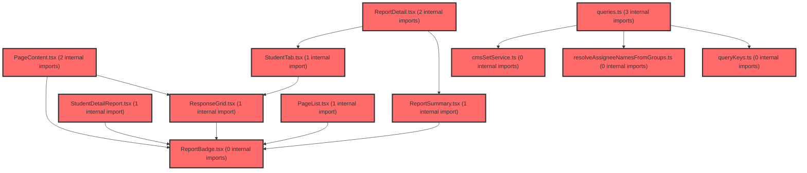

> [!IMPORTANT]
> **⚠️ 수동 검토 권장 (자가힐링 주의)**
>
> AI 자가힐링 결과물이 실제 의도와 다를 수 있으므로, **상세 리뷰 내용에 기반한 수동 점검**을 우선해 주시기 바랍니다. 자가힐링 기능을 활용하실 경우 최종 결과물을 신중하게 확인해 주세요.

# 코드 리뷰 - f16ca405

## 코드 복잡도 분석

**분석된 파일**: 18개 / 변경된 파일: 19개


### Import 의존관계 다이어그램



**범례**: 중심 파일 (변경됨) | 많은 import (10개 이상)


### 정상 범위 (NONE)


**`resolveassigneenamesfromgroups.ts`** (other)

- 평균 복잡도: **0.006**

- 최대 복잡도: 0.010

- 청크 수: 5개


**권장사항:**

- 복잡도 정상 범위


**`cmssetservice.ts`** (other)

- 평균 복잡도: **0.004**

- 최대 복잡도: 0.010

- 청크 수: 12개


**권장사항:**

- 복잡도 정상 범위


**`lmsactivityservice.ts`** (other)

- 평균 복잡도: **0.003**

- 최대 복잡도: 0.007

- 청크 수: 59개


**권장사항:**

- 파일 크기가 큼 (59개 청크) - 파일 분리 검토


**`queries.ts`** (other)

- 평균 복잡도: **0.003**

- 최대 복잡도: 0.012

- 청크 수: 91개


**권장사항:**

- 파일 크기가 큼 (91개 청크) - 파일 분리 검토


**`gnbconfig.ts`** (config)

- 평균 복잡도: **0.003**

- 최대 복잡도: 0.013

- 청크 수: 9개


**권장사항:**

- Config 파일은 높은 연결도가 정상적임


**`index.ts`** (other)

- 평균 복잡도: **0.002**

- 최대 복잡도: 0.009

- 청크 수: 35개


**권장사항:**

- 파일 크기가 큼 (35개 청크) - 파일 분리 검토


**`mapreportdetail.ts`** (other)

- 평균 복잡도: **0.002**

- 최대 복잡도: 0.007

- 청크 수: 24개


**권장사항:**

- 파일 크기가 큼 (24개 청크) - 파일 분리 검토


**`lessonreportdetailpage.tsx`** (component)

- 평균 복잡도: **0.001**

- 최대 복잡도: 0.004

- 청크 수: 6개


**권장사항:**

- 복잡도 정상 범위


**`pagelist.tsx`** (component)

- 평균 복잡도: **0.001**

- 최대 복잡도: 0.012

- 청크 수: 33개


**권장사항:**

- 파일 크기가 큼 (33개 청크) - 파일 분리 검토


**`reportbadge.tsx`** (other)

- 평균 복잡도: **0.001**

- 최대 복잡도: 0.003

- 청크 수: 31개


**권장사항:**

- 파일 크기가 큼 (31개 청크) - 파일 분리 검토


**`querykeys.ts`** (other)

- 평균 복잡도: **0.000**

- 최대 복잡도: 0.001

- 청크 수: 17개


**권장사항:**

- 복잡도 정상 범위


**`pagecontent.tsx`** (component)

- 평균 복잡도: **0.000**

- 최대 복잡도: 0.005

- 청크 수: 32개


**권장사항:**

- 파일 크기가 큼 (32개 청크) - 파일 분리 검토


**`reportdetail.tsx`** (other)

- 평균 복잡도: **0.000**

- 최대 복잡도: 0.003

- 청크 수: 26개


**권장사항:**

- 파일 크기가 큼 (26개 청크) - 파일 분리 검토


**`reportsummary.tsx`** (other)

- 평균 복잡도: **0.000**

- 최대 복잡도: 0.004

- 청크 수: 46개


**권장사항:**

- 파일 크기가 큼 (46개 청크) - 파일 분리 검토


**`responsegrid.tsx`** (other)

- 평균 복잡도: **0.000**

- 최대 복잡도: 0.004

- 청크 수: 40개


**권장사항:**

- 파일 크기가 큼 (40개 청크) - 파일 분리 검토


**`studenttab.tsx`** (other)

- 평균 복잡도: **0.000**

- 최대 복잡도: 0.006

- 청크 수: 84개


**권장사항:**

- 파일 크기가 큼 (84개 청크) - 파일 분리 검토


**`index.ts`** (other)

- 평균 복잡도: **0.000**

- 최대 복잡도: 0.000

- 청크 수: 6개


**권장사항:**

- 복잡도 정상 범위


**`studentdetailreport.tsx`** (other)

- 평균 복잡도: **0.000**

- 최대 복잡도: 0.008

- 청크 수: 71개


**권장사항:**

- 파일 크기가 큼 (71개 청크) - 파일 분리 검토


---


## 변경 배경

이 커밋은 `LessonReportDetailPage` 리포트 상세 화면에 실제 LMS/CMS API를 연동하는 **추가계획18**의 구현입니다. 기존에는 `getReportDetailView` 로컬 목업 데이터로만 화면을 그렸으나, 이번 변경으로 활동 단건(`GET /api/v1/activities/{activityId}`), 참여 현황(`/progress`), 통계(`/statistics`), 배정 명단(`/assignees`), 학생별 참여 결과(`/participations/{participationId}`), CMS 아티클(`GET /api/articles/{articleId}`)을 실제 서버에서 조회하여 요약·학생 탭·응답 격자를 채웁니다.

- **목적**: 리포트 상세 화면의 목업 데이터를 실제 API 응답으로 대체
- **도메인**: API 연동 (LMS/CMS), 비즈니스 로직, UI 위젯
- **변경 방향**: `pages → widgets → features → shared` FSD 단방향 구조를 준수하며, 페이지는 얇게 유지하고 조회 로직은 `features/lesson/api`의 React Query 훅으로 이동

---

## [GOOD] 잘된 점

1. **FSD 레이어 준수가 철저함**: `LessonReportDetailPage.tsx`는 `activityId`와 `state.activity`만 전달하고 fetch 로직이 전혀 없습니다. 모든 API 호출은 `features/lesson/api/queries.ts`의 React Query 훅으로 이동했고, 매퍼·집계는 `features/lesson/model/mapReportDetail.ts`에 분리되어 계획서 §0의 원칙을 정확히 지켰습니다.

2. **계획서 스펙과 구현의 정합성이 높음**: 계획서 §4.2의 "`assignedCount`는 `ASSIGNED`만. 키 없으면 `–`", §4.3의 "`averageScore`에 `%`를 붙이지 않는다", §6.3의 "`UNGRADABLE`·키 없음(미채점)은 채점집합에 넣지 않는다", §7.1의 "`Primary` → `Title` 변경" 등이 실제 코드에 그대로 반영되었습니다. 특히 `mapReportDetail.ts`의 `GRADED_ERRATA` 상수(`CORRECT | INCORRECT | PARTIAL`)로 미채점을 오답으로 세지 않는 LMS 규칙을 정확히 구현했습니다.

3. **에러 처리 전략이 현실적임**: `retryUnlessNotFound`로 404/409는 재시도하지 않고, `isNotSubmittedError`로 409 `NOT_SUBMITTED`를 미제출로 취급하여 화면을 깨지 않게 처리했습니다. CMS 아티클 실패 시 제목을 `lcmsArticleId`로 fallback하고 배지를 숨기는 등 부분 실패가 전체 화면을 막지 않도록 설계되었습니다.

---

## 변경사항 요약

LMS GET 5종 서비스(`getActivity`, `getActivityProgress`, `getActivityStatistics`, `getActivityAssignees`, `getTeacherParticipationResult`)와 CMS `getCmsArticle`을 추가하고, `ReportDetail`/`ReportSummary`/`StudentTab`/`ResponseGrid` 위젯이 해당 훅을 소비하도록 재구성했습니다. `reportBadges.tsx` → `ReportBadge.tsx` 파일명 변경, `NOT_AVAILABLE` 라벨을 '완료' → '발행 전'으로 수정, GNB 라벨 '수업 결과 보기' → '수업 결과보기'로 통일, 디버그 `console.log` 제거가 포함됩니다.

---

## [ISSUE] 개선이 필요한 부분

### Critical (즉시 수정 필요)

없음

### High (우선 수정 권장)

**1. `StudentTab`에서 참여 결과 로딩 중 상태 미표시**

`StudentTab.tsx`에서 `participationQuery`가 로딩 중일 때 별도의 로딩 UI 없이 `participation`이 `undefined`로 처리되어 활동 페이지·정답률 타일이 `–`로 표시됩니다. 사용자 입장에서는 데이터가 로딩 중인지, 실제로 미제출인지 구분할 수 없습니다.

- **위치**: `frontend/src/widgets/lesson/result/StudentTab.tsx` (약 250–270행)
- **기존 코드**:
```tsx
const participation =
  participationQuery.isError && isNotSubmittedError(participationQuery.error)
    ? undefined
    : participationQuery.data;
const summary = summarizeParticipation(participation);
```
- **해결 방안**: `participationQuery.isPending`일 때 타일 영역에 스켈레톤 또는 `Loading` 컴포넌트를 표시하거나, 최소한 타일에 로딩 표시를 추가하세요.
```tsx
const participation =
  participationQuery.isError && isNotSubmittedError(participationQuery.error)
    ? undefined
    : participationQuery.data;
const summary = summarizeParticipation(participation);
const participationPending = participationQuery.isPending;
```
```tsx
<Tile>
  <TileLabel>활동 페이지</TileLabel>
  <TileValue>
    {participationPending ? <Loading size='sm' /> : participation ? `${summary.answered}/${summary.total} p` : <Dash>–</Dash>}
  </TileValue>
</Tile>
```

**2. `useCmsArticleMapQuery`의 `isPending` 미사용**

`queries.ts`의 `useCmsArticleMapQuery`는 `isPending`을 반환하지만 `StudentTab`에서 이를 소비하지 않습니다. CMS 아티클 로딩 중에는 제목이 `lcmsArticleId`로 표시되었다가 로딩 완료 후 `name`으로 교체되는데, 이로 인해 화면이 깜빡일 수 있습니다.

- **위치**: `frontend/src/widgets/lesson/result/StudentTab.tsx` (약 230행)
- **기존 코드**:
```tsx
const { map: articleMap } = useCmsArticleMapQuery(articleIds);
```
- **해결 방안**: `isPending`을 받아 격자 영역에 로딩 표시를 추가하거나, 최소한 제목 fallback 시 로딩 중임을 암시하는 UI를 고려하세요.
```tsx
const { map: articleMap, isPending: articleMapPending } = useCmsArticleMapQuery(articleIds);
```

### Medium (개선 권장)

**1. `resolveAssigneeNamesFromGroups`의 그룹 상세 N+1 호출**

`resolveAssigneeNamesFromGroups`는 교사 그룹 목록을 조회한 뒤 각 그룹에 대해 `getGroupDetail`을 순차 호출합니다. 그룹 수가 많아지면 N+1 문제가 발생할 수 있습니다. 계획서 §9에서 "그룹 상세 N회 호출은 임시 이름 해석 비용이다. 캐시를 재사용한다"고 명시했지만, `useAssigneeDirectoryQuery`의 `queryFn` 내부에서 `getMyGroups`/`getGroupDetail`을 직접 호출하므로 React Query 캐시가 아닌 서비스 레벨에서 중복 호출이 발생할 수 있습니다.

- **위치**: `frontend/src/features/lesson/model/resolveAssigneeNamesFromGroups.ts` (전체)
- **개선 제안**: `useMyGroupsQuery`의 데이터를 재사용하거나, 그룹 상세 조회 결과를 별도 query key로 캐시하여 중복 호출을 방지하세요. 다만 이는 계획서에서 "임시"로 명시한 부분이므로 우선순위는 낮습니다.

**2. `ReportSummary`의 `showParticipation` 조건 경계**

`showParticipation = assignedCount != null && assignedCount > 0 && startedCount != null` 조건에서 `startedCount`가 0인 경우(아직 아무도 시작하지 않음)에도 `0/10명 · 0%`로 표시됩니다. 계획서 §4.2의 "`startedCount`만 있고 분모가 없으면 비율을 만들지 않는다"는 준수했지만, `startedCount: 0`이 명시적으로 오면 `0/10명 · 0%`가 표시되는데 이는 의도된 동작인지 확인이 필요합니다. `assignedCount`가 있고 `startedCount`가 0인 것은 정상적인 상태이므로 현재 구현이 적절합니다.

**3. `PageContent.tsx`의 `primary` → `title` 변경이 `GridItem` 인터페이스와 정합**

`PageContent.tsx`에서 `primary` → `title`로 변경되었지만, `ResponseGrid.tsx`의 `GridItem` 인터페이스도 `title`로 변경되었는지 확인이 필요합니다. Diff에서 `ResponseGrid.tsx`의 `GridItem` 인터페이스 변경이 명시적으로 보이지 않지만, `PageContent.tsx`에서 `title` 속성을 사용하므로 `GridItem`도 `title`로 변경되었을 것으로 추정됩니다. 이 부분은 `tsc` 통과로 검증되었다고 계획서에 명시되어 있어 문제없을 것으로 판단됩니다.

---

## 주요 파일 분석

### `frontend/src/features/lesson/api/lmsActivityService.ts`

**변경 내용:**
`ActivityDetail` 타입에 `openAt`/`closeAt`/`labels`/`items` 필드를 추가하고, GET 5종 서비스 함수를 신규 추가했습니다. `lmsFetch`의 에러 처리도 개선되어 `parseLmsBody`로 응답 본문 파싱 실패 시에도 `LmsHttpError`를 던질 수 있게 되었습니다.

**개선 제안:**
1. `lmsFetch`의 에러 처리 개선은 좋은 변경입니다. 기존에는 `res.ok`가 false일 때 `json` 파싱을 시도하지 않아 에러 메시지를 얻을 수 없었지만, 이제 `parseLmsBody`로 본문을 먼저 파싱하여 `message`/`errorCode`를 추출할 수 있습니다.
   - **위치**: `lmsActivityService.ts` (약 208–220행)
   - **기존 코드**:
```ts
async function lmsFetch<T>(input: RequestInfo, init?: RequestInit): Promise<T> {
  const auth = getAuth();
  const res = await auth.authorizedFetch(input, init);
  const json = await parseLmsBody<T>(res);
  if (!res.ok || !json?.success) {
    throw new LmsHttpError(
      json?.message ?? `LMS API 실패: ${res.status}`,
      res.status,
      json?.errorCode ?? null,
    );
  }
  return json.data;
}
```
   - 이 코드는 이미 개선된 형태로, 추가 수정이 필요하지 않습니다.

### `frontend/src/features/lesson/model/mapReportDetail.ts`

**변경 내용:**
신규 파일로, `articleTypeToNature`(20/21/22 → 개념/문항/활동), `lmsErrataToCd`(LMS enum → 목업 `ErrataCd`), `summarizeParticipation`(활동 페이지·정답률 집계), `cellFromParticipationItem`(격자 셀 매핑), `isNotSubmittedError`(409 처리)를 제공합니다.

**개선 제안:**
1. `summarizeParticipation`의 `answered` 계산이 `item.answer !== undefined`로 판단하는데, 계획서 §6.2의 "`answer` (단수, 답을 냈을 때만 키 존재)"와 일치합니다. 다만 `answer`가 `null`로 명시적으로 오는 경우(키는 있지만 값이 null) `answered`에 포함되는데, 이는 스펙상 "키 없음"이 아닌 "null"이므로 실제 응답에서 null이 오는지 확인이 필요합니다. 만약 null이 올 수 있다면 `item.answer != null`로 변경하는 것이 안전합니다.
   - **위치**: `mapReportDetail.ts` (약 48행)
   - **기존 코드**:
```ts
export const hasParticipationAnswer = (item: ParticipationResultItem): boolean =>
  item.answer !== undefined;
```
   - **해결 방안**:
```ts
export const hasParticipationAnswer = (item: ParticipationResultItem): boolean =>
  item.answer != null;
```

### `frontend/src/widgets/lesson/result/ReportDetail.tsx`

**변경 내용:**
목업 `getReportDetailView`를 제거하고 `useActivityDetailQuery`/`useActivityProgressQuery`/`useActivityStatisticsQuery` 훅으로 대체했습니다. 로딩/에러 상태에 따라 `LoadingBox`/`ErrorBox`를 표시하고, 성공 시에만 하위 위젯을 렌더링합니다.

**개선 제안:**
1. `detailQuery.isPending`일 때 `LoadingBox`를 표시하고, `isError`일 때 `ErrorBox`를 표시하는 구조는 명확합니다. 다만 `progressQuery`/`statisticsQuery`의 로딩/에러 상태는 `ReportSummary` 내부에서 개별적으로 처리되는데, `ReportSummary`는 `progress`/`statistics`가 `undefined`일 때 `–`로 표시하므로 부분 실패에 대한 처리가 자연스럽게 이루어집니다. 이는 계획서 §10의 "progress/statistics/assignees 실패: 해당 슬롯 – 또는 탭 에러. 다른 슬롯은 유지"와 일치합니다.

### `frontend/src/widgets/lesson/result/StudentTab.tsx`

**변경 내용:**
`useActivityAssigneesQuery`로 명단을 조회하고, `useAssigneeDirectoryQuery`로 그룹 멤버 역방향 이름 해석을 수행합니다. 선택 학생의 `participationId`를 progress rows에서 찾아 `useTeacherParticipationQuery`로 상세 결과를 조회합니다.

**개선 제안:**
1. `curId` 계산 로직에서 `students[0]?.sub ?? ''`로 기본 선택을 처리하는데, `students`가 빈 배열이면 `curId`가 `''`가 되고 `cur`가 `undefined`가 됩니다. 하지만 `students.length === 0`일 때 이미 빈 상태를 반환하므로 실제로 `cur`가 `undefined`인 상태로 렌더링되는 경로는 없습니다. 다만 `curId`가 `''`일 때 `progress?.rows.find((row) => row.participant === '')`가 호출될 수 있는데, `students.length === 0`이면 이미 return되었으므로 안전합니다.
   - **위치**: `StudentTab.tsx` (약 220–225행)
   - 이 부분은 현재 구조상 문제가 없지만, `students`가 변경될 때 `selectedId`가 더 이상 유효하지 않으면 `students[0]`으로 자동 전환되는 로직이 `useMemo`가 아닌 렌더링 중 계산으로 수행됩니다. `curId` 계산을 `useMemo`로 감싸면 불필요한 재계산을 방지할 수 있습니다.

2. `participationQuery`의 로딩 상태 미표시는 위 High 이슈에서 언급한 대로 개선이 필요합니다.

### `frontend/src/features/lesson/api/queries.ts`

**변경 내용:**
`useActivityDetailQuery` 등 5종의 상세 훅과 `useAssigneeDirectoryQuery`, `useCmsArticleMapQuery`를 추가했습니다. `retryUnlessNotFound`로 404/409 재시도를 방지합니다.

**개선 제안:**
1. `useCmsArticleMapQuery`의 `useQueries`에서 `retry: 1`로 설정되어 있는데, `retryUnlessNotFound`와 동일한 정책을 적용할지 검토가 필요합니다. CMS 아티클 404는 정상적인 상황(아티클 삭제 등)일 수 있으므로 재시도 없이 즉시 fallback하는 것이 나을 수 있습니다.
   - **위치**: `queries.ts` (약 355–370행)
   - **기존 코드**:
```ts
const results = useQueries({
  queries: unique.map((id) => ({
    queryKey: lessonKeys.cmsArticle(id),
    queryFn: ({ signal }: { signal?: AbortSignal }) => getCmsArticle(id, signal),
    retry: 1,
  })),
});
```
   - **해결 방안**: 404에 대한 재시도를 방지하려면 `retry: (failureCount, error) => !(error instanceof LmsHttpError && error.status === 404)`로 변경하거나, `retry: 0`으로 설정하는 것이 좋습니다.

---

## 최종 평가

**결론**: 
- [x] [WARN] **조건부 승인 (Approved with Comments)** - Critical/High 이슈 없음 (단, 로딩 상태 미표시는 UX 개선 권장)

**종합 의견:**

이 커밋은 계획서(추가계획18)의 스펙을 매우 충실하게 구현했습니다. FSD 레이어 준수, API 타입 확장, 에러 처리 전략, 목업 제거 범위 모두 계획서와 정확히 일치하며, `tsc`와 eslint 검증까지 완료된 상태입니다. 특히 `mapReportDetail.ts`의 `GRADED_ERRATA` 집합으로 미채점을 오답으로 세지 않는 LMS 규칙을 정확히 반영한 점, `retryUnlessNotFound`로 404/409 재시도를 방지한 점, `ReportSummary`에서 `assignedCount`가 없을 때 `–`로 표시하여 OPEN 상태를 정확히 처리한 점이 돋보입니다.

다만 `StudentTab`에서 참여 결과 로딩 중 상태를 사용자에게 표시하지 않는 점과 `useCmsArticleMapQuery`의 `isPending` 미사용으로 인한 화면 깜빡임 가능성은 UX 관점에서 개선 여지가 있습니다. 이는 기능상 버그는 아니므로 조건부 승인으로 판단합니다.