> [!IMPORTANT]
> **수동 검토 대상 (자가힐링 주의)**
>
> 이 커밋은 변경 범위가 넓거나 로직의 복잡도가 높아 AI 자가힐링이 완벽하지 않을 수 있습니다.
> 아래 리뷰 내용을 바탕으로 **수동 검토를 우선**하시고, 자가힐링 기능을 사용하실 경우 결과물을 신중히 확인해 주시기 바랍니다.

# 코드 리뷰 - f18311be

## 코드 복잡도 분석

**분석된 파일**: 33개 / 변경된 파일: 33개


### Import 의존관계 다이어그램

```mermaid
flowchart TD
    F0["AuthContext.tsx (1 imports)"]:::center
    F1["AssessmentList.tsx (1 imports)"]:::center
    F2["unifiedCounselingService.ts (1 imports)"]:::center
    F3["types.ts (0 imports)"]:::center
    F4["ExamCodeEntryPage.tsx (1 imports)"]:::center
    F5["Layout.tsx (0 imports)"]
    F6["ExamPage.tsx (1 imports)"]:::center
    F7["TypeClassification.tsx (3 imports)"]:::center
    F8["MinimalLayout.tsx (0 imports)"]
    F9["CreateAssessmentModal.tsx (0 imports)"]:::center
    F10["groupService.ts (0 imports)"]:::center
    F11["studentExamService.ts (1 imports)"]:::center
    F12["JoinGroupPage.tsx (1 imports)"]:::center
    F13["ExamCard.tsx (2 imports)"]:::center
    F14["schoolRecordService.ts (1 imports)"]:::center
    F15["guestExamService.ts (0 imports)"]:::center
    F16["GuestExamCard.tsx (1 imports)"]:::center
    F17["GuestExamListPage.tsx (2 imports)"]:::center
    F18["routes.tsx (21 imports)"]:::center
    F19["index.ts (0 imports)"]:::center
    F18 --> F0
    F18 --> F5
    F18 --> F6
    F18 --> F8
    F18 --> F9
    F18 --> F15
    F12 --> F10
    F7 --> F19
    F13 --> F3
    F13 --> F11
    F11 --> F3
    F16 --> F15
    F17 --> F15
    F17 --> F16
    classDef center fill:#ff6b6b,stroke:#333,stroke-width:3px
    classDef high fill:#ffd93d,stroke:#333,stroke-width:2px
```



**범례**: 중심 파일 (변경됨) | 많은 import (10개 이상)


### 모니터링 권장 (LOW)


**`examcodeentrypage.tsx`** (component)

- 평균 복잡도: **0.517**

- 최대 복잡도: 0.521

- 청크 수: 9개

- 평균 사용처: 53.9곳


**권장사항:**

- **모니터링 권장**: 복잡도가 높은 편이지만 영향 범위 제한적


**`guestexamentrystep.tsx`** (component)

- 평균 복잡도: **0.516**

- 최대 복잡도: 0.521

- 청크 수: 3개

- 평균 사용처: 57.7곳


**권장사항:**

- **모니터링 권장**: 복잡도가 높은 편이지만 영향 범위 제한적


**`index.ts`** (other)

- 평균 복잡도: **0.307**

- 최대 복잡도: 0.513

- 청크 수: 5개

- 평균 사용처: 33.6곳


**권장사항:**

- **모니터링 권장**: 복잡도가 높은 편이지만 영향 범위 제한적


**`studentexamservice.ts`** (other)

- 평균 복잡도: **0.280**

- 최대 복잡도: 0.530

- 청크 수: 26개

- 평균 사용처: 19.2곳


**권장사항:**

- **모니터링 권장**: 복잡도가 높은 편이지만 영향 범위 제한적

- 파일 크기가 큼 (26개 청크) - 파일 분리 검토


**`createassessmentmodal.tsx`** (component)

- 평균 복잡도: **0.279**

- 최대 복잡도: 0.525

- 청크 수: 35개

- 평균 사용처: 31.1곳


**권장사항:**

- **모니터링 권장**: 복잡도가 높은 편이지만 영향 범위 제한적

- 파일 크기가 큼 (35개 청크) - 파일 분리 검토


**`exampage.tsx`** (component)

- 평균 복잡도: **0.270**

- 최대 복잡도: 0.572

- 청크 수: 56개

- 평균 사용처: 22.7곳


**권장사항:**

- **모니터링 권장**: 복잡도가 높은 편이지만 영향 범위 제한적

- 파일 크기가 큼 (56개 청크) - 파일 분리 검토


**`assessmentcodemodal.tsx`** (component)

- 평균 복잡도: **0.260**

- 최대 복잡도: 0.526

- 청크 수: 28개

- 평균 사용처: 22.7곳


**권장사항:**

- **모니터링 권장**: 복잡도가 높은 편이지만 영향 범위 제한적

- 파일 크기가 큼 (28개 청크) - 파일 분리 검토


**`typeclassification.tsx`** (component)

- 평균 복잡도: **0.259**

- 최대 복잡도: 0.520

- 청크 수: 18개

- 평균 사용처: 26.8곳


**권장사항:**

- **모니터링 권장**: 복잡도가 높은 편이지만 영향 범위 제한적


**`assessmentpage.tsx`** (component)

- 평균 복잡도: **0.258**

- 최대 복잡도: 0.567

- 청크 수: 60개

- 평균 사용처: 25.6곳


**권장사항:**

- **모니터링 권장**: 복잡도가 높은 편이지만 영향 범위 제한적

- 파일 크기가 큼 (60개 청크) - 파일 분리 검토


**`index.ts`** (other)

- 평균 복잡도: **0.255**

- 최대 복잡도: 0.526

- 청크 수: 188개

- 평균 사용처: 28.1곳


**권장사항:**

- **모니터링 권장**: 복잡도가 높은 편이지만 영향 범위 제한적

- 파일 크기가 큼 (188개 청크) - 파일 분리 검토


**`joingrouppage.tsx`** (component)

- 평균 복잡도: **0.254**

- 최대 복잡도: 0.531

- 청크 수: 31개

- 평균 사용처: 28.5곳


**권장사항:**

- **모니터링 권장**: 복잡도가 높은 편이지만 영향 범위 제한적

- 파일 크기가 큼 (31개 청크) - 파일 분리 검토


**`groupservice.ts`** (other)

- 평균 복잡도: **0.251**

- 최대 복잡도: 0.568

- 청크 수: 107개

- 평균 사용처: 32.9곳


**권장사항:**

- **모니터링 권장**: 복잡도가 높은 편이지만 영향 범위 제한적

- 파일 크기가 큼 (107개 청크) - 파일 분리 검토


**`types.ts`** (other)

- 평균 복잡도: **0.247**

- 최대 복잡도: 0.523

- 청크 수: 8개

- 평균 사용처: 9.4곳


**권장사항:**

- **모니터링 권장**: 복잡도가 높은 편이지만 영향 범위 제한적


**`assessmentlist.tsx`** (component)

- 평균 복잡도: **0.244**

- 최대 복잡도: 0.521

- 청크 수: 20개

- 평균 사용처: 21.2곳


**권장사항:**

- **모니터링 권장**: 복잡도가 높은 편이지만 영향 범위 제한적


**`types.ts`** (other)

- 평균 복잡도: **0.240**

- 최대 복잡도: 0.521

- 청크 수: 16개

- 평균 사용처: 18.8곳


**권장사항:**

- **모니터링 권장**: 복잡도가 높은 편이지만 영향 범위 제한적


**`routes.tsx`** (other)

- 평균 복잡도: **0.235**

- 최대 복잡도: 0.542

- 청크 수: 47개

- 평균 사용처: 14.1곳


**권장사항:**

- **모니터링 권장**: 복잡도가 높은 편이지만 영향 범위 제한적

- 파일 크기가 큼 (47개 청크) - 파일 분리 검토


**`index.ts`** (component)

- 평균 복잡도: **0.235**

- 최대 복잡도: 0.513

- 청크 수: 25개

- 평균 사용처: 48.7곳


**권장사항:**

- **모니터링 권장**: 복잡도가 높은 편이지만 영향 범위 제한적

- 파일 크기가 큼 (25개 청크) - 파일 분리 검토


**`authcontext.tsx`** (other)

- 평균 복잡도: **0.226**

- 최대 복잡도: 0.551

- 청크 수: 44개

- 평균 사용처: 30.5곳


**권장사항:**

- **모니터링 권장**: 복잡도가 높은 편이지만 영향 범위 제한적

- 파일 크기가 큼 (44개 청크) - 파일 분리 검토


**`schoolrecordservice.ts`** (other)

- 평균 복잡도: **0.207**

- 최대 복잡도: 0.518

- 청크 수: 15개

- 평균 사용처: 20.6곳


**권장사항:**

- **모니터링 권장**: 복잡도가 높은 편이지만 영향 범위 제한적


**`examcard.tsx`** (component)

- 평균 복잡도: **0.189**

- 최대 복잡도: 0.521

- 청크 수: 15개

- 평균 사용처: 17.3곳


**권장사항:**

- **모니터링 권장**: 복잡도가 높은 편이지만 영향 범위 제한적


**`memoservice.ts`** (other)

- 평균 복잡도: **0.183**

- 최대 복잡도: 0.515

- 청크 수: 17개

- 평균 사용처: 14.8곳


**권장사항:**

- **모니터링 권장**: 복잡도가 높은 편이지만 영향 범위 제한적


**`unifiedcounselingservice.ts`** (other)

- 평균 복잡도: **0.163**

- 최대 복잡도: 0.516

- 청크 수: 35개

- 평균 사용처: 17.0곳


**권장사항:**

- **모니터링 권장**: 복잡도가 높은 편이지만 영향 범위 제한적

- 파일 크기가 큼 (35개 청크) - 파일 분리 검토


**`guestcompletestep.tsx`** (component)

- 평균 복잡도: **0.103**

- 최대 복잡도: 0.509

- 청크 수: 5개

- 평균 사용처: 24.8곳


**권장사항:**

- **모니터링 권장**: 복잡도가 높은 편이지만 영향 범위 제한적


### 정상 범위 (NONE)


**`vite.config.ts`** (config)

- 평균 복잡도: **0.161**

- 최대 복잡도: 0.518

- 청크 수: 13개

- 평균 사용처: 5.0곳


**권장사항:**

- Config 파일은 높은 연결도가 정상적임


**`guestexamcard.tsx`** (component)

- 평균 복잡도: **0.002**

- 최대 복잡도: 0.010

- 청크 수: 8개


**권장사항:**

- 복잡도 정상 범위


**`guestexamlistpage.tsx`** (component)

- 평균 복잡도: **0.002**

- 최대 복잡도: 0.009

- 청크 수: 13개


**권장사항:**

- 복잡도 정상 범위


**`guestexamservice.ts`** (other)

- 평균 복잡도: **0.002**

- 최대 복잡도: 0.002

- 청크 수: 1개


**권장사항:**

- 복잡도 정상 범위


**`membercompletestep.tsx`** (component)

- 평균 복잡도: **0.001**

- 최대 복잡도: 0.001

- 청크 수: 4개


**권장사항:**

- 복잡도 정상 범위


**`guestcompletepage.tsx`** (component)

- 평균 복잡도: **0.001**

- 최대 복잡도: 0.004

- 청크 수: 6개


**권장사항:**

- 복잡도 정상 범위


**`useclassstudents.ts`** (other)

- 평균 복잡도: **0.001**

- 최대 복잡도: 0.003

- 청크 수: 10개


**권장사항:**

- 복잡도 정상 범위


**`useteacherclasses.ts`** (other)

- 평균 복잡도: **0.001**

- 최대 복잡도: 0.007

- 청크 수: 15개


**권장사항:**

- 복잡도 정상 범위


**`index.ts`** (component)

- 평균 복잡도: **0.000**

- 최대 복잡도: 0.000

- 청크 수: 1개


**권장사항:**

- 복잡도 정상 범위


**`index.ts`** (other)

- 평균 복잡도: **0.000**

- 최대 복잡도: 0.000

- 청크 수: 3개


**권장사항:**

- 복잡도 정상 범위


---


## [GOOD] 잘된 점
CP님, 이번 커밋에서 게스트 검사 응시 플로우를 체계적으로 개선하신 점이 인상적입니다.

1. **사용자 경험 개선에 중점을 둔 설계**: 게스트와 회원의 검사 플로우를 명확히 분리하여 각 사용자 유형에 최적화된 인터페이스를 제공했습니다.
2. **호환성 유지와 점진적 개선 병행**: 기존 `/exam/:code` URL을 `/join/:code`로 리다이렉트하는 방식으로 하위 호환성을 유지하면서 새로운 초대코드 시스템으로 전환했습니다.
3. **모듈화와 관심사 분리**: `guest-exam` 기능을 독립된 모듈로 구성하여 유지보수성과 확장성을 높였습니다.

## 변경사항 요약
이번 커밋은 게스트 검사 응시 플로우를 대폭 개선한 병합 커밋입니다. 주요 변경사항으로는 4자리 검사코드 방식에서 초대코드(inviteCode) 기반 시스템으로 전환, 게스트 전용 라우트 및 컴포넌트 추가, 회원/게스트 플로우 분리 등이 포함됩니다.

## [ISSUE] 개선이 필요한 부분

### 🔴 Critical (즉시 수정 필요)
없음

### 🟠 High (우선 수정 권장)
없음

### 🟡 Medium (개선 권장)
1. **게스트 인증 상태 관리의 명시성 향상**
   - `AuthContext.tsx`의 `loginAsGuest` 함수가 외부에서 호출될 때 게스트 상태가 명확히 설정되는지 확인이 필요합니다.
   - **해결 방안**: 게스트 로그인 후 `memberType`이 'guest'로 정확히 설정되는지 검증 로직 추가

2. **타입 안정성 보강**
   - `GuestExamListPage.tsx`에서 `user` 객체의 `stdtId`, `classId` 존재 여부를 체크하지만, `User` 타입 정의에 해당 필드가 명시적으로 포함되어 있는지 확인 필요
   - **해결 방안**: `User` 타입에 게스트 관련 필드를 옵셔널로 명시하거나, 게스트 전용 타입 분리 고려

## 주요 파일 분석

### prototype/src/app/routes.tsx
**변경 내용:** 
게스트 전용 보호 라우트(`GuestProtectedLayout`) 추가 및 `/exam/:code` → `/join/:code` 리다이렉트 구현

**개선 제안:**
1. **라우트 보호 로직의 일관성 유지**
   - `GuestProtectedLayout`과 `StudentProtectedLayout`의 인증 체크 로직이 유사하지만 중복 구현되어 있습니다.
   - **해결 방안**: 공통 보호 로직을 HOC 또는 커스텀 훅으로 추상화하여 재사용성 향상

### prototype/src/features/auth/context/AuthContext.tsx
**변경 내용:**
게스트 로그인 기능(`loginAsGuest`) 및 게스트용 사용자 상태 관리 추가

**개선 제안:**
1. **토큰 감시 메커니즘 최적화**
   - 현재 1초 간격으로 `setInterval`을 사용해 토큰을 감시하는 방식은 성능에 부담을 줄 수 있습니다.
   - **해결 방안**: `localStorage` 이벤트 리스너나 토큰 만료 시간 기반 체크로 변경 고려

### prototype/src/features/guest-exam/pages/GuestExamListPage.tsx
**변경 내용:**
게스트용 검사 목록 페이지 구현으로, 게스트가 가입한 그룹의 검사 목록을 표시

**코드 품질 평가:**
```typescript
// 잘 구현된 점:
// 1. 명확한 상태 관리 (loading, exams 상태 분리)
// 2. 사용자 친화적인 로딩 및 에러 처리
// 3. 검사 상태별 동작 분기 명확함

// 개선 포인트:
useEffect(() => {
  const loadExams = async () => {
    if (!user?.stdtId || !user?.classId) {
      console.warn('[GuestExamListPage] 게스트 정보 없음:', user);
      setExams([]);
      setIsLoading(false);
      return;
    }
    // ...
  };
  loadExams();
}, [user]); // user 객체 전체를 의존성으로 사용
```
- **의존성 배열 최적화**: `user` 객체 전체보다는 `user.stdtId`, `user.classId` 같은 구체적인 필드를 의존성으로 사용하는 것이 더 안전합니다.

## 🎯 최종 평가

**결론**: 
- [✓] [OK] **승인 (Approved)** - Critical/High 이슈 없음

**종합 의견:**
CP님, 게스트 검사 응시 플로우의 구조적 개선을 체계적으로 수행하셨습니다. 기존 시스템과의 호환성을 유지하면서 새로운 초대코드 기반 시스템으로 전환한 점, 사용자 유형별로 최적화된 플로우를 제공한 점이 특히 긍정적입니다. Medium 수준의 개선 사항은 차기 작업에서 점진적으로 반영하시면 됩니다. 전반적으로 실무 적용 가능한 수준의 품질을 유지하고 있습니다.