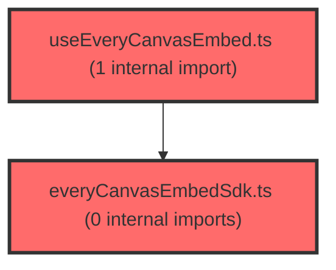

# 코드 리뷰 - f4031cd2

## 코드 복잡도 분석

**분석된 파일**: 2개 / 변경된 파일: 2개

### Import 의존관계 다이어그램

**범례**: 중심 파일 (변경됨) | 많은 import (10개 이상)

### 정상 범위 (NONE)

**`everycanvasembedsdk.ts`** (utility)

- 평균 복잡도: **0.002**

- 최대 복잡도: 0.006

- 청크 수: 13개

**권장사항:**

- 복잡도 정상 범위

**`useeverycanvasembed.ts`** (utility)

- 평균 복잡도: **0.001**

- 최대 복잡도: 0.004

- 청크 수: 10개

**권장사항:**

- 복잡도 정상 범위

---

## 변경 배경

everyCanvas Embed SDK의 `createEmbed` 호출 시 `brandId`(브랜드 식별자)를 전달하기 위한 변경입니다. 커밋 메시지(`수업 sdk props brandId={21} 추가`)에서 알 수 있듯이, 수업(lesson) 화면에서 everyCanvas 임베드를 생성할 때 브랜드 정보를 SDK에 넘겨주어야 하는 요구사항을 반영한 것입니다.

- **목적**: everyCanvas Embed SDK에 `brandId`를 전달하여 브랜드별 동작/테마를 구분
- **도메인**: 프론트엔드 (UI 임베드 SDK 연동)
- **변경 방향**: `CreateEmbedOptions` 타입에 `brandId` 필드를 추가하고, React 훅에서 이를 ref로 관리하여 `createEmbed` 호출 시 전달

## [GOOD] 잘된 점

- 기존 훅의 ref 패턴(`optionsRef`, `handlersRef` 등)을 그대로 따라 `brandIdRef`를 일관성 있게 추가하여 기존 코드 스타일을 잘 유지했습니다.
- `brandId`에 기본값(`21`)을 부여하여 호출부에서 필수로 넘기지 않아도 동작하도록 하위 호환성을 확보했습니다.
- `brandId`를 `options`가 아닌 훅의 별도 파라미터로 분리하여, `options` 객체가 재생성되어도 ref 갱신 로직과 분리된 명확한 책임을 갖게 했습니다.

## 변경사항 요약

`CreateEmbedOptions` 타입에 `brandId: number` 필드를 추가하고, `useEveryCanvasEmbed` 훅에 `brandId` 파라미터(기본값 21)와 `brandIdRef`를 도입하여 `createEmbed` 호출 시 전달하도록 변경했습니다.

---

## [ISSUE] 개선이 필요한 부분

### Critical (즉시 수정 필요)

없음

### High (우선 수정 권장)

없음

### Medium (개선 권장)

1. **`brandId`가 `CreateEmbedOptions`에서 필수(`number`)로 선언된 점**
   - `CreateEmbedOptions`의 `brandId`가 필수 필드로 추가되었습니다. 이는 타입 안전성 측면에서 좋지만, `useEveryCanvasEmbed` 훅에서는 `brandId`가 선택적(`brandId?: number`)이고 기본값 21을 사용합니다. 즉, 훅을 사용하는 호출부는 `options`에 `brandId`를 넣지 않아도 되지만, `CreateEmbedOptions` 타입을 직접 사용하는 다른 호출부(예: 훅 외부에서 `createEmbed`를 직접 호출하는 곳)는 반드시 `brandId`를 채워야 합니다. 이로 인해 기존에 `CreateEmbedOptions`를 사용하던 다른 코드가 타입 에러를 유발할 수 있습니다. 해당 타입을 사용하는 다른 호출부가 있는지 확인이 필요합니다.
   - **위치**: `everyCanvasEmbedSdk.ts` 라인 64 (`brandId: number;`)
   - **제안**: `brandId`를 선택적(`brandId?: number`)으로 두거나, 훅 내부에서 `options`에 병합하는 방식으로 일관성을 유지하는 것을 고려하세요. 다만 이는 타입 설계 의도에 따라 판단이 필요합니다.

2. **`brandId` 기본값(21)의 하드코딩**
   - 기본값 `21`이 훅 내부에 하드코딩되어 있습니다. 브랜드 식별자가 여러 개로 확장될 경우 상수로 분리하거나 환경설정에서 주입받는 것이 유지보수에 유리합니다. 다만 현재 단일 브랜드(21)만 사용하는 상황이라면 수용 가능한 수준입니다.

---

## 주요 파일 분석

### useEveryCanvasEmbed.ts

**변경 내용:**
`brandId` 파라미터(기본값 21)와 `brandIdRef`를 추가하고, `createEmbed` 호출 시 `brandId`를 전달하도록 변경.

**개선 제안:**

1. `brandId`를 `options`에 병합하는 방식과의 일관성 검토
   - **위치**: `useEveryCanvasEmbed.ts` 라인 90 (`brandId: brandIdRef.current,`)
   - 현재 `createEmbed`에 `...optionsRef.current`를 펼친 뒤 `brandId`를 별도로 덮어쓰는 구조입니다. 만약 호출부가 `options`에 이미 `brandId`를 넣어 전달한다면, 훅의 `brandId` 파라미터(기본값 21)가 이를 덮어쓰게 되어 혼란이 생길 수 있습니다. `options`의 `brandId`와 훅 파라미터의 `brandId` 중 어느 것이 우선인지 명확히 문서화하거나, 한쪽으로 통일하는 것이 좋습니다.

### everyCanvasEmbedSdk.ts

**변경 내용:**
`CreateEmbedOptions` 타입에 `brandId: number` 필드 추가.

**개선 제안:**

1. 필수 필드로 추가됨에 따른 타입 파급 효과 확인
   - **위치**: `everyCanvasEmbedSdk.ts` 라인 64
   - `CreateEmbedOptions`를 직접 사용하는 다른 호출부가 있다면 타입 에러가 발생할 수 있습니다. `grep_search`로 `CreateEmbedOptions` 사용처를 확인하여 파급 범위를 점검하는 것을 권장합니다.

---

## 최종 평가

**결론**: 
- [x] [OK] **승인 (Approved)** - Critical/High 이슈 없음

**종합 의견:**
`brandId` 전달을 위한 변경이 기존 훅의 ref 패턴을 잘 따라 일관성 있게 구현되었고, 기본값을 부여해 하위 호환성도 확보했습니다. 다만 `CreateEmbedOptions`의 `brandId`가 필수 필드로 추가된 점과 기본값 하드코딩은 향후 브랜드 확장 시 재검토가 필요할 수 있습니다. 전반적으로 실무에서 통용될 수 있는 수준의 안정적인 변경입니다.