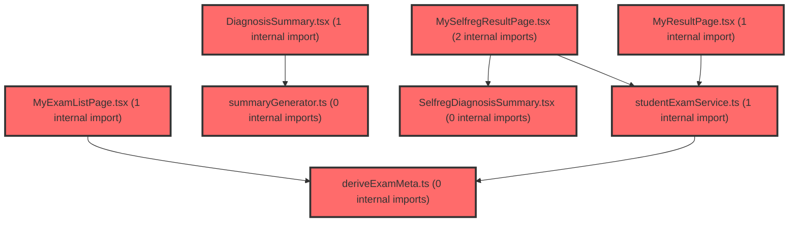

> [!IMPORTANT]
> **⚠️ 수동 검토 권장 (자가힐링 주의)**
>
> AI 자가힐링 결과물이 실제 의도와 다를 수 있으므로, **상세 리뷰 내용에 기반한 수동 점검**을 우선해 주시기 바랍니다. 자가힐링 기능을 활용하실 경우 최종 결과물을 신중하게 확인해 주세요.

# 코드 리뷰 - f4784193

## 코드 복잡도 분석

**분석된 파일**: 11개 / 변경된 파일: 11개


### Import 의존관계 다이어그램



**범례**: 중심 파일 (변경됨) | 많은 import (10개 이상)


### 정상 범위 (NONE)


**`studentexamservice.ts`** (other)

- 평균 복잡도: **0.004**

- 최대 복잡도: 0.009

- 청크 수: 20개


**권장사항:**

- 복잡도 정상 범위


**`deriveexammeta.ts`** (utility)

- 평균 복잡도: **0.003**

- 최대 복잡도: 0.008

- 청크 수: 9개


**권장사항:**

- 복잡도 정상 범위


**`summarygenerator.ts`** (utility)

- 평균 복잡도: **0.003**

- 최대 복잡도: 0.012

- 청크 수: 25개


**권장사항:**

- 파일 크기가 큼 (25개 청크) - 파일 분리 검토


**`selfregsummarygenerator.ts`** (utility)

- 평균 복잡도: **0.002**

- 최대 복잡도: 0.008

- 청크 수: 15개


**권장사항:**

- 복잡도 정상 범위


**`diagnosissummary.tsx`** (other)

- 평균 복잡도: **0.001**

- 최대 복잡도: 0.008

- 청크 수: 22개


**권장사항:**

- 파일 크기가 큼 (22개 청크) - 파일 분리 검토


**`selfregdiagnosissummary.tsx`** (other)

- 평균 복잡도: **0.001**

- 최대 복잡도: 0.008

- 청크 수: 20개


**권장사항:**

- 복잡도 정상 범위


**`factorheatmapsection.tsx`** (component)

- 평균 복잡도: **0.001**

- 최대 복잡도: 0.012

- 청크 수: 63개


**권장사항:**

- 파일 크기가 큼 (63개 청크) - 파일 분리 검토


**`myexamlistpage.tsx`** (component)

- 평균 복잡도: **0.000**

- 최대 복잡도: 0.008

- 청크 수: 112개


**권장사항:**

- 파일 크기가 큼 (112개 청크) - 파일 분리 검토


**`myresultpage.tsx`** (component)

- 평균 복잡도: **0.000**

- 최대 복잡도: 0.004

- 청크 수: 101개


**권장사항:**

- 파일 크기가 큼 (101개 청크) - 파일 분리 검토


**`myselfregresultpage.tsx`** (component)

- 평균 복잡도: **0.000**

- 최대 복잡도: 0.008

- 청크 수: 93개


**권장사항:**

- 파일 크기가 큼 (93개 청크) - 파일 분리 검토


**`studentlayout.tsx`** (other)

- 평균 복잡도: **0.000**

- 최대 복잡도: 0.008

- 청크 수: 96개


**권장사항:**

- 파일 크기가 큼 (96개 청크) - 파일 분리 검토


---


## 변경 배경

이 커밋은 학생 대시보드의 검사 목록·결과 페이지의 **다중 반(N:N 그룹) 시나리오 대응**과 **UI/UX 개선**을 목적으로 합니다. 기존에는 잠금(locked) 상태 파생이 반(claId) 구분 없이 paperIdx만으로 판정되어, 여러 반에 소속된 학생이 다른 반에서 1차를 제출했는지 정확히 반영하지 못하는 문제가 있었습니다. 또한 결과 페이지가 `resultId` 파라미터를 무시하고 항상 첫 번째 그룹의 데이터만 사용하던 것을, URL의 `resultId`를 실제로 해석해 특정 검사 결과를 정확히 표시하도록 개선했습니다.

- **목적**: 다중 반 소속 학생의 잠금 상태 정확화, 결과 페이지의 특정 검사 선택 지원, AI 요약 중복 호출 방지, UI 일관성 개선
- **도메인**: 프론트엔드 UI / 비즈니스 로직 (학생 검사 목록·결과)
- **변경 방향**: 반별 범위를 구분한 잠금 파생, URL 파라미터 기반 결과 선택, 요청 중복 방지(디바운스), 상태 업데이트 안전성 강화

## [GOOD] 잘된 점

- `deriveLockedStatus`에 `getScopeKey` 콜백을 도입해 잠금 판정 범위를 반(claId) 단위로 세분화한 설계가 명확하고 확장성이 좋습니다. 기본값 `() => ''`을 두어 기존 호출부와의 하위 호환성도 유지했습니다.
- `pendingSummaries` Map을 활용한 AI 요약 중복 호출 방지는 동일 캐시 키에 대한 동시 요청을 하나의 Promise로 공유하는 우아한 패턴입니다. `finally`에서 Map을 정리해 메모리 누수도 방지했습니다.
- `DiagnosisSummary`/`SelfregDiagnosisSummary`에 `active` 플래그를 도입해 언마운트 후 비동기 콜백의 상태 업데이트를 방지한 것은 React 비동기 패턴의 모범 사례입니다.
- `MyResultPage`/`MySelfregResultPage`가 `resultId`를 실제로 사용하도록 개선해, 목록에서 특정 검사를 클릭했을 때 해당 결과가 정확히 표시되도록 한 것은 기능적 결함 수정입니다.

## 변경사항 요약

다중 반 소속 학생의 잠금 상태 파생을 반별로 정확화하고, 결과 페이지가 URL의 `resultId`를 해석해 특정 검사 결과를 선택하도록 개선했습니다. AI 요약 생성의 중복 호출을 방지하고, 언마운트 후 상태 업데이트를 방지하는 안전장치를 추가했으며, 검사 목록·결과 페이지의 UI를 전반적으로 개편했습니다.

---

## [ISSUE] 개선이 필요한 부분

### Critical (즉시 수정 필요)

없음

### High (우선 수정 권장)

1. **`MyResultPage`의 `requestedExam` 선택 시 ordNo 정렬 미보장**
   - `MyResultPage.tsx`에서 `requestedResultId`가 없을 때 `comprehensiveExams[0]`을 사용하는데, 이 배열의 순서가 ordNo 순서를 보장하지 않습니다. `getStudentExamList`의 응답 순서에 따라 2차 결과가 먼저 올 수 있어, 사용자가 결과 페이지에 진입했을 때 의도와 다른 회차가 선택될 가능성이 있습니다.
   - **위치**: `MyResultPage.tsx` 라인 474

2. **`MySelfregResultPage`의 `resultExams[0]` 선택 시 동일한 정렬 문제**
   - `MySelfregResultPage.tsx`에서도 `resultExams[0]`을 사용하는데, `resultExams`는 `hasResult`만 필터링한 배열로 ordNo 순서가 보장되지 않습니다. `foundRound` 판정과 `viewMode` 설정이 요청한 검사와 일치하지 않을 수 있습니다.
   - **위치**: `MySelfregResultPage.tsx` 라인 421

### Medium (개선 권장)

1. **`deriveLockedStatus`의 `getScopeKey` 기본값과 실제 사용의 불일치**
   - 기본값이 `() => ''`이므로, `getScopeKey`를 전달하지 않는 호출부에서는 모든 항목이 동일한 scope로 취급됩니다. 이는 기존 동작(paperIdx만으로 판정)과 동일하지만, 향후 다른 호출부에서 이 함수를 사용할 때 반별 구분이 누락될 위험이 있습니다. 함수 시그니처에 scope 구분이 필수임을 주석으로 명시하거나, 기본값 대신 필수 파라미터로 두는 것을 고려할 수 있습니다.

2. **`pendingSummaries` Map의 캐시 키와 `sessionStorage` 캐시 키의 중복 관리**
   - `pendingSummaries`는 `cacheKey`를 사용하지만, `sessionStorage` 캐시는 `SUMMARY_CACHE_PREFIX` 기반 키를 사용합니다. 두 캐시 계층의 키 생성 로직이 분리되어 있어, 향후 키 규칙 변경 시 동기화가 어려울 수 있습니다. 키 생성 함수를 공용 유틸로 추출하면 유지보수가 용이합니다.

3. **`MyExamListPage`의 `ExamCardRoot`에 `$isLocked` prop 전달 시 `exam.status === 'locked'` 중복 계산**
   - `ExamCardRoot $isLocked={exam.status === 'locked'}`와 `ExamIconBox $isLocked={exam.status === 'locked'}`에서 동일한 조건을 두 번 계산합니다. `ExamCard` 컴포넌트 내에서 `const isLocked = exam.status === 'locked'`로 한 번만 계산해 재사용하면 가독성이 좋아집니다.

---

## 주요 파일 분석

### frontend/src/features/student-exam/utils/deriveExamMeta.ts

**변경 내용:**
`deriveLockedStatus`에 `getScopeKey` 콜백 파라미터를 추가해 잠금 판정 범위를 반(claId) 단위로 세분화했습니다.

**개선 제안:**

1. `getScopeKey` 기본값이 `() => ''`이므로, scope 구분이 필요한 호출부에서 누락 시 모든 항목이 동일 scope로 취급됩니다. 함수의 의도를 명확히 하는 JSDoc 주석 보강을 권장합니다.

   - **위치**: `deriveExamMeta.ts` 라인 34-35
   - **기존 코드**:
```typescript
export function deriveLockedStatus(
  items: StudentExamListItem[],
  getScopeKey: (item: StudentExamListItem) => string = () => '',
): StudentExamListItem[] {
```
   - **해결 방안 (수정 코드)**:
```typescript
/**
 * @param getScopeKey 잠금 판정의 범위를 구분하는 키를 반환한다.
 *   다중 반(N:N 그룹) 소속 학생의 경우 반(claId)별로 1차 제출 여부를
 *   구분해야 하므로 반드시 claId 기반 키를 전달해야 한다.
 *   단일 반만 사용하는 호출부에서는 생략 가능(기본값 '').
 */
export function deriveLockedStatus(
  items: StudentExamListItem[],
  getScopeKey: (item: StudentExamListItem) => string = () => '',
): StudentExamListItem[] {
```

### frontend/src/features/student-exam/ui/MyResultPage.tsx

**변경 내용:**
`resultId` 파라미터를 실제로 해석해 특정 검사 결과를 선택하고, `selectedRound`에 따라 `viewMode`를 설정하도록 개선했습니다.

**개선 제안:**

1. `requestedResultId`가 없을 때 `comprehensiveExams[0]`을 사용하는데, 배열 순서가 ordNo를 보장하지 않을 수 있습니다. ordNo 기준 정렬 후 첫 항목을 선택하는 것이 안전합니다.

   - **위치**: `MyResultPage.tsx` 라인 474
   - **기존 코드**:
```typescript
const requestedExam = requestedResultId
  ? comprehensiveExams.find((e) => e.dgnssResultId === requestedResultId)
  : comprehensiveExams[0];
```
   - **해결 방안 (수정 코드)**:
```typescript
const sortedExams = [...comprehensiveExams].sort((a, b) => a.ordNo - b.ordNo);
const requestedExam = requestedResultId
  ? sortedExams.find((e) => e.dgnssResultId === requestedResultId)
  : sortedExams[0];
```

### frontend/src/features/student-exam/ui/MySelfregResultPage.tsx

**변경 내용:**
`resultId`를 해석해 특정 자기조절학습검사 결과를 선택하고, `foundRound`에 따라 `viewMode`를 설정하도록 개선했습니다.

**개선 제안:**

1. `resultExams`가 hasResult만 필터링하므로, `requestedResultId`가 없을 때 `resultExams[0]`이 ordNo 순서를 보장하지 않을 수 있습니다. `MyResultPage`와 동일하게 ordNo 기준 정렬을 권장합니다.

   - **위치**: `MySelfregResultPage.tsx` 라인 421
   - **기존 코드**:
```typescript
const requestedExam = requestedResultId
  ? resultExams.find((e) => e.dgnssResultId === requestedResultId)
  : resultExams[0];
```
   - **해결 방안 (수정 코드)**:
```typescript
const sortedResultExams = [...resultExams].sort((a, b) => a.ordNo - b.ordNo);
const requestedExam = requestedResultId
  ? sortedResultExams.find((e) => e.dgnssResultId === requestedResultId)
  : sortedResultExams[0];
```

### frontend/src/shared/utils/summaryGenerator.ts / selfregSummaryGenerator.ts

**변경 내용:**
`pendingSummaries` Map을 도입해 동일 캐시 키에 대한 AI 요약 중복 호출을 방지했습니다.

**개선 제안:**

1. `pendingSummaries`와 `sessionStorage` 캐시의 키 생성 로직이 분리되어 있습니다. 키 생성 함수를 공용 유틸로 추출하면 유지보수가 용이합니다.

   - **위치**: `summaryGenerator.ts` 라인 116 (`const SUMMARY_CACHE_PREFIX = 'ai_summary_v1_';`)
   - **기존 코드**:
```typescript
const SUMMARY_CACHE_PREFIX = 'ai_summary_v1_';
const pendingSummaries = new Map<string, Promise<string>>();
```
   - **해결 방안 (수정 코드)**:
```typescript
const SUMMARY_CACHE_PREFIX = 'ai_summary_v1_';
const pendingSummaries = new Map<string, Promise<string>>();

/** 캐시 키 생성 — sessionStorage 캐시와 pendingSummaries가 공유 */
const getCacheKey = (subCategoryResults: SubCategoryResult[]): string => {
  const scores = subCategoryResults.map((r) => `${r.name}:${r.avgTScore}`).join(',');
  return `${SUMMARY_CACHE_PREFIX}${scores}`;
};
```
   - 이후 `getSummaryCacheKey` 함수를 `getCacheKey`로 대체하면 키 규칙이 단일 지점에서 관리됩니다.

---

## 최종 평가

**결론**:
- [ ] [OK] **승인 (Approved)** - Critical/High 이슈 없음
- [x] [WARN] **조건부 승인 (Approved with Comments)** - Medium 이하 이슈만 존재
- [ ] [FIX] **수정 필요 (Changes Requested)** - Critical/High 이슈 존재

**종합 의견:**

이 커밋은 다중 반 시나리오의 잠금 상태 정확화, 결과 페이지의 특정 검사 선택 지원, AI 요약 중복 호출 방지 등 실질적인 기능 개선을 잘 수행했습니다. `getScopeKey` 콜백과 `pendingSummaries` Map, `active` 플래그 등 설계 패턴이 명확하고 하위 호환성도 유지되어 전반적으로 높은 품질입니다. 다만 `comprehensiveExams[0]`/`resultExams[0]` 선택 시 ordNo 정렬을 보장하지 않는 부분과 캐시 키 관리의 중복은 개선 여지가 있습니다. 이는 기능 오류가 아닌 안전성 강화 차원의 권장 사항이므로 조건부 승인(WARN)으로 판단합니다.