> [!IMPORTANT]
> **⚠️ 수동 검토 권장 (자가힐링 주의)**
>
> AI 자가힐링 결과물이 실제 의도와 다를 수 있으므로, **상세 리뷰 내용에 기반한 수동 점검**을 우선해 주시기 바랍니다. 자가힐링 기능을 활용하실 경우 최종 결과물을 신중하게 확인해 주세요.

# 코드 리뷰 - f5c730b3

## 코드 복잡도 분석

**분석된 파일**: 134개 / 변경된 파일: 178개


### Import 의존관계 다이어그램

```mermaid
flowchart TD
    F0["GroupQueryMapper.java (0 internal imports)"]:::center
    F1["CoreSummaryTab.tsx (2 internal imports)"]:::center
    F2["AIRoomPage.tsx (1 internal import)"]:::center
    F3["LearningDetailTab.tsx (2 internal imports)"]:::center
    F4["ClassDashboardPage.tsx (5 internal imports)"]:::center
    F5["classSummaryPrompts.ts (1 internal import)"]:::center
    F6["TeacherDashboardPage.tsx (1 internal import)"]:::center
    F7["Layout.tsx (0 internal imports)"]:::center
    F8["ClassSummarySection.tsx (2 internal imports)"]:::center
    F9["ExamCard.tsx (2 internal imports)"]:::center
    F10["MemberController.java (8 internal imports)"]:::center
    F11["DataHelperChatbot.tsx (4 internal imports)"]:::center
    F12["routes.tsx (20 internal imports)"]:::center
    F13["StrategySection.tsx (1 internal import)"]:::center
    F14["tracing.py (0 internal imports)"]:::center
    F15["UserMapper.java (0 internal imports)"]:::center
    F16["StudentLayout.tsx (0 internal imports)"]:::center
    F17["ClassInsights.tsx (1 internal import)"]:::center
    F18["GroupMemberMapper.java (0 internal imports)"]:::center
    F19["typeUtils.ts (0 internal imports)"]:::center
    F20["studentExamService.ts (1 internal import)"]:::center
    F21["ProfileLineChart.tsx (0 internal imports)"]:::center
    F22["RightPanel.tsx (4 internal imports)"]:::center
    F23["User.java (0 internal imports)"]:::center
    F24["StudentPickerModal.tsx (0 internal imports)"]:::center
    F25["types.ts (0 internal imports)"]:::center
    F26["OverviewSummaryPanel.tsx (0 internal imports)"]:::center
    F27["factors.ts (1 internal import)"]:::center
    F28["ObservationMemoPanel.tsx (0 internal imports)"]:::center
    F29["useClassProfile.ts (0 internal imports)"]:::center
    F30["TypeClassification.tsx (3 internal imports)"]:::center
    F31["StudentListTab.tsx (1 internal import)"]:::center
    F32["ClassDetailAnalysisPage.tsx (5 internal imports)"]:::center
    F33["GroupServiceTest.java (12 internal imports)"]:::center
    F34["ExamSection.tsx (3 internal imports)"]:::center
    F35["GroupMember.java (0 internal imports)"]:::center
    F36["MyExamListPage.tsx (3 internal imports)"]:::center
    F37["KeywordBadges.tsx (1 internal import)"]:::center
    F38["TypeDeviations.tsx (3 internal imports)"]:::center
    F39["DiagnosisSummary.tsx (2 internal imports)"]:::center
    F40["MemberInfoDto.java (0 internal imports)"]:::center
    F41["MemberService.java (0 internal imports)"]:::center
    F42["useClassDetailData.ts (0 internal imports)"]:::center
    F43["index.ts (0 internal imports)"]:::center
    F44["selfregFactors.ts (0 internal imports)"]:::center
    F45["ProfileCard.tsx (1 internal import)"]:::center
    F46["llm_router.py (0 internal imports)"]:::center
    F47["core (2 internal imports)"]:::center
    F48["manage_venv.py (1 internal import)"]:::center
    F49["AIHelperPanel.tsx (1 internal import)"]:::center
    F50["CounselingRecordPanel.tsx (2 internal imports)"]:::center
    F51["SsoUserResolveService.java (0 internal imports)"]:::center
    F52["RiskStudentsSection.tsx (1 internal import)"]:::center
    F53["UserInfoEnricher.java (0 internal imports)"]:::center
    F54["classComparisonUtils.ts (2 internal imports)"]:::center
    F55["SsoUserQueryService.java (0 internal imports)"]:::center
    F47 --> F14
    F47 --> F46
    F48 --> F48
    F10 --> F51
    F10 --> F23
    F10 --> F40
    F10 --> F55
    F10 --> F41
    F12 --> F5
    F12 --> F6
    F12 --> F7
    F12 --> F16
    F12 --> F24
    F12 --> F43
    F2 --> F24
    F11 --> F22
    F22 --> F49
    F22 --> F28
    F22 --> F50
    F38 --> F27
    F9 --> F25
    F9 --> F20
    F36 --> F25
    F36 --> F43
    F36 --> F20
    F20 --> F25
    F6 --> F26
    F54 --> F44
    F33 --> F0
    F33 --> F15
    F33 --> F18
    F33 --> F35
    F33 --> F53
    F33 --> F23
    F33 --> F41
    F17 --> F29
    F37 --> F19
    F8 --> F29
    F8 --> F42
    F45 --> F29
    F52 --> F42
    F13 --> F29
    F1 --> F19
    F1 --> F29
    F3 --> F21
    F3 --> F29
    F31 --> F19
    F4 --> F1
    F4 --> F29
    F4 --> F31
    F4 --> F19
    F4 --> F3
    F32 --> F8
    F32 --> F13
    F32 --> F29
    F32 --> F52
    F32 --> F42
    F5 --> F42
    F34 --> F9
    F34 --> F25
    classDef center fill:#ff6b6b,stroke:#333,stroke-width:3px
    classDef high fill:#ffd93d,stroke:#333,stroke-width:2px
```



**범례**: 중심 파일 (변경됨) | 많은 import (10개 이상)


### 모니터링 권장 (LOW)


**`typeclassification.tsx`** (component)

- 평균 복잡도: **0.265**

- 최대 복잡도: 0.532

- 청크 수: 18개

- 평균 사용처: 26.6곳


**권장사항:**

- **모니터링 권장**: 복잡도가 높은 편이지만 영향 범위 제한적


**`rightpanel.tsx`** (component)

- 평균 복잡도: **0.246**

- 최대 복잡도: 0.528

- 청크 수: 23개

- 평균 사용처: 20.7곳


**권장사항:**

- **모니터링 권장**: 복잡도가 높은 편이지만 영향 범위 제한적

- 파일 크기가 큼 (23개 청크) - 파일 분리 검토


**`routes.tsx`** (other)

- 평균 복잡도: **0.240**

- 최대 복잡도: 0.528

- 청크 수: 48개

- 평균 사용처: 16.7곳


**권장사항:**

- **모니터링 권장**: 복잡도가 높은 편이지만 영향 범위 제한적

- 파일 크기가 큼 (48개 청크) - 파일 분리 검토


**`counselingrecordpanel.tsx`** (component)

- 평균 복잡도: **0.236**

- 최대 복잡도: 0.515

- 청크 수: 81개

- 평균 사용처: 21.9곳


**권장사항:**

- **모니터링 권장**: 복잡도가 높은 편이지만 영향 범위 제한적

- 파일 크기가 큼 (81개 청크) - 파일 분리 검토


### 정상 범위 (NONE)


**`emailverificationmapper.xml`** (other)

- 평균 복잡도: **0.471**

- 최대 복잡도: 0.471

- 청크 수: 1개

- 평균 사용처: 14.0곳


**권장사항:**

- 복잡도 정상 범위


**`emailverificationcontroller.java`** (other)

- 평균 복잡도: **0.469**

- 최대 복잡도: 0.469

- 청크 수: 2개

- 평균 사용처: 69.5곳


**권장사항:**

- 복잡도 정상 범위


**`emailverification.java`** (other)

- 평균 복잡도: **0.467**

- 최대 복잡도: 0.467

- 청크 수: 1개

- 평균 사용처: 12.0곳


**권장사항:**

- 복잡도 정상 범위


**`guestconversionlog.java`** (other)

- 평균 복잡도: **0.467**

- 최대 복잡도: 0.467

- 청크 수: 1개

- 평균 사용처: 15.0곳


**권장사항:**

- 복잡도 정상 범위


**`guestservice.java`** (other)

- 평균 복잡도: **0.466**

- 최대 복잡도: 0.466

- 청크 수: 1개

- 평균 사용처: 65.0곳


**권장사항:**

- 복잡도 정상 범위


**`guestcontroller.java`** (other)

- 평균 복잡도: **0.466**

- 최대 복잡도: 0.467

- 청크 수: 2개

- 평균 사용처: 49.5곳


**권장사항:**

- 복잡도 정상 범위


**`guestconversionlogmapper.xml`** (other)

- 평균 복잡도: **0.466**

- 최대 복잡도: 0.466

- 청크 수: 1개

- 평균 사용처: 14.0곳


**권장사항:**

- 복잡도 정상 범위


**`emailverificationservice.java`** (other)

- 평균 복잡도: **0.465**

- 최대 복잡도: 0.469

- 청크 수: 4개

- 평균 사용처: 54.5곳


**권장사항:**

- 복잡도 정상 범위


**`emailverificationmapper.java`** (other)

- 평균 복잡도: **0.462**

- 최대 복잡도: 0.463

- 청크 수: 4개

- 평균 사용처: 50.5곳


**권장사항:**

- 복잡도 정상 범위


**`guestconversionlogmapper.java`** (other)

- 평균 복잡도: **0.461**

- 최대 복잡도: 0.461

- 청크 수: 1개

- 평균 사용처: 48.0곳


**권장사항:**

- 복잡도 정상 범위


**`membercontroller.java`** (other)

- 평균 복잡도: **0.391**

- 최대 복잡도: 0.470

- 청크 수: 6개

- 평균 사용처: 53.7곳


**권장사항:**

- 복잡도 정상 범위


**`diagnosissummary.tsx`** (component)

- 평균 복잡도: **0.381**

- 최대 복잡도: 0.498

- 청크 수: 9개

- 평균 사용처: 46.9곳


**권장사항:**

- 복잡도 정상 범위


**`datahelperchatbot.tsx`** (utility)

- 평균 복잡도: **0.357**

- 최대 복잡도: 0.524

- 청크 수: 23개

- 평균 사용처: 40.7곳


**권장사항:**

- 파일 크기가 큼 (23개 청크) - 파일 분리 검토


**`memberservice.java`** (other)

- 평균 복잡도: **0.350**

- 최대 복잡도: 0.468

- 청크 수: 12개

- 평균 사용처: 67.4곳


**권장사항:**

- 복잡도 정상 범위


**`usermapper.java`** (other)

- 평균 복잡도: **0.289**

- 최대 복잡도: 0.463

- 청크 수: 8개

- 평균 사용처: 24.6곳


**권장사항:**

- 복잡도 정상 범위


**`coachingstrategy.tsx`** (component)

- 평균 복잡도: **0.280**

- 최대 복잡도: 0.475

- 청크 수: 20개

- 평균 사용처: 45.1곳


**권장사항:**

- 복잡도 정상 범위


**`teacherdashboardpage.tsx`** (component)

- 평균 복잡도: **0.259**

- 최대 복잡도: 0.472

- 청크 수: 35개

- 평균 사용처: 38.7곳


**권장사항:**

- 파일 크기가 큼 (35개 청크) - 파일 분리 검토


**`studentdashboardpage.tsx`** (component)

- 평균 복잡도: **0.244**

- 최대 복잡도: 0.486

- 청크 수: 40개

- 평균 사용처: 52.7곳


**권장사항:**

- 파일 크기가 큼 (40개 청크) - 파일 분리 검토


**`filemapper.xml`** (other)

- 평균 복잡도: **0.243**

- 최대 복잡도: 0.474

- 청크 수: 2개

- 평균 사용처: 7.0곳


**권장사항:**

- 복잡도 정상 범위


**`dgnssmapper.xml`** (other)

- 평균 복잡도: **0.243**

- 최대 복잡도: 0.474

- 청크 수: 2개

- 평균 사용처: 7.0곳


**권장사항:**

- 복잡도 정상 범위


**`examcard.tsx`** (component)

- 평균 복잡도: **0.243**

- 최대 복잡도: 0.487

- 청크 수: 12개

- 평균 사용처: 31.2곳


**권장사항:**

- 복잡도 정상 범위


**`manage_venv.py`** (other)

- 평균 복잡도: **0.241**

- 최대 복잡도: 0.474

- 청크 수: 2개

- 평균 사용처: 6.5곳


**권장사항:**

- 복잡도 정상 범위


**`layout.tsx`** (other)

- 평균 복잡도: **0.241**

- 최대 복잡도: 0.487

- 청크 수: 31개

- 평균 사용처: 29.3곳


**권장사항:**

- 파일 크기가 큼 (31개 청크) - 파일 분리 검토


**`observationmemopanel.tsx`** (component)

- 평균 복잡도: **0.241**

- 최대 복잡도: 0.473

- 청크 수: 33개

- 평균 사용처: 47.2곳


**권장사항:**

- 파일 크기가 큼 (33개 청크) - 파일 분리 검토


**`counselingstudentmapper.xml`** (other)

- 평균 복잡도: **0.239**

- 최대 복잡도: 0.470

- 청크 수: 2개

- 평균 사용처: 7.0곳


**권장사항:**

- 복잡도 정상 범위


**`groupquerymapper.xml`** (other)

- 평균 복잡도: **0.239**

- 최대 복잡도: 0.470

- 청크 수: 2개

- 평균 사용처: 7.0곳


**권장사항:**

- 복잡도 정상 범위


**`llm_router.py`** (other)

- 평균 복잡도: **0.238**

- 최대 복잡도: 0.469

- 청크 수: 2개

- 평균 사용처: 9.0곳


**권장사항:**

- 복잡도 정상 범위


**`groupmembermapper.xml`** (other)

- 평균 복잡도: **0.238**

- 최대 복잡도: 0.469

- 청크 수: 2개

- 평균 사용처: 7.0곳


**권장사항:**

- 복잡도 정상 범위


**`usermapper.xml`** (other)

- 평균 복잡도: **0.238**

- 최대 복잡도: 0.469

- 청크 수: 2개

- 평균 사용처: 7.0곳


**권장사항:**

- 복잡도 정상 범위


**`airoompage.tsx`** (component)

- 평균 복잡도: **0.237**

- 최대 복잡도: 0.471

- 청크 수: 24개

- 평균 사용처: 11.1곳


**권장사항:**

- 파일 크기가 큼 (24개 청크) - 파일 분리 검토


**`drawpdfservice.java`** (other)

- 평균 복잡도: **0.235**

- 최대 복잡도: 0.470

- 청크 수: 16개

- 평균 사용처: 31.4곳


**권장사항:**

- 복잡도 정상 범위


**`typedistributionchart.tsx`** (component)

- 평균 복잡도: **0.235**

- 최대 복잡도: 0.474

- 청크 수: 22개

- 평균 사용처: 26.5곳


**권장사항:**

- 파일 크기가 큼 (22개 청크) - 파일 분리 검토


**`usecontextmode.ts`** (other)

- 평균 복잡도: **0.234**

- 최대 복잡도: 0.469

- 청크 수: 26개

- 평균 사용처: 28.7곳


**권장사항:**

- 파일 크기가 큼 (26개 청크) - 파일 분리 검토


**`factors.ts`** (other)

- 평균 복잡도: **0.234**

- 최대 복잡도: 0.473

- 청크 수: 38개

- 평균 사용처: 37.3곳


**권장사항:**

- 파일 크기가 큼 (38개 청크) - 파일 분리 검토


**`user.java`** (other)

- 평균 복잡도: **0.233**

- 최대 복잡도: 0.464

- 청크 수: 6개

- 평균 사용처: 42.3곳


**권장사항:**

- 복잡도 정상 범위


**`studentpickermodal.tsx`** (component)

- 평균 복잡도: **0.233**

- 최대 복잡도: 0.473

- 청크 수: 36개

- 평균 사용처: 33.5곳


**권장사항:**

- 파일 크기가 큼 (36개 청크) - 파일 분리 검토


**`categorycomparisonchart.tsx`** (component)

- 평균 복잡도: **0.233**

- 최대 복잡도: 0.468

- 청크 수: 20개

- 평균 사용처: 15.7곳


**권장사항:**

- 복잡도 정상 범위


**`dgnsscontroller.java`** (other)

- 평균 복잡도: **0.227**

- 최대 복잡도: 0.470

- 청크 수: 23개

- 평균 사용처: 28.1곳


**권장사항:**

- 파일 크기가 큼 (23개 청크) - 파일 분리 검토


**`counselingservice.java`** (other)

- 평균 복잡도: **0.226**

- 최대 복잡도: 0.470

- 청크 수: 27개

- 평균 사용처: 20.6곳


**권장사항:**

- 파일 크기가 큼 (27개 청크) - 파일 분리 검토


**`studentlayout.tsx`** (other)

- 평균 복잡도: **0.224**

- 최대 복잡도: 0.477

- 청크 수: 23개

- 평균 사용처: 26.0곳


**권장사항:**

- 파일 크기가 큼 (23개 청크) - 파일 분리 검토


**`groupmembermapper.java`** (other)

- 평균 복잡도: **0.218**

- 최대 복잡도: 0.465

- 청크 수: 17개

- 평균 사용처: 17.2곳


**권장사항:**

- 복잡도 정상 범위


**`securityconfig.java`** (config)

- 평균 복잡도: **0.215**

- 최대 복잡도: 0.464

- 청크 수: 13개

- 평균 사용처: 24.2곳


**권장사항:**

- Config 파일은 높은 연결도가 정상적임


**`groupcontroller.java`** (other)

- 평균 복잡도: **0.214**

- 최대 복잡도: 0.467

- 청크 수: 22개

- 평균 사용처: 26.0곳


**권장사항:**

- 파일 크기가 큼 (22개 청크) - 파일 분리 검토


**`myresultpage.tsx`** (component)

- 평균 복잡도: **0.210**

- 최대 복잡도: 0.478

- 청크 수: 38개

- 평균 사용처: 43.5곳


**권장사항:**

- 파일 크기가 큼 (38개 청크) - 파일 분리 검토


**`securityutil.java`** (utility)

- 평균 복잡도: **0.202**

- 최대 복잡도: 0.475

- 청크 수: 7개

- 평균 사용처: 22.3곳


**권장사항:**

- 복잡도 정상 범위


**`studentexamservice.ts`** (other)

- 평균 복잡도: **0.202**

- 최대 복잡도: 0.482

- 청크 수: 33개

- 평균 사용처: 28.5곳


**권장사항:**

- 파일 크기가 큼 (33개 청크) - 파일 분리 검토


**`index.ts`** (component)

- 평균 복잡도: **0.199**

- 최대 복잡도: 0.463

- 청크 수: 23개

- 평균 사용처: 42.1곳


**권장사항:**

- 파일 크기가 큼 (23개 청크) - 파일 분리 검토


**`index.ts`** (component)

- 평균 복잡도: **0.198**

- 최대 복잡도: 0.461

- 청크 수: 7개

- 평균 사용처: 38.7곳


**권장사항:**

- 복잡도 정상 범위


**`dgnssmapper.java`** (other)

- 평균 복잡도: **0.190**

- 최대 복잡도: 0.466

- 청크 수: 196개

- 평균 사용처: 28.3곳


**권장사항:**

- 파일 크기가 큼 (196개 청크) - 파일 분리 검토


**`myexamlistpage.tsx`** (component)

- 평균 복잡도: **0.188**

- 최대 복잡도: 0.497

- 청크 수: 39개

- 평균 사용처: 38.1곳


**권장사항:**

- 파일 크기가 큼 (39개 청크) - 파일 분리 검토


**`index.ts`** (other)

- 평균 복잡도: **0.173**

- 최대 복잡도: 0.463

- 청크 수: 8개

- 평균 사용처: 23.8곳


**권장사항:**

- 복잡도 정상 범위


**`main.py`** (other)

- 평균 복잡도: **0.160**

- 최대 복잡도: 0.471

- 청크 수: 9개

- 평균 사용처: 5.3곳


**권장사항:**

- 복잡도 정상 범위


**`agent_service.py`** (other)

- 평균 복잡도: **0.157**

- 최대 복잡도: 0.464

- 청크 수: 9개

- 평균 사용처: 6.2곳


**권장사항:**

- 복잡도 정상 범위


**`groupmember.java`** (other)

- 평균 복잡도: **0.156**

- 최대 복잡도: 0.464

- 청크 수: 6개

- 평균 사용처: 8.3곳


**권장사항:**

- 복잡도 정상 범위


**`groupquerymapper.java`** (other)

- 평균 복잡도: **0.154**

- 최대 복잡도: 0.461

- 청크 수: 15개

- 평균 사용처: 12.0곳


**권장사항:**

- 복잡도 정상 범위


**`index.ts`** (component)

- 평균 복잡도: **0.154**

- 최대 복잡도: 0.461

- 청크 수: 6개

- 평균 사용처: 13.3곳


**권장사항:**

- 복잡도 정상 범위


**`__init__.py`** (other)

- 평균 복잡도: **0.153**

- 최대 복잡도: 0.304

- 청크 수: 2개

- 평균 사용처: 3.0곳


**권장사항:**

- 복잡도 정상 범위


**`groupservice.java`** (other)

- 평균 복잡도: **0.138**

- 최대 복잡도: 0.471

- 청크 수: 7개

- 평균 사용처: 10.7곳


**권장사항:**

- 복잡도 정상 범위


**`types.ts`** (other)

- 평균 복잡도: **0.138**

- 최대 복잡도: 0.473

- 청크 수: 14개

- 평균 사용처: 17.2곳


**권장사항:**

- 복잡도 정상 범위


**`typedeviations.tsx`** (component)

- 평균 복잡도: **0.133**

- 최대 복잡도: 0.490

- 청크 수: 13개

- 평균 사용처: 17.3곳


**권장사항:**

- 복잡도 정상 범위


**`dgnssservice.java`** (other)

- 평균 복잡도: **0.123**

- 최대 복잡도: 0.473

- 청크 수: 62개

- 평균 사용처: 14.2곳


**권장사항:**

- 파일 크기가 큼 (62개 청크) - 파일 분리 검토


**`counselingstudent.java`** (other)

- 평균 복잡도: **0.121**

- 최대 복잡도: 0.467

- 청크 수: 4개

- 평균 사용처: 3.0곳


**권장사항:**

- 복잡도 정상 범위


**`globalexceptionhandler.java`** (config)

- 평균 복잡도: **0.119**

- 최대 복잡도: 0.466

- 청크 수: 20개

- 평균 사용처: 12.6곳


**권장사항:**

- Config 파일은 높은 연결도가 정상적임


**`fileservice.java`** (other)

- 평균 복잡도: **0.113**

- 최대 복잡도: 0.468

- 청크 수: 17개

- 평균 사용처: 20.6곳


**권장사항:**

- 복잡도 정상 범위


**`classcomparisonutils.ts`** (utility)

- 평균 복잡도: **0.075**

- 최대 복잡도: 0.472

- 청크 수: 70개

- 평균 사용처: 7.3곳


**권장사항:**

- 파일 크기가 큼 (70개 청크) - 파일 분리 검토


**`aibugreport.java`** (other)

- 평균 복잡도: **0.014**

- 최대 복잡도: 0.014

- 청크 수: 1개


**권장사항:**

- 복잡도 정상 범위


**`groupservicetest.java`** (other)

- 평균 복잡도: **0.010**

- 최대 복잡도: 0.010

- 청크 수: 1개


**권장사항:**

- 복잡도 정상 범위


**`groupinvitationservice.java`** (other)

- 평균 복잡도: **0.008**

- 최대 복잡도: 0.008

- 청크 수: 1개


**권장사항:**

- 복잡도 정상 범위


**`spauthproperties.java`** (config)

- 평균 복잡도: **0.007**

- 최대 복잡도: 0.011

- 청크 수: 2개


**권장사항:**

- Config 파일은 높은 연결도가 정상적임


**`aibugreportmapper.xml`** (other)

- 평균 복잡도: **0.007**

- 최대 복잡도: 0.007

- 청크 수: 1개


**권장사항:**

- 복잡도 정상 범위


**`groupinvitationmapper.xml`** (other)

- 평균 복잡도: **0.007**

- 최대 복잡도: 0.007

- 청크 수: 1개


**권장사항:**

- 복잡도 정상 범위


**`keywordbadges.tsx`** (component)

- 평균 복잡도: **0.007**

- 최대 복잡도: 0.012

- 청크 수: 5개


**권장사항:**

- 복잡도 정상 범위


**`ssouserwithdrawalservice.java`** (other)

- 평균 복잡도: **0.006**

- 최대 복잡도: 0.006

- 청크 수: 1개


**권장사항:**

- 복잡도 정상 범위


**`personinfoclientconfig.java`** (config)

- 평균 복잡도: **0.006**

- 최대 복잡도: 0.009

- 청크 수: 2개


**권장사항:**

- Config 파일은 높은 연결도가 정상적임


**`personinfocachestoretest.java`** (store)

- 평균 복잡도: **0.006**

- 최대 복잡도: 0.009

- 청크 수: 4개


**권장사항:**

- Store 파일은 높은 연결도가 정상적임


**`aibugreportservice.java`** (other)

- 평균 복잡도: **0.005**

- 최대 복잡도: 0.010

- 청크 수: 7개


**권장사항:**

- 복잡도 정상 범위


**`memberinfodto.java`** (other)

- 평균 복잡도: **0.005**

- 최대 복잡도: 0.009

- 청크 수: 2개


**권장사항:**

- 복잡도 정상 범위


**`hasuserinfo.java`** (other)

- 평균 복잡도: **0.005**

- 최대 복잡도: 0.005

- 청크 수: 1개


**권장사항:**

- 복잡도 정상 범위


**`personinfocachestore.java`** (store)

- 평균 복잡도: **0.005**

- 최대 복잡도: 0.012

- 청크 수: 3개


**권장사항:**

- Store 파일은 높은 연결도가 정상적임


**`personinfoclientimpl.java`** (other)

- 평균 복잡도: **0.005**

- 최대 복잡도: 0.006

- 청크 수: 3개


**권장사항:**

- 복잡도 정상 범위


**`userinfoenricher.java`** (other)

- 평균 복잡도: **0.005**

- 최대 복잡도: 0.008

- 청크 수: 2개


**권장사항:**

- 복잡도 정상 범위


**`membermapperreadtest.java`** (other)

- 평균 복잡도: **0.005**

- 최대 복잡도: 0.008

- 청크 수: 3개


**권장사항:**

- 복잡도 정상 범위


**`changefilterbuttons.tsx`** (component)

- 평균 복잡도: **0.005**

- 최대 복잡도: 0.008

- 청크 수: 4개


**권장사항:**

- 복잡도 정상 범위


**`dgnsslpaservice.java`** (other)

- 평균 복잡도: **0.004**

- 최대 복잡도: 0.007

- 청크 수: 20개


**권장사항:**

- 복잡도 정상 범위


**`ssouserregistrationservice.java`** (other)

- 평균 복잡도: **0.004**

- 최대 복잡도: 0.004

- 청크 수: 1개


**권장사항:**

- 복잡도 정상 범위


**`ssouserresolveservice.java`** (other)

- 평균 복잡도: **0.004**

- 최대 복잡도: 0.006

- 청크 수: 3개


**권장사항:**

- 복잡도 정상 범위


**`personinfoclientintegrationtest.java`** (other)

- 평균 복잡도: **0.004**

- 최대 복잡도: 0.007

- 청크 수: 14개


**권장사항:**

- 복잡도 정상 범위


**`userinfoenrichertest.java`** (other)

- 평균 복잡도: **0.004**

- 최대 복잡도: 0.013

- 청크 수: 12개


**권장사항:**

- 복잡도 정상 범위


**`profilelinechart.tsx`** (component)

- 평균 복잡도: **0.004**

- 최대 복잡도: 0.013

- 청크 수: 30개


**권장사항:**

- 파일 크기가 큼 (30개 청크) - 파일 분리 검토


**`tracing.py`** (other)

- 평균 복잡도: **0.003**

- 최대 복잡도: 0.004

- 청크 수: 3개


**권장사항:**

- 복잡도 정상 범위


**`ssouserqueryservice.java`** (other)

- 평균 복잡도: **0.003**

- 최대 복잡도: 0.005

- 청크 수: 3개


**권장사항:**

- 복잡도 정상 범위


**`userslot.java`** (other)

- 평균 복잡도: **0.003**

- 최대 복잡도: 0.013

- 청크 수: 7개


**권장사항:**

- 복잡도 정상 범위


**`ncpobjectstorageconfig.java`** (config)

- 평균 복잡도: **0.003**

- 최대 복잡도: 0.004

- 청크 수: 3개


**권장사항:**

- Config 파일은 높은 연결도가 정상적임


**`serviceaccesstokenprovidertest.java`** (other)

- 평균 복잡도: **0.003**

- 최대 복잡도: 0.004

- 청크 수: 2개


**권장사항:**

- 복잡도 정상 범위


**`typeutils.ts`** (utility)

- 평균 복잡도: **0.003**

- 최대 복잡도: 0.008

- 청크 수: 22개


**권장사항:**

- 파일 크기가 큼 (22개 청크) - 파일 분리 검토


**`aihelperpanel.tsx`** (utility)

- 평균 복잡도: **0.003**

- 최대 복잡도: 0.013

- 청크 수: 16개


**권장사항:**

- 복잡도 정상 범위


**`studentgroupspage.tsx`** (component)

- 평균 복잡도: **0.003**

- 최대 복잡도: 0.012

- 청크 수: 14개


**권장사항:**

- 복잡도 정상 범위


**`authapiexception.java`** (other)

- 평균 복잡도: **0.002**

- 최대 복잡도: 0.002

- 청크 수: 2개


**권장사항:**

- 복잡도 정상 범위


**`serviceaccesstokenprovider.java`** (other)

- 평균 복잡도: **0.002**

- 최대 복잡도: 0.004

- 청크 수: 4개


**권장사항:**

- 복잡도 정상 범위


**`groupinvitation.java`** (other)

- 평균 복잡도: **0.002**

- 최대 복잡도: 0.002

- 청크 수: 4개


**권장사항:**

- 복잡도 정상 범위


**`datahelperservice.ts`** (utility)

- 평균 복잡도: **0.002**

- 최대 복잡도: 0.008

- 청크 수: 30개


**권장사항:**

- 파일 크기가 큼 (30개 청크) - 파일 분리 검토


**`typechangechart.tsx`** (component)

- 평균 복잡도: **0.002**

- 최대 복잡도: 0.008

- 청크 수: 28개


**권장사항:**

- 파일 크기가 큼 (28개 청크) - 파일 분리 검토


**`riskstudentssection.tsx`** (component)

- 평균 복잡도: **0.002**

- 최대 복잡도: 0.009

- 청크 수: 14개


**권장사항:**

- 복잡도 정상 범위


**`classsummaryprompts.ts`** (utility)

- 평균 복잡도: **0.002**

- 최대 복잡도: 0.012

- 청크 수: 19개


**권장사항:**

- 복잡도 정상 범위


**`selfregfactoranalysis.tsx`** (component)

- 평균 복잡도: **0.002**

- 최대 복잡도: 0.008

- 청크 수: 16개


**권장사항:**

- 복잡도 정상 범위


**`studentfactoranalysis.tsx`** (component)

- 평균 복잡도: **0.002**

- 최대 복잡도: 0.009

- 청크 수: 18개


**권장사항:**

- 복잡도 정상 범위


**`myselfregresultpage.tsx`** (component)

- 평균 복잡도: **0.002**

- 최대 복잡도: 0.010

- 청크 수: 21개


**권장사항:**

- 파일 크기가 큼 (21개 청크) - 파일 분리 검토


**`overviewsummarypanel.tsx`** (component)

- 평균 복잡도: **0.002**

- 최대 복잡도: 0.008

- 청크 수: 31개


**권장사항:**

- 파일 크기가 큼 (31개 청크) - 파일 분리 검토


**`selfregfactors.ts`** (other)

- 평균 복잡도: **0.002**

- 최대 복잡도: 0.007

- 청크 수: 19개


**권장사항:**

- 복잡도 정상 범위


**`personinforequestcache.java`** (other)

- 평균 복잡도: **0.001**

- 최대 복잡도: 0.001

- 청크 수: 1개


**권장사항:**

- 복잡도 정상 범위


**`userinfo.java`** (other)

- 평균 복잡도: **0.001**

- 최대 복잡도: 0.001

- 청크 수: 1개


**권장사항:**

- 복잡도 정상 범위


**`classinsights.tsx`** (component)

- 평균 복잡도: **0.001**

- 최대 복잡도: 0.008

- 청크 수: 14개


**권장사항:**

- 복잡도 정상 범위


**`classsummarysection.tsx`** (component)

- 평균 복잡도: **0.001**

- 최대 복잡도: 0.012

- 청크 수: 10개


**권장사항:**

- 복잡도 정상 범위


**`profilecard.tsx`** (component)

- 평균 복잡도: **0.001**

- 최대 복잡도: 0.005

- 청크 수: 6개


**권장사항:**

- 복잡도 정상 범위


**`strategysection.tsx`** (component)

- 평균 복잡도: **0.001**

- 최대 복잡도: 0.003

- 청크 수: 11개


**권장사항:**

- 복잡도 정상 범위


**`coresummarytab.tsx`** (component)

- 평균 복잡도: **0.001**

- 최대 복잡도: 0.007

- 청크 수: 30개


**권장사항:**

- 파일 크기가 큼 (30개 청크) - 파일 분리 검토


**`learningdetailtab.tsx`** (component)

- 평균 복잡도: **0.001**

- 최대 복잡도: 0.014

- 청크 수: 58개


**권장사항:**

- 파일 크기가 큼 (58개 청크) - 파일 분리 검토


**`studentlisttab.tsx`** (component)

- 평균 복잡도: **0.001**

- 최대 복잡도: 0.010

- 청크 수: 42개


**권장사항:**

- 파일 크기가 큼 (42개 청크) - 파일 분리 검토


**`useclassdetaildata.ts`** (other)

- 평균 복잡도: **0.001**

- 최대 복잡도: 0.010

- 청크 수: 24개


**권장사항:**

- 파일 크기가 큼 (24개 청크) - 파일 분리 검토


**`useclassprofile.ts`** (other)

- 평균 복잡도: **0.001**

- 최대 복잡도: 0.010

- 청크 수: 46개


**권장사항:**

- 파일 크기가 큼 (46개 청크) - 파일 분리 검토


**`classdashboardpage.tsx`** (component)

- 평균 복잡도: **0.001**

- 최대 복잡도: 0.005

- 청크 수: 33개


**권장사항:**

- 파일 크기가 큼 (33개 청크) - 파일 분리 검토


**`classdetailanalysispage.tsx`** (component)

- 평균 복잡도: **0.001**

- 최대 복잡도: 0.012

- 청크 수: 27개


**권장사항:**

- 파일 크기가 큼 (27개 청크) - 파일 분리 검토


**`lpacomparisonsection.tsx`** (component)

- 평균 복잡도: **0.001**

- 최대 복잡도: 0.008

- 청크 수: 10개


**권장사항:**

- 복잡도 정상 범위


**`personinfoclient.java`** (other)

- 평균 복잡도: **0.000**

- 최대 복잡도: 0.000

- 청크 수: 3개


**권장사항:**

- 복잡도 정상 범위


**`sortableheader.tsx`** (component)

- 평균 복잡도: **0.000**

- 최대 복잡도: 0.000

- 청크 수: 1개


**권장사항:**

- 복잡도 정상 범위


**`factorbar.tsx`** (component)

- 평균 복잡도: **0.000**

- 최대 복잡도: 0.000

- 청크 수: 1개


**권장사항:**

- 복잡도 정상 범위


**`index.ts`** (component)

- 평균 복잡도: **0.000**

- 최대 복잡도: 0.000

- 청크 수: 8개


**권장사항:**

- 복잡도 정상 범위


**`index.ts`** (component)

- 평균 복잡도: **0.000**

- 최대 복잡도: 0.000

- 청크 수: 3개


**권장사항:**

- 복잡도 정상 범위


**`index.ts`** (other)

- 평균 복잡도: **0.000**

- 최대 복잡도: 0.000

- 청크 수: 2개


**권장사항:**

- 복잡도 정상 범위


**`examsection.tsx`** (component)

- 평균 복잡도: **0.000**

- 최대 복잡도: 0.000

- 청크 수: 2개


**권장사항:**

- 복잡도 정상 범위


---


## 변경 배경

이 커밋은 AI Agent 서비스에 **LangSmith Observability(관측 가능성)를 도입**하고, **로컬 HTTPS 개발 환경을 구축**하며, **백엔드 회원 정보 조회 아키텍처(UserInfoEnricher 패턴)를 정리**하는 복합적인 변경입니다.

- **목적**: (1) LangSmith를 통한 LLM 호출 및 Tool 실행 추적(Tracing) (2) 로컬 HTTPS 개발 환경 셋업 자동화 (3) 백엔드 회원 정보 조회를 Auth 단일 출처로 전환하는 Phase 3 작업
- **도메인**: AI Agent 인프라(Observability) / 로컬 개발 환경(DevOps) / 백엔드 API(회원 정보)
- **변경 방향**: 기존 LiteLLM Router 기반 에이전트에 LangSmith 트레이싱을 계층적으로 추가하고, 로컬 개발 시 Caddy를 통한 HTTPS 프록시를 지원하며, 백엔드에서는 UserInfoEnricher 패턴으로 회원 PII 조회를 Auth API로 일원화

---

## [GOOD] 잘된 점

1. **LangSmith 트레이싱 구조 설계가 명확함**: `tracing.py` 모듈을 별도로 분리하여 초기화 로직을 격리하고, `@traceable` 데코레이터와 `langsmith.trace()` context manager를 계층적으로 사용한 점이 좋습니다. 최상위 Run(`meta-agent-run`) 아래에 LLM 호출과 Tool 실행이 자식 Run으로 연결되는 구조가 명확합니다.

2. **LiteLLM 중복 트레이싱 방지 주석 처리**: `llm_router.py`에 `success_callback="langsmith"`를 등록하지 않는다는 주석과 이유를 명확히 기재하여, 동일 LLM 호출이 LangSmith에 중복 Run으로 기록되는 문제를 사전에 방지한 점이 좋습니다.

3. **로컬 HTTPS 셋업 스크립트의 완성도**: `setup-local-https.sh`가 mkcert 인증서 발급, /etc/hosts 등록, Caddyfile 생성까지 자동화하고, 실서버 IP를 동적으로 조회하는 등 실제 개발 환경에서 바로 사용 가능한 수준으로 작성되었습니다.

4. **UserInfoEnricher 패턴의 일관된 적용**: `AiBugReportService`에서 reporter와 resolver 각각에 대해 `enrichReporters`/`enrichResolvers` 메서드를 분리하고, 탈퇴 회원 처리("(탈퇴 회원)")까지 포함한 점이 꼼꼼합니다.

---

## 변경사항 요약

- **Agent**: LangSmith 트레이싱 모듈(`tracing.py`) 신규 추가, `agent_service.py`에 `@traceable` 데코레이터와 `langsmith.trace()` context manager 적용, `main.py` lifespan에서 초기화
- **로컬 개발 환경**: `.gitignore`에 인증서 디렉토리 추가, `manage_venv.py`에 Caddy 리버스 프록시 실행 로직 추가, `setup-local-https.sh` 셋업 스크립트 신규 작성
- **백엔드**: `CLAUDE.md` 문서 업데이트(회원 정보 Auth 일원화), `AiBugReportService`에 UserInfoEnricher 적용, `build.gradle`에 WireMock 테스트 의존성 추가

---

## [ISSUE] 개선이 필요한 부분

### Critical (즉시 수정 필요)

없음

### High (우선 수정 권장)

#### 1. `run_agent_stream`의 예외 처리 구조가 `run_agent`와 비대칭적임

**변경 내용:**
`run_agent_stream` 메서드에서 예외 처리(try-except)가 이중으로 중첩되어 있습니다. 외부 try 블록(BaseException catch)과 내부 try 블록(litellm 예외 catch)이 분리되어 있는데, 내부 try에서 발생한 예외가 외부 try의 `finally` 블록에서 LangSmith trace 종료를 보장하지 못하는 구조입니다.

**개선 제안:**

1. `run_agent_stream`의 예외 처리 구조 단순화
   - **위치 (라인 번호)**: `agent/app/services/agent_service.py`의 `run_agent_stream` 메서드 전체 (약 300-490번 라인)
   - **기존 코드**: 
```python
        try:
            iterations = 0
            final_content = ""

            fallback_message = "응답을 생성하지 못했습니다. 잠시 후 다시 시도해 주세요."
            try:
                while iterations < self.max_iterations:
                    # ... (내부 로직)
            except litellm.exceptions.AuthenticationError as e:
                # ... (예외 처리)
            except Exception as e:
                # ... (예외 처리)

        except BaseException:
            if _trace_ctx is not None:
                # ... (trace 종료)
                _trace_ctx = None
            raise
        finally:
            if _trace_ctx is not None:
                # ... (trace 종료)
```
   - **해결 방안 (수정 코드)**: 
     내부 try-except를 제거하고, 외부 try 블록 하나로 통일하여 예외 발생 시 LangSmith trace 종료가 항상 보장되도록 합니다. `run_agent` 메서드의 패턴과 일관성을 맞추는 것이 좋습니다.

     **[수정 코드 제시 불가 — 문맥 파악 불충분]**: `run_agent_stream` 메서드의 전체 구조를 정확히 파악하기 위해 `read_file`로 해당 파일을 읽어야 합니다. 또한 `run_agent` 메서드의 예외 처리 패턴과 비교하여 일관성을 유지하는 방향으로 수정해야 합니다.

#### 2. `run_agent_stream`에서 최종 AI 응답이 messages에 추가되는 시점의 일관성 문제

**변경 내용:**
`run_agent_stream`에서 Tool Call 없이 종료될 때만 `messages.append({"role": "assistant", "content": final_content})`가 실행되고, 최대 iteration 초과 시나 예외 발생 시에는 messages에 assistant 메시지가 추가되지 않습니다. 이로 인해 LangSmith Output에 표시되는 messages 배열이 불완전할 수 있습니다.

**개선 제안:**

2. 모든 종료 경로에서 messages에 최종 assistant 메시지 추가
   - **위치 (라인 번호)**: `agent/app/services/agent_service.py`의 `run_agent_stream` 메서드 내 예외 처리 블록들
   - **기존 코드**: 
```python
            except litellm.exceptions.AuthenticationError as e:
                logger.error(f"Authentication error: {str(e)}")
                msg = "API 키 인증 오류가 발생했습니다. 관리자에게 문의하세요."
                _stream_output = msg
                _langsmith_error = f"AuthenticationError: {e}"
                history.add_user_message(text)
                history.add_ai_message(msg)
                yield msg
```
     (messages에 assistant 메시지가 추가되지 않음)
   - **해결 방안 (수정 코드)**: 
     각 예외 처리 블록에서 `messages.append({"role": "assistant", "content": msg})`를 추가하여 LangSmith Output에 일관된 메시지 구조가 표시되도록 합니다.

     **[수정 코드 제시 불가 — 문맥 파악 불충분]**: `run_agent_stream` 메서드의 전체 예외 처리 블록을 모두 확인해야 하며, `_initial_msg_len`을 기준으로 슬라이싱하는 로직과의 일관성을 검증해야 합니다.

### Medium (개선 권장)

#### 3. `tracing.py`의 `_build_project_name()`에서 환경변수 정규화 중복

**변경 내용:**
`_build_project_name()`에서 `os.getenv("LANGSMITH_ENV", "dev").strip().lower()`로 값을 정규화하지만, `setup_langsmith()`에서도 `os.getenv("LANGSMITH_TRACING", "false").lower()`로 정규화합니다. `LANGSMITH_ENV` 값은 프로젝트명에만 사용되므로 `strip().lower()`가 불필요할 수 있습니다.

**개선 제안:**
`_build_project_name()`에서 `strip().lower()`를 제거하고, `LANGSMITH_ENV` 값을 그대로 사용하는 것이 좋습니다. 환경 이름(dev/staging/prod)은 일반적으로 소문자로 설정되며, 대소문자 변환이 오히려 예상치 못한 프로젝트명을 생성할 수 있습니다.

```python
def _build_project_name() -> str:
    env = os.getenv("LANGSMITH_ENV", "dev")
    return f"{_PROJECT_BASE}-{env}"
```

#### 4. `manage_venv.py`의 Caddy 프로세스 생명주기 관리

**변경 내용:**
`_start_caddy()` 함수에서 Caddy 프로세스를 `subprocess.Popen`으로 실행하고, `finally` 블록에서 `send_signal(SIGTERM)`으로 종료합니다. 하지만 Uvicorn이 `KeyboardInterrupt`로 종료될 때만 Caddy가 종료되며, 정상 종료 시에는 Caddy 프로세스가 고아 프로세스로 남을 수 있습니다.

**개선 제안:**
`atexit` 모듈을 사용하여 프로세스 종료 시 Caddy가 항상 정리되도록 하거나, `subprocess.Popen`의 `preexec_fn`으로 프로세스 그룹을 설정하여 Uvicorn 종료 시 함께 종료되도록 하는 것이 좋습니다.

**[수정 코드 제시 불가 — 문맥 파악 불충분]**: `manage_venv.py`의 전체 실행 흐름과 Uvicorn 프로세스 관리 방식을 확인해야 합니다.

---

## 주요 파일 분석

### agent/app/core/tracing.py (신규 파일)

**변경 내용:**
LangSmith 트레이싱 초기화 모듈 신규 생성. 환경변수 기반으로 프로젝트명을 자동 구성하고, 싱글톤 패턴으로 활성화 상태를 관리.

**개선 제안:**
1. `_build_project_name()`에서 `strip().lower()` 제거 (위 Medium #3 참조)
2. `initialize()` 함수가 예외를 `main.py`로 전파하지 않고 내부에서 처리하는 것이 더 안전할 수 있음. 현재는 `main.py`의 lifespan에서 try-except로 감싸고 있지만, `tracing.py` 자체에서 예외를 처리하고 비활성화 모드로 fallback하는 것이 모듈의 책임에 더 부합함.

### agent/app/services/agent_service.py (대규모 변경)

**변경 내용:**
`_call_llm_once`와 `_invoke_tool_with_tracing` 메서드 신규 추가, `run_agent`와 `run_agent_stream`에 LangSmith 트레이싱 통합, Tool 호출 로직 리팩토링.

**개선 제안:**
1. `run_agent_stream`의 이중 try-except 구조 단순화 (위 High #1 참조)
2. 모든 종료 경로에서 messages에 최종 assistant 메시지 추가 (위 High #2 참조)

### agent/manage_venv.py (Caddy 통합)

**변경 내용:**
`LOCAL_HTTPS=true` 환경변수에 따라 Caddy 리버스 프록시를 백그라운드로 실행하고, 종료 시 정리.

**개선 제안:**
Caddy 프로세스의 생명주기 관리 강화 (위 Medium #4 참조)

### backend/src/main/java/com/vs/meta/api/ai/service/AiBugReportService.java (UserInfoEnricher 적용)

**변경 내용:**
`enrichReportUserInfo`, `enrichReportsUserInfo`, `enrichReporters`, `enrichResolvers` 메서드 신규 추가. reporter와 resolver의 sp_user_id를 기반으로 Auth API를 통해 사용자 정보를 조회하여 nickname/email을 채움.

**개선 제안:**
1. `enrichReporters`와 `enrichResolvers` 메서드가 거의 동일한 패턴을 반복하고 있음. 공통 메서드로 추출하여 중복을 제거할 수 있음.
   - **위치 (라인 번호)**: 245-290번 라인
   - **기존 코드**: 
```java
    private void enrichReporters(List<AiBugReport> reports) {
        List<UserSlot> slots = reports.stream()
                .map(AiBugReport::getReporterSpUserId)
                .filter(Objects::nonNull)
                .distinct()
                .map(UserSlot::new)
                .toList();
        if (slots.isEmpty()) return;

        userInfoEnricher.enrich(slots);

        Map<String, UserSlot> bySpUserId = slots.stream()
                .collect(Collectors.toMap(UserSlot::getSpUserId, s -> s));
        reports.forEach(r -> {
            String spUserId = r.getReporterSpUserId();
            if (spUserId == null) return;
            UserSlot slot = bySpUserId.get(spUserId);
            if (slot != null) {
                r.setReporterNickname(slot.getName());
                r.setReporterEmail(slot.getEmail());
            } else {
                r.setReporterNickname("(탈퇴 회원)");
                r.setReporterEmail(null);
            }
        });
    }
```
   - **해결 방안 (수정 코드)**: 
     `enrichResolvers`와 동일한 패턴이므로, `BiConsumer<AiBugReport, UserSlot>`을 파라미터로 받는 공통 메서드로 추출합니다.

     **[수정 코드 제시 불가 — 문맥 파악 불충분]**: `AiBugReport` 클래스의 setter 메서드 시그니처와 `UserSlot` 클래스의 getter 메서드 시그니처를 정확히 확인해야 합니다.

---

## 최종 평가

**결론**: 
- [ ] [OK] **승인 (Approved)** - Critical/High 이슈 없음
- [ ] [WARN] **조건부 승인 (Approved with Comments)** - Medium 이하 이슈만 존재
- [X] [FIX] **수정 필요 (Changes Requested)** - Critical/High 이슈 존재

**종합 의견:**
전반적으로 LangSmith 트레이싱 도입과 로컬 HTTPS 환경 구축이 체계적으로 이루어졌습니다. 특히 `tracing.py` 모듈의 분리와 LiteLLM 중복 트레이싱 방지 설계는 좋은 결정입니다. 다만 `run_agent_stream` 메서드의 이중 try-except 구조와 예외 처리 경로에서의 messages 불일치 문제는 실제 운영 환경에서 LangSmith 트레이싱 데이터의 정합성에 영향을 줄 수 있으므로, `run_agent` 메서드의 패턴과 일관성을 맞추는 방향으로 수정을 권장합니다. 이 두 가지 High 이슈만 해결되면 바로 승인 가능한 수준입니다.