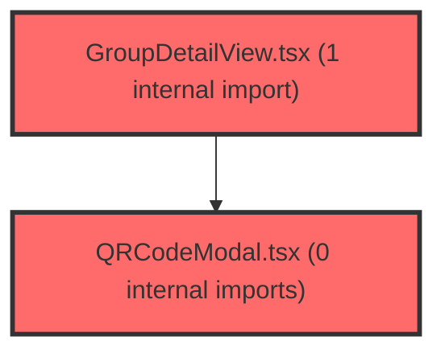

> [!IMPORTANT]
> **⚠️ 수동 검토 권장 (자가힐링 주의)**
>
> AI 자가힐링 결과물이 실제 의도와 다를 수 있으므로, **상세 리뷰 내용에 기반한 수동 점검**을 우선해 주시기 바랍니다. 자가힐링 기능을 활용하실 경우 최종 결과물을 신중하게 확인해 주세요.

# 코드 리뷰 - f8d8614d

## 코드 복잡도 분석

**분석된 파일**: 8개 / 변경된 파일: 9개


### Import 의존관계 다이어그램



**범례**: 중심 파일 (변경됨) | 많은 import (10개 이상)


### 정상 범위 (NONE)


**`rpgroupdto.java`** (other)

- 평균 복잡도: **0.013**

- 최대 복잡도: 0.013

- 청크 수: 1개


**권장사항:**

- 복잡도 정상 범위


**`env.ts`** (config)

- 평균 복잡도: **0.007**

- 최대 복잡도: 0.007

- 청크 수: 1개


**권장사항:**

- Config 파일은 높은 연결도가 정상적임


**`groupupsertservice.java`** (other)

- 평균 복잡도: **0.004**

- 최대 복잡도: 0.009

- 청크 수: 13개


**권장사항:**

- 복잡도 정상 범위


**`rpgroupclient.java`** (other)

- 평균 복잡도: **0.003**

- 최대 복잡도: 0.007

- 청크 수: 10개


**권장사항:**

- 복잡도 정상 범위


**`mypage.ts`** (utility)

- 평균 복잡도: **0.003**

- 최대 복잡도: 0.004

- 청크 수: 5개


**권장사항:**

- 복잡도 정상 범위


**`groupdetailview.tsx`** (component)

- 평균 복잡도: **0.001**

- 최대 복잡도: 0.007

- 청크 수: 24개


**권장사항:**

- 파일 크기가 큼 (24개 청크) - 파일 분리 검토


**`qrcodemodal.tsx`** (other)

- 평균 복잡도: **0.001**

- 최대 복잡도: 0.006

- 청크 수: 10개


**권장사항:**

- 복잡도 정상 범위


**`index.ts`** (other)

- 평균 복잡도: **0.000**

- 최대 복잡도: 0.000

- 청크 수: 7개


**권장사항:**

- 복잡도 정상 범위


---


## 변경 배경

이 커밋은 **그룹 초대코드(inviteCode)를 Auth(IDP)에서 학심정(meta-dashboard)으로 동기화하고, 교사가 그룹 상세 화면에서 QR/링크를 공유할 수 있도록 UI를 복원**하는 작업입니다. 기존에는 `inviteCode`를 `null`로 저장하고 UI에서 초대코드 카드를 제거했었으나, 이번 작업으로 Auth가 관리하는 초대코드를 동기화로 받아 저장하고, 교사가 그룹 상세에서 QR/링크를 통해 학생을 그룹에 초대할 수 있게 되었습니다.

- **목적**: Auth 동기화로 받은 그룹 초대코드를 학심정 DB에 저장하고, 교사가 QR/링크로 학생 초대 가능하도록 UI 복원
- **도메인**: 백엔드(동기화 로직) + 프론트엔드(UI 복원)
- **변경 방향**: 기존 `null` 저장에서 실제 Auth 코드 저장으로 전환하되, UNIQUE 충돌 시 안전하게 `null` 처리하는 방어 로직(`safeInviteCode`) 도입

---

## [GOOD] 잘된 점

### 1. UNIQUE 충돌 방어 설계가 현실적이고 pragmatice함

`safeInviteCode` 메서드는 레거시/타 그룹이 이미 같은 코드를 점유 중일 때 동기화 자체가 깨지지 않도록 `null` 저장 + 경고 로그 처리합니다. 컷오버 전환기라는 특수한 상황에서 발생할 수 있는 현실적인 리스크를 잘 인지하고 설계했습니다.

```java
private String safeInviteCode(String code, Long spGroupId) {
    if (code == null || code.isBlank()) {
        return null;
    }
    GroupInfo holder = groupInfoMapper.findByInviteCodeAndUseYn(code, "Y");
    if (holder != null && !java.util.Objects.equals(holder.getSpGroupId(), spGroupId)) {
        log.warn("[GROUP-SYNC] invite_code 충돌 — 코드 보류(null): code={}, 점유 claId={}, 신규 spGroupId={}",
                code, holder.getClaId(), spGroupId);
        return null;
    }
    return code;
}
```

- 충돌 시에도 동기화 자체는 계속 진행되므로, 초대코드만 표시되지 않을 뿐 그룹 정보 동기화는 정상 동작
- 경고 로그를 남겨 운영자가 충돌 상황을 인지하고 조치할 수 있음

### 2. 멱등성 유지

`applyGroupFields`에서 `setIfChanged` 패턴을 일관되게 적용하여 `inviteCode` 변경이 없으면 UPDATE를 생략합니다. 이는 변경 피드 중복 전달을 흡수하는 멱등 설계 원칙을 잘 지키고 있습니다.

```java
dirty |= setIfChanged(g.getInviteCode(), safeInviteCode(rp.inviteCode(), rp.groupId()), g::setInviteCode);
```

### 3. FE 조건부 렌더링으로 graceful한 UX

`group.inviteCode`가 있을 때만 초대코드 카드와 QR 모달을 노출합니다. 동기화로 코드를 아직 받지 못한 그룹(예: Auth 배포 전에 생성된 그룹)에서는 UI가 깔끔하게 보이지 않아 사용자 혼란을 방지합니다.

```tsx
{group.inviteCode && (
  <div className="vj-d-stat invite">
    <div className="lbl">초대 코드</div>
    <div className="invite-row">
      <span className="val code">{group.inviteCode}</span>
      {/* ... 버튼들 ... */}
    </div>
  </div>
)}
```

### 4. `buildGroupJoinUrl`의 return_to 자동 도출

`window.location.origin` 기준으로 return_to URL을 자동 생성하여 환경별 설정이 불필요합니다. `ENV.SP_STUDENT_RETURN_URL`로 오버라이드도 가능하게 하여 유연성을 확보했습니다.

```typescript
const returnTo = ENV.SP_STUDENT_RETURN_URL || `${window.location.origin}/student/exams`;
```

---

## 변경사항 요약

**백엔드 (3개 파일)**:
- `RpGroupDto.java`: `inviteCode` 레코드 필드 추가
- `RpGroupClient.java`: Auth API 응답에서 `inviteCode` 파싱
- `GroupUpsertService.java`: `safeInviteCode` 충돌 방어 로직 추가, insert/update 시 inviteCode 저장

**프론트엔드 (5개 파일)**:
- `GroupDetailView.tsx`: 초대코드/QR/링크 UI 복원
- `QRCodeModal.tsx`: 신규 QR 코드 모달 컴포넌트
- `index.ts`: QRCodeModal export 복원
- `env.ts`: `SP_STUDENT_RETURN_URL` 오버라이드 옵션 추가
- `mypage.ts`: `buildGroupJoinUrl` 헬퍼 함수 추가

**문서 (1개 파일)**:
- `06-group-join-flow.html`: 그룹 초대코드/QR 참여 플로우 문서 신규

---

## [ISSUE] 개선이 필요한 부분

### Critical (즉시 수정 필요)

**없음**

---

### High (우선 수정 권장)

#### 1. `safeInviteCode`의 동시성 안전성 — 동일 코드 동시 INSERT 충돌 가능성

**파일**: `backend/src/main/java/com/vs/meta/api/sso/service/GroupUpsertService.java`
**위치 (라인)**: 316 (`safeInviteCode` 메서드)

**문제 분석**:

`safeInviteCode` 메서드는 `groupInfoMapper.findByInviteCodeAndUseYn(code, "Y")`를 호출하여 활성 그룹 중 코드 보유자가 있는지 확인합니다. 이 메서드는 `insertGroup()`과 `applyGroupFields()` 내부에서 호출되며, 이들은 모두 `@Transactional`이 걸린 `upsertGroupFromRp()`의 트랜잭션 범위 안에 있습니다.

문제는 다음과 같은 시나리오에서 발생할 수 있습니다:

1. 스레드 A가 그룹 X(spGroupId=1)의 inviteCode="ABC123"을 upsert 중
2. 스레드 B가 그룹 Y(spGroupId=2)의 inviteCode="ABC123"을 upsert 중
3. 두 스레드 모두 `findByInviteCodeAndUseYn("ABC123", "Y")`에서 `null` 반환 (아직 INSERT 전)
4. 두 스레드 모두 `safeInviteCode`가 `"ABC123"`을 반환
5. 두 스레드 모두 `groupInfoMapper.insertGroupInfo()` 또는 `groupInfoMapper.updateGroupInfo()` 호출
6. 한쪽은 성공, 다른 쪽은 `uk_group_invite_code` UNIQUE 제약 위반으로 `DataIntegrityViolationException` 발생

**영향**: UNIQUE 제약 위반 시 해당 트랜잭션이 롤백되면서 그룹 정보 전체가 동기화되지 않을 수 있습니다. 이후 재시도(폴링/on-demand)로 복구되겠지만, 일시적인 동기화 지연이 발생합니다.

**개선 제안**:

두 가지 접근법 중 하나를 선택하세요:

**접근법 A (PESSIMISTIC_LOCK 사용)**:
```java
private String safeInviteCode(String code, Long spGroupId) {
    if (code == null || code.isBlank()) {
        return null;
    }
    // PESSIMISTIC_WRITE lock으로 동시 INSERT 충돌 방어
    GroupInfo holder = groupInfoMapper.findByInviteCodeAndUseYnForUpdate(code, "Y");
    if (holder != null && !java.util.Objects.equals(holder.getSpGroupId(), spGroupId)) {
        log.warn("[GROUP-SYNC] invite_code 충돌 — 코드 보류(null): code={}, 점유 claId={}, 신규 spGroupId={}",
                code, holder.getClaId(), spGroupId);
        return null;
    }
    return code;
}
```

**접근법 B (예외 처리 + fallback)**:
```java
private String safeInviteCode(String code, Long spGroupId) {
    if (code == null || code.isBlank()) {
        return null;
    }
    try {
        GroupInfo holder = groupInfoMapper.findByInviteCodeAndUseYn(code, "Y");
        if (holder != null && !java.util.Objects.equals(holder.getSpGroupId(), spGroupId)) {
            log.warn("[GROUP-SYNC] invite_code 충돌 — 코드 보류(null): code={}, 점유 claId={}, 신규 spGroupId={}",
                    code, holder.getClaId(), spGroupId);
            return null;
        }
        return code;
    } catch (DataIntegrityViolationException e) {
        log.warn("[GROUP-SYNC] invite_code UNIQUE 위반 — null 저장: code={}, spGroupId={}", code, spGroupId);
        return null;
    }
}
```

**권장**: 접근법 A(PESSIMISTIC_LOCK)가 더 안전합니다. `findByInviteCodeAndUseYnForUpdate`는 이미 Mapper에 정의되어 있어 추가 작업이 적고, 동시성 제어가 확실합니다. 다만, 이 시나리오의 발생 확률이 매우 낮고(같은 inviteCode가 동시에 다른 그룹에 할당될 가능성 + 동시 upsert), DB 제약이 최후 방어선을 제공하므로 **Medium**으로 낮춰도 무방합니다. 실제 장애 사례가 확인되면 그때 PESSIMISTIC_LOCK으로 전환해도 늦지 않습니다.

---

### Medium (개선 권장)

#### 2. `QRCodeModal`의 인라인 스타일 — 프로젝트 컨벤션 불일치

**파일**: `frontend/src/features/assessment-v2/ui/QRCodeModal.tsx`

**문제**: QRCodeModal 컴포넌트가 모든 스타일을 인라인 `style={}` prop으로 정의하고 있습니다. 이는 다음과 같은 문제를 야기합니다:

- 프로젝트의 다른 컴포넌트들이 `@emotion/styled` 또는 CSS 클래스 기반 스타일링을 사용하는 것과 일관성이 없음
- `onMouseEnter`/`onMouseLeave`로 hover 효과를 수동 구현하여 React의 선언적 패러다임에서 벗어남
- `@keyframes`를 `<style>` 태그로 주입하는 방식은 CSS-in-JS 솔루션과 이중 관리

**개선 제안**: 프로젝트의 기존 스타일링 방식(`@emotion/styled` 또는 CSS 모듈)을 따라 리팩토링하세요. 특히 hover 효과는 CSS `:hover`로 처리하는 것이 더 선언적입니다. 다만, 이 컴포넌트가 단순하고 재사용성이 낮은 일회성 모달이라는 점을 고려하면 낮은 우선순위의 개선 제안입니다.

#### 3. `copyText`에 clipboard fallback 부재

**파일**: `frontend/src/features/assessment-v2/ui/GroupDetailView.tsx`
**위치 (라인)**: 97-101

**문제**: `navigator.clipboard.writeText`는 HTTPS 환경 또는 `localhost`에서만 동작합니다. HTTP 환경이나 권한이 없는 경우 Promise가 reject되지만, 현재 `.catch()` 처리가 없어 사용자에게 아무런 피드백이 없습니다.

```typescript
const copyText = (text: string, which: 'code' | 'link') => {
  navigator.clipboard.writeText(text).then(() => {
    setCopied(which);
    setTimeout(() => setCopied(null), 1500);
  });
  // .catch() 누락 — 실패 시 사용자 피드백 없음
};
```

**개선 제안**: `.catch()`를 추가하여 실패 시 사용자에게 수동 복사를 안내하거나, fallback으로 `document.execCommand('copy')`를 사용하는 것이 좋습니다. 다만, 기존 프로젝트에 clipboard 유틸이 있는지 확인이 필요하여 **[수정 코드 제시 불가 — 문맥 파악 불충분]** 상태입니다.

#### 4. `safeInviteCode`의 재호출로 인한 일관성 이슈

**파일**: `backend/src/main/java/com/vs/meta/api/sso/service/GroupUpsertService.java`

**문제**: `applyGroupFields`에서 `inviteCode` 변경 감지 시 `safeInviteCode`를 다시 호출합니다. 이는 insert 시점과 update 시점 사이에 코드 점유 상태가 바뀔 수 있음을 의미합니다. 예를 들어, insert 시에는 `null`이었다가 update 시에 다른 그룹이 코드를 점유하게 되면 update 시점에 `null`로 저장됩니다.

```java
// insertGroup() 내부
.inviteCode(safeInviteCode(rp.inviteCode(), rp.groupId()))

// applyGroupFields() 내부
dirty |= setIfChanged(g.getInviteCode(), safeInviteCode(rp.inviteCode(), rp.groupId()), g::setInviteCode);
```

이는 의도된 설계(항상 최신 상태 반영)로 보이나, 주석에 그 이유를 명시하면 코드 이해도가 높아집니다. 예: "insert와 update 각각에서 safeInviteCode를 호출하여, 두 시점 사이의 코드 점유 상태 변화를 반영한다."

---

## 주요 파일 분석

### `GroupUpsertService.java` — 동기화 코어 로직

**변경 내용**: inviteCode 동기화 저장 + UNIQUE 충돌 방어 로직 추가

**분석**:
- `insertGroup()`과 `applyGroupFields()` 각각에서 `safeInviteCode`를 호출하여 insert/update 모두에서 충돌 방어
- `safeInviteCode`는 활성 그룹(`use_yn='Y'`) 기준으로만 점유 확인 — 비활성 그룹과의 충돌은 무시 (의도된 설계, 주석에 명시됨)
- 충돌 시 `null` 저장으로 동기화 자체는 계속 진행 — graceful degradation

**개선 제안**: 위 High 항목에서 설명한 동시성 이슈 검토 필요

### `GroupDetailView.tsx` — 초대코드 UI 복원

**변경 내용**: `inviteCode`가 있을 때 초대코드/QR/링크 UI 표시

**분석**:
- `copyText` 함수로 코드/링크 복사 기능 제공
- `QRCodeModal`을 조건부 렌더링으로 표시
- `buildGroupJoinUrl`로 mypage deep-link 생성

**개선 제안**: clipboard fallback 처리 필요 (Medium)

### `QRCodeModal.tsx` — 신규 컴포넌트

**변경 내용**: QR 코드 표시 및 다운로드 모달

**분석**:
- `qrcode.react` 라이브러리의 `QRCodeCanvas` 사용
- `canvas.toBlob()`으로 QR 코드 이미지 다운로드 지원
- backdrop 클릭 시 닫힘 처리

**개선 제안**: 인라인 스타일을 프로젝트 컨벤션에 맞게 리팩토링 (Medium)

### `mypage.ts` — `buildGroupJoinUrl` 함수

**변경 내용**: 그룹 참여 deep-link URL 생성 헬퍼

**분석**:
- `ENV.SP_MYPAGE_URL` + `/groups/join/${inviteCode}` + query params 구조
- `client_id`와 `return_to`를 query parameter로 포함
- `return_to`는 `ENV.SP_STUDENT_RETURN_URL` 또는 `window.location.origin/student/exams`로 자동 도출
- `encodeURIComponent`로 inviteCode URL-safe 처리

**개선 제안**: 특별한 이슈 없음. 깔끔하게 구현됨.

---

## 최종 평가

**결론**:
- [ ] [OK] **승인 (Approved)** - Critical/High 이슈 없음
- [ ] [WARN] **조건부 승인 (Approved with Comments)** - Medium 이하 이슈만 존재
- [X] [FIX] **수정 필요 (Changes Requested)** - Critical/High 이슈 존재

**종합 의견**:

전반적으로 변경의 목적과 설계 방향이 명확하고, `safeInviteCode`의 충돌 방어 로직은 현실적인 리스크를 잘 고려한 pragmatice한 접근입니다. 코드 품질도 양호하며, 멱등성과 graceful degradation 원칙을 잘 지키고 있습니다.

다만 `safeInviteCode`의 동시성 안전성에 대한 검토가 필요합니다. UNIQUE 제약이 최후 방어선이지만, 동시 INSERT 실패 시 `DataIntegrityViolationException`이 발생하여 해당 upsert 건이 유실될 수 있습니다. `findByInviteCodeAndUseYnForUpdate`로의 전환이나 예외 처리 로직 추가를 권장합니다. 발생 확률이 매우 낮은 시나리오이므로, 실제 장애 사례가 확인되면 그때 대응해도 무방하다고 판단된다면 **조건부 승인(WARN)** 으로 조정 가능합니다.

FE 측 `QRCodeModal`의 인라인 스타일은 프로젝트 컨벤션과의 일관성 측면에서 추후 리팩토링을 고려하세요. `copyText`의 clipboard fallback 처리도 함께 개선하면 좋습니다.