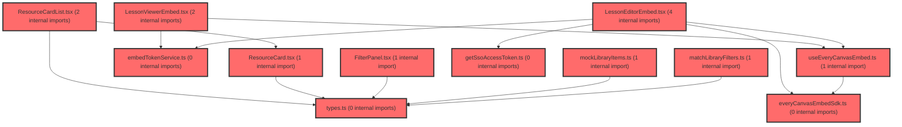

> [!IMPORTANT]
> **⚠️ 수동 검토 권장 (자가힐링 주의)**
>
> AI 자가힐링 결과물이 실제 의도와 다를 수 있으므로, **상세 리뷰 내용에 기반한 수동 점검**을 우선해 주시기 바랍니다. 자가힐링 기능을 활용하실 경우 최종 결과물을 신중하게 확인해 주세요.

# 코드 리뷰 - fb6cd4f4

## 코드 복잡도 분석

**분석된 파일**: 19개 / 변경된 파일: 29개


### Import 의존관계 다이어그램



**범례**: 중심 파일 (변경됨) | 많은 import (10개 이상)


### 정상 범위 (NONE)


**`theme.ts`** (other)

- 평균 복잡도: **0.111**

- 최대 복잡도: 0.221

- 청크 수: 2개

- 평균 사용처: 2.0곳


**권장사항:**

- 복잡도 정상 범위


**`env.ts`** (config)

- 평균 복잡도: **0.006**

- 최대 복잡도: 0.006

- 청크 수: 1개


**권장사항:**

- Config 파일은 높은 연결도가 정상적임


**`embedtokenservice.ts`** (other)

- 평균 복잡도: **0.003**

- 최대 복잡도: 0.007

- 청크 수: 5개


**권장사항:**

- 복잡도 정상 범위


**`getssoaccesstoken.ts`** (utility)

- 평균 복잡도: **0.003**

- 최대 복잡도: 0.004

- 청크 수: 3개


**권장사항:**

- 복잡도 정상 범위


**`everycanvasembedsdk.ts`** (utility)

- 평균 복잡도: **0.002**

- 최대 복잡도: 0.005

- 청크 수: 11개


**권장사항:**

- 복잡도 정상 범위


**`matchlibraryfilters.ts`** (utility)

- 평균 복잡도: **0.002**

- 최대 복잡도: 0.006

- 청크 수: 9개


**권장사항:**

- 복잡도 정상 범위


**`types.ts`** (other)

- 평균 복잡도: **0.002**

- 최대 복잡도: 0.007

- 청크 수: 10개


**권장사항:**

- 복잡도 정상 범위


**`lessoneditorembed.tsx`** (other)

- 평균 복잡도: **0.002**

- 최대 복잡도: 0.014

- 청크 수: 15개


**권장사항:**

- 복잡도 정상 범위


**`lessonviewerembed.tsx`** (component)

- 평균 복잡도: **0.002**

- 최대 복잡도: 0.014

- 청크 수: 14개


**권장사항:**

- 복잡도 정상 범위


**`lessonlibrarypage.tsx`** (utility)

- 평균 복잡도: **0.002**

- 최대 복잡도: 0.006

- 청크 수: 6개


**권장사항:**

- 복잡도 정상 범위


**`index.ts`** (other)

- 평균 복잡도: **0.001**

- 최대 복잡도: 0.005

- 청크 수: 15개


**권장사항:**

- 복잡도 정상 범위


**`useeverycanvasembed.ts`** (utility)

- 평균 복잡도: **0.001**

- 최대 복잡도: 0.009

- 청크 수: 11개


**권장사항:**

- 복잡도 정상 범위


**`lessonlibrarycontents.tsx`** (utility)

- 평균 복잡도: **0.001**

- 최대 복잡도: 0.008

- 청크 수: 18개


**권장사항:**

- 복잡도 정상 범위


**`mocklibraryitems.ts`** (utility)

- 평균 복잡도: **0.000**

- 최대 복잡도: 0.000

- 청크 수: 1개


**권장사항:**

- 복잡도 정상 범위


**`filterpanel.tsx`** (other)

- 평균 복잡도: **0.000**

- 최대 복잡도: 0.006

- 청크 수: 47개


**권장사항:**

- 파일 크기가 큼 (47개 청크) - 파일 분리 검토


**`resourcecard.tsx`** (other)

- 평균 복잡도: **0.000**

- 최대 복잡도: 0.010

- 청크 수: 46개


**권장사항:**

- 파일 크기가 큼 (46개 청크) - 파일 분리 검토


**`resourcecardlist.tsx`** (other)

- 평균 복잡도: **0.000**

- 최대 복잡도: 0.000

- 청크 수: 18개


**권장사항:**

- 복잡도 정상 범위


**`lessonmypage.tsx`** (component)

- 평균 복잡도: **0.000**

- 최대 복잡도: 0.007

- 청크 수: 21개


**권장사항:**

- 파일 크기가 큼 (21개 청크) - 파일 분리 검토


**`index.ts`** (other)

- 평균 복잡도: **0.000**

- 최대 복잡도: 0.000

- 청크 수: 1개


**권장사항:**

- 복잡도 정상 범위


---


## 변경 배경

이 커밋은 **everyCanvas LMS 임베드 통합**과 **Lesson Library(자료실) UI 구현**이라는 두 가지 작업을 함께 진행합니다. everyCanvas Embed App을 React에 통합하기 위해 `/sdk/react`의 bare `react` import 문제를 우회하여 `/sdk/embed`의 `createEmbed`를 얇은 React 훅(`useEveryCanvasEmbed`)으로 래핑하고, 토큰 조달(`fetchEmbedToken`, `getSsoAccessToken`)을 공통 서비스로 추출했습니다. 동시에 자료실의 `FilterPanel`/`ResourceCardList` UI를 FSD 구조에 맞게 `features/lesson`으로 정리하고, 관련 계획 문서(`lesson-library.plan.md`)를 신규 작성했습니다.

- **목적**: everyCanvas 임베드 PoC를 FSD 구조로 정리하고, 자료실 목록 UI(목업)를 구현
- **도메인**: 프론트엔드 UI + 임베드 SDK 통합 (API 연동은 Phase B로 보류)
- **변경 방향**: pages에 있던 Embed 로직을 `features/lesson`으로 이동, 공통 SDK 로더·토큰 서비스·React 훅 추출, `ENV.EVERYCLASS_EMBED_BASE_URL` env 반영

---

## [GOOD] 잘된 점

### 1. FSD 구조 준수가 명확함
pages는 조합만 담당하고 SDK import·fetch·styled를 `features/lesson`(api/lib/ui)으로 명확히 분리했습니다. `LessonEditorEmbed`/`LessonViewerEmbed`가 얇은 래퍼로 유지되어 재사용성이 좋습니다. 특히 `LessonEditorEmbed`는 `slideId` 유무에 따라 신규/기존 편집을 분기하고, `getSsoToken`은 Editor에만 전달하는 등 컴포넌트별 책임이 명확합니다.

### 2. 토큰 콜백 최신화 처리가 견고함
`useEveryCanvasEmbed`에서 `getToken`을 `optionsRef.current.getToken()`으로 래핑해 TOKEN_EXPIRED 재발급 시 최신 콜백을 사용하도록 한 점이 좋습니다. `identity` 배열 기반 재마운트와 cleanup(`destroy()`) 처리도 공식 React SDK 패턴을 잘 따릅니다.

```ts
// useEveryCanvasEmbed.ts 내부
handle = createEmbed(containerRef.current, {
  ...optionsRef.current,
  // TOKEN_EXPIRED 재발급 시 최신 콜백을 쓰도록 래핑 (공식 React SDK와 동일)
  getToken: () => optionsRef.current.getToken(),
});
```

### 3. 임시 스펙의 명시적 문서화
`setSearch` API가 임시 스펙임을 문서에 명확히 표기하고, Phase A(목업)와 Phase B(API)를 분리해 스펙 변경에 따른 교체 비용을 낮춘 설계가 좋습니다. `lesson-library.plan.md`에 request/response 초안과 FilterPanel 축 매핑 미정 사항을 명시해 팀 내 커뮤니케이션 비용을 줄였습니다.

---

## 변경사항 요약

everyCanvas 임베드 통합(React SDK 래퍼 + 토큰 서비스)과 자료실 목록 UI(FilterPanel/ResourceCardList 목업)를 `features/lesson`으로 정리하고, 관련 계획 문서를 신규 작성/삭제했습니다. env에 `EVERYCLASS_EMBED_BASE_URL`을 추가했습니다.

---

## [ISSUE] 개선이 필요한 부분

### Critical (즉시 수정 필요)

없음

### High (우선 수정 권장)

**`EVERYCLASS_EMBED_BASE_URL` 기본값이 빈 문자열**

`env.ts`에서 이 값의 기본값이 `''`입니다. 만약 env 변수가 누락되면 `loadEveryCanvasEmbedSdk`가 `import('/sdk/embed/index.js')` 같은 잘못된 상대 URL을 생성해 런타임에 조용히 실패할 수 있습니다. 다른 URL env들은 기본값을 갖고 있는데 이 값만 빈 문자열이라, 누락 시 디버깅이 어렵습니다.

```ts
// env.ts 현재 상태
EVERYCLASS_EMBED_BASE_URL:
  (import.meta.env.VITE_EVERYCLASS_EMBED_BASE_URL as string | undefined) ?? '',
```

**권장 방안**: `loadEveryCanvasEmbedSdk`에서 값이 비어 있으면 명시적으로 throw하거나, env 누락 시 조기 경고를 남기세요.

```ts
// everyCanvasEmbedSdk.ts 내부에 가드 추가 권장
export function loadEveryCanvasEmbedSdk(): Promise<EveryCanvasEmbedSdk> {
  if (!ENV.EVERYCLASS_EMBED_BASE_URL) {
    throw new Error('EVERYCLASS_EMBED_BASE_URL env 누락 — .env.development / .env.production 확인 필요');
  }
  if (!sdkPromise) {
    const url = `${ENV.EVERYCLASS_EMBED_BASE_URL}/sdk/embed/index.js`;
    sdkPromise = import(/* @vite-ignore */ url) as Promise<EveryCanvasEmbedSdk>;
  }
  return sdkPromise;
}
```

### Medium (개선 권장)

**1. `ResourceCard.tsx`의 주석 처리된 코드 잔재**

`// const initial = ...`와 `{/* <ThumbMark ...> */}`가 남아 있습니다. 미사용 코드는 제거하는 것이 좋습니다. 썸네일 이니셜 표시가 추후 필요하다면 별도 이슈로 관리하세요.

```ts
// 현재 상태 (ResourceCard.tsx)
// const initial = item.title.trim().charAt(0) || '?';
...
{/* <ThumbMark aria-hidden>{initial}</ThumbMark> */}
```

**2. `useEveryCanvasEmbed`의 `getToken` 래핑과 `getSsoToken` 미래핑의 비대칭**

`getToken`은 `optionsRef.current.getToken()`으로 래핑했지만 `getSsoToken`은 그대로 전달됩니다. `optionsRef.current`를 스프레드로 전달하므로 `getSsoToken`도 최신 참조가 유지되긴 하지만, `getToken`만 특별히 래핑한 이유가 주석으로 명시되어 있어 일관성이 다소 떨어집니다. `getSsoToken`도 동일하게 래핑하거나, 래핑이 실제로 필요한지 근거를 명확히 남기세요.

---

## 주요 파일 분석

### frontend/src/features/lesson/lib/useEveryCanvasEmbed.ts

**변경 내용:**
`createEmbed`를 React에 마운트하는 공통 훅. SDK 동적 로드, 이벤트 구독, cleanup(`destroy()`) 처리.

**동작 방식:**
1. `containerRef`를 반환하여 부모 컴포넌트가 `<div ref={containerRef} />`로 마운트 지점을 제공
2. `identity` 배열이 변경될 때만 effect가 재실행되어 embed를 재생성
3. `optionsRef`/`handlersRef`를 매 렌더마다 갱신하여 최신 콜백 참조 유지
4. cleanup에서 `cancelled` 플래그로 비동기 로드 후 마운트 해제된 경우를 방어

**개선 제안:**
- `getToken` 래핑과 `getSsoToken` 미래핑의 비대칭 (Medium, 위 상세 참조)

---

### frontend/src/shared/config/env.ts

**변경 내용:**
`EVERYCLASS_EMBED_BASE_URL` 추가.

**동작 방식:**
`VITE_EVERYCLASS_EMBED_BASE_URL` env 변수를 읽어 `ENV.EVERYCLASS_EMBED_BASE_URL`로 노출. `.env.development`(https://t-everyclass.vsaidt.com)와 `.env.production`(https://everyclass.vsaidt.com)에서 각각 설정.

**개선 제안:**
- 빈 문자열 기본값에 대한 방어 로직 추가 (High, 위 상세 참조)

---

### frontend/src/features/lesson/ui/ResourceCard.tsx

**변경 내용:**
자료실/나의 자료 카드 UI. `variant`로 모드 분기.

**동작 방식:**
- `variant="library"`: src/SEL 뱃지 + reason 표시
- `variant="my"`: 수정일 메타 + 삭제 버튼(`onDelete`) 표시
- CTA 버튼(수정하기/시작하기)은 UI만 존재, 라우트 연결은 후속 작업

**개선 제안:**
- 주석 처리된 미사용 코드 제거 (Medium, 위 상세 참조)

---

### frontend/src/features/lesson/api/embedTokenService.ts

**변경 내용:**
BE embed token 조달 서비스. `scope`(editor/viewer)와 `slideId`를 쿼리 파라미터로 전달.

**동작 방식:**
1. `getAuth().authorizedFetch`로 인증 헤더 자동 첨부
2. flat(`json.token`) / envelope(`json.resultData.token`) 응답 shape 모두 허용
3. token이 없으면 명시적으로 throw

**특이사항:**
- BE 경로(`/api/everyclass/embed-token`)는 PoC 단계로 문서에 미확정 항목으로 명시됨
- `slideId`는 viewer에서 필수, editor에서 선택(신규 생략) — `URLSearchParams`로 조건부 추가 처리

---

## 최종 평가

**결론**:
- [ ] [OK] **승인 (Approved)** - Critical/High 이슈 없음
- [x] [WARN] **조건부 승인 (Approved with Comments)** - Medium 이하 이슈만 존재
- [ ] [FIX] **수정 필요 (Changes Requested)** - Critical/High 이슈 존재

**종합 의견:**

전체적으로 FSD 구조를 잘 지키며 everyCanvas 임베드 통합과 자료실 UI를 견고하게 구현했습니다. `EVERYCLASS_EMBED_BASE_URL`의 빈 기본값에 대한 방어 로직만 추가하면 더 안전해질 것입니다. 임시 API 스펙을 명확히 문서화하고 Phase를 분리한 점은 스펙 변경 리스크를 잘 관리한 좋은 접근입니다. 특히 `useEveryCanvasEmbed`의 `identity` 기반 재마운트와 `optionsRef`를 통한 최신 콜백 유지 패턴은 공식 React SDK의 동작을 잘 이해하고 구현한 것으로 보입니다.